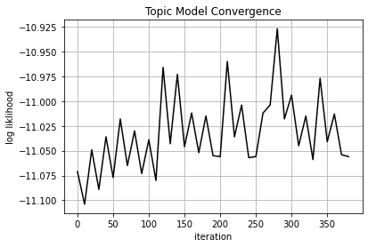
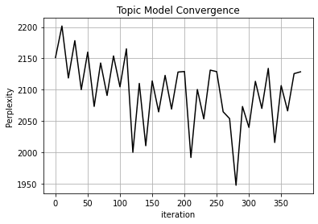
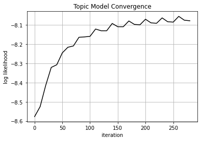
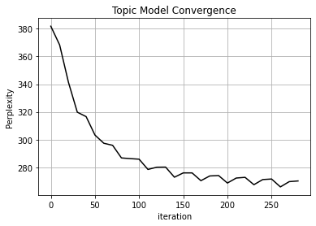
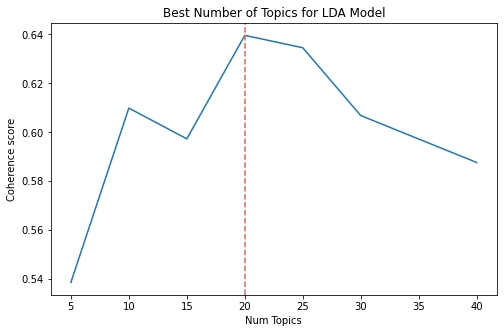
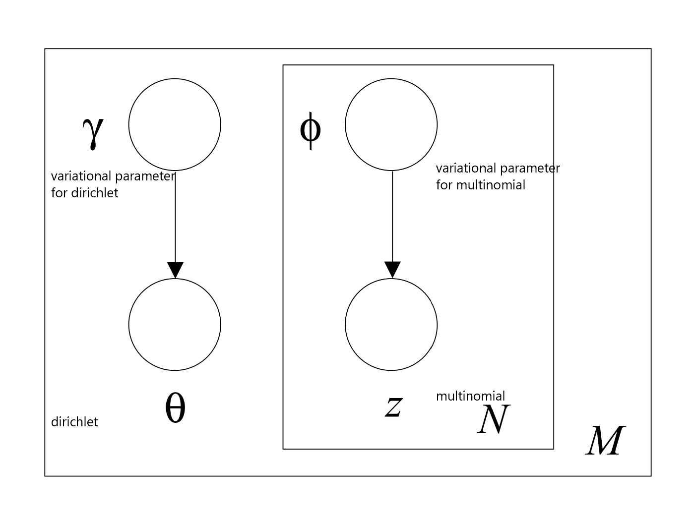
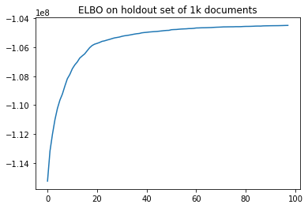
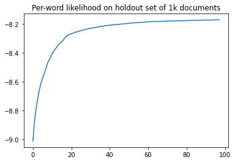
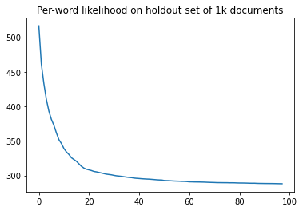

---
jupyter:
  kernelspec:
    display_name: WH
    language: python
    name: wh
  language_info:
    codemirror_mode:
      name: ipython
      version: 3
    file_extension: .py
    mimetype: text/x-python
    name: python
    nbconvert_exporter: python
    pygments_lexer: ipython3
    version: 3.9.9
  nbformat: 4
  nbformat_minor: 5
---

::: {.cell .code execution_count="1" tags="[]"}
``` {.python}
import re
import numpy as np
import pandas as pd
from pprint import pprint
import gensim
import gensim.corpora as corpora
from gensim.utils import simple_preprocess
from gensim.models import CoherenceModel
import spacy
import pyLDAvis
import pyLDAvis.gensim_models as gensimvis

import matplotlib.pyplot as plt
import nltk
nltk.download('stopwords')
#python -m spacy download en_core_web_sm
#python -m spacy download en_core_web_md
nlp = spacy.load('en_core_web_md', disable=['parser', 'ner'])
from nltk.corpus import stopwords

stop_words = stopwords.words('english')
stop_words.extend(['from', 'subject', 're', 'edu', 'use'])
from sklearn.datasets import fetch_20newsgroups

import pickle
import bz2
import time
import logging
import os

```

::: {.output .stream .stderr}
    C:\Users\jorda\anaconda3\envs\WH\lib\site-packages\gensim\similarities\__init__.py:15: UserWarning: The gensim.similarities.levenshtein submodule is disabled, because the optional Levenshtein package <https://pypi.org/project/python-Levenshtein/> is unavailable. Install Levenhstein (e.g. `pip install python-Levenshtein`) to suppress this warning.
      warnings.warn(msg)
    [nltk_data] Downloading package stopwords to
    [nltk_data]     C:\Users\jorda\AppData\Roaming\nltk_data...
    [nltk_data]   Package stopwords is already up-to-date!
:::
:::

::: {.cell .code execution_count="1"}
``` {.python}
#Bug fix for pyLDAvis https://github.com/bmabey/pyLDAvis/issues/162
from IPython.display import HTML
css_str = '<style> \
.jp-Button path { fill: #616161;} \
text.terms { fill: #616161;} \
.jp-icon-warn0 path {fill: var(--jp-warn-color0);} \
.bp3-button-text path { fill: var(--jp-inverse-layout-color3);} \
.jp-icon-brand0 path { fill: var(--jp-brand-color0);} \
text.terms { fill: #616161;} \
</style>'
display(HTML(css_str ))
```

::: {.output .display_data}
```{=html}
<style> .jp-Button path { fill: #616161;} text.terms { fill: #616161;} .jp-icon-warn0 path {fill: var(--jp-warn-color0);} .bp3-button-text path { fill: var(--jp-inverse-layout-color3);} .jp-icon-brand0 path { fill: var(--jp-brand-color0);} text.terms { fill: #616161;} </style>
```
:::
:::

::: {.cell .markdown}
# Load datapickle

From wikidownloader.py
:::

::: {.cell .code execution_count="3"}
``` {.python}
print('Load data pickle')
with bz2.BZ2File('datapicklesoup.bz2', 'rb') as f:  #Use datacompression BZ2
    data= pickle.load(f)
print('Loaded data pickle')
    
df=pd.DataFrame({'text':data[0],'title':data[1]})
```

::: {.output .stream .stdout}
    Load data pickle
    Loaded data pickle
:::
:::

::: {.cell .code execution_count="4"}
``` {.python}
df
```

::: {.output .execute_result execution_count="4"}
```{=html}
<div>
<style scoped>
    .dataframe tbody tr th:only-of-type {
        vertical-align: middle;
    }

    .dataframe tbody tr th {
        vertical-align: top;
    }

    .dataframe thead th {
        text-align: right;
    }
</style>
<table border="1" class="dataframe">
  <thead>
    <tr style="text-align: right;">
      <th></th>
      <th>text</th>
      <th>title</th>
    </tr>
  </thead>
  <tbody>
    <tr>
      <th>0</th>
      <td>Megacraspedus cuencellus is a moth of the fami...</td>
      <td>Megacraspedus_cuencellus</td>
    </tr>
    <tr>
      <th>1</th>
      <td>Jellyfish dermatitis is a cutaneous condition ...</td>
      <td>Jellyfish_dermatitis</td>
    </tr>
    <tr>
      <th>2</th>
      <td>The Hadrianic Society was a British historical...</td>
      <td>Hadrianic_Society</td>
    </tr>
    <tr>
      <th>3</th>
      <td>The CPL–U Sports Draft (French: Repêchage de l...</td>
      <td>CPL%E2%80%93U_Sports_Draft</td>
    </tr>
    <tr>
      <th>4</th>
      <td>Mikhail Ivanovich Meltyukhov (Russian: Russian...</td>
      <td>Mikhail_Meltyukhov</td>
    </tr>
    <tr>
      <th>...</th>
      <td>...</td>
      <td>...</td>
    </tr>
    <tr>
      <th>49884</th>
      <td>Swertia perennis is a species of flowering pla...</td>
      <td>Swertia_perennis</td>
    </tr>
    <tr>
      <th>49885</th>
      <td>Sarah Johns (born 1979) is an American country...</td>
      <td>Sarah_Johns</td>
    </tr>
    <tr>
      <th>49886</th>
      <td>Abū Thābit Sulaymān ibn Saʿd al-Khūshani (Arab...</td>
      <td>Sulayman_ibn_Sa%27d_al-Khushani</td>
    </tr>
    <tr>
      <th>49887</th>
      <td>Argyresthia pilatella is a moth of the family ...</td>
      <td>Argyresthia_pilatella</td>
    </tr>
    <tr>
      <th>49888</th>
      <td>LeRoy Hurd (born May 26, 1980) is an American ...</td>
      <td>LeRoy_Hurd</td>
    </tr>
  </tbody>
</table>
<p>49889 rows × 2 columns</p>
</div>
```
:::
:::

::: {.cell .code execution_count="5"}
``` {.python}
#remove zero length articles
articlelen=df.text.apply(len)
df=df[articlelen>10]
```
:::

::: {.cell .markdown}
# Tokenizing articles
:::

::: {.cell .code execution_count="6"}
``` {.python}
def sent_to_words(sentences):
   for sentence in sentences:
      yield(gensim.utils.simple_preprocess(str(sentence), deacc=True))
data_words = list(sent_to_words(df.text))
```
:::

::: {.cell .code execution_count="7"}
``` {.python}
print(df.text[0][:400])
```

::: {.output .stream .stdout}
    Megacraspedus cuencellus is a moth of the family Gelechiidae. It was described by Aristide Caradja in 1920. It is found in France and Spain. The forewings are uniform mouse grey with the margin whitish from one-third to the apex. The hindwings are mouse grey. 
:::
:::

::: {.cell .code execution_count="8"}
``` {.python}
print(data_words[0][:40])
```

::: {.output .stream .stdout}
    ['megacraspedus', 'cuencellus', 'is', 'moth', 'of', 'the', 'family', 'gelechiidae', 'it', 'was', 'described', 'by', 'aristide', 'caradja', 'in', 'it', 'is', 'found', 'in', 'france', 'and', 'spain', 'the', 'forewings', 'are', 'uniform', 'mouse', 'grey', 'with', 'the', 'margin', 'whitish', 'from', 'one', 'third', 'to', 'the', 'apex', 'the', 'hindwings']
:::
:::

::: {.cell .code execution_count="9"}
``` {.python}
id2word = corpora.Dictionary(data_words)
texts = data_words
corpus = [id2word.doc2bow(text) for text in texts]
print([(id2word[id], freq) for id, freq in corpus[0]][:20])
print(corpus[0][:20]) #it will print the corpus we created above.

```

::: {.output .stream .stdout}
    [('and', 1), ('apex', 1), ('are', 2), ('aristide', 1), ('by', 1), ('caradja', 1), ('cuencellus', 1), ('described', 1), ('family', 1), ('forewings', 1), ('found', 1), ('france', 1), ('from', 1), ('gelechiidae', 1), ('grey', 2), ('hindwings', 1), ('in', 2), ('is', 2), ('it', 2), ('margin', 1)]
    [(0, 1), (1, 1), (2, 2), (3, 1), (4, 1), (5, 1), (6, 1), (7, 1), (8, 1), (9, 1), (10, 1), (11, 1), (12, 1), (13, 1), (14, 2), (15, 1), (16, 2), (17, 2), (18, 2), (19, 1)]
:::
:::

::: {.cell .markdown}
# Removing stop words and adding bigrams
:::

::: {.cell .code execution_count="10"}
``` {.python}
bigram = gensim.models.Phrases(data_words, min_count=5, threshold=100)
trigram = gensim.models.Phrases(bigram[data_words], threshold=100)
bigram_mod = gensim.models.phrases.Phraser(bigram)
trigram_mod = gensim.models.phrases.Phraser(trigram)
def remove_stopwords(texts):
   return [[word for word in simple_preprocess(str(doc)) 
   if word not in stop_words] for doc in texts]
def make_bigrams(texts):
   return [bigram_mod[doc] for doc in texts]
def make_trigrams(texts):
   return [trigram_mod[bigram_mod[doc]] for doc in texts]

data_words_nostops = remove_stopwords(data_words)
data_words_bigrams = make_bigrams(data_words_nostops)
```
:::

::: {.cell .code execution_count="11"}
``` {.python}
print(data_words_nostops[0][:40])
```

::: {.output .stream .stdout}
    ['megacraspedus', 'cuencellus', 'moth', 'family', 'gelechiidae', 'described', 'aristide', 'caradja', 'found', 'france', 'spain', 'forewings', 'uniform', 'mouse', 'grey', 'margin', 'whitish', 'one', 'third', 'apex', 'hindwings', 'mouse', 'grey']
:::
:::

::: {.cell .code execution_count="12" tags="[]"}
``` {.python}
print(data_words_bigrams[0][:40])
```

::: {.output .stream .stdout}
    ['megacraspedus', 'cuencellus', 'moth', 'family_gelechiidae', 'described', 'aristide', 'caradja', 'found', 'france', 'spain', 'forewings', 'uniform', 'mouse', 'grey', 'margin', 'whitish', 'one', 'third', 'apex', 'hindwings', 'mouse', 'grey']
:::
:::

::: {.cell .code}
``` {.python}
```
:::

::: {.cell .markdown}
# Lemmatization

Reference:
<https://www.researchgate.net/publication/341574872_Machine_Learning_and_Deep_Neural_Network-Based_Lemmatization_and_Morphosyntactic_Tagging_for_Serbian>

The basic set of PoS-categories/tags that should be as-signed to tokens
is not generally accepted, even for a specific language. The choice of a
tagset usually depends on the foreseen task or project. A tagset
tailored to be applicable for PoS-tagging in general is the Universal
Part-of-Speech (UPoS) tagset (Petrov et al., 2012) (used by spaCy), and
it lists the following 17 categories: adjective(ADJ), adposition (ADP),
adverb (ADV), auxiliary (AUX),coordinating conjunction (CCONJ),
determiner (DET), interjection (INTJ), noun (N), numerical (NUM),
particle(PART), pronoun (PRON), proper noun (PROPN), punctuation
(PUNCT), subordinating conjunction (SCONJ), symbol (SYM), verb (VERB)
and other (X). It should be notedthat the MULTEXT-East tagset (Erjavec,
2012) was alsotailored to be universal. SMD uses its own tagset
thatcorresponds closely to Serbian traditional grammars. TheSerbian
TreeTagger models TT11 and TT19 (see Subsec-tion 3.3.) use modifications
of the SMD tagset. A gen-eral overview of the tagsets used is presented
in Table 3.It should be noted that tags for some PoS differ
betweentagsets (e.g. ADJ in UPoS vs. A in SMD for adjective
:::

::: {.cell .code execution_count="13"}
``` {.python}
doc=nlp(" ".join(data_words_bigrams[0]))
```
:::

::: {.cell .code execution_count="14" tags="[]"}
``` {.python}
tags=[]
for w in doc:
    if not w.pos_ in tags:
        print('Lemmatization Example {} -> {}'.format(w.lemma_,w.pos_))
        tags.append(w.pos_)
tags
```

::: {.output .stream .stdout}
    Lemmatization Example megacraspedus -> PROPN
    Lemmatization Example moth -> NOUN
    Lemmatization Example describe -> VERB
    Lemmatization Example whitish -> ADJ
    Lemmatization Example one -> NUM
:::

::: {.output .execute_result execution_count="14"}
    ['PROPN', 'NOUN', 'VERB', 'ADJ', 'NUM']
:::
:::

::: {.cell .markdown}
We will only keep the UPoS with the following tags \'NOUN\', \'ADJ\',
\'VERB\', \'ADV\'
:::

::: {.cell .code execution_count="15"}
``` {.python}
def lemmatization(texts, allowed_postags=['NOUN', 'ADJ', 'VERB', 'ADV']):
   texts_out = []
   for sent in texts:
      doc = nlp(" ".join(sent))
      texts_out.append([token.lemma_ for token in doc if token.pos_ in allowed_postags])
   return texts_out

def lemmatization2(texts, allowed_postags=['NOUN', 'ADJ', 'VERB', 'ADV']):
   texts_out = []
   for sent in texts:
      doc = nlp(sent)
      texts_out.append([token.lemma_ for token in doc if token.pos_ in allowed_postags])
   return texts_out
```
:::

::: {.cell .code execution_count="16"}
``` {.python}
#bigrams, then lemmatize, then remove stop words
data_lemmatized = make_bigrams(data_words)

nlp = spacy.load('en_core_web_sm', disable=['parser', 'ner'])
data_lemmatized = lemmatization(data_lemmatized, allowed_postags=[
   'NOUN', 'ADJ', 'VERB', 'ADV'
])
data_lemmatized = remove_stopwords(data_lemmatized)
```
:::

::: {.cell .code execution_count="17"}
``` {.python}
print(data_lemmatized[0][:40]) #it will print the lemmatized data.
```

::: {.output .stream .stdout}
    ['describe', 'find', 'forewing', 'uniform', 'mouse', 'grey', 'margin', 'whitish', 'third', 'apex', 'hindwing', 'mouse', 'grey']
:::
:::

::: {.cell .code execution_count="18" tags="[]"}
``` {.python}
print(data_words_bigrams[0][:55])
```

::: {.output .stream .stdout}
    ['megacraspedus', 'cuencellus', 'moth', 'family_gelechiidae', 'described', 'aristide', 'caradja', 'found', 'france', 'spain', 'forewings', 'uniform', 'mouse', 'grey', 'margin', 'whitish', 'one', 'third', 'apex', 'hindwings', 'mouse', 'grey']
:::
:::

::: {.cell .code}
``` {.python}
```
:::

::: {.cell .markdown tags="[]"}
# Creating bag of words frequencies
:::

::: {.cell .markdown}
Without Lemmatization
:::

::: {.cell .code execution_count="19" tags="[]"}
``` {.python}
id2word = corpora.Dictionary(data_words_bigrams)
texts = data_words_bigrams
corpus = [id2word.doc2bow(text) for text in texts]
print(corpus[0][:20]) #it will print the corpus we created above.
[(id2word[id], freq) for id, freq in corpus[0]][:20]
#it will print the words with their frequencies.
```

::: {.output .stream .stdout}
    [(0, 1), (1, 1), (2, 1), (3, 1), (4, 1), (5, 1), (6, 1), (7, 1), (8, 1), (9, 2), (10, 1), (11, 1), (12, 1), (13, 1), (14, 2), (15, 1), (16, 1), (17, 1), (18, 1), (19, 1)]
:::

::: {.output .execute_result execution_count="19"}
    [('apex', 1),
     ('aristide', 1),
     ('caradja', 1),
     ('cuencellus', 1),
     ('described', 1),
     ('family_gelechiidae', 1),
     ('forewings', 1),
     ('found', 1),
     ('france', 1),
     ('grey', 2),
     ('hindwings', 1),
     ('margin', 1),
     ('megacraspedus', 1),
     ('moth', 1),
     ('mouse', 2),
     ('one', 1),
     ('spain', 1),
     ('third', 1),
     ('uniform', 1),
     ('whitish', 1)]
:::
:::

::: {.cell .code execution_count="20"}
``` {.python}
print(f'Number of unique tokens: {len(id2word)}')
print(f'Number of documents: {len(corpus)}')
```

::: {.output .stream .stdout}
    Number of unique tokens: 380536
    Number of documents: 49835
:::
:::

::: {.cell .markdown}
With Lemmatization
:::

::: {.cell .code execution_count="21" tags="[]"}
``` {.python}
id2word_lemmatized = corpora.Dictionary(data_lemmatized)

# Filter out words that occur less than X documents, 
# or more than X% of the documents.
id2word_lemmatized.filter_extremes(no_below=10, no_above=0.1)

corpus_lemmatized = [id2word_lemmatized.doc2bow(text) for text in data_lemmatized]
print(corpus_lemmatized[0][:20]) #it will print the corpus we created above.
[(id2word_lemmatized[id], freq) for id, freq in corpus_lemmatized[0]][:20]
#it will print the words with their frequencies.
```

::: {.output .stream .stdout}
    [(0, 1), (1, 1), (2, 1), (3, 2), (4, 1), (5, 1), (6, 2), (7, 1), (8, 1), (9, 1)]
:::

::: {.output .execute_result execution_count="21"}
    [('apex', 1),
     ('describe', 1),
     ('forewing', 1),
     ('grey', 2),
     ('hindwing', 1),
     ('margin', 1),
     ('mouse', 2),
     ('third', 1),
     ('uniform', 1),
     ('whitish', 1)]
:::
:::

::: {.cell .code}
``` {.python}
```
:::

::: {.cell .code execution_count="95"}
``` {.python}
print(f'Number of unique tokens: {len(id2word_lemmatized)}')
print(f'Number of documents: {len(corpus_lemmatized)}')
```

::: {.output .stream .stdout}
    Number of unique tokens: 26262
    Number of documents: 49835
:::
:::

::: {.cell .code execution_count="23"}
``` {.python}
dictwords=set(id2word_lemmatized.values())
```
:::

::: {.cell .code execution_count="24"}
``` {.python}
data_lemmatized_filtered=[[w for w in article if w in dictwords] for article in data_lemmatized]
```
:::

::: {.cell .markdown tags="[]"}
# Fitting via LDA Variational Inference (Gensim) library

About Gensim algorithmn

The core estimation code is based on the \`onlineldavb.py script

    https://github.com/blei-lab/onlineldavb/blob/master/onlineldavb.py
    Matthew D. Hoffman, David M. Blei, Francis Bach:

Online Learning for Latent Dirichlet Allocation\', NIPS 2010

    Hoffman et al.: online-lda_
    https://papers.neurips.cc/paper/2010/file/71f6278d140af599e06ad9bf1ba03cb0-Paper.pdf


EM Algorihmn explanation:

Given the statistical model which generates a set w of observed data
(corpus), a set of unobserved latent data beta and theta, and a vector
of unknown parameters lambda, along with a likelihood function

    First, initialize the parameters lambda to some random values.
    E: Compute the probability of each possible value of beta and theta, given lambda λ
    M: Use the just-computed probability disribution of beta and theta to compute a better estimate for the parameters lambda
    Iterate E-step 2 and M-step 3 until convergence.

E step:

    fits phi φ(per word topic assignment) and gamma γ (topic assignment for document k)
    note phi φ is the associated variational parameter of z

    for every document
      hillclimb until peak
        phi φ (per word topic assignment) 
        word w in document d is likely part of topic k if 
          theta, the topic distribution for that document d is high for k
          plus
          beta, the word w is often associated with topic k
        gamma γ (topic assignment for document k)
          has its distribution by taking into account 
          phi (per word topic assignment)  times n
          n is the frequency word w appears in document d. 
      

M step:

    fits lambda λ, the distribution of words across topics
    (lambda λ is the associated variational parameter to beta)

randomly guess words in topic (lamda) E step: do our best given lamba to

a\) assign speciic words in specific documents to topics

b\) then assign topics to documents based on step a frequency M step:
survey E step a and b to assign words to topics in a better way
:::

::: {.cell .markdown}
Set up logging
:::

::: {.cell .code execution_count="25"}
``` {.python}
def setUpNewLogFile(LOG_FILENAME):

    #logging.basicConfig(filename=LOG_FILENAME,
    #                    format="%(asctime)s:%(levelname)s:%(message)s",
    #                    level=logging.INFO)

    my_logger = logging.getLogger()
    my_logger.setLevel(logging.INFO)
    my_logger.handlers.clear()
    handlers = my_logger.handlers[:]
    for handler in handlers:
        handler.close()
        my_logger.removeHandler(handler)

    # Check if log exists and should therefore be rolled
    needRoll = os.path.isfile(LOG_FILENAME)

    # Add the log message handler to the logger
    handler = logging.handlers.RotatingFileHandler(LOG_FILENAME, backupCount=50)

    my_logger.addHandler(handler)

    # This is a stale log, so roll it
    if needRoll:    
        # Add timestamp
        my_logger.debug('\n---------\nLog closed on %s.\n---------\n' % time.asctime())

        # Roll over on application start
        my_logger.handlers[0].doRollover()
    
```
:::

::: {.cell .markdown}
## Without Lemmatization
:::

::: {.cell .code execution_count="26"}
``` {.python}
starttime=time.time()
setUpNewLogFile('gensim_nolem.log')

#Old code
#lda_model = gensim.models.ldamodel.LdaModel(

#New code uses multicore which runs works in parallel for each CPU core.
lda_model = gensim.models.ldamulticore.LdaMulticore(
   corpus=corpus, id2word=id2word, num_topics=20, random_state=100, 
   eval_every=1000, chunksize=200, passes=20, alpha='symmetric', per_word_topics=True
)
print('Time taken = {:.0f} minutes'.format((time.time()-starttime)/60.0))
```

::: {.output .stream .stdout}
    Time taken = 26 minutes
:::
:::

::: {.cell .code execution_count="27"}
``` {.python}
p = re.compile(r"(-*\d+\.\d+) per-word .* (\d+\.\d+) perplexity")
matches = [p.findall(l) for l in open('gensim_nolem.log')]
matches = [m for m in matches if len(m) > 0]
tuples = [t[0] for t in matches]
perplexity = [float(t[1]) for t in tuples]
liklihood = [float(t[0]) for t in tuples]
iter = list(range(0,len(tuples)*10,10))
plt.plot(iter[:-1],liklihood[:-1],c="black")
plt.ylabel("log liklihood")
plt.xlabel("iteration")
plt.title("Topic Model Convergence")
plt.grid()
plt.show()


plt.plot(iter[:-1],perplexity[:-1],c="black")
plt.ylabel("Perplexity")
plt.xlabel("iteration")
plt.title("Topic Model Convergence")
plt.grid()
plt.show()
print('Note: Perplexity estimate based on a held-out corpus of 4 documents')
```

::: {.output .display_data}

:::

::: {.output .display_data}

:::

::: {.output .stream .stdout}
    Note: Perplexity estimate based on a held-out corpus of 4 documents
:::
:::

::: {.cell .code execution_count="28"}
``` {.python}
print('\nLog Likelihood(per-word ELBO): ', lda_model.log_perplexity(corpus))
```

::: {.output .stream .stdout}

    Log Likelihood(per-word ELBO):  -11.35139410375823
:::
:::

::: {.cell .code execution_count="29"}
``` {.python}
coherence_model_lda = CoherenceModel(
   model=lda_model, texts=texts, dictionary=id2word, coherence='c_v'
)
coherence_lda = coherence_model_lda.get_coherence()
print('\nCoherence Score: ', coherence_lda)
```

::: {.output .stream .stdout}

    Coherence Score:  0.5497309076719765
:::
:::

::: {.cell .code}
``` {.python}
```
:::

::: {.cell .markdown}
## With Lemmatization and dictionary compression
:::

::: {.cell .code execution_count="30"}
``` {.python}
starttime=time.time()
setUpNewLogFile('gensim_lem.log')

#Old code
#lda_model_lemmatized = gensim.models.ldamodel.LdaModel(

#New code uses multicore which runs works in parallel for each CPU core.
lda_model_lemmatized = gensim.models.ldamulticore.LdaMulticore(
   corpus=corpus_lemmatized, id2word=id2word_lemmatized, num_topics=20, random_state=100, 
   eval_every=1000, chunksize=1000, passes=10, alpha='symmetric', per_word_topics=True
)
print('Time taken = {:.0f} minutes'.format((time.time()-starttime)/60.0))
```

::: {.output .stream .stdout}
    Time taken = 4 minutes
:::
:::

::: {.cell .code execution_count="31"}
``` {.python}
p = re.compile(r"(-*\d+\.\d+) per-word .* (\d+\.\d+) perplexity")
matches = [p.findall(l) for l in open('gensim_lem.log')]
matches = [m for m in matches if len(m) > 0]
tuples = [t[0] for t in matches]
perplexity = [float(t[1]) for t in tuples]
liklihood = [float(t[0]) for t in tuples]
iter = list(range(0,len(tuples)*10,10))
plt.plot(iter[:-1],liklihood[:-1],c="black")
plt.ylabel("log likelihood")
plt.xlabel("iteration")
plt.title("Topic Model Convergence")
plt.grid()
plt.show()


plt.plot(iter[:-1],perplexity[:-1],c="black")
plt.ylabel("Perplexity")
plt.xlabel("iteration")
plt.title("Topic Model Convergence")
plt.grid()
plt.show()
print('Note: Log likelihood is per-word ELBO')
print('Note: Perplexity estimate based on a held-out corpus of 4 documents')
```

::: {.output .display_data}

:::

::: {.output .display_data}

:::

::: {.output .stream .stdout}
    Note: Log likelihood is per-word ELBO
    Note: Perplexity estimate based on a held-out corpus of 4 documents
:::
:::

::: {.cell .code execution_count="32"}
``` {.python}
print('\nLog Likelihood(per-word ELBO): ', lda_model_lemmatized.log_perplexity(corpus_lemmatized))
```

::: {.output .stream .stdout}

    Log Likelihood(per-word ELBO):  -8.056201668835016
:::
:::

::: {.cell .code execution_count="33"}
``` {.python}
coherence_model_lda_lemmatized = CoherenceModel(
   model=lda_model_lemmatized, texts=data_lemmatized_filtered, dictionary=id2word_lemmatized, coherence='c_v'
)
coherence_lda_lemmatized = coherence_model_lda_lemmatized.get_coherence()
print('\nCoherence Score: ', coherence_lda_lemmatized)

```

::: {.output .stream .stdout}

    Coherence Score:  0.639390651206254
:::
:::

::: {.cell .markdown}
# About how gensim reports perplexity

<https://tedboy.github.io/nlps/_modules/gensim/models/ldamodel.html#LdaModel.log_perplexity>

    They calculate the ELBO of the variational inferred q vs p in function "bound"

        def bound(self, corpus, gamma=None, subsample_ratio=1.0):
            Estimate the variational bound of documents from `corpus`:
            E_q[log p(corpus)] - E_q[log q(corpus)]
        
    Then they divide the ELBO by the number of words/tokens so that it is "per-word".
    The likelihood reported above is the per-word likelihood, and perplexity=2^(-bound)
        
        def log_perplexity(self, chunk, total_docs=None):
            Calculate and return per-word likelihood bound, using the `chunk` of
            documents as evaluation corpus. Also output the calculated statistics. incl.
            perplexity=2^(-bound), to log at INFO level.
:::

::: {.cell .code}
``` {.python}
```
:::

::: {.cell .markdown}
## Finding the right value of K
:::

::: {.cell .code execution_count="34"}
``` {.python}
K_Coherence={}
models={}
```
:::

::: {.cell .code execution_count="35"}
``` {.python}
for K in [5,10,15,20,25,30,40]:
    print('Starting K={}'.format(K))
    starttime=time.time()
    setUpNewLogFile('gensim_lem_{}.log'.format(K))

    #New code uses multicore which runs works in parallel for each CPU core.
    lda_model_lemmatized = gensim.models.ldamulticore.LdaMulticore(
       corpus=corpus_lemmatized, id2word=id2word_lemmatized, num_topics=K, random_state=100, 
       eval_every=1000, chunksize=1000, passes=8, alpha='symmetric', per_word_topics=True
    )
    coherence_model_lda_lemmatized = CoherenceModel(
       model=lda_model_lemmatized, texts=data_lemmatized_filtered, dictionary=id2word_lemmatized, coherence='c_v'
    )
    coherence_lda_lemmatized = coherence_model_lda_lemmatized.get_coherence()
    print('Coherence Score: ', coherence_lda_lemmatized)
    K_Coherence[K]=coherence_lda_lemmatized
    print('Time taken = {:.0f} minutes'.format((time.time()-starttime)/60.0))
    models[K]=lda_model_lemmatized
```

::: {.output .stream .stdout}
    Starting K=5
    Coherence Score:  0.538652983441009
    Time taken = 4 minutes
    Starting K=10
    Coherence Score:  0.6099184296764066
    Time taken = 4 minutes
    Starting K=15
    Coherence Score:  0.5973412754528363
    Time taken = 5 minutes
    Starting K=20
    Coherence Score:  0.639642445838058
    Time taken = 5 minutes
    Starting K=25
    Coherence Score:  0.6345741806955959
    Time taken = 5 minutes
    Starting K=30
    Coherence Score:  0.6068648435452109
    Time taken = 5 minutes
    Starting K=40
    Coherence Score:  0.5876884859335876
    Time taken = 6 minutes
:::
:::

::: {.cell .code execution_count="36"}
``` {.python}
plt.figure(figsize=(8,5))

x = list(K_Coherence.keys())
coherence_values= list(K_Coherence.values())

# Build the line plot
#ax = sns.lineplot(x=x, y=coherence_values, color='#238C8C')
ax=plt.plot(x,coherence_values)

# Set titles and labels
plt.title("Best Number of Topics for LDA Model")
plt.xlabel("Num Topics")
plt.ylabel("Coherence score")

# Add a vertical line to show the optimum number of topics
plt.axvline(x[np.argmax(coherence_values)], 
            color='#F26457', linestyle='--')
```

::: {.output .execute_result execution_count="36"}
    <matplotlib.lines.Line2D at 0x1f8b526b7f0>
:::

::: {.output .display_data}

:::
:::

::: {.cell .markdown tags="[]"}
# Exploring final model (with Lemmatization)
:::

::: {.cell .code execution_count="37"}
``` {.python}
#Choose model with K=20
lda_model_lemmatized=models[20]
```
:::

::: {.cell .code execution_count="38" tags="[]"}
``` {.python}
pprint(lda_model_lemmatized.print_topics())
```

::: {.output .stream .stdout}
    [(0,
      '0.007*"displaystyle" + 0.006*"example" + 0.005*"cell" + 0.005*"function" + '
      '0.005*"language" + 0.004*"case" + 0.004*"term" + 0.004*"protein" + '
      '0.004*"result" + 0.004*"type"'),
     (1,
      '0.060*"film" + 0.011*"star" + 0.009*"series" + 0.008*"direct" + '
      '0.007*"character" + 0.006*"movie" + 0.005*"award" + 0.005*"role" + '
      '0.005*"kill" + 0.005*"production"'),
     (2,
      '0.027*"club" + 0.024*"season" + 0.017*"league" + 0.016*"match" + '
      '0.015*"championship" + 0.014*"final" + 0.013*"football" + 0.012*"game" + '
      '0.011*"player" + 0.010*"event"'),
     (3,
      '0.010*"design" + 0.009*"system" + 0.007*"power" + 0.006*"engine" + '
      '0.006*"model" + 0.006*"car" + 0.005*"produce" + 0.005*"vehicle" + '
      '0.004*"low" + 0.004*"production"'),
     (4,
      '0.025*"station" + 0.024*"line" + 0.023*"road" + 0.016*"route" + '
      '0.014*"railway" + 0.012*"north" + 0.010*"highway" + 0.010*"bridge" + '
      '0.009*"train" + 0.009*"county"'),
     (5,
      '0.028*"woman" + 0.017*"medical" + 0.017*"hospital" + 0.014*"health" + '
      '0.010*"patient" + 0.010*"child" + 0.008*"treatment" + 0.008*"medicine" + '
      '0.008*"research" + 0.006*"study"'),
     (6,
      '0.028*"ship" + 0.020*"island" + 0.009*"sea" + 0.008*"port" + 0.008*"boat" + '
      '0.007*"navy" + 0.007*"vessel" + 0.007*"crew" + 0.007*"fleet" + '
      '0.007*"coast"'),
     (7,
      '0.019*"art" + 0.011*"study" + 0.010*"church" + 0.009*"book" + '
      '0.009*"publish" + 0.008*"artist" + 0.008*"museum" + 0.006*"history" + '
      '0.006*"painting" + 0.005*"award"'),
     (8,
      '0.031*"album" + 0.029*"song" + 0.026*"music" + 0.020*"band" + '
      '0.012*"single" + 0.009*"perform" + 0.008*"track" + 0.007*"tour" + '
      '0.006*"chart" + 0.006*"video"'),
     (9,
      '0.008*"book" + 0.007*"say" + 0.006*"series" + 0.006*"life" + '
      '0.006*"episode" + 0.006*"story" + 0.005*"tell" + 0.005*"novel" + '
      '0.005*"get" + 0.004*"appear"'),
     (10,
      '0.017*"election" + 0.012*"party" + 0.009*"elect" + 0.009*"vote" + '
      '0.008*"son" + 0.007*"king" + 0.006*"government" + 0.006*"candidate" + '
      '0.006*"seat" + 0.005*"general"'),
     (11,
      '0.027*"game" + 0.016*"station" + 0.011*"radio" + 0.010*"player" + '
      '0.009*"network" + 0.009*"broadcast" + 0.009*"channel" + 0.008*"television" '
      '+ 0.007*"air" + 0.007*"tv"'),
     (12,
      '0.016*"law" + 0.014*"court" + 0.009*"police" + 0.009*"case" + 0.008*"act" + '
      '0.007*"report" + 0.007*"say" + 0.006*"government" + 0.005*"claim" + '
      '0.005*"right"'),
     (13,
      '0.013*"government" + 0.012*"german" + 0.010*"war" + 0.007*"political" + '
      '0.007*"country" + 0.006*"military" + 0.005*"russian" + 0.004*"president" + '
      '0.004*"region" + 0.004*"force"'),
     (14,
      '0.016*"population" + 0.014*"village" + 0.013*"specie" + 0.009*"river" + '
      '0.008*"age" + 0.007*"town" + 0.006*"census" + 0.006*"water" + '
      '0.006*"region" + 0.006*"county"'),
     (15,
      '0.037*"season" + 0.032*"game" + 0.018*"race" + 0.012*"player" + '
      '0.010*"finish" + 0.010*"football" + 0.009*"point" + 0.009*"basketball" + '
      '0.008*"championship" + 0.007*"coach"'),
     (16,
      '0.020*"army" + 0.015*"force" + 0.014*"war" + 0.011*"military" + '
      '0.011*"unit" + 0.010*"command" + 0.010*"battle" + 0.010*"attack" + '
      '0.008*"division" + 0.008*"air"'),
     (17,
      '0.008*"research" + 0.006*"system" + 0.006*"social" + 0.006*"provide" + '
      '0.005*"information" + 0.005*"increase" + 0.005*"study" + '
      '0.005*"development" + 0.004*"economic" + 0.004*"project"'),
     (18,
      '0.023*"company" + 0.014*"student" + 0.012*"college" + 0.012*"university" + '
      '0.009*"business" + 0.008*"found" + 0.008*"public" + 0.007*"award" + '
      '0.007*"director" + 0.006*"program"'),
     (19,
      '0.021*"building" + 0.013*"house" + 0.011*"church" + 0.009*"site" + '
      '0.007*"design" + 0.006*"town" + 0.006*"th_century" + 0.006*"street" + '
      '0.005*"park" + 0.005*"stone"')]
:::
:::

::: {.cell .code execution_count="39" tags="[]"}
``` {.python}
pyLDAvis.enable_notebook()
vis = gensimvis.prepare(lda_model_lemmatized, corpus_lemmatized, id2word_lemmatized)
vis
```

::: {.output .stream .stderr}
    C:\Users\jorda\anaconda3\envs\WH\lib\site-packages\pyLDAvis\_prepare.py:246: FutureWarning: In a future version of pandas all arguments of DataFrame.drop except for the argument 'labels' will be keyword-only
      default_term_info = default_term_info.sort_values(
:::

::: {.output .execute_result execution_count="39"}
```{=html}
<link rel="stylesheet" type="text/css" href="https://cdn.jsdelivr.net/gh/bmabey/pyLDAvis@3.3.1/pyLDAvis/js/ldavis.v1.0.0.css">


<div id="ldavis_el4925221663905314562037636026"></div>
<script type="text/javascript">

var ldavis_el4925221663905314562037636026_data = {"mdsDat": {"x": [0.006253586948281443, 0.02927272658283708, 0.029086672648176208, -0.07104450509236356, 0.030991614986209396, 0.17322067758087706, 0.04072822457626831, 0.1747671766580427, -0.25589475372492165, 0.05288374203651245, 0.06557779066731995, -0.04611007928898604, 0.035113696424006545, 0.08216542266405727, -0.07865619062240613, -0.24896218650605428, -0.004816301973742663, -0.06207158134366365, -0.0672487756028987, 0.11474304238244742], "y": [0.11560772898179517, -0.18705572568382475, -0.09374103589568843, 0.0805889151153543, 0.07426162162337833, -0.07089094667698771, 0.08906284741349899, 0.032091041885258145, 0.07084834744263657, 0.15049439913436893, -0.16289082694016854, 0.06635796812443191, 0.06402170155544627, 0.0723480915271408, -0.08122886114857449, 0.048277808438552436, -0.01715823547565187, -0.20354307330103755, -0.1539930310950246, 0.1065412649750963], "topics": [1, 2, 3, 4, 5, 6, 7, 8, 9, 10, 11, 12, 13, 14, 15, 16, 17, 18, 19, 20], "cluster": [1, 1, 1, 1, 1, 1, 1, 1, 1, 1, 1, 1, 1, 1, 1, 1, 1, 1, 1, 1], "Freq": [9.492244200736062, 6.775347459062231, 5.980407716620598, 5.9180840851624295, 5.850291365374616, 5.61787214251498, 5.51681701886381, 5.510314686910666, 5.333069607338023, 5.2783181466252405, 5.276838172260098, 4.851615710750737, 4.768809316336087, 4.623859870961606, 3.629793229860538, 3.621560862329018, 3.5043881621995303, 3.4485509321386205, 2.7576904528603214, 2.244126861094783]}, "tinfo": {"Term": ["film", "season", "game", "album", "song", "music", "club", "station", "woman", "band", "building", "player", "ship", "league", "road", "championship", "election", "company", "art", "football", "line", "church", "army", "population", "war", "specie", "match", "race", "island", "government", "paige", "eastender", "donna", "peggy", "buffy", "godzilla", "pinoy", "tanya", "dramatist", "macbeth", "nell", "guest_starre", "grandma", "hardcover", "contextual", "sheen", "graphic_novel", "lister", "guest_star", "molly", "lawman", "kapoor", "natalie", "anguish", "psychosis", "testicle", "transsexual", "sami", "evangeline", "paranormal", "sonnet", "chandler", "borge", "sonya", "novel", "maggie", "sitcom", "karen", "episode", "gabrielle", "fiction", "pity", "tell", "short_storie", "witchcraft", "poem", "chuck", "lucas", "story", "novelist", "book", "husband", "wedding", "tale", "love", "mother", "friend", "writer", "joke", "truth", "actress", "ask", "divorce", "life", "get", "say", "character", "try", "think", "thing", "want", "series", "father", "wife", "appear", "drama", "believe", "television", "publish", "child", "death", "young", "marry", "role", "woman", "back", "son", "way", "median_age", "average_density", "husband_present", "non_familie", "someone_living", "cdp", "races_hispanic", "families_reside", "forewing", "larvae", "mollusk", "square_mile", "grassland", "subspecie", "flowering_plant", "hindwing", "nearest_rural", "endemic", "species", "inhabitants_p", "sea_snail", "plumage", "inflorescence", "cd_block", "cultivar", "subtropical", "gmina", "ascot", "iucn", "whitish", "census", "habitat", "housing_unit", "married_couple", "fossil", "per_square", "kilometres_mi", "specie", "mile_km", "genus", "vegetation", "breeding", "rainfall", "sq_mi", "population", "tributary", "township", "wildlife", "household", "forest", "lake", "village", "municipality", "breed", "bird", "river", "male", "km", "mountain", "dam", "tree", "fish", "plant", "water", "native", "age", "region", "white", "female", "town", "county", "size", "park", "north", "south", "land", "southern", "black", "central", "nave", "facade", "cornice", "portico", "pilaster", "verandah", "balustrade", "apse", "chancel", "pediment", "transept", "brickwork", "ashlar", "arched", "italianate", "national_regist", "porch", "storey", "timber_frame", "vestry", "minaret", "plinth", "belfry", "glebe", "stonework", "lintel", "courtyard", "gable", "weatherboard", "remodelle", "historic_place", "brick", "art_deco", "architectural", "grade_ii", "octagonal", "building", "masonry", "skyscraper", "stucco", "architect", "chapel", "tower", "monument", "renovation", "statue", "historic", "temple", "mosque", "demolish", "stone", "inscription", "terrace", "roof", "parish", "floor", "wall", "architecture", "garden", "site", "church", "th_century", "house", "hotel", "castle", "square", "entrance", "street", "room", "construction", "design", "property", "park", "town", "hall", "structure", "construct", "style", "main", "side", "original", "date", "local", "land", "center", "album", "studio_album", "beatle", "guitarist", "drummer", "vocalist", "billboard_hot", "beyonce", "allmusic", "uk_single", "remix", "remixe", "liner_note", "bassist", "hip_hop", "airplay", "melodic", "duet", "reggae", "songwriter", "mixtape", "bonus_track", "songwrite", "guitar", "musically", "synth", "sales_streaming", "frontman", "bluegrass", "backing_vocal", "song", "jazz", "ep", "billboard", "orchestra", "band", "singer", "chart", "self_titled", "music", "musician", "lyric", "piano", "recording", "concert", "vocal", "pop", "musical", "melody", "dance", "drum", "sing", "perform", "solo", "tour", "track", "single", "sound", "video", "label", "performance", "debut", "hit", "artist", "rock", "love", "version", "top", "produce", "week", "festival", "award", "country", "say", "peerage", "libertarian", "bure", "vassal", "whig", "earldom", "baronetcy", "labour_party", "vomiting", "opioid", "abdicate", "falkland", "electorate", "unionist", "bahraini", "electoral_vote", "elector", "protein_kinase", "serotonin", "cornea", "tyrosine", "shadow_cabinet", "two_sicilie", "ndp", "abdication", "caithness", "sub_prefecture", "syndicalist", "gene_encode", "liberal_party", "election", "constituency", "barony", "incumbent", "electoral", "candidacy", "boles\u0142aw", "bourbon", "candidate", "baronet", "ballot", "polling", "parliament", "emperor", "conservative", "throne", "vote", "voter", "mp", "parliamentary", "monarchy", "caucus", "elect", "labour", "liberal", "party", "councillor", "republican", "king", "seat", "ruler", "baron", "democratic", "governor", "kingdom", "politician", "assembly", "son", "reign", "representative", "succeed", "council", "campaign", "political", "government", "general", "leader", "daughter", "appoint", "defeat", "house", "death", "support", "marry", "rule", "term", "father", "brother", "order", "county", "displaystyle", "vowel", "protein", "enzyme", "consonant", "theorem", "peptide", "mutation", "np", "amino_acid", "neuron", "receptor", "ligand", "genome", "mrna", "antibody", "conjugate", "polynomial", "equation", "random_variable", "mathbb", "mathcal", "verb", "molecule", "invariant", "algebraic", "noun", "lipid", "vertex", "antigen", "graph", "chromosome", "inhibitor", "approximation", "finite", "integer", "metabolite", "nm", "vector", "cell", "gene", "encode", "syllable", "tissue", "probability", "organism", "dna", "function", "matrix", "dialect", "define", "theory", "example", "sequence", "method", "interaction", "word", "variable", "language", "structure", "human", "type", "case", "term", "value", "text", "effect", "different", "occur", "result", "thus", "complex", "often", "cause", "refer", "point", "system", "common", "mean", "contain", "study", "tertiary_sector", "henrique", "friesland", "kibbutz", "fachhochschule", "fdp", "svp", "aur", "pomerania", "torneo", "swiss_reformed", "biannual", "amalgamated", "baja", "fintech", "private_equity", "oberliga", "isd", "citigroup", "charter_flight", "msp", "curation", "sligo", "johor", "nuncio", "franchisee", "vacancy_rate", "commuted_away", "minor_countie", "dunmore", "chief_executive", "entrepreneurial", "underwriter", "ceo", "campus", "enrollment", "mba", "trustee", "metis", "publicly_trade", "polytechnic", "student", "alumnus", "entrepreneur", "university", "undergraduate", "company", "business", "seaford", "faculty", "college", "shareholder", "chairman", "subsidiary", "investment", "engineering", "found", "corporation", "firm", "education", "board", "accredit", "graduate", "library", "executive", "director", "airline", "industry", "management", "department", "president", "newspaper", "program", "public", "science", "academic", "international", "award", "establish", "union", "office", "development", "degree", "community", "offer", "government", "center", "country", "ln", "macroeconomic", "xml", "interpersonal", "informatic", "mcmaster", "greenhouse_gase", "biodegradable", "combe", "problem_solving", "ict", "tax_exempt", "cryptographic", "greenpeace", "ieee", "rss", "pheromone", "nsf", "rebate", "login", "keynesian", "oswego", "nicotine", "marketer", "liquidity", "ect", "frs", "commensurate", "organometallic", "danforth", "climate_change", "tax_cut", "dell", "oecd", "think_tank", "holistic", "consumer", "purchasing", "gdp", "gcse", "cee", "mitigation", "van_den", "database", "tariff", "bias", "cent", "wikipedia", "environmental", "sustainable", "stakeholder", "research", "datum", "social", "information", "scientific", "resource", "economic", "assessment", "policy", "benefit", "strategy", "price", "planning", "technology", "poverty", "cost", "science", "economy", "product", "impact", "funding", "increase", "environment", "market", "process", "value", "provide", "system", "development", "project", "need", "individual", "management", "study", "program", "level", "develop", "issue", "public", "term", "report", "support", "midfielder", "footballer", "goalkeeper", "relegation", "scored_goal", "liga", "bundesliga", "quarter_final", "scoring_goal", "runners_up", "matchday", "uefa_cup", "last_update", "handball", "hat_trick", "mixed_double", "nrl", "welterweight", "everton", "semi_final", "estadio", "play_off", "straight_set", "premier_league", "tag_team", "bronze_medal", "bantamweight", "minor_league", "copa", "fc", "wrestler", "top_scorer", "rugby", "olympic", "match", "relegate", "soccer", "club", "blackpool", "cup", "silver_medal", "league", "wrestling", "compete", "championship", "athlete", "competition", "summer_olympic", "tournament", "stadium", "goal", "football", "gold_medal", "final", "champion", "season", "score", "round", "winner", "player", "qualify", "event", "professional", "debut", "finish", "defeat", "sport", "division", "game", "title", "appearance", "sign", "coach", "lose", "woman", "side", "third", "international", "ordain", "freiburg", "minor_planet", "eparchy", "apostolic", "modernism", "solo_exhibition", "expressionist", "archdiocese", "asher", "theology", "cubism", "consistory", "expressionism", "episcopate", "suffragan", "musicology", "impressionism", "painter", "co_consecrator", "biennale", "dark_fuscous", "curacy", "portraiture", "archdeacon", "musee", "gaia", "printmaker", "theological", "beatification", "painting", "chaplain", "priesthood", "synod", "figurative", "engraver", "surrealism", "liturgical", "theologian", "surrealist", "holiness", "diocese", "pastor", "bishop", "exhibition", "art", "portrait", "curator", "fine_art", "archbishop", "seminary", "gallery", "museum", "priest", "artist", "bible", "congregation", "paint", "collection", "teach", "christian", "philosophy", "church", "study", "artistic", "contemporary", "prize", "publish", "book", "exhibit", "professor", "poet", "history", "society", "religious", "literature", "french", "award", "author", "life", "teacher", "academy", "german", "college", "father", "university", "age", "found", "child", "airbag", "socket", "motherboard", "propellant", "convection", "neutron", "tropical_storm", "tricolor", "cylinder_engine", "converter", "cathode", "spacetime", "ghz", "rural_localitie", "coolant", "corrosion", "wheelbase", "volkswagen", "chassis", "opel", "pulley", "electrically", "compressor", "nozzle", "diode", "reactor", "supercomputer", "conductive", "airliner", "conductivity", "spacecraft", "torque", "oscillator", "cpu", "transistor", "electrode", "sensor", "payload", "brake", "engine", "voltage", "axle", "cylinder", "plug", "thermal", "orbit", "alloy", "rotor", "optical", "microwave", "solar", "vehicle", "gas", "prototype", "fuel", "liquid", "connector", "tire", "pin", "manufacture", "detector", "car", "model", "manufacturer", "speed", "rocket", "design", "device", "temperature", "truck", "system", "power", "heat", "electric", "surface", "type", "metal", "produce", "light", "standard", "production", "low", "energy", "material", "control", "space", "pressure", "water", "develop", "aircraft", "allow", "air", "introduce", "company", "require", "provide", "line", "spider_man", "ngc", "filmmake", "cinematographer", "superhuman", "star_war", "tumour", "yakuza", "opening_weekend", "teleport", "cinematography", "humanoid", "welle", "ravi", "grossed_million", "toho", "ontology", "multiverse", "box_office", "supervillain", "shell_attain", "reiko", "roger_ebert", "shell_varie", "sea_slug", "hajime", "visual_effect", "genie_award", "manga", "batman", "film", "superhero", "elf", "stargate", "reddy", "anime", "average_rating", "star_trek", "filmmaker", "marvel", "planet", "animation", "screenplay", "comic_book", "rotten_tomatoe", "movie", "alien", "telugu", "villain", "cinema", "robot", "zombie", "tamil", "ryan", "sequel", "comic_strip", "star", "animate", "demon", "remake", "actor", "direct", "magic", "monster", "character", "horror", "shoot", "documentary", "series", "earth", "script", "kill", "role", "screen", "production", "adventure", "story", "festival", "director", "fight", "cast", "award", "appear", "scene", "produce", "premiere", "escape", "attack", "set", "original", "power", "title", "battle", "help", "reveal", "back", "television", "bolshevik", "kurdish", "faisal", "reich", "nepalese", "comintern", "nkvd", "zionist", "auschwitz", "trujillo", "stalingrad", "yemeni", "raju", "presidium", "serb", "villar", "stalinist", "petrograd", "plenipotentiary", "honduran", "sejm", "grand_", "dalit", "pogrom", "tartu", "hernandez", "mihail", "styria", "union_parishad", "viet_cong", "communist", "commissar", "bundestag", "azerbaijan", "cossack", "azerbaijani", "albanian", "fascist", "nazi", "ine", "commune", "ussr", "communism", "lahore", "fascism", "lithuanian", "syrian", "iranian", "ethnic", "embassy", "hitler", "isil", "marxist", "afghan", "soviet", "socialist", "romanian", "iraqi", "polish", "soviet_union", "german", "revolutionary", "uprising", "russian", "refugee", "political", "independence", "revolution", "government", "nepal", "rebel", "korean", "war", "turkish", "ambassador", "regime", "minister", "military", "foreign", "jewish", "protest", "country", "president", "movement", "secretary", "leader", "deputy", "region", "general", "official", "force", "chief", "organization", "appoint", "party", "language", "establish", "head", "support", "accord", "local", "plaintiff", "indict", "defendant", "sentencing", "prosecutor", "appellate", "saudi", "petitioner", "trafficker", "automatic_bid", "juris_doctor", "dee", "racketeering", "affidavit", "ninth_circuit", "circuit_court", "tort", "punishable", "falk", "tilden", "organized_crime", "indictment", "remand", "acquittal", "wilmer", "complainant", "prosecution", "headteacher", "ceara", "subpoena", "parole", "ruling", "attorney", "prosecute", "injunction", "unlawful", "convict", "offender", "judicial", "criminal", "felony", "lawsuit", "court", "stardust", "sentence", "police", "judge", "law", "violation", "allegation", "conviction", "prison", "legal", "crime", "appeal", "allege", "illegal", "amendment", "investigation", "case", "justice", "lawyer", "arrest", "victim", "trial", "act", "charge", "report", "bill", "claim", "murder", "federal", "accuse", "right", "say", "government", "public", "person", "issue", "decision", "rule", "order", "authority", "skier", "uci", "mig", "hussar", "afb", "battalion", "smolensk", "tac", "af_mil", "nd_battalion", "howitzer", "nieuport", "air_refuele", "aircrew", "fighter_pilot", "infantry", "regiment", "pickup_truck", "raaf", "luce", "usaaf", "unit_citation", "biathlon", "country_skier", "weightlifting", "brigade", "airman", "track_cycle", "combat_mission", "ships_sunk", "artillery", "air_force", "reconnaissance", "regimental", "armoured", "platoon", "corps", "corp", "cavalry", "squadron", "missile", "airfield", "rifle", "machine_gun", "marine_corp", "army", "commander", "tactical", "command", "bomber", "combat", "aviation", "aircraft", "troop", "cadet", "tornado", "lieutenant", "unit", "battle", "military", "fly", "force", "attack", "soldier", "fighter", "war", "defence", "officer", "operation", "guard", "division", "air", "training", "th", "fire", "order", "general", "japanese", "german", "support", "quarterback", "wicket", "averaged_point", "nfl", "big_ten", "nfl_draft", "touchdown", "fastest_lap", "pole_position", "nba_draft", "postseason", "rushing_yard", "tight_end", "tcu", "bold_indicate", "fia", "fiba", "ncaa_division", "defenceman", "wins_losse", "rebounds_per", "georgia_tech", "assists_per", "batsman", "cornerback", "mcleod", "motorsport", "ap_poll", "bruin", "receiving_yard", "nba", "innings", "ncaa", "bowler", "pitcher", "racing", "linebacker", "laker", "batting", "basketball", "chess", "lap", "racer", "punt", "baseball", "rookie", "steeler", "rebound", "race", "nhl", "strikeout", "bowl", "dodger", "playoff", "raider", "season", "yard", "game", "bat", "coach", "finish", "ball", "conference", "football", "player", "draft", "championship", "point", "career", "league", "regular", "college", "score", "hit", "field", "round", "sign", "third", "tournament", "series", "major", "class", "lose", "nintendo", "marge", "newscast", "atari", "gameplay", "simulcast", "multiplayer", "ascii", "nokia", "router", "amiga", "tipperary", "byte", "source_code", "wii", "abc_affiliate", "ashford", "classic_hit", "sasha", "uhf_channel", "subchannel", "boy_advance", "call_letter", "simulcaste", "cbs_affiliate", "playstation", "nbc_affiliate", "uhf_digital", "gamecube", "computer_game", "housemate", "programming", "server", "app", "io", "broadcasting", "transmitter", "fm", "programmer", "browser", "folder", "linux", "broadcast", "channel", "smartphone", "radio", "format", "user", "digit", "software", "network", "tv", "digital", "apple", "game", "code", "station", "license", "computer", "file", "television", "graphic", "news", "player", "air", "video", "version", "online", "host", "program", "launch", "available", "medium", "series", "system", "announce", "character", "freeway", "stagecoach", "turnpike", "passenger_train", "expressway", "northbound", "eastbound", "amtrak", "rosedale", "bahn", "viaduct", "wbo", "southbound", "railway_station", "commuter_rail", "remington", "westbound", "flea_market", "freight_train", "autoroute", "overpass", "bus_terminal", "indian_railway", "standard_gauge", "trailhead", "derailment", "railway", "thane", "suarez", "lane_undivided", "interchange", "highway", "motorway", "narrow_gauge", "reroute", "route", "junction", "surname_include", "terminus", "railroad", "rail", "airport", "bus", "parkway", "commuter", "road", "bridge", "lane", "intersection", "tunnel", "roadway", "freight", "traffic", "tram", "station", "line", "train", "passenger", "canal", "miles_km", "crossing", "north", "connect", "mile", "south", "county", "operate", "street", "west", "town", "east", "river", "section", "pass", "main", "track", "cross", "western", "park", "frigate", "schooner", "flotilla", "hms", "got_underway", "gunboat", "solomon", "minesweeper", "lst", "nunatak", "anson", "steamship", "torpedo_boat", "racing_cyclist", "destroyer", "salvadoran", "whaling", "trawler", "leamington", "waterline", "svalbard", "ran_aground", "nautical_mile", "sloop", "dry_dock", "tsushima", "perseus", "kriegsmarine", "grt", "brig", "submarine", "lighthouse", "battleship", "sail", "ship", "torpedo", "uss", "shipwreck", "vessel", "voyage", "ashore", "shipyard", "boat", "shipbuilding", "anchorage", "cruiser", "archipelago", "sailing", "steamer", "expedition", "warship", "island", "navy", "fleet", "naval", "sink", "convoy", "yacht", "maritime", "port", "sea", "crew", "harbour", "coast", "sailor", "cargo", "deck", "admiral", "shipping", "arrive", "marine", "gun", "storm", "spanish", "cape", "captain", "beach", "water", "shore", "damage", "ice", "british", "class", "war", "fire", "land", "reach", "carry", "psychiatry", "pediatric", "neurology", "pokemon", "oncology", "mental_disorder", "transplantation", "immunology", "ventricular", "obstetric", "breaststroke", "clinical_trial", "bioethic", "acupuncture", "inpatient", "infertility", "dialysis", "icf", "grady", "urology", "compiled_record", "bdo", "throate", "neurologist", "pontiff", "ventricle", "whistler", "psychotherapy", "bobsledder", "microbiology", "surgical", "neurological", "patient", "surgeon", "clinical", "blood_pressure", "dentistry", "medical", "medicine", "medication", "physician", "therapy", "contraception", "psychiatric", "shepard", "contraceptive", "pregnancy", "hospital", "clinic", "diagnosis", "surgery", "nursing", "health", "dental", "wine", "treatment", "milk", "vaccine", "disease", "woman", "cancer", "abortion", "nurse", "care", "diagnose", "symptom", "doctor", "disorder", "drug", "research", "child", "brain", "treat", "study", "psychology", "practice", "age", "female", "heart", "life", "center", "mother", "training", "help", "cause"], "Freq": [21002.0, 19073.0, 18938.0, 11978.0, 11640.0, 11231.0, 11423.0, 10586.0, 10601.0, 8146.0, 10001.0, 9437.0, 5376.0, 7841.0, 7058.0, 7199.0, 6776.0, 14147.0, 8608.0, 7080.0, 10572.0, 8576.0, 6432.0, 9006.0, 10468.0, 6295.0, 6337.0, 6184.0, 5286.0, 12365.0, 233.52944764724376, 131.55581285890327, 85.28124079292307, 221.35130885956673, 65.93900770068387, 57.81374149084, 53.60582054007226, 264.4401546039863, 52.266392779616325, 62.17471756404551, 43.86952333120418, 41.43879092374214, 39.72522638769371, 51.89586762763044, 33.78026991910998, 31.152203426625555, 31.069945270228335, 59.321900648856584, 62.614718467866474, 225.9167851190647, 27.298541606587577, 28.22633342356082, 42.50582911745216, 26.414196707266807, 25.589660752039112, 24.84768468378843, 41.11161439838653, 118.7894823076478, 24.899845214851293, 55.98783717392407, 84.31932370454277, 104.1552474571043, 51.064901610880334, 55.79002077714156, 3050.0196834056514, 90.4888271562734, 189.6706220365959, 99.39656304967882, 3850.9245567915, 112.99752610139642, 598.8879114783671, 110.82180175061404, 3216.865502569712, 120.37276323668195, 101.9211336674565, 985.9198474363426, 224.45042936137583, 155.38881646208895, 3652.9418973161683, 235.53555369542792, 5024.838062562054, 1133.6845904683257, 531.665520186586, 550.2174157418118, 2472.7146517333917, 2330.6429247075403, 2194.7300125562147, 1773.2591333951161, 250.18049540987863, 569.6832075064763, 791.7136113242973, 1745.2406877693575, 474.76933681722136, 3858.202078935687, 3016.87920575094, 4558.526288756538, 2459.6175696065775, 1862.7807311761349, 1510.0679970978588, 1124.9466923179402, 1655.9145382572374, 3877.9584463920432, 2249.6676535887914, 1818.0823265121862, 2725.6633332025026, 922.4736234940227, 1552.2988673669613, 1774.4682501185052, 2539.967289229959, 2583.0460772883857, 2134.2348234044816, 1922.3447614719244, 1595.7586039974028, 1772.507769391326, 1940.1601052518226, 1799.8601401905162, 1668.5383605413215, 1634.22592474129, 418.5998523971088, 382.65825886920305, 383.39774261214586, 372.75431422923515, 361.90731701702845, 405.1559298746253, 292.0371327819203, 252.32909822785396, 225.57055254317206, 184.08296146950252, 243.25036700964506, 926.4529673886236, 164.26015303261087, 316.6003826047377, 152.3689584124244, 150.34777159223597, 131.94377106606805, 559.4274005883898, 509.25742142946683, 107.81011595306117, 104.08011787197592, 84.35515195524344, 82.13016788472073, 82.49788659842471, 80.00957222868217, 144.50818122284085, 153.69857769718126, 74.56126057150857, 73.88763387705335, 68.5414590555582, 2858.79971906192, 586.0660970174551, 405.7555938368924, 432.6364165665118, 387.00676891136936, 656.5361540569226, 384.1118781461574, 5782.507560355389, 637.4865182029591, 1773.8245351217402, 307.78385263318813, 256.71940279370625, 285.55968645266125, 235.58703696553218, 7182.181463019965, 483.17685549159785, 1280.365548066603, 405.447891119412, 2009.2591173600233, 2039.6974346026352, 1910.0371951823531, 6103.270218066643, 2258.657090719682, 584.8144019383213, 1220.3770145781286, 3892.515446859099, 2369.6727435236717, 2310.3277569420716, 2081.0183044236373, 833.45777660862, 1638.0366598765038, 1152.2314222345033, 2198.446244824144, 2842.432555460219, 1702.6512545475748, 3608.4363203132757, 2722.832866143735, 2022.8154752438531, 1692.1493166820767, 2953.949011601117, 2661.540427053096, 1467.2950925148834, 2121.826675750572, 2262.8686003494163, 2243.506641146684, 2104.5696359943386, 1492.3336930446324, 1587.9311607135235, 1596.8855786763968, 229.17353223531785, 522.4823858349565, 93.44614603126011, 74.92952265927046, 73.0038942933453, 59.53938686771472, 55.587913079653354, 53.55592686416652, 49.59438355755272, 46.73412183518588, 46.27813912593069, 55.24864288792209, 42.377165586376194, 41.02373991643139, 39.36341283321423, 41.78480657150854, 230.67446655904595, 312.38201949244575, 36.84010842403244, 69.73417530027523, 69.25387424286835, 35.495536787277054, 49.60572616740956, 35.60269535942384, 37.93920386280422, 32.196055684595315, 220.92055943820904, 219.77579112881767, 29.78300616690925, 29.47113048059912, 722.7018354770856, 870.8602612367143, 68.03909167232914, 549.0049446850602, 216.85219743450256, 96.38009727383454, 8258.016865505164, 135.60771562144419, 105.47782663765089, 66.42299155060304, 1183.5209782735349, 675.1413564128676, 1491.6487068258905, 941.7466302522242, 396.89714775423033, 714.9503339208392, 1403.7448975415011, 939.8195502165763, 356.731543384391, 525.7194249774843, 1870.1143036623546, 504.14116103326717, 330.64169732352394, 837.8774956122385, 878.1147387307725, 1335.668408092031, 1648.1091165175503, 969.7809072582813, 1135.7699848399996, 3607.459170998403, 4495.45300608181, 2335.0930562736494, 5147.5474696386555, 1189.7540332998751, 1142.1298651068723, 1027.5392969970826, 768.751886758437, 2309.83013198004, 1463.1949663971131, 1657.5100374720143, 2753.2218645440284, 1457.3944628633737, 2047.9723250660777, 2444.9541305117536, 1261.2833767906423, 1395.6201555698945, 1125.3027548682976, 1435.3710202042064, 1715.6807935815582, 1580.4425048621554, 1412.1455028451674, 1283.0851517873966, 1465.2149532950116, 1364.2410471838075, 1169.7866158155307, 11961.15001451981, 657.2089504113412, 708.9185134845666, 496.73441166520337, 631.4333838738539, 392.44715844716444, 319.6582652051476, 205.39847293919667, 203.3629393304127, 186.99590971191842, 283.43886001787126, 192.4886170972943, 169.16185205694634, 150.84600576739794, 447.4538349382137, 115.74063846289786, 111.55530919564174, 229.49219149007402, 106.56434240921601, 390.8656403385485, 97.22344835001144, 93.9688098140587, 93.54325721621026, 953.72496634267, 99.37449813195853, 83.19247452826073, 79.13523117172323, 100.89495182846812, 81.80328195508584, 75.4503256737686, 11411.958855817265, 1046.202298413051, 629.48096444809, 707.6138602347241, 605.0162989755747, 7649.470953874749, 2057.79297793368, 2424.686572500664, 138.48557001873792, 10084.890087051375, 1460.399971110542, 1130.0855555524233, 928.3032906475615, 1780.1470054554695, 1591.2169067126636, 1115.9740670035824, 1373.3298722101595, 1921.4158517021094, 383.3086115100778, 2032.097948925528, 722.3343967474788, 1268.6427588238244, 3705.6008611198986, 959.9768858763982, 2648.1866988410143, 3306.66992991186, 4853.709219910271, 1793.9316010200098, 2371.361242346835, 1212.7845552955457, 1995.90950918696, 1789.0949712288575, 1536.2372280796928, 1841.5468841902587, 1317.8860310779962, 1531.9031597683104, 1635.8294078435308, 1694.991018209253, 1567.0897600706182, 1404.7613075971105, 1334.7893352954911, 1449.286065689223, 1407.5681727474637, 1354.283521798712, 129.45825991814928, 140.14746959366266, 99.05978371992171, 126.07155864612653, 122.16697695316263, 58.717163785840526, 56.88519701713807, 82.71073274585243, 50.990455528522205, 47.76608919976442, 46.07360639383819, 39.0638751212484, 324.3499615325929, 131.57754606815865, 34.540091027272396, 32.02149878578035, 143.54468626139246, 27.77650228902742, 27.079440314174906, 26.330297263693033, 39.49480911112642, 26.676457215350943, 27.26952327912339, 41.05529439757589, 26.3863652859798, 25.411811823771643, 23.29999380246578, 23.458193873490654, 24.05553428219546, 20.9530149603114, 6418.68157257336, 806.5326990946722, 143.56302339838638, 404.4078729544004, 600.6686610570665, 125.98370493815621, 119.22324095174379, 108.1595682297501, 2357.6827260476994, 105.79892388138482, 346.4657434224587, 114.71467206055931, 1875.2974121486016, 985.9191736113439, 1033.324966809005, 534.1937330944321, 3499.2557234025367, 570.2974031660549, 622.7242583670014, 523.5944396321563, 223.07648978223082, 155.57804076307085, 3632.5897688335517, 963.4427801447985, 901.0684733102063, 4614.00650471691, 374.2251257907155, 997.2874321521828, 2858.1721025750057, 2287.2203329837093, 524.0479202984673, 379.755322290967, 768.5262495735032, 1382.3087023177345, 923.0988246540278, 1190.6098602917498, 1102.0683800731706, 2979.4840189428464, 678.3367487527108, 1261.7499272175537, 966.2929595548303, 1268.4188294947228, 1419.4475922462516, 1576.0888939214353, 2445.5040650828955, 1928.0800551434168, 1382.8552774840884, 1353.2435625164296, 1422.998798036752, 1443.199447986509, 1883.4478919799653, 1618.8342817745731, 1692.753388584468, 1301.2545444992204, 1232.68154150632, 1318.7658679087533, 1200.7981404092839, 1128.4962180572777, 1154.0528898821453, 1134.0457322298143, 2715.632559903936, 430.14851585201103, 1548.5127517856886, 565.1753553790282, 210.77993527505976, 184.86880111973653, 199.67670651163974, 348.7851571448252, 401.65472302717706, 159.01686750299248, 143.32378959750375, 421.73416039898217, 157.28583076761657, 235.80674109266747, 100.75057186554972, 111.36408121943248, 96.18355876304258, 80.51516217898525, 489.0699136101479, 68.08772992433195, 69.24580393344637, 67.51750535826433, 239.02844089580626, 470.885369674649, 67.89079884572381, 69.35770593868207, 169.83669127496202, 72.48716870525031, 170.43238722449328, 66.69284834951708, 314.4512690688429, 161.11225270843562, 149.4373870077808, 156.3783525300801, 143.9048098742172, 130.95889670522334, 83.29491968000137, 483.75926814826704, 348.7843779055605, 2011.6118761456964, 1145.569340179042, 299.44364032429985, 230.5029356198875, 486.0373741385058, 427.318751753462, 343.99614743403, 397.0377736751262, 1780.9821626265555, 360.0768535826177, 470.10422560289584, 1397.5198192185942, 1271.8757996773697, 2300.641589772775, 723.474002380889, 1235.0481727901886, 494.9545120815225, 1337.6006488731282, 427.4504431891898, 1704.6165415254186, 1371.9413769382113, 1352.6165895031609, 1461.9035976398698, 1659.409062168205, 1642.8045124239486, 1025.6358457156805, 937.9951519477306, 1129.5031581845262, 1414.150603351428, 1072.1632698050905, 1544.8186381783487, 985.7931689492419, 892.354069230803, 1249.1324895882478, 1195.33753378804, 1039.395219740376, 1366.631813753087, 1388.1014139730487, 1024.952452880572, 1078.4383970212714, 1051.2935106546374, 1088.6256516746166, 52.876035126497044, 39.57868937995581, 35.46161330782713, 35.27726915608071, 32.799248536486985, 31.16932526685132, 29.33815121765773, 30.894823061529532, 25.586561738113062, 24.68642396503442, 23.25668069529174, 21.659968865909097, 21.40588321380177, 23.59876158547255, 22.123467667625736, 54.785785272542704, 20.310366678682637, 19.846127896477945, 18.044161156135214, 17.815640036400733, 17.701006829267964, 19.595374149332997, 29.956535773738075, 39.76793307935026, 16.042099440587535, 15.971576775905302, 15.759551774160409, 15.691824296097334, 15.50628315616467, 17.92621995723357, 217.0935572165652, 36.842871249217716, 27.392289492390603, 566.48824980599, 1434.7945014341667, 244.9646712106908, 102.31678589804804, 479.1972712235087, 58.47432628888774, 28.41268140158759, 66.59364727791049, 4981.620959095208, 290.6096010657683, 300.0186456054687, 4220.331328649001, 313.00472128315585, 8298.697955981808, 3446.2941167750464, 54.05423817073045, 881.1758009709115, 4382.735964968868, 205.77738766806223, 1099.184457648628, 438.15900022235286, 674.19382603511, 985.34133180134, 3017.577533282448, 950.1508887938722, 1027.6931492079523, 2253.5910897811395, 2030.1006363917268, 191.25419316772982, 1847.885417809024, 1146.6897914464328, 938.5684856909588, 2539.6357366024677, 389.3888816776799, 1531.9287456381444, 1233.172907955547, 1863.6828347965966, 1914.5134841434597, 1113.0513040696724, 2326.962634173027, 2760.840046179989, 1559.013360011772, 793.9239762572704, 2189.4567975467776, 2725.2550035953495, 2077.6124320658223, 1189.2999988799843, 1477.5076737649288, 1563.116991555105, 1177.6442194712965, 1537.4995631982135, 1336.912550123607, 1541.79909162278, 1190.1881667712005, 1199.8982412188896, 54.42996416061331, 51.22020117785962, 65.88101047746432, 38.459640692567504, 31.996519278761305, 25.711094366552718, 26.97767125137378, 22.928719110403897, 71.950785609563, 20.872091164583217, 20.7945299072473, 19.309649352482595, 20.035114023543443, 25.095076112235237, 93.52237711401868, 15.695721506114163, 34.43598542949281, 35.98823497768696, 26.698206036321814, 14.377527790971806, 21.020876190332082, 14.018416688119519, 13.915360838095797, 77.70122879352729, 26.014524206803344, 13.968027281846332, 23.20043496714135, 12.513727499635793, 13.758486756133697, 11.863267063056057, 251.85943177030566, 67.32321913759233, 218.41719273516628, 134.0910746730173, 31.983451525219976, 31.73896723206651, 983.4350981801474, 46.97596786125377, 106.81718685396098, 83.76753794550312, 61.10387077446416, 74.67352265336805, 82.26580253640435, 391.3008545037325, 150.76328830873084, 290.0271658122806, 208.2222643233016, 79.2201773320877, 678.5479114817823, 190.464004658707, 93.22890997620391, 2860.667001969252, 1463.3945989774031, 2125.6528072729884, 1938.2175278481368, 817.3337809640385, 799.6795962431638, 1612.4730600174057, 343.5654017576392, 1446.2103013749309, 764.8036622264831, 618.2945062434379, 860.3306178719582, 516.0614469926489, 1344.3769391642215, 321.31748235239434, 1213.4133781202308, 1560.6509566252541, 657.7737289478903, 1161.3804921819244, 739.8578621096159, 528.4808870942717, 1773.8557186468906, 736.2698879788766, 1271.6168763887586, 1372.648551558492, 994.5788877476075, 2087.0393471256575, 2341.768100890845, 1647.2484434560658, 1610.7327876822708, 1310.4371276319343, 1193.2657258982877, 919.9651784633122, 1768.210788814936, 1374.0401240005924, 1271.141214406078, 1216.2572440038273, 1205.1252589383478, 1208.3704778892802, 1110.507080096419, 1124.5692992362444, 1156.8129142357557, 398.10262501119655, 725.0715003978295, 300.92382974949896, 252.31310308978942, 184.39537238240482, 189.2678842298467, 157.4373703365183, 166.63760994886658, 106.60701712376694, 121.88709846770429, 91.5219176245888, 87.4747960428452, 119.9513452612057, 94.15000124477402, 85.11906336753297, 90.61799214857649, 83.44622434626932, 76.75431859693528, 75.24176578918667, 529.9514073667597, 73.2853873295869, 65.1545170043036, 86.94428268337701, 59.527942821253085, 158.01028490124108, 137.91276087878953, 61.37287299541573, 58.29829759477174, 56.28633626131027, 255.24570072076708, 246.96475663605716, 108.07096317065792, 761.6306065642827, 1033.3501053323828, 5565.9668228736855, 473.60081175525204, 953.3151231893706, 9637.866653887104, 220.1059201906352, 1235.655738595041, 327.0383282937134, 6026.625845677802, 322.020725624705, 3171.978869895638, 5297.78457299211, 940.7365852711843, 3012.0067150290524, 432.9094220030922, 2595.587303601011, 1068.2441499702736, 3265.2219867239796, 4610.571317990691, 651.6190099902531, 4815.281994465278, 1571.4718869338524, 8579.93301400309, 3047.934827150942, 2913.6426586471734, 1399.100949779595, 3864.863756139872, 735.2546116604514, 3469.9625813739253, 1908.8012867191228, 2152.5601136029054, 2538.2770660763463, 2190.457400574301, 1783.0062087881054, 2344.307836483076, 4149.350096506775, 2460.1465730575483, 1619.727109231018, 1980.1222715180404, 1504.8552886315683, 1847.3355461457336, 1936.5032157022695, 1738.3306468568176, 1685.445340344676, 1607.4034511528985, 266.91815602718526, 221.66966535393559, 90.3627453858714, 84.41181439136454, 96.87391653269978, 143.91499265820738, 72.91732259678278, 66.90328005848096, 172.7015746117506, 46.32616108513884, 466.7834922612486, 44.25147267570188, 63.422601899318714, 43.417625448718155, 41.69344430728095, 36.23200274506992, 34.80746543135817, 33.85245146338116, 868.903668548483, 32.22886085913975, 32.230068382836784, 33.5578817773384, 31.442722257887112, 31.73185427406048, 94.12481978308054, 30.325851813559442, 28.23151508695535, 27.646387235699148, 222.1526341582674, 27.575115373867376, 2154.1201012117485, 213.56071918843085, 125.44932674210543, 127.24682363811634, 72.85497369953332, 65.02712888207788, 57.57119119468881, 88.40053717327454, 147.67652811852435, 103.45204804622271, 82.57207704535377, 566.9592514225021, 390.05673491678147, 1298.7988625799348, 1424.6014573705347, 6661.759795022079, 577.5706137703302, 207.97068270787338, 241.5968060981028, 487.908760897011, 205.10571452644174, 792.1782534619358, 2816.643479652474, 805.1154233893915, 2949.593719890912, 271.94251214339664, 522.0606426470849, 1074.424588191534, 1841.503676084642, 1525.2753569180652, 1081.2101493968114, 701.0434962309895, 3584.4784621269955, 3917.535116256838, 444.9683844035335, 1012.0002397771668, 736.0776481793758, 2979.143243279949, 3092.139233231682, 749.2449543284005, 1196.2492186008258, 736.744058899451, 2162.568353909655, 1687.9931357713456, 982.685164104836, 806.5033994277122, 1459.9544159121797, 1908.64292915292, 1108.040176890815, 1483.6721947088402, 873.1630189992175, 852.9221763093361, 1177.022390757836, 1184.7027905764958, 1082.8485175489493, 1038.8691520763703, 1061.9271094191083, 988.2990561693365, 1014.9923360534224, 375.7940143737239, 369.9514620277531, 110.84602524605258, 99.2449914674843, 88.9273149219243, 95.37306336413629, 80.50877692819617, 67.91690084973428, 65.01288107039474, 81.8804543662089, 64.28707054590063, 64.2799748388227, 62.90713850309237, 58.710378485539756, 53.06897621972817, 66.41035414839352, 49.73008007185933, 101.2726253451974, 167.1051622407882, 54.35067643231568, 44.66385704167751, 45.872226476318474, 46.84610210699564, 43.53348955604657, 44.42050885252046, 344.32286596535175, 43.79504463829327, 43.9033151658485, 40.89918543038182, 40.466276138241604, 218.04184798628845, 119.07948524112615, 116.65332270356163, 176.5053069328622, 72.56613926562342, 116.1871510137724, 451.87186786791085, 126.37094437564127, 226.9472856737197, 2255.614595177828, 310.4522299984588, 121.67264087348902, 340.52109183699633, 410.16228508686197, 291.84789598627964, 461.67658985266064, 124.06815361615385, 96.87586906231849, 289.0233166123276, 129.6212966715777, 452.92821330327246, 1697.957567733545, 993.4751121926017, 391.31372862935285, 739.9042252739962, 390.5487341465036, 227.73413656089213, 291.70419266929724, 444.5353133801039, 754.9874620524071, 150.0994361381128, 1977.1390369710819, 2187.46441533358, 541.4628347170112, 1026.3706475535985, 410.8780365824827, 3383.262737480192, 859.8583529872876, 872.5689805016104, 529.7941172454273, 3132.8767454680174, 2297.46601077428, 671.2061917824066, 568.5401342525679, 990.2118188721521, 1418.3203467199078, 749.1714220331687, 1863.5555123322085, 1319.3159180207506, 1184.3316595086687, 1472.8601064640425, 1495.1055751156866, 874.8331006741, 1035.6778567813367, 1294.241437719673, 1036.804630667466, 689.2777988121902, 1106.8676830180768, 1055.6426960509, 770.6572230651568, 1022.324020702207, 935.2338738015313, 843.2104009747281, 977.6809221617518, 832.7643815898286, 858.4425459440811, 861.5161053434668, 104.4041471961974, 91.84433960066445, 95.86502470381598, 103.00626287250635, 57.00930638703553, 67.75306352838928, 47.35345881222991, 83.04556902815428, 45.45220490598254, 45.15467979760606, 86.98167690030921, 44.79797212467322, 38.82780941947072, 198.24280463161327, 34.28043033549213, 35.120590022271614, 32.493816944969, 31.3099576923668, 222.9368511983299, 30.35005425545882, 29.737553967949893, 24.188099663854505, 24.158218637498432, 23.48872054924634, 22.9761913151952, 91.07108742942138, 46.86001997427895, 28.25812304285123, 263.5874966913525, 150.19361888214416, 19120.590797866535, 149.56242542831927, 107.56871332182719, 84.35442714726554, 103.72348227771731, 429.4540363543747, 112.96795401469906, 74.01092340977766, 400.27557396112326, 225.8640141117469, 689.3867012471286, 464.0637234480647, 346.44179724176183, 244.52357011467623, 140.233497965922, 1931.545733626399, 434.9125156913019, 164.0199539216659, 288.69028803273403, 603.2098586225533, 484.1877021001867, 171.89101068966417, 230.82480658867783, 297.4288946494563, 410.9762900870345, 449.3070388675805, 3502.9279886631343, 430.4103787430995, 328.09067848304596, 217.01564122241732, 1385.3862970101932, 2541.5423332116266, 599.0451333263541, 337.1367876856658, 2143.735902202847, 366.4953400432053, 1178.7220527147406, 684.8364107024963, 2840.1305219565, 878.0363411638853, 509.99765592330124, 1500.4198552493895, 1590.4370219619168, 702.2902200917132, 1474.8933646002904, 511.8323901972132, 1455.550423823182, 1057.7443666777283, 1310.8279302049777, 1065.663838746485, 759.2742439713064, 1625.2686717124425, 1363.050355987903, 824.3569699982937, 1265.3097711349408, 662.4687660701342, 673.715995606459, 928.4186864273321, 1087.9508784456925, 958.9282518076109, 935.8133291586017, 921.9237831771826, 803.2772097524363, 797.9041207992406, 736.8001978362738, 782.4025509273978, 753.569986883657, 154.05461722199257, 171.04123861742093, 56.31148140049029, 420.99290756467263, 50.69362785145007, 48.19657182347696, 42.410213858025976, 51.36172905201835, 38.10128633619851, 138.82833711451133, 40.39684722402883, 76.00150013690244, 60.64104305361882, 32.37081324194273, 152.32457484990965, 26.900728920378924, 28.173607230453406, 27.583621283634084, 25.318706123091186, 157.61519918891108, 30.052328348712145, 24.369701450278246, 24.27793652574542, 32.649888489731055, 39.32363353287642, 22.757483091523994, 21.775448649984355, 20.640775840456463, 20.504244681151913, 20.059287921888917, 756.3660399082873, 39.14881760791542, 33.31440444108284, 180.4535995867427, 116.05519238659576, 79.46746000438398, 286.91294709023884, 157.50238212195777, 151.42370117170324, 82.2642208179177, 683.9072758789747, 261.88416842669, 123.14563479992037, 126.26184797926032, 100.86560538704705, 235.7325475869983, 269.3446287706833, 499.58373853577615, 550.774611284646, 399.5703062347596, 219.34820212465286, 153.44693011200124, 126.91604916172597, 122.89523235880642, 975.8405824486358, 359.1059846664117, 485.56256151791484, 269.0522965988222, 1079.7983125500757, 431.4120230506892, 3659.302339240719, 429.32696521294855, 264.3275031355255, 1629.542944436491, 298.6279889170073, 2305.2173672933754, 743.835260865809, 702.8079196613726, 4107.523443799306, 344.3209589339929, 536.1026598567925, 852.3579296288364, 3273.320389367607, 529.6899834285992, 481.3155685446921, 410.5725426388267, 1047.0501271378798, 1849.8193333615045, 868.3257706492114, 801.7946431566534, 703.9491727008846, 2107.8510010670057, 1420.2062096793816, 1141.7222409162264, 849.4016814958964, 1167.2640983709161, 683.2831439359339, 1307.5802335235182, 1298.586030666529, 1055.190007137367, 1304.9831625933148, 884.1405185422487, 873.8627734981114, 892.0166932412614, 976.2495902516293, 914.7932463675352, 964.1575115822092, 911.4354135741177, 894.5892898500996, 861.3285401219869, 865.6395485123538, 175.6058143150866, 132.6206140398603, 227.2169230892659, 60.24388965170392, 270.42117542081644, 45.08518626994973, 67.5644559815016, 42.92874254951432, 39.551095417924905, 31.829027183580735, 31.22271236353527, 28.15745559127443, 29.28097145919393, 34.72873445790444, 26.589637999052275, 26.15492999052617, 25.831707729262316, 30.25977766024337, 176.13869756966872, 50.854888804694916, 25.54123504650589, 88.00709207214882, 60.80680560149556, 22.35621939464531, 21.535362099159425, 21.30268108727517, 255.3484413528594, 25.48921341221149, 19.83351308220941, 34.948592671403965, 145.84532408857925, 296.94839636652955, 719.1975976073195, 163.37228564814373, 92.34648916775596, 68.41706295336314, 541.36773371675, 131.33543025399405, 325.29131487414264, 890.1707606790924, 77.65874191701975, 321.13827815714393, 4168.887210130643, 139.6122415187009, 1023.4504015288846, 2814.977001835442, 1496.3313330157491, 4783.835376699828, 364.9281301870701, 358.5963490370579, 292.6599608753399, 1233.4406454716109, 1351.1955341351866, 1124.0880346342208, 1136.7414776574371, 565.7911783928437, 466.2779964759067, 381.70913357898365, 862.2005094818115, 2793.7136932864514, 828.4568545530306, 712.5457408813712, 1147.4695501116591, 722.2455665393823, 987.9202666684238, 2552.344142062368, 1436.1886227704035, 2148.9481511899708, 931.4187145111225, 1657.6616804396967, 967.2078886053646, 1085.9694315237934, 612.7704554426058, 1620.4106271592693, 2134.259237015589, 1979.9349922683805, 1605.983959031741, 1063.1583011982623, 1239.6028574725772, 924.8279297585857, 1027.2909521275533, 1225.775079502049, 879.3351530931579, 130.90901920206048, 76.2751280144894, 88.36622527926943, 64.73695494957613, 51.42311488146235, 1264.900925755799, 48.100954463383644, 44.38135726871773, 42.682421775743954, 71.69457921999933, 68.15157358584656, 40.91863896115461, 37.231575563201524, 32.39008159406679, 32.150422368308504, 583.2486493460999, 1745.2638712320547, 29.55069754528532, 30.956384827845508, 27.794910947040123, 39.96463475888927, 26.369425424406167, 24.76193245183314, 23.72481235322633, 23.26621693374811, 1162.5397345186975, 42.442280049830224, 22.4304759670457, 22.819255711858496, 21.59743070773347, 863.0245044049975, 1267.2535126006549, 218.3304812059546, 101.47516011832836, 172.08270145190045, 153.54023446384792, 749.8515615688874, 505.32753148975144, 669.8544343480887, 1203.3717227454154, 503.11625425563693, 263.73019351288605, 524.3224857250245, 236.37951136837705, 88.40606300949469, 4845.72562136755, 1493.7016603348047, 240.70282464521463, 2513.233831101654, 291.93225767080304, 999.477506335112, 478.3680520799662, 1794.5184940562294, 1582.56224548348, 250.20080524127425, 361.9312264532476, 594.4791271669599, 2577.535410077638, 2447.6106772071635, 2646.068669257461, 1341.224114981424, 3590.918431037417, 2357.220188956926, 1210.8364057299152, 570.4425637712723, 3385.3195485706997, 611.0006037937941, 1538.0517320137335, 1835.8389682374172, 941.2097246652686, 2017.4886128438259, 1861.8550409664672, 1282.6548056782099, 1472.035976833344, 1343.899487437513, 1600.8089748400268, 1475.4149883566943, 1133.1039244560761, 1261.1591859996522, 1100.6267690658422, 287.9596741079523, 499.1209667042123, 194.11386042381883, 382.51911265450195, 202.66934929584602, 237.89363361577753, 613.9030229349703, 115.1969862082482, 110.59283465515591, 115.23434051110472, 127.90070041314586, 85.30219948962996, 89.95077991843954, 80.68864308030857, 81.06979092585425, 74.50480359485464, 65.43017084511906, 354.8802495433234, 61.265940512107996, 58.982220949759736, 59.499299666159644, 87.95793414025098, 59.47624102384721, 182.2098799356248, 57.89505305877841, 53.67680410606869, 174.65438961205197, 50.30905974452783, 90.85826482179166, 49.14028309738051, 417.7725045858487, 431.6382487791596, 306.4694079322992, 127.07428704494366, 319.3241440347748, 630.9366408527129, 137.88691350436892, 94.8698964786582, 138.59375682356944, 2077.281461109972, 521.4810263426834, 480.5400964450643, 291.7899064606968, 145.2998797900723, 1313.484341932186, 320.262341235694, 157.85516750282025, 358.21969910186937, 4387.040698211854, 417.5432995881942, 152.45132409440222, 603.64341318485, 167.94904805793607, 782.3312163240558, 413.04593641005926, 8919.797392263643, 1262.2227963030912, 7747.935115045625, 455.90177317716126, 1654.6824791931406, 2424.963535097465, 840.8693299159469, 1517.2245610892276, 2381.5127644280133, 2884.774491186042, 851.4165552396489, 1881.0915833270246, 2107.7630187622544, 1587.826844708645, 1569.6328852113968, 963.148256587461, 1491.53562886702, 1256.6687403170674, 1014.771707782072, 1227.5144674192532, 1113.4290403314944, 1192.2309073882518, 1202.307331748794, 915.3249812762807, 1228.0962847565359, 963.3474051158017, 877.7298917742298, 832.9364871784223, 124.08610502592663, 101.13432661708674, 172.329763957904, 88.26822075696852, 311.9313410492558, 157.70524306125589, 86.0809380005283, 60.91327890275643, 156.396853893935, 101.76034859161399, 53.324389492239135, 56.35050105253605, 139.116330397353, 42.82807736754666, 43.179509231536144, 38.819219055826125, 36.294438838763526, 65.1411551150747, 34.6561607731239, 34.62129100888404, 34.14272796766306, 34.647131090709415, 33.80077811410434, 33.814935305897365, 31.31321031533605, 253.30649759947508, 29.798735102867855, 29.78246479661073, 30.614545811627604, 31.736660225797678, 108.33887898822151, 911.1363942685878, 436.0851467520067, 350.2970202547913, 163.2308416011082, 563.7081868186419, 302.09073576905433, 137.05260745216506, 140.12229440322406, 85.54367358465765, 126.12159460150161, 110.56922742250994, 2036.9911425610799, 2032.0350317448847, 97.19564328395113, 2513.031624698094, 1152.3050543676436, 1016.454451233837, 260.20702478319197, 813.2740532444665, 2160.8353668680934, 1557.4607945017076, 836.7314331080377, 372.47146284091264, 6348.980382460164, 1098.9944034950033, 3752.913756116164, 768.6331397039838, 980.0867386320188, 942.924332963753, 1857.2636956714198, 340.62384385225647, 1096.4801618456036, 2307.72752641881, 1574.509699049298, 1321.9231456237897, 1505.2197441107805, 687.4165236881687, 1179.6715744688397, 1549.7912556810045, 1040.6632627022393, 943.4564327388408, 914.1022618131645, 1215.6773166390055, 1186.3793154013206, 958.4940303818161, 911.0505194571393, 444.62007233156027, 154.97183661013068, 122.1635872495221, 111.19287992866178, 162.45555363778735, 72.17539415900707, 66.31369082842448, 56.2162773775142, 54.774122395943635, 46.878828037631926, 103.72914683363913, 43.87621890678874, 82.97236483681142, 436.3018932445406, 37.53557219604681, 36.952174899385305, 68.4216502543934, 32.110542374817754, 31.879710679548758, 29.82436520121786, 35.15896241240225, 30.972438144885714, 28.322211916582837, 65.76756741941033, 26.41961762678406, 26.32446972545383, 3179.3048575197954, 26.111700303073384, 25.048118934956175, 24.85051019551151, 440.1005412052292, 2391.602011595007, 187.17570488045257, 47.75371969208944, 47.529627923568185, 3684.017997149546, 767.0614100178519, 308.89887495504956, 282.04315350715115, 1065.1570028802028, 1186.6593132950638, 1433.4280353934214, 1336.8021069924428, 143.72617083849764, 119.14772746919802, 5305.119289512126, 2244.392072606699, 784.129336098775, 588.8576139355852, 631.0638391049132, 139.06839979519557, 244.35948894330346, 926.4573491611105, 161.01439851720795, 5656.374322280015, 5554.292992864976, 2160.02883801703, 961.387456347645, 528.7373876225655, 793.0442960038295, 343.2150077006578, 2782.4834820159404, 1125.628701923299, 967.6383879565618, 2072.6716276477337, 2136.6174483412437, 1596.7625631745636, 1576.1938879159673, 1424.4437695092317, 1900.0283076721269, 992.462577891065, 1389.1966831359173, 1036.9255524315986, 1066.2114742191895, 1120.8263928353208, 1017.6588091246059, 900.0225392943162, 911.5760160921459, 913.3074962978671, 134.7055673841124, 87.95629793959169, 92.40539540914119, 89.02495537105318, 79.27761147291483, 89.18805933571342, 70.6959341718904, 59.33043913951956, 53.56106073835541, 52.11209656411021, 122.4321653767046, 52.71709693515813, 49.3227377287235, 60.8539771176127, 460.68711365053184, 44.08785007941016, 50.7405059653613, 50.41028697798676, 46.96150488584875, 42.304610702129104, 42.69984601859755, 41.98167005850833, 44.08880104549186, 41.20090299846652, 40.47356801309883, 39.68877926968358, 39.6278696265179, 41.01983958777736, 40.43365134463608, 37.26886810070634, 620.0459082480552, 284.45741574070973, 275.85269212201825, 1056.8963504771139, 5058.35311099141, 218.65814936528866, 147.21359769337536, 101.90928667770542, 1321.1123416030487, 399.0436009280849, 151.14516773341404, 194.48297652000863, 1399.8446829376335, 146.02464570890905, 84.92393805070319, 260.97988011321814, 181.01833808447452, 266.54792996336556, 158.51856559407707, 934.8497673142494, 200.7657916027344, 3580.8747447398337, 1363.0136709656326, 1229.6989791348867, 1087.1045583978735, 474.76927439596614, 293.68089420634584, 192.29756083639467, 305.8238491681113, 1481.2521396739692, 1556.315685741325, 1277.6613306641143, 337.4901696630752, 1217.515477954487, 319.4116988068114, 373.94944421234703, 348.58189802977046, 260.79570082763, 273.76196928443875, 1031.798751157907, 513.0193190176074, 730.0271862829535, 516.3032652180314, 898.3376849278152, 422.63767505819163, 654.8691598759502, 543.7034987439056, 935.8964037713611, 454.29606906492154, 616.9096964878538, 453.71677665403746, 757.6626218779277, 758.9126694486482, 754.8771731600611, 634.6776105101976, 644.9030778410425, 621.6023475275111, 509.2339427464857, 148.01493141829343, 82.87942622842452, 66.82584917110519, 74.08205102515365, 72.02965352612226, 57.449352624199186, 51.42994754922751, 42.109230027774885, 47.63928677597231, 43.69873770536256, 38.08122954444845, 70.51132009253077, 33.39057320114755, 36.28297204171614, 30.13427480000998, 34.54286704800363, 33.02713839373593, 27.839116191285715, 26.64116412959372, 26.88879109676201, 24.484383071419654, 28.338639369742218, 23.683219962339454, 23.388317871676154, 22.665345698446956, 35.910237847872175, 21.924269768506704, 27.272136794091892, 21.91296437774864, 58.196986977764674, 195.23658452213576, 91.72264554779424, 1503.7114951299568, 284.91319212340534, 467.9985956670763, 73.09454351639869, 82.73900592562454, 2551.0567294697125, 1184.4586735950818, 248.29230346508047, 619.1435509728318, 330.2516049076392, 77.01968007532487, 124.66443580705587, 92.19137612752252, 93.23076305849423, 328.55490569718137, 2502.722262759321, 311.6716815663423, 273.68046714272504, 546.2337673720876, 249.8391921973171, 2123.5873068542373, 162.26869891349912, 625.1657143037513, 1210.9379306945075, 389.16034297193613, 184.58810830131966, 835.7529356518806, 4150.892769949991, 510.758272597464, 276.71539604926375, 299.300825821071, 834.5485721582596, 260.0451369466244, 311.7579743386294, 612.9730816669353, 292.8482708034414, 569.6384423932602, 1174.7289992348651, 1483.372548098979, 409.58198580192743, 448.28365432652146, 906.8011818246435, 311.0424187611346, 514.7028725862918, 658.1448404538683, 494.49486921698906, 424.9598074451626, 561.0282222056362, 505.9714274820881, 433.18003272284255, 421.1142279802058, 447.71474458249264, 440.1502752016323], "Total": [21002.0, 19073.0, 18938.0, 11978.0, 11640.0, 11231.0, 11423.0, 10586.0, 10601.0, 8146.0, 10001.0, 9437.0, 5376.0, 7841.0, 7058.0, 7199.0, 6776.0, 14147.0, 8608.0, 7080.0, 10572.0, 8576.0, 6432.0, 9006.0, 10468.0, 6295.0, 6337.0, 6184.0, 5286.0, 12365.0, 234.61882017370908, 132.51259336348437, 86.39742379525576, 224.55340371799045, 66.8968533263781, 58.761643261533116, 54.55356605547158, 269.3928946365681, 53.26154386912595, 63.38019620579037, 44.85489934925485, 42.42400824463294, 40.68672526885271, 53.15313010972825, 34.742565986357036, 32.11774324456174, 32.03537965451609, 61.22351302755649, 64.63708262295938, 233.40443689225856, 28.25073213873163, 29.215289742819564, 44.00072324070008, 27.379754690707443, 26.53808126432083, 25.796273000596006, 42.717257721834784, 123.43950655800082, 25.895137053664214, 58.269303657782245, 88.04896536385257, 110.51635245199901, 53.52729582274255, 58.6385685203368, 3605.643628155109, 96.64668954465348, 207.82184955668023, 107.30559844521933, 5001.571909317001, 123.50455765964838, 724.8337172430141, 121.54764300673293, 4500.386041631879, 133.75657003783527, 112.01318993018421, 1320.9113962972733, 269.738380739797, 179.68454947541736, 6578.024250436064, 292.9113919166711, 9714.467398239281, 1759.3272605963152, 754.9315755815707, 789.7489025456861, 4545.918015266423, 4253.548489801205, 4050.4982114170193, 3247.0454791992483, 320.12548074818807, 854.1775136912725, 1314.7993463477512, 3481.5080290395676, 712.7824816208977, 9469.724443045943, 7111.457530639358, 11981.919645674327, 5991.240662649311, 4261.78686070043, 3345.3618629100456, 2260.2454081515893, 3786.0185852968148, 11959.148679725662, 5987.968822158939, 4612.421263352105, 8538.626397436386, 1757.1632248348562, 3868.1795858142327, 4885.6016133748435, 8990.834003266507, 9577.845865567917, 7414.544132887499, 6199.4110214496595, 4464.614249256693, 6715.29863637374, 10601.440894739795, 8686.13592226571, 7317.189511959013, 6986.610118738093, 419.7355179498742, 383.7560054194931, 384.5079950997575, 373.844876506014, 363.00363168631304, 406.3895881388995, 293.13758440216884, 253.38901847774247, 226.718784060084, 185.14644911724463, 244.70260786294776, 932.2058426124204, 165.2824070853633, 318.5984970651302, 153.4554931163682, 151.43512901283802, 132.98737115169524, 563.8878403671977, 513.8601977124536, 108.80587686874313, 105.2200596061491, 85.32936992626567, 83.109664645131, 83.489779254028, 80.98549302696146, 146.28798445015084, 155.5926296683763, 75.55314360624081, 74.915068778694, 69.5299985599948, 2946.2517515199243, 595.6279482584355, 412.83514157106197, 441.06016880507525, 394.99085036054555, 680.9021387232859, 395.17745078075995, 6295.999252219775, 664.4807185198405, 1900.1345243495546, 316.5450136151362, 262.9833921444841, 294.1108159635605, 241.42636936315697, 9006.245208091654, 517.0144895731654, 1482.6172773015287, 431.36749314883383, 2515.9407728722945, 2582.7368860745723, 2411.59601194184, 8869.058254798556, 2960.1951590787335, 650.3561582521163, 1575.3712768162989, 6388.305944595995, 3513.784932850063, 3463.016078791303, 3077.1116017452696, 1016.890995445318, 2415.562957195309, 1548.3514849430717, 3627.9542421806163, 6144.249844079201, 3006.1724771736217, 9595.422632982127, 6393.482596594977, 4692.110653682358, 3535.2958097298488, 9630.231961778974, 8108.702601389503, 3169.297241240751, 6388.07090733222, 7617.144614136384, 7621.571031280283, 7033.858087736706, 3969.3155016236833, 5661.318507083953, 6049.739111970011, 230.2757321762497, 527.4485525313826, 94.41917404683517, 75.9017194049452, 73.97835738078986, 60.53324779796563, 56.57529289881896, 54.54312865479402, 50.5592995788891, 47.70184302456549, 47.25572973097534, 56.489193125370875, 43.34361179527887, 42.00319743273481, 40.323925460281444, 42.81984229551312, 236.41281457140468, 320.42038529172436, 37.81141924383934, 71.59753800295671, 71.13895928762985, 36.466930754887215, 50.984309372388495, 36.601811506434046, 39.06905191170402, 33.163215666625256, 227.825247156952, 226.8516554272448, 30.753577039636163, 30.44706097371948, 753.8381246933548, 917.2823284962151, 70.46743141056005, 603.0925773811252, 232.0621685554761, 101.37934850913281, 10001.892489498277, 145.42975618776092, 112.22484168504288, 69.3434524822773, 1402.4329086497225, 790.4788510062001, 1849.8763021642437, 1142.3208352524327, 459.5828213280312, 861.1705874190932, 1806.8407752067933, 1178.5246504739932, 416.13805790647007, 635.7678968575952, 2541.418655887949, 611.400135470464, 387.4523452431725, 1099.52457403566, 1166.0209628343696, 1881.3262274588426, 2479.4440220984593, 1384.3627467695028, 1664.277355749732, 6589.630912109181, 8576.681214129325, 3936.3188983786854, 10475.565615258733, 1895.397522002714, 1800.2024279003601, 1635.2779972987187, 1120.5426378717061, 5175.665047709097, 3029.7339370164736, 4040.089402605607, 9211.76637671471, 3443.786187510898, 6388.07090733222, 9630.231961778974, 2853.2797527157254, 3934.3634193973926, 2358.022379699231, 4489.514353054619, 7513.841065254402, 7886.317786646507, 6583.628331431845, 4369.561663587523, 8873.27129280369, 7033.858087736706, 5955.728457516139, 11978.91862218471, 658.4494322788371, 710.6863709868767, 498.0151151677699, 633.1610409244273, 393.5995309569268, 320.72114534735914, 206.36444083187033, 204.39940663040275, 188.00727942804866, 284.9747082702224, 193.62815383906042, 170.21804607552474, 151.8508743475358, 451.07367735848527, 116.71996256371337, 112.53990460318026, 231.58482629044644, 107.54504517304514, 394.54602366326066, 98.21773840072068, 94.94864211175393, 94.53470797051523, 964.4224910648156, 100.52462413210573, 84.19151479252375, 80.11178620223984, 102.14900522447454, 82.82536125032057, 76.41609414038079, 11640.918857943696, 1061.4428878894694, 638.8167609693662, 721.8999329676107, 621.037949702617, 8146.577296612468, 2184.862041686047, 2602.0550266116397, 140.60369264743733, 11231.119211304092, 1558.8237395273907, 1203.6756254078962, 988.6620005523208, 1939.4797365746433, 1746.6047940322896, 1207.7044137474934, 1559.0437398725992, 2240.264570644538, 401.18210570354194, 2448.9001283747316, 809.3909210340519, 1554.411780511408, 5965.483802859863, 1193.544012069235, 4198.576874826116, 5717.342821781959, 9488.731935755279, 2842.685648437505, 4512.944568991622, 1771.597948343378, 4804.811556578317, 4772.581904610029, 3586.5061872547817, 5284.767839029789, 2906.637123535439, 4545.918015266423, 5623.4554211245095, 6999.730332283132, 8833.135347614387, 5300.348240922759, 3749.8342590044704, 11908.07604366918, 9664.54997691838, 11981.919645674327, 130.56341697536507, 141.39053624303594, 100.01969349060742, 127.47621285832511, 123.56068054178965, 59.70337749267498, 57.9133957229912, 84.21325475559817, 51.99429152237524, 48.769413275028406, 47.16791685601408, 40.01433072612917, 332.5214688860252, 135.4403398990535, 35.70007890565742, 33.12441628466216, 148.5052366323797, 28.740481214580118, 28.046035313802616, 27.286527248951465, 40.94812508423574, 27.668859634561965, 28.30049699370378, 42.61839559958346, 27.391343290883597, 26.434305572696584, 24.250892209001137, 24.421085163160114, 25.114710434950656, 21.91475327600016, 6776.684581901439, 849.2115668056673, 151.65597719118338, 435.7164860814859, 655.4090811221423, 133.43599996845097, 126.37806179475434, 115.36309920065966, 2755.8793478920343, 113.65688044819436, 390.727660157253, 124.39964866555559, 2305.1202077589405, 1173.7099997536832, 1254.6994450563159, 627.7791891387402, 4597.744874438203, 687.9340554656884, 758.5071027397559, 632.9871658724695, 253.27881979450655, 172.6473528201709, 5339.825532520771, 1260.3352747388408, 1175.7861065887012, 7245.161919248012, 449.42304392544565, 1342.5069277410837, 4790.9312437407925, 3875.4844165372233, 687.7008439903019, 478.7662474377348, 1123.109697718762, 2307.323919263007, 1442.7489447338323, 2035.3123197977884, 1930.6461497686207, 7317.189511959013, 1062.5295065278196, 2714.3548355613, 1913.2341544736166, 3203.9406832859313, 3978.0311811834367, 5174.510444035072, 12365.44400032588, 8082.7812942600995, 4242.920132528755, 4240.751538819727, 4755.894254387877, 5100.696399680865, 10475.565615258733, 7414.544132887499, 9539.20312468265, 4464.614249256693, 4275.627579597053, 6737.490994997846, 5987.968822158939, 4528.767851462536, 10002.54459588475, 8108.702601389503, 2717.8214137124933, 431.65528496495864, 1554.938359330287, 567.6987271881051, 211.9471152155236, 185.91925193765545, 200.8281131475363, 350.95339321116984, 404.2753054124208, 160.1652897326373, 144.4567912912625, 425.07178549785306, 158.53064090814976, 237.76853242187894, 101.75015846721894, 112.48892549340206, 97.24243747432757, 81.50663831990144, 495.1549252436271, 69.05504861583324, 70.23202534172691, 68.48051058233264, 242.46969292100698, 477.67566844711666, 68.87635582252575, 70.37109587260409, 172.34707241818884, 73.63353388025688, 173.15733971510497, 67.81707237789568, 323.3871255301472, 164.77429067849303, 152.90897939237766, 160.54425127788133, 147.6857652203833, 134.4311692741317, 84.77071163151162, 523.9311055907532, 374.01812355903826, 2326.1144058269383, 1297.9222947947856, 320.60855033789363, 243.8294328117727, 543.9336112928627, 490.8295040443132, 387.3642603357338, 471.0044611560249, 2775.0741490516284, 438.0364384918546, 613.0486416574876, 2458.905315242953, 2346.5640302745046, 5148.632769394944, 1177.3023320885275, 2599.3810304416793, 757.2572845127966, 3613.4260402991576, 609.0353920118647, 5499.391775028368, 3934.3634193973926, 3865.4605154512737, 4848.781224439989, 6310.323998472675, 6737.490994997846, 2861.0395046619906, 2455.909378079465, 3610.012119020716, 6239.724369573351, 3812.035371673168, 8787.075013920648, 3296.136378812164, 2602.051632903471, 6326.963705857728, 5864.113205149478, 4054.2591121381342, 9656.168647695451, 11086.762962577961, 4198.550117652344, 5219.727860670508, 5291.5465662464385, 10115.716695391906, 53.91186771539179, 40.55812615721758, 36.41043482761777, 36.23562100587086, 33.78072702971686, 32.12822169753639, 30.30487340048152, 31.953436291842394, 26.535733452228587, 25.63361053531113, 24.218901675578113, 22.620441088245826, 22.36357593344936, 24.65822703071421, 23.13543685010883, 57.36423003169319, 21.26914985749162, 20.84043135323995, 18.99317802197591, 18.797812432956494, 18.691747763633394, 20.695328066952833, 31.707831781144904, 42.109768812439135, 16.990691028286427, 16.93958586831829, 16.717067646753343, 16.645854570644524, 16.457076826593212, 19.060397948358162, 231.13805112417836, 39.21361385057621, 29.172485233393214, 625.2091253119311, 1633.553052826262, 270.6211981457103, 112.94633494065883, 590.0741194978092, 64.8471977350973, 30.57468405499066, 74.9757810982559, 7629.703236743105, 368.5304856896901, 382.3055662247395, 6606.3236288745375, 400.18111496605337, 14147.850907111455, 5612.296066212248, 60.71871776099592, 1338.630668316649, 8124.332631540986, 270.47746666930493, 1816.7111268439437, 642.2684933491159, 1070.8484170169306, 1669.9107994803128, 6138.22690169963, 1628.4846588643663, 1814.0760880867722, 4577.865975363617, 4050.8344571521716, 259.9199955192929, 3840.6598295199856, 2182.13336675886, 1760.0879018563699, 5917.886143603006, 619.129410691625, 3550.7342100952555, 2727.646770358811, 4676.038848313367, 5227.541451732581, 2435.7210688461805, 7174.491314168728, 9413.206716744304, 4095.3806349951783, 1550.779797101124, 8259.010473956992, 11908.07604366918, 7622.752502766964, 3073.832551154697, 5287.854756247183, 6511.955442989053, 3075.9073569055763, 7211.565243228595, 5325.061762374732, 12365.44400032588, 5955.728457516139, 9664.54997691838, 55.37941714783834, 52.21073559548257, 67.83280273996583, 39.60274191053416, 33.04915847638611, 26.65886273285051, 28.076079445447466, 23.89957510718157, 75.09723320886413, 21.84168538041183, 21.80341030017433, 20.32675695519892, 21.099099888191123, 26.537311063859068, 99.13105403178368, 16.643263117265615, 36.62055022832234, 38.274542937105785, 28.399348813315044, 15.32621392968202, 22.427134544343804, 14.966906577303774, 14.864189545307818, 83.18187491468453, 27.893598328348514, 14.98919526226175, 24.96657005727026, 13.47828085034118, 14.851285669951638, 12.81147888311355, 275.1514047212137, 73.4326594562571, 241.3519292714269, 147.67845349710115, 34.69520611750236, 34.44215389156816, 1148.7184317876556, 51.961759616001814, 122.471074860109, 95.54287534680466, 69.42383494041292, 86.15231870939186, 95.92246275740783, 536.953645732296, 189.10927664840565, 388.94461807007775, 271.3968120020656, 93.89253766316432, 1022.6904475658338, 251.99669611988705, 114.7537672359537, 6098.474475398266, 2836.615532128586, 4440.928421929379, 4069.655967017838, 1476.4697138039965, 1453.6399713629983, 3352.2917405574376, 533.5140211789811, 2965.573739691295, 1405.6098047495682, 1128.2631980954498, 1707.2390078063586, 955.8152059510279, 3226.46879336012, 527.1448775139146, 2952.1295187435717, 4095.3806349951783, 1338.5491367135135, 3099.1467191941133, 1702.0917982909175, 1071.8301198602771, 6283.256907535098, 1757.8016276276055, 3927.946373083437, 4529.169757396957, 2861.0395046619906, 9231.05226799696, 11086.762962577961, 6511.955442989053, 6394.02595888812, 4801.644260752399, 4439.257230107543, 2727.646770358811, 10115.716695391906, 7174.491314168728, 6760.125493223903, 6672.405876168339, 6706.134516193648, 9413.206716744304, 6737.490994997846, 7364.538472657704, 9539.20312468265, 399.17505245358103, 727.2795741418732, 302.09567484877573, 253.4149689982398, 185.3806445932498, 190.3190796609129, 158.43326181531694, 167.7625030901138, 107.58988708158914, 123.0257601064149, 92.47910557322982, 88.45266793981673, 121.29339924544324, 95.22773977510633, 86.0971940715716, 91.6659513886753, 84.4282291215627, 77.73955395319487, 76.221488466722, 537.0174617574577, 74.2734572742821, 66.13488613749057, 88.35092451579322, 60.49955305082755, 160.60546090941122, 140.192502378918, 62.39229103177608, 59.27455078573577, 57.26913491788992, 259.8187828361986, 253.51219370837126, 110.050042032104, 792.1962497673175, 1100.761936257814, 6337.593314359995, 506.0384686461819, 1042.3964375286503, 11423.24819970686, 230.74286216857567, 1414.557961999109, 350.5905434512951, 7841.987695650746, 350.58336868107983, 4127.432699762103, 7199.019751508414, 1128.3341505841238, 4042.7131854703416, 491.52716681027226, 3520.041643705024, 1340.5408516089944, 4745.840580242362, 7080.585652616021, 782.034502751117, 8537.092414774077, 2375.507731421188, 19073.84355725662, 5627.783217903349, 5327.897729449103, 2410.85765712908, 9437.936555984474, 1038.7326188144398, 8508.325303066027, 4009.1822310395373, 4772.581904610029, 6134.190996792329, 5100.696399680865, 4041.57964372643, 6653.498949133508, 18938.83493986377, 8436.625732882103, 3663.3529616227006, 6412.835756101936, 3430.9457195787168, 6518.957183878347, 10601.440894739795, 7886.317786646507, 7744.005146066715, 8259.010473956992, 268.99678123817097, 223.60086654969882, 91.36329299414835, 85.38184885801574, 98.04101256063089, 145.67076355650508, 73.90280650458253, 67.90981132876819, 175.58986513436074, 47.272383897061864, 476.7647605731017, 45.242066870300825, 64.84372111202057, 44.41426197071673, 42.65722780498961, 37.19188893098776, 35.76743761703242, 34.824174838965334, 894.1130519075156, 33.18873976287422, 33.19082035287656, 34.56458694307544, 32.39448086089339, 32.70704044744363, 97.02897374121022, 31.299936282063815, 29.178568295450088, 28.605869210879412, 229.86590399526688, 28.53804814342573, 2284.06464471633, 222.19249160938412, 130.56362526702685, 132.58855911394372, 75.79140464115515, 67.70229062820526, 59.83384539623112, 92.69483055482655, 157.0845903561826, 109.26484053220027, 86.73563731248213, 639.4599772626256, 433.5374224615101, 1530.1236038801094, 1692.6264109714245, 8608.579651902775, 677.2065542927675, 230.89699813879278, 271.58732228725904, 578.078322870003, 228.9613386707203, 996.0051776281647, 4164.968508705005, 1068.8846703644815, 5284.767839029789, 332.22338999463346, 723.4270313886456, 1736.8057793402868, 3309.6397887082003, 2715.6513543072724, 1839.2921780974082, 1085.3214800435637, 8576.681214129325, 10115.716695391906, 619.5847911260531, 1808.089270211638, 1251.0338930430858, 8990.834003266507, 9714.467398239281, 1318.0257760945096, 2648.878561105289, 1321.3666679827334, 6773.23418284146, 4984.497697595283, 2107.011990426706, 1529.1852436942345, 5981.002788971887, 11908.07604366918, 3421.621721207659, 9469.724443045943, 2352.724998907752, 2198.939498059904, 7718.735202435896, 8124.332631540986, 5987.968822158939, 6606.3236288745375, 9595.422632982127, 6138.22690169963, 9577.845865567917, 376.7641826611318, 371.4266670235376, 111.90198452433935, 100.32227337782169, 89.98295708785294, 96.56734454439571, 81.54986747388955, 68.87265158401159, 65.98141242284527, 83.11470789832677, 65.25777240986443, 65.26445936070823, 63.916810991722066, 59.7415997725719, 54.03028101014897, 67.66742844435115, 50.701009200874104, 103.33155174834025, 170.57811055025766, 55.496984757191974, 45.62104806549709, 46.86664167909203, 47.8621588328145, 44.48919144909966, 45.40878655204362, 352.17369623005385, 44.80390857073838, 44.93518003453259, 41.86085279720957, 41.42686787895345, 224.10616786012616, 121.98481087337787, 119.82940757984142, 182.27449468593258, 74.3555002742926, 119.90777353269088, 475.94368076865993, 130.56008425785663, 238.99985068301504, 2520.7383442820724, 329.743851467847, 127.0224193089208, 373.17255459629007, 457.88443865915394, 322.585831560869, 529.4207076831117, 131.83413883600983, 101.1445511184675, 329.42149383760045, 138.74234672962092, 550.7278918671623, 2363.7144005070245, 1328.4667823608877, 477.0133012750555, 995.1582282620874, 486.0435043890636, 262.7068524468043, 350.64833054206997, 573.5976532032824, 1142.5724513662858, 163.7882055747368, 4025.7943949258156, 4744.805607010734, 830.3147749086758, 1908.8937183761711, 593.9370274582476, 9211.76637671471, 1574.498501251845, 1651.3701283492624, 837.0486042764257, 11086.762962577961, 7564.757909510961, 1226.35105418244, 969.1505258269914, 2477.2449902356757, 4848.781224439989, 1573.5821254151756, 8833.135347614387, 4620.1757090581705, 3998.5418825969778, 6188.979060229138, 6695.059064556525, 2337.21354349949, 3555.3234079665062, 6273.810815267533, 3893.963495874622, 1549.4527555493798, 6144.249844079201, 6672.405876168339, 2623.995037074066, 6920.2845685986995, 5844.515354822203, 3834.0663013634735, 14147.850907111455, 4433.961957642111, 9231.05226799696, 10572.726231629042, 105.41127634518455, 92.80158860536329, 97.33195883153788, 104.75242919258282, 58.04166787685842, 69.02849753248046, 48.31756070809438, 84.80606424534946, 46.435900242393636, 46.143404243729144, 88.92688838696475, 45.83672433899703, 39.84446178868529, 203.46713203177072, 35.25653944834227, 36.14727225473967, 33.455806130255226, 32.275257836904245, 229.9487280467297, 31.315993718408915, 30.702916741965524, 25.13699989587591, 25.117559788415978, 24.442792967810497, 23.932068005267762, 94.9005296738969, 48.85290067764176, 29.465179531854627, 274.97734475332277, 156.74797663408395, 21002.369209092198, 157.23811946726042, 113.4326154526554, 88.89529585344684, 110.70881579542272, 475.88147291317756, 120.89385928841556, 78.76111526277431, 457.9245657626081, 255.92782745394123, 834.2961659456603, 549.3232060678246, 404.99729533166186, 280.6517689936501, 155.73820378533864, 2640.5723666470703, 533.9146464797601, 185.00544984451386, 344.73336953273144, 779.3113996080007, 614.633867417886, 195.42542800753003, 272.9805742617327, 370.4672056973262, 540.042152458829, 601.4073319394906, 6600.645728946998, 593.4561043568033, 429.86745692843743, 264.15924115162755, 2617.3120249537346, 5642.34838941015, 954.5641963390145, 471.29081865680274, 5991.240662649311, 542.3514575354704, 2838.920836167616, 1326.2128240556983, 11959.148679725662, 2143.970545791478, 926.299016378315, 5515.284551593948, 6715.29863637374, 1641.5515687995526, 6188.979060229138, 968.196750376757, 6578.024250436064, 3749.8342590044704, 5917.886143603006, 4089.911838779727, 2091.590773268201, 11908.07604366918, 8538.626397436386, 2737.0261723171666, 8833.135347614387, 1650.06612202328, 1877.627778573302, 5327.767945686907, 9359.877164311201, 6583.628331431845, 7564.757909510961, 8436.625732882103, 4777.647194681847, 6888.49082919678, 2907.905452841233, 8686.13592226571, 4885.6016133748435, 155.62526430346657, 173.02372198767614, 57.26478251526772, 428.66232977500385, 51.6654348768526, 49.1735662144296, 43.36802707795106, 52.5368937946525, 39.10966797257004, 142.5572034214105, 41.48228131202528, 78.0501244713952, 62.434726327883084, 33.38491736389373, 157.150718086999, 27.855953653273463, 29.175690400074693, 28.56716889338409, 26.271081713311688, 163.58397598791657, 31.22581402290421, 25.343442459628843, 25.252968950809954, 33.96606970140121, 40.963568412811796, 23.707441889385066, 22.772985335425275, 21.593420111913364, 21.4541580517338, 21.010290137217773, 797.2807338072142, 41.05225141309263, 34.97235272531742, 193.53044204625542, 125.16886574957437, 85.01712239598365, 320.5621722570948, 173.08157018894465, 166.71914640430177, 88.62294435095342, 812.0752673899786, 300.44238914478774, 135.9916108720455, 139.6755959567933, 110.52052656728728, 271.67375035384646, 316.7593020548444, 614.6217034768312, 691.4976811926887, 490.4620340599912, 256.32294192408403, 175.00314998245705, 143.39745258178613, 138.56094906870746, 1460.9471432551545, 470.4915724253911, 668.6014939873348, 340.23510245574454, 1691.2794362022726, 597.9522374839732, 7718.735202435896, 605.9170653853437, 339.52249272557606, 3067.4840752213295, 395.9965774207975, 5174.510444035072, 1269.4224582295897, 1183.5307007076037, 12365.44400032588, 477.1579498302508, 867.7082836235368, 1639.3927877369852, 10468.665351654765, 866.1458876854936, 775.8847015687869, 618.6680690515745, 2368.899302418004, 5490.791622219533, 1917.4303007067024, 1911.2316054593875, 1550.7361100152593, 9664.54997691838, 5227.541451732581, 3627.4416150839306, 2192.8535381786937, 4242.920132528755, 1560.6236517185298, 6393.482596594977, 8082.7812942600995, 4851.151956123019, 9058.244886794695, 3593.843825766581, 4074.6278595768554, 4755.894254387877, 7245.161919248012, 5499.391775028368, 7622.752502766964, 6721.074913490247, 9539.20312468265, 7350.915346797876, 8873.27129280369, 176.7662804089485, 134.30584576832027, 230.98914375808428, 61.251401945892965, 275.384327147321, 46.04172196826233, 69.05897698026507, 43.938013179316805, 40.635668690494875, 32.780306353502404, 32.28039198094472, 29.11136705245685, 30.295746616724553, 35.93906663046535, 27.55455614106545, 27.108941203361052, 26.787199156368395, 31.37962292769886, 182.72552785875624, 52.7762133047234, 26.539715914554193, 91.4616109396621, 63.36344201132265, 23.333232291511433, 22.483550866118115, 22.258352532309143, 266.88570633624045, 26.699942284002564, 20.790871994093308, 36.65902373135309, 154.25704063923138, 318.7025533624169, 788.1531960166997, 175.1425091189311, 98.02849309045315, 72.65235336369318, 600.9134582619015, 144.14940476676605, 371.37642021547424, 1080.9665222741032, 84.26866095872197, 376.67707794218154, 5674.632020271143, 157.36731442877627, 1338.4632129608224, 4102.581297838978, 2093.2474085324293, 7576.423324442149, 454.47179130636687, 446.53011311917925, 357.81991030127983, 1772.1041893811114, 1969.7788586394795, 1614.6291083820747, 1645.0149056245198, 753.7442372912027, 610.236456901695, 497.15389530341406, 1303.730521225718, 6310.323998472675, 1359.3852941102155, 1133.6736856676578, 2120.796026691882, 1209.1280017507004, 1859.3705112494615, 7297.690841563245, 3319.95092723465, 7364.538472657704, 2079.752023690465, 5312.894356171174, 2217.1372077858123, 2832.391314576079, 1120.0092419997575, 6425.726121338169, 11981.919645674327, 12365.44400032588, 9413.206716744304, 3811.4498636956364, 6706.134516193648, 2843.071490106115, 4275.627579597053, 10002.54459588475, 2705.0484123822353, 131.95088227453078, 77.29875531057851, 89.72487113130198, 65.74582579662494, 52.40974258602396, 1289.8565074624767, 49.10672280123886, 45.37023671311776, 43.64414889822035, 73.38372395354651, 69.76598519828738, 41.920520366653925, 38.19819320491513, 33.349149063832414, 33.12413049147796, 601.0406051741402, 1800.4183100196897, 30.498674266262633, 32.001497204821376, 28.7420065870513, 41.326821178338946, 27.336950516472125, 25.728928678733507, 24.67509146915571, 24.247135235698728, 1211.7473413849407, 44.241458413628344, 23.390415191543482, 23.800615793901233, 22.54726479285341, 906.2189153486859, 1342.0059296835689, 228.38634249230606, 106.0022041041894, 180.93078548587044, 162.2377651904145, 813.7542475723988, 550.4540798362237, 740.9705716025884, 1364.6833001006494, 558.5734493740762, 291.1688325460408, 596.5406402926407, 264.9147906955741, 94.91032929999987, 6432.349684361294, 1962.2534779575367, 278.7036023587097, 3537.8587917454765, 344.8508003487596, 1350.7514002463467, 602.8873457803385, 2623.995037074066, 2348.0604617959016, 300.07099158533515, 460.5112753904133, 854.310322221546, 4999.352004410396, 4777.647194681847, 5490.791622219533, 2467.097373588136, 9058.244886794695, 5327.767945686907, 2290.1948264692487, 853.1622044092429, 10468.665351654765, 967.8303431129829, 3853.829267373122, 5182.431615291329, 1846.2532195743643, 6653.498949133508, 5844.515354822203, 3369.5306312682937, 5131.024753151997, 4917.617060843373, 10002.54459588475, 8082.7812942600995, 4016.5740469267594, 7718.735202435896, 9539.20312468265, 289.1360070682694, 501.4199777619544, 195.17053341869706, 384.66744192961596, 204.02847657996966, 239.61624684640503, 618.8844708189772, 116.19645061072842, 111.5692717469549, 116.30248181294336, 129.34775384786312, 86.27485461529446, 91.0150004989261, 81.64348279498348, 82.14047693486447, 75.51169576345873, 66.39511212214136, 360.37173401943295, 62.23814771249486, 59.94409823977519, 60.47534751145082, 89.43772931047819, 60.47813807974562, 185.38632386843761, 58.90973300386928, 54.640953012303505, 177.80209251217872, 51.269953101473824, 92.61875096477812, 50.10669643057026, 427.6035008188194, 446.2945738142101, 316.06350304248457, 129.91955221504455, 331.9785870712887, 668.7654373336525, 141.83725547990912, 96.93797231833513, 143.17993362728842, 2345.343108525969, 562.0649372218095, 520.785952951109, 309.9899506408919, 150.45669723818622, 1521.8449205517945, 344.8112355626578, 164.49452244924512, 392.7831193107375, 6184.587898205815, 477.5843789677115, 158.68819390078, 743.1520912703344, 177.3307388300975, 1061.880432494036, 507.30430247055517, 19073.84355725662, 1925.7704196309767, 18938.83493986377, 605.8129640592906, 3430.9457195787168, 6134.190996792329, 1505.1873421768519, 3543.315650835868, 7080.585652616021, 9437.936555984474, 1607.2016860733672, 7199.019751508414, 9656.168647695451, 6690.1822920314125, 7841.987695650746, 2876.4881228515574, 8124.332631540986, 5627.783217903349, 3586.5061872547817, 6129.009300521039, 5327.897729449103, 6412.835756101936, 7744.005146066715, 3520.041643705024, 11959.148679725662, 7991.6835065031555, 6200.507448063696, 6518.957183878347, 125.19387214989716, 102.1251433059524, 174.25418858511424, 89.28185853016848, 315.78431095222857, 159.77184510868554, 87.28693739886361, 61.930482621789096, 159.1277869474452, 103.55211017031174, 54.30302305347, 57.40320998777067, 142.4117673133596, 43.8642816663782, 44.22804807350417, 39.79349665576535, 37.24405248899331, 66.92162758480917, 35.6122299290067, 35.60090408198223, 35.115054669809, 35.64944874272765, 34.82062425207837, 34.86072083995913, 32.29298452780158, 261.4774589471703, 30.771071105926417, 30.761365332820763, 31.63229646934568, 32.81583605452168, 112.33069781064847, 973.0182946764266, 463.45552028410333, 371.9982178083385, 172.59508522707523, 623.1258810906096, 334.72462269914115, 147.70831937345145, 153.53672308155134, 91.46406700070774, 139.10032804803438, 121.03031446229457, 2696.146052700512, 2942.0345048560253, 107.53554227208788, 4077.748942894263, 1700.3279646488445, 1563.4501583002454, 327.94516224088545, 1257.8203126207113, 3958.3673536229066, 2869.9515969749914, 1461.839636932542, 532.9251050977224, 18938.83493986377, 2170.9819320240563, 10586.146342652624, 1391.8017259871613, 1934.266373767927, 1861.0488857341927, 4885.6016133748435, 490.47637871802795, 2555.3835148245407, 9437.936555984474, 5844.515354822203, 4512.944568991622, 5623.4554211245095, 1652.742943344422, 4360.867856645577, 7174.491314168728, 3927.5139528925492, 3606.495553723532, 4216.404358939428, 11959.148679725662, 11086.762962577961, 6127.222581391774, 5991.240662649311, 446.8589411628651, 156.01604065967976, 123.30901891400063, 112.30961053010776, 164.78365871016368, 73.2293057441487, 67.29162917169434, 57.224732284829024, 55.86917098963369, 47.869514593146945, 105.97632882892373, 44.84208101453327, 84.8585924032371, 446.6442676405979, 38.49566784343665, 37.90271817581083, 70.18462660647818, 33.05906691909014, 32.89171620398755, 30.776924886547064, 36.30536526027764, 31.99909026355271, 29.2726412007442, 68.06209214721338, 27.381139728122267, 27.303052146990332, 3298.6171709941996, 27.09209522063113, 25.996046640238017, 25.802590115384007, 457.19295818304255, 2528.7603956291036, 196.5557399293662, 49.5889271142921, 49.412690842629914, 4090.4450140770837, 839.7929397966262, 336.4607065302707, 308.7334694052871, 1222.2449380040512, 1385.8569839495422, 1716.852254783891, 1627.0163516761143, 156.94671323395372, 129.60227786859292, 7058.399110437094, 2955.975510028245, 969.9719930965745, 717.0354291196455, 775.6463711869097, 153.14183848985834, 283.0745335669486, 1225.507847546544, 181.6752948970019, 10586.146342652624, 10572.726231629042, 4099.442107126845, 1576.4844418197335, 794.9524788815237, 1329.3031988785594, 477.6596267531406, 7617.144614136384, 2564.7561320628233, 2301.1158767422658, 7621.571031280283, 8108.702601389503, 5207.4920710593005, 5175.665047709097, 4521.723401715471, 9630.231961778974, 2816.0413146983565, 6388.305944595995, 3899.7863951967474, 4814.446710412839, 7513.841065254402, 5717.342821781959, 3307.2354384245955, 5318.918581126203, 6388.07090733222, 135.81919717278208, 89.07802697497482, 93.5942869170237, 90.20770257558443, 80.33992915422427, 90.53086562964852, 71.83650302365044, 60.30141790806076, 54.555695538541805, 53.07994866229271, 124.72354591607397, 53.72400076986218, 50.28573647957725, 62.043497150636526, 470.0478699925538, 45.036041436352306, 51.85725780024631, 51.53708492500648, 48.03227875099896, 43.28311855151008, 43.69409325314855, 42.962990494095536, 45.124198786773, 42.17482379487645, 41.439822448300156, 40.637605099975005, 40.58012628231441, 42.02512568305966, 41.486845312426986, 38.244408002441, 638.5633108212737, 292.20355881686, 283.5083682348597, 1104.1341162634915, 5376.1639752430465, 226.27143119088947, 152.12339235182225, 105.35226386893846, 1469.7927692952214, 428.4753220959182, 159.2526146009704, 206.65271838764966, 1639.7789876399106, 155.7812409923435, 88.59933044641733, 286.3564325992444, 199.50820927792097, 303.28024227017477, 175.02647623813334, 1181.7379891810456, 226.2106656268119, 5286.99484585619, 1841.170944123583, 1666.460615406966, 1544.5278749797005, 606.4318279905845, 352.88016847615995, 217.76066652595188, 373.76197993588465, 2350.2517456640157, 2494.6884250300736, 2067.671511580692, 427.8170797792169, 2225.008411079044, 409.7729934496157, 519.8119306036047, 479.99744356607795, 325.1934243269251, 357.2665362777669, 3277.0014387762812, 1059.2905093413815, 1974.1807241635624, 1090.7693732084156, 3359.9684517377186, 767.4741823344451, 2276.5426753295196, 1468.1752241318939, 6144.249844079201, 987.8013232211521, 2308.955856991088, 1069.649347797375, 6044.523119466005, 6200.507448063696, 10468.665351654765, 4917.617060843373, 7033.858087736706, 5952.891755810963, 3217.2013325225134, 149.91210142756645, 84.07628678972348, 67.79187068746015, 75.20274262774028, 73.28963286648634, 58.639520812468916, 52.54466303340216, 43.11057385890007, 48.78578727449999, 44.77020122444824, 39.03046057984564, 72.43759906695642, 34.34457461444098, 37.40638950640019, 31.103945338670982, 35.67511195255627, 34.160900254761444, 28.81505715551234, 27.5894852847836, 27.85601369532205, 25.435716138217682, 29.454927447741245, 24.631400904331507, 24.35558616889002, 23.61512850946422, 37.430599380526516, 22.872450695144146, 28.46095149014224, 22.87843976762995, 60.848071770755055, 205.44808341559, 96.28241373493195, 1630.0122862243447, 307.46388938323986, 511.0464833191401, 77.04994720277031, 87.51162747983625, 2958.432823554186, 1346.2980561644472, 272.40483671714367, 709.8787319814686, 372.00347837176247, 82.71491814086694, 137.41935960251215, 100.14473145161486, 101.81635842053262, 389.73506755700373, 3417.9706715223833, 370.9115665805514, 327.87041897050665, 699.5461120228879, 298.5334311353197, 3173.095143331627, 187.6524688614045, 847.9345555656115, 1825.4418012615483, 526.2325941874439, 225.98466803458342, 1444.6306350837904, 10601.440894739795, 854.9363408154011, 398.0897828821576, 447.16819452613095, 1767.3729348750621, 381.5300060139386, 511.5456163144145, 1414.9512750231452, 478.626021320882, 1546.3723959587041, 6098.474475398266, 9577.845865567917, 887.4449964768412, 1353.3821370387725, 10115.716695391906, 567.206489997457, 3664.4458546464652, 9595.422632982127, 3535.2958097298488, 2004.0497985380177, 9469.724443045943, 5955.728457516139, 4253.548489801205, 3369.5306312682937, 6888.49082919678, 5864.113205149478], "Category": ["Default", "Default", "Default", "Default", "Default", "Default", "Default", "Default", "Default", "Default", "Default", "Default", "Default", "Default", "Default", "Default", "Default", "Default", "Default", "Default", "Default", "Default", "Default", "Default", "Default", "Default", "Default", "Default", "Default", "Default", "Topic1", "Topic1", "Topic1", "Topic1", "Topic1", "Topic1", "Topic1", "Topic1", "Topic1", "Topic1", "Topic1", "Topic1", "Topic1", "Topic1", "Topic1", "Topic1", "Topic1", "Topic1", "Topic1", "Topic1", "Topic1", "Topic1", "Topic1", "Topic1", "Topic1", "Topic1", "Topic1", "Topic1", "Topic1", "Topic1", "Topic1", "Topic1", "Topic1", "Topic1", "Topic1", "Topic1", "Topic1", "Topic1", "Topic1", "Topic1", "Topic1", "Topic1", "Topic1", "Topic1", "Topic1", "Topic1", "Topic1", "Topic1", "Topic1", "Topic1", "Topic1", "Topic1", "Topic1", "Topic1", "Topic1", "Topic1", "Topic1", "Topic1", "Topic1", "Topic1", "Topic1", "Topic1", "Topic1", "Topic1", "Topic1", "Topic1", "Topic1", "Topic1", "Topic1", "Topic1", "Topic1", "Topic1", "Topic1", "Topic1", "Topic1", "Topic1", "Topic1", "Topic1", "Topic1", "Topic1", "Topic1", "Topic1", "Topic1", "Topic1", "Topic1", "Topic1", "Topic1", "Topic1", "Topic2", "Topic2", "Topic2", "Topic2", "Topic2", "Topic2", "Topic2", "Topic2", "Topic2", "Topic2", "Topic2", "Topic2", "Topic2", "Topic2", "Topic2", "Topic2", "Topic2", "Topic2", "Topic2", "Topic2", "Topic2", "Topic2", "Topic2", "Topic2", "Topic2", "Topic2", "Topic2", "Topic2", "Topic2", "Topic2", "Topic2", "Topic2", "Topic2", "Topic2", "Topic2", "Topic2", "Topic2", "Topic2", "Topic2", "Topic2", "Topic2", "Topic2", "Topic2", "Topic2", "Topic2", "Topic2", "Topic2", "Topic2", "Topic2", "Topic2", "Topic2", "Topic2", "Topic2", "Topic2", "Topic2", "Topic2", "Topic2", "Topic2", "Topic2", "Topic2", "Topic2", "Topic2", "Topic2", "Topic2", "Topic2", "Topic2", "Topic2", "Topic2", "Topic2", "Topic2", "Topic2", "Topic2", "Topic2", "Topic2", "Topic2", "Topic2", "Topic2", "Topic2", "Topic2", "Topic3", "Topic3", "Topic3", "Topic3", "Topic3", "Topic3", "Topic3", "Topic3", "Topic3", "Topic3", "Topic3", "Topic3", "Topic3", "Topic3", "Topic3", "Topic3", "Topic3", "Topic3", "Topic3", "Topic3", "Topic3", "Topic3", "Topic3", "Topic3", "Topic3", "Topic3", "Topic3", "Topic3", "Topic3", "Topic3", "Topic3", "Topic3", "Topic3", "Topic3", "Topic3", "Topic3", "Topic3", "Topic3", "Topic3", "Topic3", "Topic3", "Topic3", "Topic3", "Topic3", "Topic3", "Topic3", "Topic3", "Topic3", "Topic3", "Topic3", "Topic3", "Topic3", "Topic3", "Topic3", "Topic3", "Topic3", "Topic3", "Topic3", "Topic3", "Topic3", "Topic3", "Topic3", "Topic3", "Topic3", "Topic3", "Topic3", "Topic3", "Topic3", "Topic3", "Topic3", "Topic3", "Topic3", "Topic3", "Topic3", "Topic3", "Topic3", "Topic3", "Topic3", "Topic3", "Topic3", "Topic3", "Topic3", "Topic3", "Topic3", "Topic3", "Topic4", "Topic4", "Topic4", "Topic4", "Topic4", "Topic4", "Topic4", "Topic4", "Topic4", "Topic4", "Topic4", "Topic4", "Topic4", "Topic4", "Topic4", "Topic4", "Topic4", "Topic4", "Topic4", "Topic4", "Topic4", "Topic4", "Topic4", "Topic4", "Topic4", "Topic4", "Topic4", "Topic4", "Topic4", "Topic4", "Topic4", "Topic4", "Topic4", "Topic4", "Topic4", "Topic4", "Topic4", "Topic4", "Topic4", "Topic4", "Topic4", "Topic4", "Topic4", "Topic4", "Topic4", "Topic4", "Topic4", "Topic4", "Topic4", "Topic4", "Topic4", "Topic4", "Topic4", "Topic4", "Topic4", "Topic4", "Topic4", "Topic4", "Topic4", "Topic4", "Topic4", "Topic4", "Topic4", "Topic4", "Topic4", "Topic4", "Topic4", "Topic4", "Topic4", "Topic4", "Topic4", "Topic4", "Topic4", "Topic4", "Topic5", "Topic5", "Topic5", "Topic5", "Topic5", "Topic5", "Topic5", "Topic5", "Topic5", "Topic5", "Topic5", "Topic5", "Topic5", "Topic5", "Topic5", "Topic5", "Topic5", "Topic5", "Topic5", "Topic5", "Topic5", "Topic5", "Topic5", "Topic5", "Topic5", "Topic5", "Topic5", "Topic5", "Topic5", "Topic5", "Topic5", "Topic5", "Topic5", "Topic5", "Topic5", "Topic5", "Topic5", "Topic5", "Topic5", "Topic5", "Topic5", "Topic5", "Topic5", "Topic5", "Topic5", "Topic5", "Topic5", "Topic5", "Topic5", "Topic5", "Topic5", "Topic5", "Topic5", "Topic5", "Topic5", "Topic5", "Topic5", "Topic5", "Topic5", "Topic5", "Topic5", "Topic5", "Topic5", "Topic5", "Topic5", "Topic5", "Topic5", "Topic5", "Topic5", "Topic5", "Topic5", "Topic5", "Topic5", "Topic5", "Topic5", "Topic5", "Topic5", "Topic5", "Topic5", "Topic5", "Topic5", "Topic5", "Topic5", "Topic5", "Topic5", "Topic5", "Topic5", "Topic5", "Topic5", "Topic5", "Topic6", "Topic6", "Topic6", "Topic6", "Topic6", "Topic6", "Topic6", "Topic6", "Topic6", "Topic6", "Topic6", "Topic6", "Topic6", "Topic6", "Topic6", "Topic6", "Topic6", "Topic6", "Topic6", "Topic6", "Topic6", "Topic6", "Topic6", "Topic6", "Topic6", "Topic6", "Topic6", "Topic6", "Topic6", "Topic6", "Topic6", "Topic6", "Topic6", "Topic6", "Topic6", "Topic6", "Topic6", "Topic6", "Topic6", "Topic6", "Topic6", "Topic6", "Topic6", "Topic6", "Topic6", "Topic6", "Topic6", "Topic6", "Topic6", "Topic6", "Topic6", "Topic6", "Topic6", "Topic6", "Topic6", "Topic6", "Topic6", "Topic6", "Topic6", "Topic6", "Topic6", "Topic6", "Topic6", "Topic6", "Topic6", "Topic6", "Topic6", "Topic6", "Topic6", "Topic6", "Topic6", "Topic6", "Topic6", "Topic6", "Topic6", "Topic6", "Topic6", "Topic6", "Topic6", "Topic6", "Topic6", "Topic7", "Topic7", "Topic7", "Topic7", "Topic7", "Topic7", "Topic7", "Topic7", "Topic7", "Topic7", "Topic7", "Topic7", "Topic7", "Topic7", "Topic7", "Topic7", "Topic7", "Topic7", "Topic7", "Topic7", "Topic7", "Topic7", "Topic7", "Topic7", "Topic7", "Topic7", "Topic7", "Topic7", "Topic7", "Topic7", "Topic7", "Topic7", "Topic7", "Topic7", "Topic7", "Topic7", "Topic7", "Topic7", "Topic7", "Topic7", "Topic7", "Topic7", "Topic7", "Topic7", "Topic7", "Topic7", "Topic7", "Topic7", "Topic7", "Topic7", "Topic7", "Topic7", "Topic7", "Topic7", "Topic7", "Topic7", "Topic7", "Topic7", "Topic7", "Topic7", "Topic7", "Topic7", "Topic7", "Topic7", "Topic7", "Topic7", "Topic7", "Topic7", "Topic7", "Topic7", "Topic7", "Topic7", "Topic7", "Topic7", "Topic7", "Topic7", "Topic7", "Topic7", "Topic7", "Topic7", "Topic7", "Topic7", "Topic7", "Topic7", "Topic7", "Topic7", "Topic7", "Topic7", "Topic8", "Topic8", "Topic8", "Topic8", "Topic8", "Topic8", "Topic8", "Topic8", "Topic8", "Topic8", "Topic8", "Topic8", "Topic8", "Topic8", "Topic8", "Topic8", "Topic8", "Topic8", "Topic8", "Topic8", "Topic8", "Topic8", "Topic8", "Topic8", "Topic8", "Topic8", "Topic8", "Topic8", "Topic8", "Topic8", "Topic8", "Topic8", "Topic8", "Topic8", "Topic8", "Topic8", "Topic8", "Topic8", "Topic8", "Topic8", "Topic8", "Topic8", "Topic8", "Topic8", "Topic8", "Topic8", "Topic8", "Topic8", "Topic8", "Topic8", "Topic8", "Topic8", "Topic8", "Topic8", "Topic8", "Topic8", "Topic8", "Topic8", "Topic8", "Topic8", "Topic8", "Topic8", "Topic8", "Topic8", "Topic8", "Topic8", "Topic8", "Topic8", "Topic8", "Topic8", "Topic8", "Topic8", "Topic8", "Topic8", "Topic8", "Topic8", "Topic8", "Topic8", "Topic8", "Topic8", "Topic8", "Topic8", "Topic8", "Topic8", "Topic8", "Topic8", "Topic8", "Topic8", "Topic8", "Topic8", "Topic8", "Topic8", "Topic8", "Topic9", "Topic9", "Topic9", "Topic9", "Topic9", "Topic9", "Topic9", "Topic9", "Topic9", "Topic9", "Topic9", "Topic9", "Topic9", "Topic9", "Topic9", "Topic9", "Topic9", "Topic9", "Topic9", "Topic9", "Topic9", "Topic9", "Topic9", "Topic9", "Topic9", "Topic9", "Topic9", "Topic9", "Topic9", "Topic9", "Topic9", "Topic9", "Topic9", "Topic9", "Topic9", "Topic9", "Topic9", "Topic9", "Topic9", "Topic9", "Topic9", "Topic9", "Topic9", "Topic9", "Topic9", "Topic9", "Topic9", "Topic9", "Topic9", "Topic9", "Topic9", "Topic9", "Topic9", "Topic9", "Topic9", "Topic9", "Topic9", "Topic9", "Topic9", "Topic9", "Topic9", "Topic9", "Topic9", "Topic9", "Topic9", "Topic9", "Topic9", "Topic9", "Topic9", "Topic9", "Topic9", "Topic9", "Topic9", "Topic9", "Topic9", "Topic9", "Topic9", "Topic9", "Topic10", "Topic10", "Topic10", "Topic10", "Topic10", "Topic10", "Topic10", "Topic10", "Topic10", "Topic10", "Topic10", "Topic10", "Topic10", "Topic10", "Topic10", "Topic10", "Topic10", "Topic10", "Topic10", "Topic10", "Topic10", "Topic10", "Topic10", "Topic10", "Topic10", "Topic10", "Topic10", "Topic10", "Topic10", "Topic10", "Topic10", "Topic10", "Topic10", "Topic10", "Topic10", "Topic10", "Topic10", "Topic10", "Topic10", "Topic10", "Topic10", "Topic10", "Topic10", "Topic10", "Topic10", "Topic10", "Topic10", "Topic10", "Topic10", "Topic10", "Topic10", "Topic10", "Topic10", "Topic10", "Topic10", "Topic10", "Topic10", "Topic10", "Topic10", "Topic10", "Topic10", "Topic10", "Topic10", "Topic10", "Topic10", "Topic10", "Topic10", "Topic10", "Topic10", "Topic10", "Topic10", "Topic10", "Topic10", "Topic10", "Topic10", "Topic10", "Topic10", "Topic10", "Topic10", "Topic10", "Topic10", "Topic10", "Topic10", "Topic10", "Topic10", "Topic10", "Topic10", "Topic10", "Topic10", "Topic11", "Topic11", "Topic11", "Topic11", "Topic11", "Topic11", "Topic11", "Topic11", "Topic11", "Topic11", "Topic11", "Topic11", "Topic11", "Topic11", "Topic11", "Topic11", "Topic11", "Topic11", "Topic11", "Topic11", "Topic11", "Topic11", "Topic11", "Topic11", "Topic11", "Topic11", "Topic11", "Topic11", "Topic11", "Topic11", "Topic11", "Topic11", "Topic11", "Topic11", "Topic11", "Topic11", "Topic11", "Topic11", "Topic11", "Topic11", "Topic11", "Topic11", "Topic11", "Topic11", "Topic11", "Topic11", "Topic11", "Topic11", "Topic11", "Topic11", "Topic11", "Topic11", "Topic11", "Topic11", "Topic11", "Topic11", "Topic11", "Topic11", "Topic11", "Topic11", "Topic11", "Topic11", "Topic11", "Topic11", "Topic11", "Topic11", "Topic11", "Topic11", "Topic11", "Topic11", "Topic11", "Topic11", "Topic11", "Topic11", "Topic11", "Topic11", "Topic11", "Topic11", "Topic11", "Topic11", "Topic11", "Topic11", "Topic11", "Topic11", "Topic11", "Topic11", "Topic11", "Topic11", "Topic11", "Topic11", "Topic11", "Topic11", "Topic11", "Topic11", "Topic11", "Topic11", "Topic11", "Topic12", "Topic12", "Topic12", "Topic12", "Topic12", "Topic12", "Topic12", "Topic12", "Topic12", "Topic12", "Topic12", "Topic12", "Topic12", "Topic12", "Topic12", "Topic12", "Topic12", "Topic12", "Topic12", "Topic12", "Topic12", "Topic12", "Topic12", "Topic12", "Topic12", "Topic12", "Topic12", "Topic12", "Topic12", "Topic12", "Topic12", "Topic12", "Topic12", "Topic12", "Topic12", "Topic12", "Topic12", "Topic12", "Topic12", "Topic12", "Topic12", "Topic12", "Topic12", "Topic12", "Topic12", "Topic12", "Topic12", "Topic12", "Topic12", "Topic12", "Topic12", "Topic12", "Topic12", "Topic12", "Topic12", "Topic12", "Topic12", "Topic12", "Topic12", "Topic12", "Topic12", "Topic12", "Topic12", "Topic12", "Topic12", "Topic12", "Topic12", "Topic12", "Topic12", "Topic12", "Topic12", "Topic12", "Topic12", "Topic12", "Topic12", "Topic12", "Topic12", "Topic12", "Topic12", "Topic12", "Topic12", "Topic12", "Topic12", "Topic12", "Topic12", "Topic12", "Topic12", "Topic12", "Topic12", "Topic12", "Topic12", "Topic12", "Topic12", "Topic12", "Topic12", "Topic12", "Topic12", "Topic13", "Topic13", "Topic13", "Topic13", "Topic13", "Topic13", "Topic13", "Topic13", "Topic13", "Topic13", "Topic13", "Topic13", "Topic13", "Topic13", "Topic13", "Topic13", "Topic13", "Topic13", "Topic13", "Topic13", "Topic13", "Topic13", "Topic13", "Topic13", "Topic13", "Topic13", "Topic13", "Topic13", "Topic13", "Topic13", "Topic13", "Topic13", "Topic13", "Topic13", "Topic13", "Topic13", "Topic13", "Topic13", "Topic13", "Topic13", "Topic13", "Topic13", "Topic13", "Topic13", "Topic13", "Topic13", "Topic13", "Topic13", "Topic13", "Topic13", "Topic13", "Topic13", "Topic13", "Topic13", "Topic13", "Topic13", "Topic13", "Topic13", "Topic13", "Topic13", "Topic13", "Topic13", "Topic13", "Topic13", "Topic13", "Topic13", "Topic13", "Topic13", "Topic13", "Topic13", "Topic13", "Topic13", "Topic13", "Topic13", "Topic13", "Topic13", "Topic13", "Topic13", "Topic13", "Topic13", "Topic13", "Topic13", "Topic13", "Topic13", "Topic13", "Topic13", "Topic13", "Topic13", "Topic13", "Topic13", "Topic13", "Topic13", "Topic13", "Topic13", "Topic13", "Topic13", "Topic13", "Topic13", "Topic13", "Topic13", "Topic13", "Topic14", "Topic14", "Topic14", "Topic14", "Topic14", "Topic14", "Topic14", "Topic14", "Topic14", "Topic14", "Topic14", "Topic14", "Topic14", "Topic14", "Topic14", "Topic14", "Topic14", "Topic14", "Topic14", "Topic14", "Topic14", "Topic14", "Topic14", "Topic14", "Topic14", "Topic14", "Topic14", "Topic14", "Topic14", "Topic14", "Topic14", "Topic14", "Topic14", "Topic14", "Topic14", "Topic14", "Topic14", "Topic14", "Topic14", "Topic14", "Topic14", "Topic14", "Topic14", "Topic14", "Topic14", "Topic14", "Topic14", "Topic14", "Topic14", "Topic14", "Topic14", "Topic14", "Topic14", "Topic14", "Topic14", "Topic14", "Topic14", "Topic14", "Topic14", "Topic14", "Topic14", "Topic14", "Topic14", "Topic14", "Topic14", "Topic14", "Topic14", "Topic14", "Topic14", "Topic14", "Topic14", "Topic14", "Topic14", "Topic14", "Topic14", "Topic14", "Topic14", "Topic14", "Topic14", "Topic14", "Topic14", "Topic14", "Topic14", "Topic15", "Topic15", "Topic15", "Topic15", "Topic15", "Topic15", "Topic15", "Topic15", "Topic15", "Topic15", "Topic15", "Topic15", "Topic15", "Topic15", "Topic15", "Topic15", "Topic15", "Topic15", "Topic15", "Topic15", "Topic15", "Topic15", "Topic15", "Topic15", "Topic15", "Topic15", "Topic15", "Topic15", "Topic15", "Topic15", "Topic15", "Topic15", "Topic15", "Topic15", "Topic15", "Topic15", "Topic15", "Topic15", "Topic15", "Topic15", "Topic15", "Topic15", "Topic15", "Topic15", "Topic15", "Topic15", "Topic15", "Topic15", "Topic15", "Topic15", "Topic15", "Topic15", "Topic15", "Topic15", "Topic15", "Topic15", "Topic15", "Topic15", "Topic15", "Topic15", "Topic15", "Topic15", "Topic15", "Topic15", "Topic15", "Topic15", "Topic15", "Topic15", "Topic15", "Topic15", "Topic15", "Topic15", "Topic15", "Topic15", "Topic15", "Topic15", "Topic15", "Topic15", "Topic15", "Topic15", "Topic16", "Topic16", "Topic16", "Topic16", "Topic16", "Topic16", "Topic16", "Topic16", "Topic16", "Topic16", "Topic16", "Topic16", "Topic16", "Topic16", "Topic16", "Topic16", "Topic16", "Topic16", "Topic16", "Topic16", "Topic16", "Topic16", "Topic16", "Topic16", "Topic16", "Topic16", "Topic16", "Topic16", "Topic16", "Topic16", "Topic16", "Topic16", "Topic16", "Topic16", "Topic16", "Topic16", "Topic16", "Topic16", "Topic16", "Topic16", "Topic16", "Topic16", "Topic16", "Topic16", "Topic16", "Topic16", "Topic16", "Topic16", "Topic16", "Topic16", "Topic16", "Topic16", "Topic16", "Topic16", "Topic16", "Topic16", "Topic16", "Topic16", "Topic16", "Topic16", "Topic16", "Topic16", "Topic16", "Topic16", "Topic16", "Topic16", "Topic16", "Topic16", "Topic16", "Topic16", "Topic16", "Topic16", "Topic16", "Topic16", "Topic16", "Topic16", "Topic16", "Topic16", "Topic16", "Topic16", "Topic16", "Topic16", "Topic16", "Topic17", "Topic17", "Topic17", "Topic17", "Topic17", "Topic17", "Topic17", "Topic17", "Topic17", "Topic17", "Topic17", "Topic17", "Topic17", "Topic17", "Topic17", "Topic17", "Topic17", "Topic17", "Topic17", "Topic17", "Topic17", "Topic17", "Topic17", "Topic17", "Topic17", "Topic17", "Topic17", "Topic17", "Topic17", "Topic17", "Topic17", "Topic17", "Topic17", "Topic17", "Topic17", "Topic17", "Topic17", "Topic17", "Topic17", "Topic17", "Topic17", "Topic17", "Topic17", "Topic17", "Topic17", "Topic17", "Topic17", "Topic17", "Topic17", "Topic17", "Topic17", "Topic17", "Topic17", "Topic17", "Topic17", "Topic17", "Topic17", "Topic17", "Topic17", "Topic17", "Topic17", "Topic17", "Topic17", "Topic17", "Topic17", "Topic17", "Topic17", "Topic17", "Topic17", "Topic17", "Topic17", "Topic17", "Topic17", "Topic17", "Topic17", "Topic17", "Topic17", "Topic18", "Topic18", "Topic18", "Topic18", "Topic18", "Topic18", "Topic18", "Topic18", "Topic18", "Topic18", "Topic18", "Topic18", "Topic18", "Topic18", "Topic18", "Topic18", "Topic18", "Topic18", "Topic18", "Topic18", "Topic18", "Topic18", "Topic18", "Topic18", "Topic18", "Topic18", "Topic18", "Topic18", "Topic18", "Topic18", "Topic18", "Topic18", "Topic18", "Topic18", "Topic18", "Topic18", "Topic18", "Topic18", "Topic18", "Topic18", "Topic18", "Topic18", "Topic18", "Topic18", "Topic18", "Topic18", "Topic18", "Topic18", "Topic18", "Topic18", "Topic18", "Topic18", "Topic18", "Topic18", "Topic18", "Topic18", "Topic18", "Topic18", "Topic18", "Topic18", "Topic18", "Topic18", "Topic18", "Topic18", "Topic18", "Topic18", "Topic18", "Topic18", "Topic18", "Topic18", "Topic18", "Topic18", "Topic18", "Topic18", "Topic18", "Topic18", "Topic18", "Topic18", "Topic18", "Topic19", "Topic19", "Topic19", "Topic19", "Topic19", "Topic19", "Topic19", "Topic19", "Topic19", "Topic19", "Topic19", "Topic19", "Topic19", "Topic19", "Topic19", "Topic19", "Topic19", "Topic19", "Topic19", "Topic19", "Topic19", "Topic19", "Topic19", "Topic19", "Topic19", "Topic19", "Topic19", "Topic19", "Topic19", "Topic19", "Topic19", "Topic19", "Topic19", "Topic19", "Topic19", "Topic19", "Topic19", "Topic19", "Topic19", "Topic19", "Topic19", "Topic19", "Topic19", "Topic19", "Topic19", "Topic19", "Topic19", "Topic19", "Topic19", "Topic19", "Topic19", "Topic19", "Topic19", "Topic19", "Topic19", "Topic19", "Topic19", "Topic19", "Topic19", "Topic19", "Topic19", "Topic19", "Topic19", "Topic19", "Topic19", "Topic19", "Topic19", "Topic19", "Topic19", "Topic19", "Topic19", "Topic19", "Topic19", "Topic19", "Topic19", "Topic19", "Topic19", "Topic19", "Topic19", "Topic19", "Topic19", "Topic19", "Topic19", "Topic19", "Topic19", "Topic19", "Topic19", "Topic19", "Topic20", "Topic20", "Topic20", "Topic20", "Topic20", "Topic20", "Topic20", "Topic20", "Topic20", "Topic20", "Topic20", "Topic20", "Topic20", "Topic20", "Topic20", "Topic20", "Topic20", "Topic20", "Topic20", "Topic20", "Topic20", "Topic20", "Topic20", "Topic20", "Topic20", "Topic20", "Topic20", "Topic20", "Topic20", "Topic20", "Topic20", "Topic20", "Topic20", "Topic20", "Topic20", "Topic20", "Topic20", "Topic20", "Topic20", "Topic20", "Topic20", "Topic20", "Topic20", "Topic20", "Topic20", "Topic20", "Topic20", "Topic20", "Topic20", "Topic20", "Topic20", "Topic20", "Topic20", "Topic20", "Topic20", "Topic20", "Topic20", "Topic20", "Topic20", "Topic20", "Topic20", "Topic20", "Topic20", "Topic20", "Topic20", "Topic20", "Topic20", "Topic20", "Topic20", "Topic20", "Topic20", "Topic20", "Topic20", "Topic20", "Topic20", "Topic20", "Topic20", "Topic20", "Topic20", "Topic20", "Topic20", "Topic20", "Topic20", "Topic20", "Topic20"], "logprob": [30.0, 29.0, 28.0, 27.0, 26.0, 25.0, 24.0, 23.0, 22.0, 21.0, 20.0, 19.0, 18.0, 17.0, 16.0, 15.0, 14.0, 13.0, 12.0, 11.0, 10.0, 9.0, 8.0, 7.0, 6.0, 5.0, 4.0, 3.0, 2.0, 1.0, -7.8975, -8.4714, -8.9049, -7.9511, -9.1621, -9.2936, -9.3692, -7.7732, -9.3945, -9.2209, -9.5696, -9.6266, -9.6688, -9.4016, -9.8309, -9.9119, -9.9146, -9.2678, -9.2138, -7.9306, -10.044, -10.0106, -9.6012, -10.0769, -10.1086, -10.1381, -9.6345, -8.5735, -10.136, -9.3257, -8.9162, -8.7049, -9.4177, -9.3292, -5.3279, -8.8456, -8.1055, -8.7517, -5.0947, -8.6234, -6.9557, -8.6429, -5.2747, -8.5602, -8.7266, -6.4572, -7.9372, -8.3049, -5.1475, -7.889, -4.8287, -6.3176, -7.0748, -7.0405, -5.5377, -5.5969, -5.657, -5.8702, -7.8286, -7.0057, -6.6766, -5.8862, -7.188, -5.0929, -5.3388, -4.9261, -5.5431, -5.821, -6.0309, -6.3253, -5.9387, -5.0878, -5.6323, -5.8453, -5.4403, -6.5238, -6.0033, -5.8696, -5.5109, -5.4941, -5.685, -5.7895, -5.9757, -5.8707, -5.7803, -5.8554, -5.9311, -5.9519, -6.9767, -7.0665, -7.0646, -7.0927, -7.1222, -7.0094, -7.3367, -7.4829, -7.595, -7.7982, -7.5195, -6.1823, -7.9122, -7.256, -7.9873, -8.0007, -8.1313, -6.6867, -6.7807, -8.3333, -8.3685, -8.5786, -8.6053, -8.6009, -8.6315, -8.0403, -7.9786, -8.702, -8.7111, -8.7862, -5.0555, -6.6402, -7.0079, -6.9437, -7.0552, -6.5267, -7.0627, -4.351, -6.5561, -5.5327, -7.2842, -7.4656, -7.3592, -7.5516, -4.1343, -6.8332, -5.8587, -7.0086, -5.4081, -5.3931, -5.4588, -4.2971, -5.2911, -6.6423, -5.9067, -4.7468, -5.2431, -5.2685, -5.373, -6.288, -5.6124, -5.9642, -5.3181, -5.0612, -5.5737, -4.8226, -5.1042, -5.4014, -5.5799, -5.0227, -5.127, -5.7225, -5.3536, -5.2892, -5.2978, -5.3618, -5.7055, -5.6434, -5.6378, -7.4543, -6.6302, -8.3514, -8.5723, -8.5983, -8.8022, -8.8709, -8.9081, -8.985, -9.0444, -9.0542, -8.877, -9.1422, -9.1747, -9.216, -9.1563, -7.4478, -7.1446, -9.2822, -8.6441, -8.651, -9.3194, -8.9847, -9.3164, -9.2528, -9.417, -7.491, -7.4962, -9.4949, -9.5054, -6.3058, -6.1193, -8.6687, -6.5807, -7.5096, -8.3205, -3.8699, -7.9791, -8.2303, -8.6928, -5.8126, -6.3739, -5.5812, -6.0411, -6.9052, -6.3166, -5.6419, -6.0431, -7.0118, -6.6241, -5.3551, -6.666, -7.0878, -6.158, -6.1111, -5.6916, -5.4814, -6.0118, -5.8538, -4.6981, -4.478, -5.133, -4.3426, -5.8073, -5.8482, -5.9539, -6.2441, -5.1439, -5.6005, -5.4758, -4.9683, -5.6044, -5.2642, -5.087, -5.7489, -5.6477, -5.863, -5.6196, -5.4413, -5.5234, -5.636, -5.7318, -5.5991, -5.6705, -5.8243, -3.4889, -6.3904, -6.3146, -6.6703, -6.4304, -6.906, -7.1111, -7.5534, -7.5634, -7.6473, -7.2314, -7.6183, -7.7475, -7.8621, -6.7748, -8.127, -8.1638, -7.4425, -8.2096, -6.91, -8.3013, -8.3354, -8.3399, -6.018, -8.2795, -8.4572, -8.5072, -8.2643, -8.474, -8.5549, -3.5359, -5.9254, -6.4335, -6.3165, -6.4731, -3.936, -5.249, -5.0849, -7.9476, -3.6596, -5.5919, -5.8483, -6.045, -5.3939, -5.5061, -5.8609, -5.6534, -5.3175, -6.9295, -5.2615, -6.2959, -5.7326, -4.6608, -6.0114, -4.9967, -4.7747, -4.3909, -5.3862, -5.1071, -5.7777, -5.2795, -5.3889, -5.5413, -5.36, -5.6946, -5.5441, -5.4784, -5.4429, -5.5214, -5.6307, -5.6818, -5.5995, -5.6287, -5.6673, -8.0035, -7.9241, -8.2711, -8.03, -8.0614, -8.7941, -8.8258, -8.4515, -8.9352, -9.0005, -9.0366, -9.2016, -7.085, -7.9872, -9.3247, -9.4004, -7.9002, -9.5426, -9.5681, -9.5961, -9.1907, -9.583, -9.5611, -9.1519, -9.594, -9.6316, -9.7184, -9.7116, -9.6865, -9.8245, -4.0999, -6.1741, -7.9001, -6.8644, -6.4688, -8.0307, -8.0858, -8.1832, -5.1014, -8.2053, -7.019, -8.1244, -5.3303, -5.9733, -5.9263, -6.5861, -4.7065, -6.5207, -6.4327, -6.6061, -7.4593, -7.8197, -4.6691, -5.9963, -6.0633, -4.43, -6.942, -5.9618, -4.9089, -5.1317, -6.6052, -6.9273, -6.2224, -5.6353, -6.0391, -5.7846, -5.8619, -4.8673, -6.3472, -5.7266, -5.9934, -5.7213, -5.6088, -5.5041, -5.0648, -5.3026, -5.6349, -5.6566, -5.6063, -5.5922, -5.326, -5.4774, -5.4327, -5.6957, -5.7499, -5.6824, -5.7761, -5.8382, -5.8158, -5.8333, -4.9195, -6.7622, -5.4812, -6.4892, -7.4755, -7.6066, -7.5296, -6.9718, -6.8307, -7.7573, -7.8612, -6.7819, -7.7682, -7.3633, -8.2136, -8.1135, -8.26, -8.4378, -6.6338, -8.6055, -8.5886, -8.6139, -7.3497, -6.6717, -8.6084, -8.587, -7.6915, -8.5429, -7.688, -8.6262, -7.0755, -7.7442, -7.8194, -7.774, -7.8571, -7.9514, -8.4039, -6.6447, -6.9718, -5.2196, -5.7826, -7.1244, -7.386, -6.64, -6.7688, -6.9857, -6.8423, -5.3414, -6.94, -6.6733, -5.5838, -5.678, -5.0853, -6.2422, -5.7074, -6.6218, -5.6277, -6.7685, -5.3852, -5.6023, -5.6165, -5.5388, -5.4121, -5.4221, -5.8932, -5.9825, -5.7968, -5.572, -5.8489, -5.4836, -5.9328, -6.0324, -5.6961, -5.7401, -5.8799, -5.6062, -5.5906, -5.8939, -5.843, -5.8685, -5.8336, -8.8402, -9.1299, -9.2397, -9.2449, -9.3177, -9.3687, -9.4293, -9.3776, -9.5661, -9.6019, -9.6615, -9.7327, -9.7445, -9.6469, -9.7115, -8.8047, -9.797, -9.8201, -9.9153, -9.9281, -9.9345, -9.8328, -9.4084, -9.1251, -10.0329, -10.0373, -10.0507, -10.055, -10.0669, -9.9219, -7.4278, -9.2015, -9.4979, -6.4687, -5.5394, -7.307, -8.1801, -6.636, -8.7396, -9.4613, -8.6095, -4.2946, -7.1362, -7.1043, -4.4605, -7.0619, -3.7843, -4.6631, -8.8182, -6.0269, -4.4227, -7.4813, -5.8058, -6.7256, -6.2946, -5.9152, -4.7959, -5.9515, -5.8731, -5.0879, -5.1923, -7.5545, -5.2863, -5.7635, -5.9638, -4.9684, -6.8436, -5.4739, -5.6908, -5.2778, -5.2509, -5.7933, -5.0558, -4.8849, -5.4563, -6.1312, -5.1167, -4.8978, -5.1692, -5.727, -5.51, -5.4537, -5.7369, -5.4702, -5.61, -5.4674, -5.7263, -5.7181, -8.81, -8.8708, -8.6191, -9.1574, -9.3413, -9.56, -9.512, -9.6746, -8.531, -9.7685, -9.7723, -9.8464, -9.8095, -9.5843, -8.2688, -10.0536, -9.2679, -9.2238, -9.5224, -10.1413, -9.7614, -10.1666, -10.174, -8.4541, -9.5483, -10.1702, -9.6628, -10.2801, -10.1853, -10.3335, -7.2781, -8.5975, -7.4206, -7.9084, -9.3417, -9.3494, -5.9159, -8.9573, -8.1358, -8.3789, -8.6944, -8.4938, -8.397, -6.8375, -7.7913, -7.137, -7.4684, -8.4347, -6.287, -7.5575, -8.2719, -4.8482, -5.5184, -5.1451, -5.2374, -6.1009, -6.1228, -5.4214, -6.9676, -5.5303, -6.1673, -6.38, -6.0496, -6.5607, -5.6033, -7.0345, -5.7058, -5.4541, -6.3181, -5.7496, -6.2005, -6.537, -5.3261, -6.2054, -5.6589, -5.5825, -5.9046, -5.1635, -5.0483, -5.4001, -5.4225, -5.6288, -5.7225, -5.9826, -5.3292, -5.5815, -5.6593, -5.7034, -5.7126, -5.7099, -5.7944, -5.7818, -5.7535, -6.7876, -6.188, -7.0674, -7.2436, -7.5572, -7.5311, -7.7152, -7.6584, -8.1051, -7.9712, -8.2577, -8.3029, -7.9872, -8.2294, -8.3302, -8.2676, -8.3501, -8.4337, -8.4536, -6.5015, -8.4799, -8.5975, -8.309, -8.6878, -7.7116, -7.8476, -8.6573, -8.7087, -8.7438, -7.232, -7.265, -8.0915, -6.1388, -5.8337, -4.1498, -6.6139, -5.9143, -3.6008, -7.3802, -5.6549, -6.9842, -4.0703, -6.9997, -4.7122, -4.1992, -5.9276, -4.7639, -6.7037, -4.9127, -5.8005, -4.6832, -4.3382, -6.2948, -4.2947, -5.4145, -3.7171, -4.752, -4.7971, -5.5307, -4.5146, -6.174, -4.6224, -5.22, -5.0999, -4.935, -5.0824, -5.2882, -5.0145, -4.4436, -4.9663, -5.3843, -5.1834, -5.4578, -5.2528, -5.2056, -5.3136, -5.3445, -5.3919, -7.177, -7.3628, -8.2601, -8.3282, -8.1905, -7.7947, -8.4746, -8.5607, -7.6124, -8.9282, -6.6181, -8.9741, -8.6141, -8.9931, -9.0336, -9.174, -9.2141, -9.2419, -5.9967, -9.2911, -9.291, -9.2507, -9.3158, -9.3066, -8.2193, -9.3519, -9.4235, -9.4445, -7.3606, -9.447, -5.0888, -7.4, -7.932, -7.9178, -8.4755, -8.5891, -8.7109, -8.2821, -7.7689, -8.1248, -8.3503, -6.4237, -6.7977, -5.5948, -5.5023, -3.9598, -6.4051, -7.4266, -7.2767, -6.5738, -7.4404, -6.0892, -4.8206, -6.073, -4.7745, -7.1584, -6.5062, -5.7844, -5.2456, -5.434, -5.7781, -6.2114, -4.5796, -4.4907, -6.6659, -5.8443, -6.1626, -4.7646, -4.7273, -6.1449, -5.677, -6.1617, -5.0849, -5.3327, -5.8737, -6.0712, -5.4778, -5.2098, -5.7536, -5.4617, -5.9918, -6.0153, -5.6932, -5.6867, -5.7766, -5.8181, -5.7961, -5.868, -5.8413, -6.8346, -6.8503, -8.0555, -8.1661, -8.2758, -8.2059, -8.3753, -8.5454, -8.5891, -8.3584, -8.6003, -8.6004, -8.622, -8.6911, -8.7921, -8.5678, -8.8571, -8.1459, -7.645, -8.7682, -8.9645, -8.9378, -8.9168, -8.9901, -8.97, -6.9221, -8.9841, -8.9817, -9.0526, -9.0632, -7.379, -7.9839, -8.0045, -7.5903, -8.4792, -8.0085, -6.6503, -7.9244, -7.3389, -5.0425, -7.0256, -7.9623, -6.9332, -6.7471, -7.0874, -6.6288, -7.9428, -8.1902, -7.0972, -7.899, -6.6479, -5.3265, -5.8625, -6.7942, -6.1571, -6.7961, -7.3355, -7.0879, -6.6666, -6.137, -7.7524, -5.1743, -5.0732, -6.4694, -5.8299, -6.7454, -4.6371, -6.0069, -5.9922, -6.4912, -4.714, -5.0241, -6.2546, -6.4206, -5.8657, -5.5064, -6.1447, -5.2334, -5.5788, -5.6867, -5.4687, -5.4537, -5.9896, -5.8209, -5.598, -5.8198, -6.228, -5.7544, -5.8018, -6.1164, -5.8338, -5.9229, -6.0265, -5.8785, -6.0389, -6.0085, -6.005, -8.0314, -8.1596, -8.1167, -8.0449, -8.6364, -8.4638, -8.822, -8.2603, -8.863, -8.8696, -8.214, -8.8775, -9.0205, -7.3902, -9.1451, -9.1209, -9.1986, -9.2357, -7.2728, -9.2669, -9.2872, -9.4938, -9.495, -9.5231, -9.5452, -8.168, -8.8325, -9.3383, -7.1053, -7.6677, -2.8211, -7.6719, -8.0015, -8.2446, -8.0379, -6.6171, -7.9525, -8.3754, -6.6875, -7.2597, -6.1438, -6.5396, -6.8319, -7.1803, -7.7363, -5.1136, -6.6045, -7.5797, -7.0143, -6.2774, -6.4972, -7.5328, -7.238, -6.9845, -6.6611, -6.5719, -4.5183, -6.6149, -6.8864, -7.2997, -5.4459, -4.8391, -6.2843, -6.8592, -5.0093, -6.7757, -5.6075, -6.1505, -4.728, -5.902, -6.4452, -5.3662, -5.3079, -6.1253, -5.3833, -6.4417, -5.3965, -5.7158, -5.5012, -5.7083, -6.0473, -5.2862, -5.4622, -5.965, -5.5366, -6.1837, -6.1668, -5.8462, -5.6876, -5.8138, -5.8382, -5.8532, -5.991, -5.9977, -6.0773, -6.0173, -6.0548, -7.6251, -7.5205, -8.6315, -6.6198, -8.7366, -8.7871, -8.915, -8.7235, -9.0222, -7.7292, -8.9637, -8.3317, -8.5575, -9.1852, -7.6364, -9.3703, -9.3241, -9.3452, -9.4309, -7.6023, -9.2595, -9.4691, -9.4729, -9.1766, -8.9906, -9.5375, -9.5817, -9.6352, -9.6418, -9.6637, -6.0339, -8.9951, -9.1564, -7.467, -7.9084, -8.2871, -7.0033, -7.603, -7.6424, -8.2525, -6.1346, -7.0945, -7.8491, -7.8241, -8.0486, -7.1997, -7.0664, -6.4487, -6.3511, -6.672, -7.2718, -7.6291, -7.8189, -7.8511, -5.7791, -6.7788, -6.4771, -7.0675, -5.6779, -6.5954, -4.4574, -6.6002, -7.0852, -5.2664, -6.9632, -4.9195, -6.0506, -6.1074, -4.3419, -6.8209, -6.3781, -5.9144, -4.5689, -6.3901, -6.4859, -6.6449, -5.7087, -5.1396, -5.8959, -5.9756, -6.1057, -5.009, -5.4039, -5.6221, -5.9179, -5.6, -6.1355, -5.4865, -5.4934, -5.701, -5.4885, -5.8778, -5.8895, -5.869, -5.7787, -5.8437, -5.7912, -5.8474, -5.8661, -5.904, -5.899, -7.4633, -7.7441, -7.2057, -8.5332, -7.0316, -8.823, -8.4185, -8.872, -8.954, -9.1712, -9.1904, -9.2938, -9.2546, -9.084, -9.351, -9.3675, -9.38, -9.2218, -7.4603, -8.7026, -9.3913, -8.1542, -8.5239, -9.5245, -9.5619, -9.5727, -7.0889, -9.3933, -9.6442, -9.0777, -7.649, -6.938, -6.0534, -7.5355, -8.106, -8.4059, -6.3375, -7.7538, -6.8468, -5.8402, -8.2792, -6.8597, -4.2962, -7.6927, -5.7006, -4.6889, -5.3208, -4.1586, -6.7319, -6.7494, -6.9526, -5.514, -5.4228, -5.6068, -5.5956, -6.2933, -6.4868, -6.6869, -5.8721, -4.6964, -5.912, -6.0627, -5.5863, -6.0492, -5.736, -4.7868, -5.3618, -4.9588, -5.7949, -5.2184, -5.7572, -5.6413, -6.2136, -5.2411, -4.9657, -5.0408, -5.2501, -5.6626, -5.509, -5.802, -5.6969, -5.5202, -5.8524, -7.515, -8.0552, -7.908, -8.2192, -8.4494, -5.2468, -8.5162, -8.5967, -8.6357, -8.1171, -8.1678, -8.6779, -8.7724, -8.9117, -8.9191, -6.0209, -4.9249, -9.0034, -8.9569, -9.0647, -8.7015, -9.1173, -9.1802, -9.223, -9.2425, -5.3312, -8.6414, -9.2791, -9.2619, -9.3169, -5.6291, -5.2449, -7.0035, -7.7697, -7.2415, -7.3556, -5.7696, -6.1643, -5.8825, -5.2966, -6.1687, -6.8146, -6.1274, -6.9241, -7.9076, -3.9037, -5.0805, -6.906, -4.5602, -6.713, -5.4823, -6.2191, -4.897, -5.0227, -6.8673, -6.4981, -6.0018, -4.5349, -4.5866, -4.5087, -5.1882, -4.2034, -4.6243, -5.2904, -6.0431, -4.2623, -5.9744, -5.0512, -4.8743, -5.5423, -4.7799, -4.8602, -5.2328, -5.0951, -5.1862, -5.0113, -5.0928, -5.3568, -5.2497, -5.3859, -6.7244, -6.1744, -7.1188, -6.4405, -7.0757, -6.9154, -5.9674, -7.6406, -7.6814, -7.6403, -7.536, -7.941, -7.888, -7.9966, -7.9919, -8.0764, -8.2063, -6.5155, -8.272, -8.31, -8.3013, -7.9104, -8.3017, -7.1821, -8.3286, -8.4043, -7.2244, -8.4691, -7.8779, -8.4926, -6.3523, -6.3197, -6.6621, -7.5425, -6.621, -5.94, -7.4608, -7.8347, -7.4557, -4.7484, -6.1306, -6.2123, -6.7112, -7.4084, -5.2068, -6.6181, -7.3256, -6.5061, -4.0008, -6.3529, -7.3604, -5.9843, -7.2636, -5.725, -6.3637, -3.2912, -5.2466, -3.4321, -6.265, -4.9759, -4.5937, -5.6528, -5.0626, -4.6118, -4.42, -5.6403, -4.8476, -4.7339, -5.0171, -5.0286, -5.517, -5.0797, -5.251, -5.4648, -5.2745, -5.372, -5.3037, -5.2952, -5.568, -5.274, -5.5168, -5.6099, -5.6623, -7.5334, -7.7379, -7.2049, -7.874, -6.6116, -7.2936, -7.8991, -8.2449, -7.302, -7.7317, -8.378, -8.3228, -7.419, -8.5972, -8.589, -8.6954, -8.7627, -8.1778, -8.8089, -8.8099, -8.8238, -8.8091, -8.8339, -8.8335, -8.9103, -6.8198, -8.9599, -8.9604, -8.9329, -8.8969, -7.6691, -5.5397, -6.2765, -6.4956, -7.2592, -6.0198, -6.6436, -7.434, -7.4118, -7.9053, -7.5171, -7.6487, -4.7351, -4.7376, -7.7776, -4.5251, -5.3048, -5.4303, -6.7929, -5.6533, -4.6761, -5.0035, -5.6249, -6.4342, -3.5983, -5.3522, -4.1241, -5.7097, -5.4667, -5.5054, -4.8275, -6.5236, -5.3545, -4.6103, -4.9927, -5.1675, -5.0377, -5.8214, -5.2814, -5.0085, -5.4067, -5.5048, -5.5364, -5.2513, -5.2757, -5.489, -5.5398, -6.2411, -7.2951, -7.5329, -7.627, -7.2479, -8.0592, -8.1439, -8.3091, -8.3351, -8.4907, -7.6965, -8.5569, -7.9198, -6.26, -8.713, -8.7287, -8.1126, -8.8691, -8.8763, -8.943, -8.7784, -8.9052, -8.9946, -8.1522, -9.0642, -9.0678, -4.2739, -9.0759, -9.1175, -9.1254, -6.2513, -4.5586, -7.1062, -8.4722, -8.4769, -4.1265, -5.6957, -6.6053, -6.6962, -5.3674, -5.2594, -5.0705, -5.1403, -7.3704, -7.5579, -3.7619, -4.6221, -5.6737, -5.9601, -5.8909, -7.4033, -6.8397, -5.5069, -7.2568, -3.6978, -3.716, -4.6604, -5.4699, -6.0678, -5.6624, -6.4999, -4.4072, -5.3122, -5.4634, -4.7017, -4.6713, -4.9626, -4.9755, -5.0768, -4.7887, -5.4381, -5.1018, -5.3943, -5.3664, -5.3165, -5.413, -5.5359, -5.5231, -5.5212, -7.2116, -7.6379, -7.5885, -7.6258, -7.7418, -7.624, -7.8563, -8.0316, -8.1339, -8.1613, -7.3072, -8.1498, -8.2163, -8.0063, -5.982, -8.3285, -8.188, -8.1945, -8.2654, -8.3698, -8.3605, -8.3775, -8.3285, -8.3963, -8.4141, -8.4337, -8.4352, -8.4007, -8.4151, -8.4966, -5.6849, -6.4641, -6.4949, -5.1516, -3.5859, -6.7272, -7.1228, -7.4907, -4.9285, -6.1257, -7.0965, -6.8444, -4.8706, -7.131, -7.673, -6.5503, -6.9161, -6.5292, -7.0489, -5.2743, -6.8126, -3.9314, -4.8973, -5.0002, -5.1235, -5.9519, -6.4322, -6.8557, -6.3917, -4.8141, -4.7647, -4.9619, -6.2932, -5.0102, -6.3483, -6.1906, -6.2609, -6.551, -6.5025, -5.1757, -5.8744, -5.5217, -5.868, -5.3142, -6.0682, -5.6303, -5.8163, -5.2732, -5.996, -5.69, -5.9973, -5.4845, -5.4828, -5.4882, -5.6616, -5.6456, -5.6824, -5.8818, -6.9113, -7.4913, -7.7066, -7.6035, -7.6316, -7.8578, -7.9684, -8.1684, -8.045, -8.1313, -8.2689, -7.6529, -8.4004, -8.3173, -8.503, -8.3665, -8.4113, -8.5822, -8.6262, -8.6169, -8.7106, -8.5644, -8.7439, -8.7564, -8.7878, -8.3276, -8.8211, -8.6028, -8.8216, -7.8448, -6.6344, -7.3899, -4.593, -6.2565, -5.7602, -7.6169, -7.493, -4.0644, -4.8316, -6.394, -5.4803, -6.1088, -7.5646, -7.083, -7.3848, -7.3736, -6.114, -4.0835, -6.1667, -6.2967, -5.6056, -6.3878, -4.2478, -6.8194, -5.4706, -4.8095, -5.9447, -6.6905, -5.1803, -3.5776, -5.6728, -6.2857, -6.2072, -5.1818, -6.3478, -6.1664, -5.4903, -6.229, -5.5637, -4.8399, -4.6066, -5.8935, -5.8032, -5.0987, -6.1687, -5.6651, -5.4192, -5.7051, -5.8567, -5.5789, -5.6822, -5.8375, -5.8658, -5.8045, -5.8215], "loglift": [30.0, 29.0, 28.0, 27.0, 26.0, 25.0, 24.0, 23.0, 22.0, 21.0, 20.0, 19.0, 18.0, 17.0, 16.0, 15.0, 14.0, 13.0, 12.0, 11.0, 10.0, 9.0, 8.0, 7.0, 6.0, 5.0, 4.0, 3.0, 2.0, 1.0, 2.35, 2.3474, 2.3417, 2.3403, 2.3403, 2.3384, 2.3372, 2.3361, 2.3358, 2.3355, 2.3325, 2.3312, 2.3308, 2.3308, 2.3266, 2.3242, 2.3241, 2.3231, 2.3229, 2.3221, 2.3204, 2.3203, 2.3201, 2.3188, 2.3183, 2.3172, 2.3164, 2.3163, 2.3155, 2.3148, 2.3114, 2.2954, 2.3076, 2.3049, 2.1873, 2.2889, 2.2633, 2.2781, 2.0933, 2.2658, 2.1638, 2.2623, 2.0189, 2.2493, 2.2603, 2.0622, 2.1709, 2.2094, 1.7665, 2.1367, 1.6955, 1.9152, 2.0041, 1.9933, 1.7458, 1.7531, 1.7419, 1.7498, 2.1082, 1.9496, 1.8475, 1.6641, 1.9483, 1.4568, 1.4972, 1.3883, 1.4644, 1.5271, 1.5593, 1.657, 1.5277, 1.2285, 1.3757, 1.4237, 1.2128, 1.7103, 1.4416, 1.3419, 1.0906, 1.0442, 1.1094, 1.1838, 1.3259, 1.0227, 0.6565, 0.7807, 0.8764, 0.9019, 2.6892, 2.689, 2.689, 2.689, 2.6889, 2.6888, 2.6881, 2.6877, 2.6868, 2.6861, 2.6859, 2.6857, 2.6857, 2.6856, 2.6848, 2.6847, 2.684, 2.6839, 2.6829, 2.6827, 2.681, 2.6804, 2.68, 2.6799, 2.6798, 2.6796, 2.6796, 2.6787, 2.6781, 2.6776, 2.6617, 2.6757, 2.6746, 2.6726, 2.6715, 2.6554, 2.6635, 2.6068, 2.6504, 2.6231, 2.6638, 2.6678, 2.6624, 2.6674, 2.4656, 2.6242, 2.5452, 2.6299, 2.467, 2.4558, 2.4587, 2.3181, 2.4214, 2.5857, 2.4365, 2.1965, 2.2979, 2.2871, 2.3007, 2.493, 2.3034, 2.3964, 2.191, 1.921, 2.1234, 1.7139, 1.8383, 1.8505, 1.9551, 1.5101, 1.5778, 1.9218, 1.5897, 1.4781, 1.4689, 1.4853, 1.7136, 1.4207, 1.3599, 2.8119, 2.8072, 2.8063, 2.8038, 2.8034, 2.8001, 2.7991, 2.7984, 2.7974, 2.7962, 2.7958, 2.7945, 2.7941, 2.7931, 2.7926, 2.7922, 2.7921, 2.7913, 2.7907, 2.7903, 2.7898, 2.7897, 2.7893, 2.789, 2.7873, 2.7871, 2.7859, 2.785, 2.7846, 2.7841, 2.7745, 2.7647, 2.7816, 2.7227, 2.7489, 2.7661, 2.6251, 2.7468, 2.7547, 2.7737, 2.647, 2.659, 2.6014, 2.6236, 2.67, 2.6306, 2.5642, 2.5904, 2.6626, 2.6266, 2.51, 2.6238, 2.6581, 2.5449, 2.5331, 2.4741, 2.4083, 2.4608, 2.4346, 2.2142, 2.1707, 2.2945, 2.1062, 2.351, 2.3617, 2.352, 2.4399, 2.0099, 2.0888, 1.9257, 1.609, 1.9568, 1.6791, 1.4458, 2.0003, 1.7803, 2.0769, 1.6764, 1.3397, 1.2093, 1.2772, 1.5913, 1.0156, 1.1765, 1.1891, 2.8257, 2.8253, 2.8247, 2.8246, 2.8244, 2.8242, 2.8238, 2.8225, 2.8221, 2.8218, 2.8218, 2.8213, 2.8209, 2.8205, 2.8191, 2.8187, 2.8184, 2.8181, 2.818, 2.8178, 2.817, 2.8168, 2.8166, 2.816, 2.8157, 2.8152, 2.8149, 2.8148, 2.8147, 2.8144, 2.8073, 2.8127, 2.8124, 2.8072, 2.801, 2.7642, 2.7672, 2.7566, 2.812, 2.7195, 2.7619, 2.7641, 2.7642, 2.7414, 2.734, 2.7482, 2.7003, 2.6736, 2.7816, 2.6406, 2.7134, 2.624, 2.351, 2.6094, 2.3663, 2.2796, 2.1568, 2.3668, 2.1837, 2.4482, 1.9486, 1.846, 1.9793, 1.7729, 2.0362, 1.7394, 1.5924, 1.409, 1.0979, 1.4993, 1.7942, 0.721, 0.9006, 0.647, 2.8302, 2.8298, 2.829, 2.8276, 2.8273, 2.822, 2.8208, 2.8207, 2.8192, 2.8179, 2.8152, 2.8146, 2.8138, 2.8097, 2.8056, 2.8048, 2.8047, 2.8046, 2.8036, 2.803, 2.8025, 2.8022, 2.8016, 2.8013, 2.8013, 2.7992, 2.7987, 2.7985, 2.7956, 2.7938, 2.7844, 2.7871, 2.7838, 2.7641, 2.7515, 2.7812, 2.7804, 2.7742, 2.6826, 2.767, 2.7185, 2.7576, 2.6323, 2.6643, 2.6446, 2.6772, 2.5657, 2.6511, 2.6414, 2.6489, 2.7117, 2.7346, 2.4534, 2.5701, 2.5726, 2.3874, 2.6556, 2.5414, 2.3221, 2.3113, 2.5669, 2.607, 2.4593, 2.3263, 2.3921, 2.3025, 2.278, 1.9402, 2.3899, 2.0726, 2.1556, 1.9121, 1.8082, 1.6499, 1.218, 1.4055, 1.7176, 1.6964, 1.6321, 1.5762, 1.1227, 1.3169, 1.1096, 1.6058, 1.5949, 1.2077, 1.2319, 1.4491, 0.6791, 0.8715, 2.8784, 2.8757, 2.8751, 2.8748, 2.8737, 2.8736, 2.8735, 2.873, 2.8727, 2.872, 2.8713, 2.8713, 2.8713, 2.8709, 2.8693, 2.8692, 2.8683, 2.867, 2.8669, 2.8651, 2.8651, 2.8651, 2.8649, 2.8649, 2.8648, 2.8647, 2.8645, 2.8635, 2.8634, 2.8625, 2.8512, 2.8567, 2.8563, 2.8529, 2.8533, 2.853, 2.8617, 2.7994, 2.8094, 2.734, 2.7544, 2.8109, 2.823, 2.7667, 2.7407, 2.7605, 2.7084, 2.4357, 2.6832, 2.6137, 2.3142, 2.2668, 2.0737, 2.3923, 2.1351, 2.454, 1.8854, 2.5252, 1.7079, 1.8257, 1.8292, 1.6802, 1.5435, 1.4679, 1.8533, 1.9167, 1.7173, 1.3948, 1.6107, 1.1408, 1.6722, 1.809, 1.2568, 1.2888, 1.5181, 0.924, 0.8014, 1.4691, 1.3023, 1.2631, 0.65, 2.878, 2.8729, 2.871, 2.8706, 2.8679, 2.8671, 2.8649, 2.8637, 2.8609, 2.8597, 2.8568, 2.854, 2.8536, 2.8535, 2.8526, 2.8514, 2.8512, 2.8485, 2.8461, 2.8437, 2.8429, 2.8428, 2.8406, 2.8402, 2.8399, 2.8385, 2.8384, 2.8383, 2.8379, 2.836, 2.8347, 2.835, 2.8344, 2.7987, 2.7676, 2.7978, 2.7985, 2.6892, 2.7939, 2.824, 2.7788, 2.4711, 2.6598, 2.655, 2.4493, 2.6517, 2.3639, 2.4097, 2.7811, 2.4792, 2.2802, 2.624, 2.3949, 2.5149, 2.4347, 2.3698, 2.1873, 2.3586, 2.3291, 2.1887, 2.2065, 2.5906, 2.1658, 2.2539, 2.2686, 2.0514, 2.4336, 2.0567, 2.1035, 1.9775, 1.8929, 2.1142, 1.7714, 1.6708, 1.9316, 2.2278, 1.5697, 1.4227, 1.5975, 1.9478, 1.6223, 1.4704, 1.9373, 1.3518, 1.5153, 0.8154, 1.2871, 0.8111, 2.8813, 2.8794, 2.8694, 2.8693, 2.8662, 2.8623, 2.8586, 2.8571, 2.8557, 2.8531, 2.8512, 2.8472, 2.8468, 2.8427, 2.8403, 2.8399, 2.837, 2.837, 2.8368, 2.8347, 2.8338, 2.8331, 2.8326, 2.8304, 2.8288, 2.828, 2.8252, 2.8243, 2.8221, 2.8217, 2.8101, 2.8117, 2.7987, 2.802, 2.8172, 2.8168, 2.7432, 2.7977, 2.7618, 2.767, 2.7709, 2.7556, 2.745, 2.5821, 2.6719, 2.6051, 2.6336, 2.7286, 2.4883, 2.6186, 2.6908, 2.1416, 2.2367, 2.1618, 2.1568, 2.3072, 2.3009, 2.1667, 2.4584, 2.1804, 2.2899, 2.2971, 2.2132, 2.2822, 2.0231, 2.4035, 2.0095, 1.9338, 2.1881, 1.917, 2.0654, 2.1914, 1.6338, 2.0283, 1.7707, 1.7048, 1.8419, 1.4117, 1.3437, 1.524, 1.5199, 1.6, 1.5848, 1.8117, 1.1544, 1.2458, 1.2274, 1.1963, 1.1821, 0.8457, 1.0957, 1.0193, 0.7888, 2.9286, 2.9282, 2.9274, 2.9269, 2.9259, 2.9257, 2.9249, 2.9245, 2.9221, 2.9219, 2.9208, 2.9201, 2.9201, 2.9199, 2.9198, 2.9197, 2.9195, 2.9185, 2.9183, 2.918, 2.9179, 2.9163, 2.9152, 2.9151, 2.915, 2.9148, 2.9148, 2.9146, 2.9139, 2.9135, 2.9051, 2.9131, 2.8919, 2.868, 2.8014, 2.865, 2.8419, 2.7613, 2.884, 2.796, 2.8617, 2.6679, 2.8463, 2.6679, 2.6246, 2.7494, 2.6369, 2.8043, 2.6266, 2.7042, 2.5573, 2.5022, 2.7488, 2.3586, 2.518, 2.1324, 2.318, 2.3277, 2.3871, 2.0384, 2.5857, 2.0343, 2.1891, 2.135, 2.0489, 2.086, 2.1129, 1.8881, 1.413, 1.6989, 2.1151, 1.7561, 2.1071, 1.6703, 1.2311, 1.419, 1.4064, 1.2946, 2.9338, 2.9329, 2.9306, 2.9301, 2.9296, 2.9294, 2.9281, 2.9266, 2.925, 2.9213, 2.9204, 2.9194, 2.9194, 2.9189, 2.9187, 2.9154, 2.9144, 2.9133, 2.913, 2.9122, 2.9122, 2.912, 2.9117, 2.9113, 2.9112, 2.9099, 2.9086, 2.9074, 2.9074, 2.9072, 2.883, 2.9019, 2.9016, 2.9004, 2.902, 2.9012, 2.903, 2.8941, 2.8798, 2.8869, 2.8924, 2.8212, 2.8359, 2.7777, 2.7692, 2.6852, 2.7824, 2.837, 2.8245, 2.772, 2.8315, 2.7126, 2.5504, 2.6582, 2.3584, 2.7413, 2.6153, 2.4613, 2.3553, 2.3647, 2.4103, 2.5045, 2.0691, 1.9929, 2.6105, 2.3612, 2.4112, 1.837, 1.7968, 2.3767, 2.1466, 2.3574, 1.7999, 1.8588, 2.1788, 2.3018, 1.5314, 1.1107, 1.814, 1.088, 1.9504, 1.9945, 1.0609, 1.0162, 1.2314, 1.0917, 0.7404, 1.1153, 0.697, 2.9393, 2.9379, 2.9324, 2.931, 2.93, 2.9294, 2.929, 2.9279, 2.9271, 2.9269, 2.9269, 2.9266, 2.9259, 2.9244, 2.9239, 2.9231, 2.9225, 2.9217, 2.9213, 2.921, 2.9206, 2.9204, 2.9204, 2.9201, 2.9198, 2.9193, 2.9191, 2.9186, 2.9186, 2.9184, 2.9144, 2.9177, 2.915, 2.9097, 2.9175, 2.9103, 2.8899, 2.9092, 2.8901, 2.8307, 2.8816, 2.8988, 2.8503, 2.8318, 2.8417, 2.8049, 2.8811, 2.8987, 2.811, 2.8738, 2.7463, 2.611, 2.6513, 2.7438, 2.6455, 2.7231, 2.799, 2.7578, 2.6869, 2.5275, 2.8546, 2.2308, 2.1675, 2.5143, 2.3213, 2.5734, 1.9402, 2.3369, 2.3039, 2.4844, 1.678, 1.7501, 2.3391, 2.4085, 2.0249, 1.7126, 2.1997, 1.3858, 1.6885, 1.7251, 1.5063, 1.4427, 1.9592, 1.7085, 1.3634, 1.6186, 2.1318, 1.2279, 1.098, 1.7166, 1.0295, 1.1094, 1.4274, 0.2697, 1.2695, 0.5666, 0.4345, 3.0163, 3.0155, 3.0107, 3.009, 3.0079, 3.0072, 3.0057, 3.0049, 3.0044, 3.0042, 3.0037, 3.0029, 3.0, 2.9998, 2.9978, 2.997, 2.9967, 2.9955, 2.9949, 2.9945, 2.9939, 2.9874, 2.9869, 2.986, 2.9851, 2.9847, 2.9842, 2.984, 2.9836, 2.9831, 2.932, 2.9758, 2.9728, 2.9734, 2.9607, 2.9232, 2.958, 2.9637, 2.8913, 2.9009, 2.8351, 2.8572, 2.8697, 2.8881, 2.921, 2.7132, 2.8208, 2.9055, 2.8484, 2.7697, 2.7873, 2.8975, 2.8581, 2.8063, 2.7527, 2.7343, 2.3923, 2.7046, 2.7557, 2.8293, 2.3897, 2.2283, 2.5599, 2.6909, 1.9981, 2.6339, 2.1469, 2.365, 1.5882, 2.1331, 2.4291, 1.7241, 1.5855, 2.1768, 1.5917, 2.3884, 1.5175, 1.7603, 1.5185, 1.6809, 2.0125, 1.0343, 1.191, 1.8258, 1.0827, 2.1133, 2.0009, 1.2787, 0.8737, 1.0993, 0.936, 0.812, 1.2429, 0.8702, 1.653, 0.6187, 1.1566, 3.0329, 3.0315, 3.0263, 3.025, 3.0241, 3.023, 3.0207, 3.0205, 3.017, 3.0166, 3.0166, 3.0165, 3.0139, 3.0122, 3.0119, 3.0082, 3.0081, 3.008, 3.0061, 3.0059, 3.0048, 3.0039, 3.0037, 3.0036, 3.0022, 3.0022, 2.9983, 2.998, 2.9978, 2.9968, 2.9904, 2.9956, 2.9945, 2.9731, 2.9675, 2.9756, 2.9322, 2.9488, 2.9468, 2.9686, 2.8713, 2.9057, 2.9438, 2.9421, 2.9517, 2.9012, 2.8809, 2.8358, 2.8155, 2.8381, 2.8873, 2.9116, 2.921, 2.9231, 2.6395, 2.7729, 2.7232, 2.8083, 2.5944, 2.7166, 2.2967, 2.6985, 2.7927, 2.4105, 2.7609, 2.2345, 2.5086, 2.5219, 1.941, 2.7168, 2.5615, 2.389, 1.8805, 2.5513, 2.5656, 2.6331, 2.2266, 1.9551, 2.2509, 2.1744, 2.2533, 1.5203, 1.7399, 1.8871, 2.0946, 1.7525, 2.2171, 1.456, 1.2146, 1.5176, 1.1056, 1.6407, 1.5035, 1.3694, 1.0387, 1.2494, 0.9754, 1.0451, 0.6763, 0.899, 0.7157, 3.0674, 3.0613, 3.0575, 3.0574, 3.0558, 3.0529, 3.0521, 3.0507, 3.0469, 3.0445, 3.0406, 3.0406, 3.0399, 3.0397, 3.0383, 3.0381, 3.0376, 3.0376, 3.0372, 3.0369, 3.0356, 3.0354, 3.0328, 3.0312, 3.0309, 3.0301, 3.0297, 3.0275, 3.0268, 3.0262, 3.0179, 3.0032, 2.9824, 3.0044, 3.0142, 3.0139, 2.9696, 2.9808, 2.9414, 2.8797, 2.9923, 2.9144, 2.7656, 2.9542, 2.8056, 2.6973, 2.7382, 2.6141, 2.8545, 2.8546, 2.8729, 2.7116, 2.697, 2.7118, 2.7044, 2.7871, 2.8049, 2.8097, 2.6604, 2.2591, 2.5787, 2.6096, 2.4597, 2.5587, 2.4415, 2.0234, 2.236, 1.8422, 2.2706, 1.9092, 2.2444, 2.1153, 2.4708, 1.6963, 1.3487, 1.2421, 1.3056, 1.7972, 1.3857, 1.9509, 1.6479, 0.9747, 1.9502, 3.3081, 3.3027, 3.3007, 3.3005, 3.297, 3.2965, 3.2953, 3.294, 3.2937, 3.2927, 3.2926, 3.2918, 3.2904, 3.2868, 3.2862, 3.2859, 3.2849, 3.2844, 3.2828, 3.2825, 3.2825, 3.28, 3.2777, 3.2767, 3.2747, 3.2745, 3.2745, 3.2741, 3.2739, 3.273, 3.2672, 3.2587, 3.271, 3.2723, 3.2659, 3.2609, 3.2342, 3.2305, 3.2151, 3.1902, 3.2114, 3.217, 3.187, 3.202, 3.245, 3.0328, 3.0432, 3.1694, 2.974, 3.1494, 3.0148, 3.0846, 2.936, 2.9215, 3.1342, 3.0751, 2.9534, 2.6535, 2.6472, 2.586, 2.7065, 2.3907, 2.5005, 2.6787, 2.9135, 2.1871, 2.856, 2.3974, 2.2782, 2.6422, 2.1227, 2.1721, 2.3502, 2.0673, 2.0187, 1.4837, 1.6152, 2.0505, 1.5044, 1.1565, 3.3142, 3.3137, 3.3128, 3.3127, 3.3116, 3.3111, 3.3102, 3.3096, 3.3095, 3.309, 3.307, 3.3069, 3.3065, 3.3065, 3.3051, 3.3048, 3.3036, 3.3029, 3.3025, 3.3021, 3.302, 3.3016, 3.3016, 3.301, 3.3009, 3.3005, 3.3004, 3.2993, 3.2991, 3.2988, 3.295, 3.2849, 3.2874, 3.2961, 3.2794, 3.26, 3.29, 3.2967, 3.2857, 3.1969, 3.2433, 3.2378, 3.2578, 3.2834, 3.171, 3.2444, 3.2771, 3.2262, 2.9749, 3.1839, 3.2782, 3.1103, 3.2639, 3.0127, 3.1127, 2.5582, 2.8958, 2.4245, 3.034, 2.589, 2.3902, 2.736, 2.4701, 2.2286, 2.133, 2.6829, 1.9762, 1.7963, 1.88, 1.7096, 2.2241, 1.6232, 1.819, 2.0558, 1.7102, 1.7528, 1.6358, 1.4556, 1.9713, 1.0422, 1.2025, 1.3632, 1.2608, 3.3423, 3.3414, 3.34, 3.3397, 3.3389, 3.3381, 3.3372, 3.3346, 3.3338, 3.3337, 3.333, 3.3326, 3.3277, 3.3272, 3.3272, 3.3264, 3.3253, 3.3242, 3.3239, 3.3233, 3.3231, 3.3226, 3.3214, 3.3207, 3.3203, 3.3194, 3.319, 3.3188, 3.3185, 3.3177, 3.315, 3.2854, 3.2903, 3.291, 3.2954, 3.2509, 3.2486, 3.2763, 3.2597, 3.2842, 3.2532, 3.2608, 3.0708, 2.9811, 3.2501, 2.8671, 2.9621, 2.9206, 3.1198, 2.9151, 2.7458, 2.7399, 2.7932, 2.9929, 2.2582, 2.6704, 2.3141, 2.7574, 2.6713, 2.6712, 2.384, 2.9866, 2.5051, 1.9427, 2.0396, 2.1233, 2.0331, 2.4739, 2.0437, 1.8187, 2.023, 2.0102, 1.8224, 1.065, 1.1163, 1.496, 1.4677, 3.3622, 3.3605, 3.3579, 3.3572, 3.353, 3.3527, 3.3526, 3.3494, 3.3474, 3.3463, 3.3458, 3.3454, 3.3447, 3.3438, 3.342, 3.3418, 3.3418, 3.3381, 3.336, 3.3358, 3.3351, 3.3346, 3.3342, 3.3329, 3.3315, 3.3307, 3.3304, 3.3304, 3.3301, 3.3296, 3.3291, 3.3115, 3.3183, 3.3295, 3.3284, 3.2626, 3.2766, 3.2817, 3.2768, 3.2296, 3.212, 3.1868, 3.1707, 3.2792, 3.2831, 3.0817, 3.0918, 3.1545, 3.1703, 3.1609, 3.2708, 3.2201, 3.0875, 3.2465, 2.7405, 2.7235, 2.7265, 2.8726, 2.9594, 2.8507, 3.0367, 2.3602, 2.5437, 2.5009, 2.0651, 2.0335, 2.1851, 2.1783, 2.2121, 1.7442, 2.3243, 1.8415, 2.0426, 1.8597, 1.4645, 1.6412, 2.0658, 1.6034, 1.4221, 3.5825, 3.5781, 3.578, 3.5776, 3.5775, 3.5758, 3.5748, 3.5745, 3.5724, 3.5724, 3.5722, 3.5719, 3.5714, 3.5714, 3.5707, 3.5695, 3.569, 3.5687, 3.5682, 3.5679, 3.5678, 3.5677, 3.5676, 3.5674, 3.5672, 3.5672, 3.567, 3.5666, 3.5651, 3.5649, 3.5613, 3.5639, 3.5634, 3.5471, 3.5298, 3.5566, 3.558, 3.5576, 3.4841, 3.5196, 3.5385, 3.5301, 3.4326, 3.5261, 3.5484, 3.498, 3.4935, 3.4617, 3.4917, 3.3564, 3.4714, 3.2011, 3.2901, 3.2868, 3.2396, 3.346, 3.4071, 3.4664, 3.3902, 3.1291, 3.1189, 3.1094, 3.3536, 2.9878, 3.3417, 3.2614, 3.2709, 3.3701, 3.3246, 2.4352, 2.8657, 2.5959, 2.8428, 2.2716, 2.9942, 2.3448, 2.5974, 1.709, 2.814, 2.2709, 2.7332, 1.5141, 1.4903, 0.9612, 1.5433, 1.2014, 1.3314, 1.7474, 3.7841, 3.7825, 3.7825, 3.7818, 3.7795, 3.7763, 3.7754, 3.7734, 3.7731, 3.7726, 3.7722, 3.7699, 3.7687, 3.7664, 3.7652, 3.7646, 3.7631, 3.7624, 3.7619, 3.7615, 3.7587, 3.7582, 3.7576, 3.7563, 3.7558, 3.7554, 3.7545, 3.7542, 3.7537, 3.7523, 3.7459, 3.7483, 3.7162, 3.7207, 3.7089, 3.7442, 3.7408, 3.6487, 3.6688, 3.7042, 3.6601, 3.6778, 3.7255, 3.6994, 3.7141, 3.7088, 3.6261, 3.4852, 3.6228, 3.6162, 3.5495, 3.6188, 3.3953, 3.6515, 3.4921, 3.3864, 3.4951, 3.5945, 3.2496, 2.8592, 3.2817, 3.4332, 3.3954, 3.0465, 3.4135, 3.3016, 2.9603, 3.3056, 2.7982, 2.1499, 1.9317, 3.0236, 2.6919, 1.3849, 3.1961, 1.834, 1.1172, 1.8298, 2.2459, 0.9708, 1.3312, 1.5125, 1.7172, 1.0634, 1.2074]}, "token.table": {"Topic": [17, 5, 5, 1, 4, 5, 8, 14, 20, 1, 3, 5, 6, 7, 8, 10, 12, 13, 14, 16, 20, 1, 3, 4, 5, 7, 8, 9, 10, 12, 13, 14, 15, 16, 17, 18, 19, 20, 1, 2, 3, 4, 5, 6, 7, 8, 9, 10, 11, 12, 13, 14, 15, 16, 17, 18, 19, 20, 5, 7, 8, 9, 10, 13, 14, 20, 1, 4, 5, 7, 8, 9, 10, 12, 13, 14, 15, 16, 17, 20, 14, 1, 2, 3, 4, 5, 6, 7, 8, 9, 10, 11, 12, 13, 14, 15, 16, 17, 18, 19, 20, 1, 3, 4, 5, 6, 7, 8, 9, 10, 12, 13, 14, 17, 20, 1, 4, 10, 12, 13, 17, 20, 3, 4, 5, 9, 13, 15, 18, 19, 1, 2, 3, 4, 5, 7, 9, 10, 11, 12, 15, 17, 18, 19, 15, 15, 14, 13, 14, 15, 20, 1, 2, 3, 4, 5, 6, 7, 8, 9, 10, 11, 12, 13, 14, 15, 16, 17, 18, 19, 20, 1, 2, 3, 4, 5, 6, 7, 8, 9, 10, 11, 12, 13, 14, 15, 16, 17, 18, 19, 20, 1, 7, 11, 13, 14, 15, 16, 17, 18, 19, 20, 15, 11, 7, 11, 13, 14, 15, 18, 19, 20, 15, 2, 11, 12, 15, 18, 19, 1, 7, 8, 11, 13, 15, 16, 17, 18, 11, 8, 15, 4, 1, 2, 3, 4, 7, 9, 11, 12, 13, 14, 15, 16, 18, 19, 20, 3, 4, 5, 7, 9, 13, 15, 1, 3, 4, 10, 17, 20, 6, 1, 2, 4, 5, 6, 12, 13, 14, 17, 1, 5, 7, 8, 13, 14, 16, 20, 1, 3, 4, 5, 7, 8, 9, 10, 11, 12, 13, 14, 15, 16, 17, 20, 4, 1, 2, 3, 4, 5, 6, 7, 8, 9, 10, 11, 12, 13, 14, 15, 16, 17, 18, 19, 20, 1, 3, 4, 11, 3, 4, 7, 9, 10, 13, 14, 16, 20, 7, 1, 3, 4, 5, 7, 9, 10, 12, 13, 14, 15, 16, 17, 18, 20, 2, 3, 5, 7, 8, 13, 14, 17, 20, 17, 6, 18, 2, 7, 10, 19, 1, 1, 4, 6, 10, 12, 17, 1, 4, 7, 10, 11, 12, 17, 1, 4, 12, 17, 1, 2, 3, 4, 5, 6, 7, 8, 9, 10, 11, 12, 13, 14, 15, 16, 17, 18, 19, 20, 9, 19, 6, 6, 16, 10, 1, 8, 11, 14, 17, 1, 2, 3, 4, 5, 6, 7, 8, 9, 10, 11, 12, 13, 14, 15, 16, 17, 18, 19, 20, 1, 2, 3, 4, 5, 6, 7, 8, 9, 10, 11, 12, 13, 14, 15, 16, 17, 18, 19, 20, 1, 2, 3, 4, 5, 6, 7, 8, 9, 10, 11, 12, 13, 14, 15, 16, 17, 18, 19, 20, 14, 1, 2, 3, 4, 7, 8, 10, 11, 12, 14, 17, 18, 20, 1, 2, 3, 4, 5, 7, 8, 9, 10, 11, 12, 13, 14, 15, 16, 17, 18, 19, 20, 6, 11, 3, 3, 5, 10, 13, 14, 16, 3, 10, 10, 14, 18, 3, 2, 13, 15, 19, 1, 3, 4, 7, 8, 10, 11, 12, 13, 14, 19, 3, 7, 8, 10, 13, 19, 20, 1, 2, 3, 6, 7, 8, 10, 11, 13, 17, 6, 11, 15, 18, 19, 1, 2, 3, 4, 5, 6, 7, 9, 10, 11, 12, 13, 14, 15, 16, 17, 18, 19, 20, 1, 2, 3, 4, 5, 6, 7, 9, 10, 12, 13, 14, 15, 16, 17, 18, 19, 20, 1, 2, 3, 4, 5, 6, 7, 8, 9, 10, 11, 12, 13, 14, 15, 16, 17, 18, 19, 20, 1, 2, 3, 4, 5, 6, 7, 8, 9, 10, 11, 12, 13, 14, 15, 16, 17, 18, 19, 20, 3, 10, 3, 5, 13, 15, 18, 19, 1, 2, 3, 4, 5, 7, 8, 9, 10, 11, 12, 13, 14, 16, 17, 18, 19, 20, 1, 3, 4, 8, 9, 10, 12, 13, 15, 17, 17, 2, 10, 17, 3, 15, 19, 1, 2, 3, 4, 5, 6, 7, 8, 9, 10, 11, 12, 13, 14, 15, 16, 17, 18, 19, 20, 1, 2, 3, 4, 5, 6, 7, 8, 10, 11, 12, 13, 14, 15, 17, 18, 19, 20, 1, 2, 3, 4, 5, 6, 7, 8, 10, 11, 12, 13, 14, 15, 16, 20, 16, 17, 6, 7, 8, 9, 10, 12, 13, 14, 15, 16, 20, 1, 2, 3, 4, 5, 6, 7, 8, 9, 10, 11, 12, 13, 14, 15, 16, 17, 18, 19, 20, 1, 3, 5, 7, 12, 13, 14, 17, 7, 13, 1, 2, 3, 4, 5, 6, 7, 8, 9, 10, 11, 12, 13, 14, 15, 16, 17, 18, 19, 20, 1, 2, 3, 4, 5, 6, 7, 8, 9, 10, 11, 12, 13, 14, 15, 16, 17, 18, 19, 20, 14, 18, 1, 2, 3, 4, 5, 6, 7, 8, 9, 10, 11, 12, 13, 14, 15, 16, 17, 18, 19, 20, 2, 1, 12, 16, 7, 11, 13, 14, 15, 18, 20, 1, 2, 3, 4, 5, 6, 7, 8, 9, 10, 11, 12, 13, 14, 15, 16, 17, 18, 19, 20, 1, 11, 17, 18, 2, 6, 10, 11, 13, 10, 13, 14, 1, 2, 3, 4, 5, 6, 7, 8, 9, 10, 11, 12, 13, 14, 15, 16, 17, 18, 19, 20, 4, 18, 5, 7, 1, 2, 3, 4, 5, 6, 7, 8, 9, 10, 11, 12, 13, 14, 15, 16, 17, 18, 19, 20, 5, 7, 8, 9, 13, 14, 16, 18, 19, 3, 1, 2, 3, 4, 5, 6, 7, 8, 10, 11, 12, 13, 14, 15, 16, 17, 18, 19, 20, 9, 1, 3, 4, 5, 7, 9, 10, 11, 12, 13, 14, 15, 16, 19, 3, 5, 5, 2, 3, 5, 1, 2, 3, 4, 7, 9, 10, 12, 14, 16, 17, 18, 3, 4, 7, 9, 10, 13, 14, 16, 17, 20, 4, 1, 2, 3, 4, 6, 8, 9, 10, 11, 12, 14, 16, 17, 20, 1, 12, 9, 16, 13, 15, 18, 9, 12, 16, 1, 2, 3, 4, 5, 6, 7, 9, 10, 12, 13, 14, 15, 16, 17, 18, 19, 20, 12, 15, 19, 20, 1, 2, 3, 4, 7, 9, 10, 11, 12, 13, 14, 15, 16, 17, 18, 19, 20, 10, 1, 4, 3, 1, 2, 3, 4, 5, 6, 7, 8, 9, 10, 11, 12, 13, 14, 15, 16, 17, 18, 19, 20, 1, 2, 3, 4, 5, 6, 7, 8, 9, 10, 11, 12, 13, 14, 15, 16, 17, 18, 19, 20, 4, 7, 1, 5, 6, 8, 11, 12, 14, 20, 15, 1, 2, 3, 4, 6, 10, 14, 10, 16, 1, 2, 3, 4, 5, 7, 8, 9, 10, 11, 12, 13, 14, 15, 16, 17, 18, 19, 20, 1, 4, 8, 10, 11, 4, 8, 20, 1, 2, 3, 4, 6, 7, 8, 9, 10, 11, 12, 15, 16, 17, 18, 19, 20, 1, 3, 5, 10, 13, 14, 15, 18, 1, 2, 3, 4, 5, 6, 7, 8, 9, 10, 11, 12, 13, 14, 15, 16, 17, 18, 19, 20, 9, 18, 5, 6, 20, 4, 1, 2, 3, 4, 5, 7, 8, 9, 10, 11, 12, 13, 14, 15, 16, 17, 18, 19, 20, 1, 2, 3, 4, 5, 7, 9, 11, 12, 13, 15, 17, 18, 19, 20, 16, 3, 5, 12, 13, 15, 4, 9, 11, 15, 16, 18, 19, 4, 1, 2, 3, 4, 5, 6, 7, 8, 9, 10, 11, 12, 13, 14, 15, 16, 17, 18, 19, 20, 1, 4, 3, 5, 16, 1, 2, 3, 4, 6, 7, 8, 9, 10, 11, 12, 16, 17, 18, 19, 20, 4, 9, 16, 1, 4, 12, 17, 1, 4, 5, 6, 8, 9, 11, 12, 17, 19, 20, 1, 11, 18, 20, 1, 2, 3, 4, 6, 9, 11, 12, 14, 16, 20, 2, 6, 7, 11, 1, 2, 3, 4, 7, 8, 11, 14, 17, 18, 19, 3, 1, 2, 3, 4, 5, 6, 7, 8, 9, 10, 11, 12, 13, 14, 15, 16, 17, 18, 19, 20, 19, 3, 5, 13, 15, 18, 1, 2, 3, 4, 5, 6, 7, 8, 9, 10, 11, 12, 13, 14, 15, 16, 17, 18, 19, 20, 1, 3, 4, 5, 7, 8, 9, 10, 11, 12, 13, 14, 16, 17, 18, 20, 1, 4, 5, 7, 9, 10, 13, 14, 16, 17, 9, 15, 1, 2, 3, 4, 5, 7, 9, 10, 11, 12, 13, 14, 15, 16, 17, 18, 19, 20, 2, 8, 17, 11, 16, 1, 1, 2, 3, 4, 5, 6, 7, 8, 9, 10, 11, 12, 13, 14, 15, 16, 17, 18, 19, 20, 9, 9, 13, 5, 1, 2, 3, 4, 7, 8, 10, 11, 12, 13, 14, 17, 18, 18, 1, 2, 3, 4, 5, 7, 8, 9, 10, 11, 12, 13, 14, 15, 16, 17, 18, 19, 20, 4, 11, 17, 3, 5, 7, 9, 12, 13, 15, 16, 19, 5, 17, 1, 2, 3, 4, 5, 7, 8, 9, 10, 11, 12, 13, 14, 15, 16, 17, 18, 19, 20, 2, 3, 4, 5, 7, 8, 9, 10, 12, 13, 14, 16, 17, 18, 20, 2, 3, 4, 5, 6, 7, 10, 11, 13, 14, 15, 17, 18, 19, 1, 4, 5, 6, 7, 8, 9, 10, 12, 13, 14, 15, 16, 20, 5, 13, 1, 2, 5, 6, 7, 8, 9, 10, 11, 12, 13, 14, 15, 16, 17, 18, 19, 20, 1, 2, 3, 4, 5, 7, 8, 9, 10, 11, 12, 13, 14, 15, 16, 17, 18, 19, 1, 2, 3, 4, 5, 7, 9, 10, 11, 12, 13, 14, 15, 16, 17, 18, 19, 20, 1, 2, 3, 4, 5, 7, 8, 9, 10, 11, 12, 13, 14, 15, 16, 17, 18, 19, 20, 1, 2, 3, 4, 5, 6, 7, 8, 9, 10, 11, 12, 13, 14, 15, 16, 17, 18, 19, 20, 1, 3, 4, 5, 6, 7, 8, 9, 10, 11, 12, 13, 14, 15, 16, 17, 18, 19, 20, 2, 3, 4, 7, 11, 12, 13, 14, 15, 18, 19, 1, 2, 3, 4, 5, 6, 7, 8, 9, 10, 11, 12, 13, 14, 15, 16, 17, 18, 19, 20, 1, 2, 3, 4, 5, 6, 7, 8, 9, 10, 11, 12, 13, 14, 15, 16, 17, 18, 19, 20, 1, 2, 3, 4, 5, 7, 9, 10, 11, 12, 13, 14, 16, 17, 18, 19, 20, 1, 2, 3, 4, 5, 7, 10, 12, 13, 15, 17, 18, 19, 11, 5, 10, 13, 14, 20, 1, 2, 3, 4, 5, 6, 7, 8, 9, 10, 11, 12, 13, 14, 15, 16, 17, 18, 19, 20, 5, 13, 15, 18, 17, 2, 2, 14, 4, 6, 8, 1, 2, 3, 5, 6, 8, 10, 11, 12, 13, 14, 15, 17, 19, 20, 1, 2, 3, 5, 7, 8, 10, 13, 16, 18, 19, 1, 2, 3, 4, 7, 8, 10, 12, 16, 17, 18, 19, 1, 2, 3, 4, 5, 6, 7, 8, 9, 10, 11, 12, 13, 14, 15, 16, 17, 18, 19, 20, 1, 2, 3, 4, 5, 6, 7, 8, 9, 10, 11, 12, 13, 14, 15, 16, 17, 18, 19, 20, 1, 4, 7, 8, 9, 12, 14, 17, 20, 1, 3, 4, 5, 7, 8, 9, 10, 11, 12, 13, 14, 15, 17, 19, 20, 1, 4, 5, 6, 7, 8, 9, 10, 12, 13, 14, 15, 16, 17, 18, 7, 9, 12, 14, 15, 16, 17, 18, 3, 1, 8, 1, 2, 3, 4, 5, 6, 7, 8, 9, 10, 11, 12, 13, 14, 15, 16, 17, 18, 19, 20, 1, 3, 4, 5, 7, 10, 13, 15, 5, 10, 14, 19, 1, 2, 3, 4, 5, 6, 7, 8, 9, 10, 11, 12, 13, 14, 15, 16, 17, 18, 19, 20, 1, 2, 3, 4, 5, 6, 7, 8, 9, 10, 11, 12, 13, 14, 15, 16, 17, 18, 19, 20, 1, 2, 3, 4, 5, 6, 7, 8, 9, 10, 11, 12, 15, 16, 17, 19, 20, 7, 11, 16, 1, 3, 7, 9, 10, 12, 15, 16, 17, 1, 2, 3, 4, 5, 6, 7, 8, 9, 10, 11, 12, 13, 14, 15, 16, 17, 18, 19, 20, 4, 7, 8, 9, 13, 14, 20, 1, 2, 3, 4, 5, 6, 7, 8, 9, 10, 11, 12, 13, 14, 15, 16, 17, 18, 19, 20, 1, 2, 3, 4, 5, 6, 7, 9, 10, 12, 13, 14, 15, 16, 17, 18, 19, 20, 2, 6, 14, 1, 4, 10, 12, 14, 16, 17, 1, 2, 3, 4, 5, 6, 7, 8, 10, 11, 12, 13, 14, 15, 16, 17, 18, 19, 20, 1, 3, 4, 7, 8, 10, 11, 12, 13, 17, 18, 10, 12, 1, 12, 14, 7, 1, 2, 3, 4, 5, 6, 7, 8, 9, 10, 11, 12, 13, 14, 15, 16, 17, 18, 19, 20, 1, 2, 3, 4, 5, 6, 7, 8, 9, 10, 11, 12, 13, 14, 15, 16, 17, 18, 19, 20, 4, 17, 2, 5, 8, 12, 13, 14, 1, 2, 3, 4, 5, 7, 8, 9, 12, 13, 14, 16, 17, 20, 5, 6, 8, 20, 5, 20, 1, 2, 3, 4, 5, 6, 7, 8, 9, 10, 11, 12, 13, 14, 15, 16, 17, 18, 19, 20, 10, 1, 3, 4, 7, 8, 9, 10, 11, 12, 13, 14, 16, 17, 18, 20, 1, 2, 3, 4, 5, 7, 8, 9, 10, 11, 12, 13, 14, 15, 16, 17, 18, 19, 20, 1, 2, 3, 4, 5, 6, 7, 8, 9, 10, 11, 12, 13, 14, 15, 16, 17, 18, 19, 20, 1, 2, 3, 4, 5, 6, 7, 8, 10, 11, 12, 13, 14, 15, 16, 17, 18, 19, 20, 1, 2, 3, 4, 5, 7, 8, 9, 10, 11, 12, 13, 14, 15, 16, 17, 18, 19, 20, 1, 2, 3, 4, 5, 6, 7, 8, 10, 11, 12, 13, 14, 15, 16, 17, 18, 19, 20, 15, 8, 9, 20, 1, 12, 1, 6, 10, 12, 17, 13, 1, 3, 4, 5, 6, 8, 10, 11, 12, 13, 14, 15, 16, 17, 18, 19, 1, 2, 3, 5, 7, 10, 12, 13, 15, 17, 18, 19, 8, 13, 15, 1, 2, 3, 4, 5, 6, 7, 8, 9, 10, 11, 12, 13, 14, 15, 16, 17, 18, 19, 20, 1, 2, 3, 10, 13, 18, 1, 4, 5, 7, 13, 14, 20, 1, 3, 5, 7, 10, 13, 14, 15, 19, 1, 2, 3, 4, 5, 6, 7, 8, 9, 10, 11, 12, 13, 14, 15, 16, 17, 18, 19, 20, 7, 3, 7, 12, 18, 18, 1, 2, 3, 4, 5, 6, 7, 8, 9, 10, 11, 12, 13, 14, 15, 16, 17, 18, 19, 20, 1, 2, 3, 4, 5, 6, 7, 8, 9, 10, 11, 12, 13, 14, 15, 16, 17, 18, 19, 20, 1, 2, 3, 4, 5, 6, 7, 8, 9, 10, 11, 12, 13, 14, 15, 16, 17, 18, 19, 20, 20, 14, 1, 2, 3, 4, 5, 6, 7, 8, 9, 10, 11, 12, 13, 14, 15, 16, 17, 18, 19, 20, 11, 1, 4, 5, 6, 7, 8, 10, 11, 12, 13, 14, 16, 17, 17, 1, 2, 3, 4, 5, 6, 7, 8, 9, 10, 11, 13, 15, 17, 18, 19, 20, 11, 11, 1, 3, 4, 5, 7, 8, 9, 10, 11, 12, 13, 14, 16, 17, 18, 19, 20, 1, 3, 10, 13, 14, 20, 6, 1, 2, 3, 4, 5, 6, 7, 8, 10, 11, 12, 13, 14, 15, 16, 17, 18, 19, 20, 7, 11, 18, 1, 2, 3, 4, 5, 6, 7, 8, 10, 11, 13, 14, 17, 18, 20, 10, 6, 2, 3, 5, 7, 13, 1, 2, 3, 4, 5, 6, 7, 8, 10, 11, 12, 13, 14, 15, 16, 17, 18, 19, 20, 1, 2, 3, 4, 5, 6, 7, 8, 9, 10, 11, 12, 13, 14, 15, 16, 17, 18, 19, 20, 1, 3, 4, 5, 7, 8, 11, 13, 14, 16, 17, 19, 20, 1, 2, 3, 4, 5, 6, 7, 8, 9, 10, 11, 12, 13, 14, 15, 16, 17, 18, 19, 20, 1, 2, 3, 4, 5, 6, 7, 8, 10, 11, 12, 13, 14, 15, 17, 18, 19, 20, 1, 5, 8, 20, 5, 8, 20, 1, 2, 3, 4, 5, 6, 7, 8, 9, 10, 11, 12, 13, 14, 15, 16, 17, 18, 19, 20, 11, 11, 1, 3, 5, 12, 13, 14, 17, 18, 19, 1, 4, 5, 6, 8, 10, 12, 13, 14, 5, 13, 15, 18, 19, 11, 9, 5, 16, 3, 2, 4, 5, 7, 9, 13, 14, 15, 16, 18, 19, 20, 1, 2, 3, 4, 5, 7, 8, 10, 11, 12, 13, 14, 15, 16, 17, 18, 19, 20, 2, 5, 7, 8, 9, 10, 11, 12, 13, 14, 15, 16, 18, 19, 11, 5, 13, 15, 16, 1, 2, 3, 4, 5, 6, 7, 8, 9, 10, 11, 12, 13, 14, 15, 16, 17, 18, 19, 20, 1, 2, 3, 5, 7, 8, 9, 10, 11, 12, 13, 14, 15, 16, 17, 18, 19, 20, 2, 3, 5, 7, 10, 13, 18, 1, 2, 3, 4, 5, 6, 7, 8, 9, 10, 11, 12, 13, 14, 15, 16, 17, 18, 19, 20, 15, 1, 2, 3, 4, 5, 6, 7, 8, 9, 10, 11, 13, 14, 15, 16, 17, 18, 19, 20, 1, 2, 3, 4, 5, 6, 7, 8, 9, 10, 11, 12, 13, 14, 15, 16, 17, 18, 19, 20, 1, 3, 13, 11, 17, 1, 2, 3, 4, 7, 9, 11, 12, 14, 15, 16, 17, 18, 19, 20, 1, 2, 3, 4, 5, 8, 10, 12, 13, 14, 15, 17, 18, 20, 1, 3, 4, 5, 8, 12, 13, 14, 15, 17, 18, 1, 2, 3, 4, 5, 6, 7, 8, 9, 10, 11, 12, 13, 14, 15, 16, 17, 18, 19, 20, 1, 2, 3, 4, 6, 10, 11, 12, 13, 14, 15, 18, 19, 11, 12, 14, 15, 19, 8, 10, 2, 1, 2, 3, 4, 5, 6, 7, 9, 10, 11, 15, 16, 17, 20, 10, 7, 2, 4, 5, 7, 8, 10, 17, 4, 6, 10, 11, 12, 15, 19, 11, 13, 2, 3, 7, 8, 9, 11, 12, 13, 14, 15, 16, 18, 1, 2, 3, 4, 5, 6, 7, 8, 9, 10, 11, 12, 13, 14, 15, 16, 17, 18, 19, 20, 1, 2, 3, 4, 6, 7, 9, 10, 12, 13, 14, 16, 17, 19, 20, 8, 10, 1, 2, 3, 4, 5, 6, 7, 8, 11, 12, 14, 15, 17, 18, 1, 2, 3, 4, 5, 6, 7, 8, 9, 10, 11, 12, 13, 14, 15, 16, 17, 18, 19, 20, 1, 2, 3, 4, 5, 6, 7, 8, 11, 12, 13, 14, 15, 17, 18, 19, 20, 1, 2, 3, 4, 5, 6, 7, 8, 9, 10, 11, 12, 13, 14, 15, 16, 17, 18, 19, 20, 1, 2, 3, 4, 5, 6, 7, 8, 9, 10, 11, 12, 13, 14, 15, 16, 17, 18, 19, 20, 1, 4, 7, 9, 10, 11, 12, 16, 17, 18, 1, 2, 3, 4, 5, 6, 7, 8, 9, 10, 11, 12, 13, 14, 15, 16, 17, 18, 19, 20, 1, 3, 4, 11, 12, 16, 17, 18, 19, 14, 1, 2, 3, 4, 5, 6, 7, 9, 10, 11, 12, 13, 14, 15, 16, 17, 18, 19, 20, 1, 2, 3, 4, 5, 6, 7, 8, 9, 10, 11, 13, 14, 15, 16, 17, 18, 19, 20, 16, 13, 14, 17, 1, 2, 3, 4, 5, 6, 7, 8, 9, 10, 11, 12, 13, 14, 15, 17, 18, 19, 20, 1, 2, 3, 4, 5, 6, 7, 8, 9, 10, 11, 12, 13, 14, 15, 16, 17, 18, 19, 20, 1, 3, 4, 7, 8, 9, 11, 15, 16, 18, 1, 2, 5, 7, 8, 10, 13, 14, 1, 3, 5, 7, 9, 11, 12, 13, 14, 15, 16, 18, 19, 1, 3, 4, 6, 9, 12, 16, 17, 1, 2, 6, 7, 14, 20, 7, 11, 20, 1, 2, 3, 4, 5, 6, 7, 8, 9, 10, 11, 12, 13, 14, 15, 16, 17, 18, 19, 20, 1, 3, 5, 7, 8, 9, 10, 12, 13, 14, 15, 17, 18, 20, 18, 1, 2, 3, 4, 5, 6, 7, 8, 9, 10, 11, 12, 13, 14, 15, 16, 17, 18, 19, 20, 12, 19, 1, 6, 11, 14, 1, 2, 3, 4, 5, 6, 7, 8, 9, 10, 11, 12, 13, 14, 15, 16, 17, 18, 19, 20, 1, 2, 3, 4, 5, 6, 7, 8, 9, 10, 11, 12, 13, 14, 15, 16, 17, 18, 19, 20, 1, 3, 4, 5, 6, 8, 10, 11, 12, 13, 14, 15, 17, 19, 20, 1, 4, 5, 6, 7, 8, 9, 10, 14, 16, 20, 1, 2, 5, 6, 11, 20, 1, 2, 3, 5, 6, 10, 11, 13, 18, 19, 20, 1, 2, 3, 4, 5, 6, 7, 8, 9, 10, 11, 12, 13, 14, 15, 16, 17, 18, 19, 20, 2, 5, 6, 8, 11, 16, 17, 18, 1, 4, 5, 6, 7, 8, 10, 11, 12, 14, 17, 20, 2, 3, 5, 10, 13, 11, 1, 2, 3, 4, 5, 6, 7, 8, 9, 10, 11, 12, 13, 14, 15, 16, 17, 18, 19, 20, 1, 2, 3, 4, 5, 7, 8, 9, 10, 11, 12, 13, 14, 15, 16, 17, 18, 19, 20, 1, 2, 3, 4, 5, 6, 8, 10, 12, 13, 14, 15, 16, 18, 19, 20, 1, 4, 5, 6, 8, 12, 13, 14, 15, 18, 20, 6, 1, 2, 3, 4, 5, 6, 7, 8, 9, 10, 11, 12, 13, 14, 15, 16, 17, 18, 19, 20, 1, 4, 5, 7, 8, 9, 10, 12, 13, 14, 20, 1, 2, 6, 8, 12, 14, 17, 20, 1, 2, 3, 4, 5, 7, 8, 9, 10, 12, 13, 14, 15, 16, 17, 18, 19, 20, 1, 2, 3, 4, 5, 7, 8, 9, 10, 11, 12, 13, 14, 15, 16, 17, 18, 19, 20, 7, 9, 16, 1, 1, 2, 3, 4, 5, 6, 7, 8, 9, 10, 11, 12, 13, 14, 15, 16, 17, 18, 19, 20, 1, 3, 4, 7, 8, 9, 10, 12, 13, 16, 17, 19, 20, 1, 1, 2, 3, 4, 5, 6, 7, 8, 9, 10, 11, 12, 13, 14, 15, 16, 17, 20, 1, 3, 4, 5, 10, 11, 12, 13, 14, 15, 17, 19, 1, 4, 19, 4, 9, 7, 5, 1, 2, 3, 4, 5, 6, 7, 8, 10, 11, 12, 13, 15, 17, 18, 19, 20, 1, 2, 3, 4, 5, 6, 7, 8, 9, 10, 11, 12, 13, 14, 15, 16, 17, 18, 19, 20, 18, 1, 1, 2, 3, 5, 6, 7, 8, 9, 10, 11, 12, 13, 14, 15, 16, 17, 18, 19, 20, 1, 2, 3, 5, 7, 8, 11, 12, 13, 14, 15, 18, 19, 8, 1, 2, 3, 4, 5, 6, 7, 8, 9, 10, 11, 12, 13, 14, 15, 16, 18, 19, 20, 1, 2, 3, 4, 5, 6, 7, 8, 9, 10, 11, 12, 13, 14, 15, 16, 17, 18, 19, 20, 1, 2, 3, 4, 5, 7, 8, 9, 10, 12, 13, 14, 15, 16, 17, 18, 19, 20, 1, 2, 3, 5, 7, 8, 9, 10, 13, 14, 18, 20, 5, 10, 13, 2, 3, 5, 7, 8, 13, 14, 18, 5, 2, 5, 13, 1, 2, 3, 4, 7, 8, 10, 11, 12, 13, 14, 15, 17, 18, 19, 20, 11, 6, 11, 1, 12, 17, 1, 3, 5, 7, 10, 13, 14, 15, 19, 20, 1, 2, 3, 4, 5, 6, 9, 10, 12, 13, 15, 18, 19, 20, 6, 12, 17, 2, 8, 12, 19, 1, 2, 3, 4, 5, 6, 7, 8, 9, 10, 11, 12, 13, 14, 15, 16, 17, 18, 19, 20, 1, 4, 8, 11, 12, 13, 14, 15, 16, 17, 18, 19, 2, 3, 4, 5, 6, 7, 8, 9, 10, 11, 12, 13, 14, 15, 16, 17, 18, 19, 20, 3, 10, 12, 7, 8, 10, 13, 14, 1, 2, 3, 4, 6, 7, 9, 10, 11, 12, 13, 14, 15, 16, 17, 18, 19, 20, 1, 3, 4, 5, 7, 8, 10, 12, 13, 14, 16, 17, 20, 7, 13, 1, 2, 3, 4, 5, 6, 7, 8, 10, 11, 12, 13, 14, 15, 17, 18, 19, 20, 1, 2, 3, 5, 6, 7, 8, 10, 11, 12, 13, 14, 15, 17, 18, 19, 20, 5, 6, 4, 6, 8, 11, 10, 10, 1, 2, 3, 4, 5, 6, 8, 9, 11, 12, 13, 14, 17, 19, 20, 1, 6, 8, 11, 1, 2, 3, 4, 5, 6, 8, 9, 10, 11, 12, 13, 14, 15, 16, 17, 18, 19, 20, 1, 2, 3, 4, 5, 6, 7, 8, 9, 10, 11, 12, 13, 14, 15, 16, 17, 18, 19, 20, 9, 1, 2, 3, 4, 5, 6, 7, 8, 12, 13, 14, 17, 20, 1, 1, 2, 3, 4, 5, 6, 7, 8, 9, 10, 11, 12, 13, 14, 15, 16, 17, 18, 19, 20, 9, 1, 2, 3, 4, 5, 6, 7, 8, 9, 10, 11, 12, 13, 14, 15, 16, 17, 18, 19, 20, 1, 2, 3, 4, 5, 7, 8, 9, 10, 11, 12, 13, 14, 15, 16, 17, 18, 20, 1, 2, 3, 4, 5, 6, 7, 8, 10, 11, 12, 13, 14, 16, 17, 18, 19, 20, 1, 2, 3, 4, 7, 8, 9, 10, 11, 12, 13, 14, 16, 17, 18, 20, 1, 2, 3, 5, 7, 8, 10, 11, 12, 13, 15, 18, 19, 10, 10, 2, 18, 1, 3, 12, 19, 7, 5, 6, 7, 8, 10, 12, 13, 14, 17, 20, 13, 1, 5, 14, 5, 2, 1, 4, 10, 12, 13, 1, 5, 10, 13, 15, 16, 1, 2, 3, 4, 5, 6, 7, 8, 9, 10, 11, 12, 13, 14, 15, 16, 17, 18, 19, 20, 7, 9, 17, 7, 2, 3, 5, 7, 8, 9, 10, 11, 13, 14, 15, 17, 18, 19, 20, 4, 5, 12, 14, 1, 2, 3, 4, 5, 6, 7, 8, 9, 10, 11, 12, 13, 14, 15, 16, 17, 20, 1, 2, 3, 4, 7, 9, 10, 12, 13, 14, 16, 17, 18, 19, 20, 16, 16, 1, 4, 7, 10, 12, 13, 14, 17, 1, 2, 3, 4, 5, 6, 7, 8, 9, 10, 11, 12, 13, 14, 15, 16, 17, 18, 19, 20, 1, 2, 3, 4, 5, 6, 7, 8, 9, 10, 12, 13, 14, 15, 16, 17, 18, 19, 20, 1, 4, 5, 9, 11, 12, 13, 14, 15, 17, 18, 15, 1, 3, 10, 11, 1, 2, 3, 4, 5, 6, 7, 8, 11, 12, 13, 14, 15, 16, 17, 18, 19, 20, 1, 2, 3, 4, 5, 6, 7, 8, 9, 10, 11, 12, 13, 14, 16, 17, 18, 19, 20, 12, 1, 4, 10, 12, 20, 1, 2, 3, 4, 5, 6, 7, 8, 9, 10, 11, 12, 13, 14, 15, 16, 17, 18, 19, 20, 1, 3, 4, 7, 10, 12, 1, 2, 3, 4, 5, 6, 7, 8, 9, 10, 11, 12, 13, 14, 15, 16, 17, 18, 19, 20, 6, 8, 17, 7, 1, 2, 3, 4, 5, 6, 7, 8, 9, 10, 11, 12, 13, 14, 15, 16, 17, 18, 19, 20, 1, 2, 3, 4, 5, 6, 7, 8, 9, 10, 11, 12, 13, 14, 15, 16, 17, 18, 19, 20, 1, 2, 3, 4, 5, 6, 7, 8, 10, 12, 13, 14, 16, 17, 19, 20, 18, 5, 7, 11, 12, 13, 15, 16, 17, 18, 19, 1, 2, 3, 4, 5, 6, 7, 8, 9, 10, 11, 12, 13, 14, 15, 16, 17, 18, 19, 20, 19, 2, 1, 2, 3, 4, 5, 6, 7, 8, 9, 10, 11, 12, 13, 14, 15, 16, 17, 18, 19, 20, 4, 17, 18, 7, 10, 11, 17, 2, 3, 4, 7, 9, 10, 12, 13, 14, 16, 17, 18, 19, 20, 9, 10, 1, 2, 3, 4, 5, 6, 7, 8, 9, 10, 11, 12, 13, 14, 15, 16, 17, 18, 19, 20, 1, 2, 3, 4, 5, 6, 7, 8, 9, 10, 11, 12, 13, 14, 15, 17, 18, 19, 20, 1, 2, 3, 4, 5, 6, 7, 8, 9, 10, 11, 12, 13, 14, 15, 16, 17, 18, 19, 20, 2, 1, 3, 4, 5, 6, 7, 8, 9, 10, 11, 12, 13, 14, 16, 17, 18, 20, 2, 6, 7, 1, 2, 3, 4, 5, 6, 7, 8, 9, 10, 11, 12, 13, 14, 15, 16, 17, 18, 19, 20, 7, 4, 18, 10, 13, 3, 7, 11, 14, 16, 18, 19, 18, 1, 2, 3, 4, 5, 6, 7, 8, 9, 10, 11, 12, 13, 14, 15, 16, 17, 18, 19, 20, 1, 2, 3, 4, 5, 6, 7, 8, 9, 10, 11, 12, 13, 14, 15, 16, 17, 18, 19, 20, 7, 19, 4, 2, 8, 1, 2, 3, 4, 5, 7, 8, 11, 12, 13, 14, 15, 16, 18, 19, 1, 2, 3, 4, 5, 6, 7, 8, 10, 11, 12, 13, 14, 15, 17, 18, 19, 20, 1, 2, 3, 4, 5, 7, 8, 9, 10, 11, 12, 13, 14, 15, 16, 17, 18, 19, 20, 1, 3, 4, 1, 2, 4, 11, 17, 19, 10, 1, 2, 3, 4, 5, 7, 10, 12, 14, 17, 18, 1, 2, 3, 4, 5, 6, 7, 8, 9, 10, 11, 12, 13, 14, 15, 16, 17, 18, 20, 17, 12, 16, 17, 1, 2, 3, 4, 5, 7, 8, 9, 10, 11, 12, 13, 14, 15, 16, 17, 18, 19, 20, 1, 2, 3, 5, 6, 7, 8, 11, 12, 13, 14, 15, 16, 18, 19, 20, 4, 7, 8, 5, 6, 7, 8, 1, 2, 4, 5, 6, 7, 9, 12, 14, 16, 17, 20, 5, 1, 2, 3, 4, 5, 6, 7, 8, 9, 10, 11, 12, 13, 14, 15, 16, 17, 18, 19, 20, 12, 6, 8, 2, 6, 19, 7, 16, 1, 2, 3, 4, 5, 6, 7, 8, 9, 10, 11, 12, 13, 14, 15, 16, 17, 18, 19, 20, 1, 2, 3, 4, 5, 6, 7, 8, 9, 10, 11, 12, 13, 14, 15, 16, 17, 18, 19, 20, 11, 3, 2, 13, 1, 2, 3, 4, 5, 6, 7, 8, 9, 10, 11, 12, 13, 14, 15, 16, 17, 18, 19, 20, 9, 1, 1, 3, 7, 9, 10, 12, 13, 15, 16, 19, 20, 19, 1, 2, 3, 4, 5, 6, 7, 8, 9, 10, 11, 12, 13, 14, 15, 16, 17, 18, 19, 20, 1, 2, 3, 4, 5, 6, 7, 8, 10, 11, 13, 14, 15, 16, 18, 19, 20, 2, 3, 16, 1, 3, 4, 5, 6, 7, 8, 9, 10, 12, 13, 14, 15, 16, 17, 19, 20, 20, 13, 1, 6, 8, 1, 4, 6, 10, 11, 12, 17, 1, 2, 8, 8, 13, 12, 19, 1, 2, 3, 4, 5, 6, 9, 10, 11, 12, 13, 14, 15, 16, 17, 18, 19, 20, 1, 17, 1, 1, 4, 10, 4, 1, 2, 4, 5, 11, 12, 13, 14, 15, 16, 17, 18, 19, 20, 19, 2, 6, 8, 12, 19, 1, 4, 12, 1, 2, 3, 4, 5, 6, 7, 8, 9, 10, 11, 12, 13, 14, 15, 16, 17, 18, 20, 9, 1, 2, 3, 5, 7, 9, 10, 13, 14, 15, 18, 19, 1, 9, 1, 2, 3, 4, 5, 6, 7, 8, 9, 10, 11, 12, 13, 14, 15, 16, 17, 18, 19, 20, 14, 1, 2, 3, 4, 5, 6, 7, 8, 9, 10, 11, 12, 13, 14, 15, 16, 17, 18, 19, 20, 1, 2, 3, 4, 5, 6, 7, 8, 9, 10, 11, 12, 13, 14, 15, 16, 17, 18, 19, 20, 1, 2, 3, 4, 5, 6, 8, 9, 10, 11, 12, 13, 14, 15, 16, 17, 19, 20, 1, 2, 3, 4, 5, 6, 7, 8, 9, 10, 11, 12, 13, 14, 15, 16, 17, 18, 19, 20, 7, 13, 1, 2, 3, 4, 7, 8, 11, 13, 14, 17, 18, 2, 1, 4, 17, 1, 2, 3, 4, 5, 6, 7, 8, 9, 10, 11, 13, 14, 15, 16, 17, 18, 19, 20, 2, 3, 7, 18, 1, 2, 3, 4, 5, 6, 7, 8, 9, 10, 11, 12, 13, 14, 15, 16, 17, 18, 19, 20, 1, 2, 3, 4, 5, 7, 8, 9, 10, 11, 12, 13, 14, 15, 16, 17, 18, 19, 20, 1, 10, 13, 15, 18, 19, 3, 6, 10, 7, 8, 11, 13, 16, 1, 4, 10, 12, 17, 20, 1, 2, 3, 4, 5, 7, 8, 9, 10, 11, 12, 13, 14, 15, 16, 17, 18, 19, 20, 1, 2, 3, 4, 5, 6, 7, 8, 9, 10, 11, 12, 13, 14, 15, 16, 17, 18, 19, 20, 1, 2, 3, 4, 5, 7, 8, 9, 10, 11, 12, 13, 14, 15, 16, 17, 18, 19, 20, 1, 2, 3, 4, 5, 6, 7, 8, 9, 10, 11, 12, 13, 14, 15, 16, 17, 18, 19, 20, 1, 2, 3, 4, 5, 7, 8, 10, 11, 12, 13, 14, 15, 17, 20, 1, 6, 17, 2, 3, 7, 15, 1, 2, 3, 4, 5, 6, 7, 8, 10, 11, 12, 13, 14, 15, 16, 17, 19, 20, 12, 1, 2, 3, 4, 5, 7, 8, 9, 10, 12, 13, 14, 16, 18, 19, 20, 2, 15, 1, 2, 3, 4, 6, 7, 8, 9, 11, 12, 13, 14, 15, 16, 17, 18, 19, 20, 20, 8, 8, 11, 1, 2, 3, 5, 7, 8, 11, 12, 13, 14, 16, 17, 18, 19, 20, 1, 2, 3, 4, 5, 6, 7, 8, 9, 10, 11, 12, 13, 14, 15, 16, 17, 18, 19, 20, 10, 1, 2, 3, 4, 5, 6, 7, 8, 9, 10, 11, 12, 13, 14, 15, 16, 17, 18, 19, 20, 3, 5, 9, 10, 13, 14, 16, 1, 2, 3, 4, 5, 6, 7, 8, 9, 10, 11, 12, 13, 14, 15, 16, 17, 18, 19, 20, 18, 14, 1, 13, 14, 1, 2, 3, 4, 5, 6, 7, 8, 9, 10, 11, 12, 13, 14, 15, 16, 17, 18, 19, 20, 1, 2, 3, 4, 5, 6, 7, 8, 9, 10, 11, 12, 13, 14, 15, 17, 18, 19, 20, 3, 13, 17, 5, 13, 15, 18, 19, 20, 2, 8, 1, 2, 3, 4, 5, 6, 7, 8, 9, 10, 11, 12, 13, 14, 15, 16, 17, 18, 19, 20, 2, 6, 11, 1, 5, 14, 9, 16, 20, 1, 2, 3, 5, 6, 10, 13, 15, 18, 19, 6, 11, 17, 1, 2, 4, 5, 6, 7, 8, 10, 11, 12, 13, 14, 17, 19, 20, 4, 6, 8, 9, 11, 17, 18, 1, 2, 3, 4, 5, 6, 7, 8, 9, 10, 11, 12, 13, 14, 15, 16, 17, 18, 19, 20, 8, 1, 2, 3, 6, 7, 8, 10, 11, 17, 18, 20, 1, 2, 3, 4, 5, 6, 7, 8, 9, 10, 11, 12, 13, 14, 15, 16, 17, 18, 19, 20, 6, 1, 2, 3, 5, 6, 7, 8, 9, 10, 11, 12, 13, 14, 15, 16, 17, 18, 19, 20, 1, 2, 3, 4, 5, 6, 7, 8, 9, 11, 13, 14, 16, 17, 18, 6, 11, 12, 14, 17, 1, 3, 5, 6, 7, 8, 9, 10, 12, 13, 14, 15, 5, 9, 13, 15, 7, 5, 13, 15, 1, 2, 3, 4, 5, 6, 7, 8, 9, 10, 11, 12, 13, 14, 15, 16, 17, 18, 19, 20, 1, 2, 3, 4, 5, 6, 7, 8, 9, 10, 11, 12, 13, 14, 15, 16, 17, 18, 19, 20, 3, 2, 1, 2, 3, 4, 5, 6, 7, 8, 9, 10, 11, 12, 13, 14, 15, 16, 17, 18, 19, 20, 1, 4, 10, 16, 1, 3, 4, 5, 6, 7, 8, 9, 10, 12, 13, 14, 16, 20, 2, 7, 1, 4, 5, 7, 9, 11, 12, 16, 17, 1, 3, 4, 5, 6, 7, 8, 9, 10, 11, 12, 13, 14, 15, 16, 17, 18, 20, 2, 5, 8, 13, 14, 2, 3, 6, 11, 15, 18, 14, 1, 3, 4, 5, 7, 8, 10, 12, 13, 14, 15, 17, 20, 1, 1, 4, 5, 10, 8, 7, 1, 2, 3, 4, 5, 6, 7, 9, 10, 11, 12, 13, 14, 15, 16, 17, 18, 19, 20, 2, 7, 11, 18, 19, 1, 2, 3, 4, 5, 6, 7, 8, 9, 10, 11, 12, 13, 14, 15, 16, 17, 18, 19, 20, 1, 2, 3, 4, 5, 6, 7, 10, 12, 13, 14, 15, 17, 18, 19, 2, 3, 5, 6, 7, 8, 9, 11, 13, 15, 16, 18, 19, 1, 2, 3, 4, 5, 6, 7, 8, 9, 10, 12, 13, 14, 15, 16, 17, 18, 19, 20, 19, 5, 13, 1, 2, 3, 4, 5, 6, 7, 8, 9, 10, 11, 12, 13, 14, 15, 16, 17, 18, 19, 20, 1, 2, 3, 5, 7, 8, 10, 11, 13, 14, 15, 18, 19, 20, 5, 1, 3, 13, 14, 16, 18, 20, 1, 2, 3, 4, 5, 6, 7, 8, 9, 10, 11, 12, 13, 14, 15, 16, 17, 18, 19, 16, 18, 1, 2, 3, 4, 5, 6, 7, 8, 9, 10, 11, 12, 13, 14, 15, 16, 17, 18, 19, 20, 1, 2, 3, 4, 7, 8, 9, 10, 11, 12, 14, 16, 17, 18, 19, 18, 1, 2, 3, 4, 5, 6, 7, 8, 9, 10, 11, 12, 13, 14, 15, 16, 17, 18, 19, 20, 1, 2, 3, 4, 6, 9, 11, 15, 16, 2, 9, 1, 2, 3, 4, 5, 7, 8, 9, 10, 11, 12, 13, 14, 15, 16, 17, 18, 19, 20, 1, 2, 3, 4, 5, 6, 7, 8, 9, 10, 11, 12, 13, 14, 15, 16, 17, 18, 19, 20, 1, 1, 3, 4, 5, 7, 8, 11, 12, 13, 14, 16, 17, 1, 3, 4, 5, 7, 10, 12, 13, 14, 16, 20, 1, 2, 3, 4, 5, 6, 7, 8, 9, 10, 11, 12, 13, 14, 15, 16, 17, 18, 19, 20, 2, 3, 4, 5, 7, 8, 9, 10, 12, 13, 14, 16, 17, 18, 19, 20, 19, 1, 2, 3, 4, 5, 7, 8, 10, 11, 12, 13, 14, 15, 16, 17, 18, 19, 20, 1, 2, 3, 4, 5, 6, 7, 8, 9, 10, 11, 12, 13, 14, 15, 16, 17, 18, 19, 20, 1, 2, 3, 4, 5, 7, 8, 10, 13, 14, 20, 5, 5, 1, 2, 3, 4, 5, 6, 7, 8, 10, 11, 12, 13, 14, 17, 18, 19, 20, 1, 2, 3, 4, 5, 6, 7, 8, 9, 10, 11, 12, 13, 14, 15, 17, 18, 19, 20, 1, 5, 7, 10, 12, 13, 14, 15, 16, 18, 19, 1, 2, 3, 4, 5, 6, 7, 8, 9, 10, 11, 12, 13, 14, 15, 16, 17, 18, 19, 20, 9, 6, 1, 2, 3, 4, 5, 6, 7, 8, 9, 10, 11, 12, 13, 14, 15, 16, 17, 18, 19, 20, 2, 3, 7, 11, 12, 19, 1, 2, 3, 4, 5, 6, 7, 8, 9, 10, 11, 12, 13, 14, 15, 16, 17, 18, 19, 20, 16, 18, 4, 3, 11, 17, 6, 2, 4, 6, 8, 11, 12, 17, 19, 7, 8, 1, 5, 1, 2, 3, 4, 5, 6, 7, 8, 10, 11, 12, 13, 14, 20, 1, 4, 7, 9, 10, 13, 15, 16, 20, 1, 6, 10, 8, 1, 2, 3, 4, 5, 6, 7, 8, 9, 10, 11, 12, 13, 14, 15, 16, 17, 18, 19, 20, 8, 1, 2, 3, 4, 5, 6, 7, 8, 9, 10, 11, 12, 13, 14, 15, 16, 17, 18, 19, 20, 1, 2, 3, 4, 5, 6, 7, 8, 9, 10, 11, 12, 13, 14, 16, 17, 18, 20, 1, 2, 3, 4, 5, 6, 7, 8, 9, 10, 11, 12, 13, 14, 15, 16, 17, 18, 19, 20, 19, 1, 2, 3, 5, 8, 11, 12, 15, 1, 4, 10, 12, 1, 4, 11, 12, 13, 15, 18, 19, 8, 1, 4, 1, 3, 4, 6, 7, 9, 10, 11, 12, 16, 17, 18, 19, 1, 2, 3, 4, 5, 6, 7, 8, 9, 10, 11, 12, 13, 14, 15, 16, 17, 18, 19, 20, 1, 2, 3, 4, 5, 6, 7, 8, 9, 10, 11, 12, 13, 14, 15, 16, 17, 18, 19, 20, 1, 2, 3, 4, 5, 6, 7, 8, 9, 10, 11, 12, 13, 14, 15, 16, 17, 18, 20, 1, 2, 3, 4, 5, 6, 7, 8, 9, 10, 11, 12, 13, 14, 15, 16, 17, 18, 19, 20, 1, 4, 12, 1, 2, 3, 4, 5, 6, 7, 8, 10, 11, 12, 13, 14, 15, 16, 17, 18, 19, 20, 3, 4, 5, 7, 8, 9, 10, 11, 14, 15, 16, 17, 20, 17, 1, 2, 3, 5, 6, 7, 8, 11, 12, 13, 14, 15, 16, 17, 18, 19, 20, 13, 14, 15, 2, 3, 5, 7, 13, 14, 15, 16, 18, 19, 1, 2, 3, 4, 5, 6, 7, 8, 9, 10, 11, 12, 13, 14, 15, 16, 17, 18, 19, 20, 7, 8, 2, 14, 20, 1, 2, 3, 4, 5, 7, 8, 9, 10, 12, 13, 14, 15, 16, 18, 19, 20, 1, 3, 7, 10, 12, 13, 1, 4, 5, 10, 13, 14, 2, 3, 11, 1, 2, 3, 4, 5, 6, 7, 8, 9, 10, 11, 12, 13, 14, 15, 16, 17, 18, 19, 20, 9, 1, 2, 3, 4, 5, 6, 7, 8, 10, 11, 12, 13, 14, 15, 17, 18, 19, 20, 6, 6, 4, 5, 6, 8, 9, 11, 12, 7, 13, 16, 16, 8, 1, 2, 3, 4, 5, 6, 7, 8, 9, 10, 11, 12, 13, 14, 15, 16, 17, 18, 19, 20, 2, 1, 2, 3, 4, 5, 6, 7, 8, 9, 10, 11, 12, 13, 14, 15, 16, 17, 18, 19, 20, 1, 5, 6, 14, 20, 1, 2, 3, 4, 5, 6, 7, 8, 10, 12, 13, 14, 15, 16, 20, 1, 2, 3, 4, 5, 6, 7, 8, 9, 10, 11, 12, 13, 14, 15, 16, 17, 18, 19, 20, 4, 1, 4, 10, 12, 17, 20, 5, 6, 1, 2, 3, 4, 5, 6, 7, 8, 9, 10, 11, 12, 13, 14, 15, 16, 17, 18, 19, 20, 1, 2, 3, 4, 5, 6, 7, 8, 9, 10, 11, 12, 13, 14, 15, 16, 17, 18, 19, 20, 1, 5, 7, 14, 6, 20, 11, 17, 9, 15, 13, 1, 2, 3, 4, 5, 6, 7, 9, 10, 11, 12, 13, 14, 15, 16, 17, 18, 19, 20, 2, 18, 2, 3, 11, 13, 14, 15, 16, 17, 18, 19, 1, 2, 3, 4, 5, 6, 7, 8, 9, 10, 11, 12, 13, 14, 15, 16, 17, 18, 19, 20, 1, 2, 3, 4, 6, 8, 11, 18, 20, 3, 5, 19, 1, 2, 3, 5, 7, 8, 10, 12, 13, 14, 15, 18, 19, 20, 7, 9, 10, 5, 11, 12, 13, 15, 17, 19, 2, 8, 11, 14, 9, 4, 1, 2, 3, 4, 5, 6, 7, 8, 9, 10, 11, 12, 13, 14, 15, 16, 17, 18, 19, 20, 1, 10, 6, 11, 2, 1, 2, 4, 18, 3, 5, 10, 13, 15, 19, 1, 4, 5, 12, 16, 17, 1, 2, 3, 5, 10, 13, 14, 15, 18, 19, 3, 5, 13, 14, 1, 2, 3, 4, 5, 6, 7, 8, 9, 10, 11, 12, 13, 14, 15, 16, 17, 18, 19, 20, 11, 7, 16, 2, 3, 18, 1, 2, 3, 4, 5, 6, 7, 9, 10, 11, 12, 13, 14, 15, 16, 17, 18, 19, 20, 1, 2, 3, 4, 5, 6, 7, 8, 9, 10, 11, 12, 13, 14, 15, 16, 17, 18, 19, 20, 1, 3, 4, 7, 10, 11, 12, 13, 14, 16, 17, 18, 19, 20, 3, 4, 5, 6, 7, 9, 11, 13, 14, 15, 17, 18, 20, 6, 7, 17, 12, 2, 3, 5, 7, 8, 9, 10, 11, 13, 14, 18, 19, 1, 2, 3, 4, 5, 10, 12, 13, 14, 15, 17, 18, 19, 20, 10, 1, 2, 3, 4, 7, 8, 10, 11, 12, 13, 15, 16, 17, 18, 19, 20, 1, 2, 3, 4, 5, 7, 8, 9, 10, 12, 13, 14, 16, 17, 18, 19, 20, 1, 3, 4, 7, 10, 12, 13, 17, 20, 4, 1, 3, 4, 5, 10, 12, 13, 20, 10, 5, 6, 8, 18, 1, 3, 1, 2, 3, 4, 5, 6, 7, 8, 9, 10, 11, 12, 13, 14, 15, 16, 17, 18, 19, 20, 19, 3, 5, 7, 13, 15, 16, 19, 3, 1, 4, 5, 7, 9, 10, 11, 12, 13, 14, 15, 16, 19, 20, 1, 5, 10, 12, 13, 14, 15, 4, 9, 16, 17, 16, 17, 9, 16, 7, 9, 16, 15, 18, 5, 13, 2, 1, 2, 3, 4, 5, 6, 7, 8, 9, 10, 11, 12, 13, 14, 15, 16, 17, 18, 19, 20, 1, 1, 2, 4, 6, 9, 10, 13, 14, 20, 13, 1, 2, 3, 4, 5, 6, 7, 8, 9, 10, 11, 12, 13, 14, 15, 16, 17, 18, 19, 20, 6, 20, 20, 20, 6, 11, 1, 3, 4, 5, 7, 8, 9, 10, 12, 13, 14, 15, 16, 17, 18, 19, 20, 1, 17, 1, 2, 3, 4, 5, 7, 8, 9, 10, 11, 12, 13, 14, 15, 16, 17, 18, 19, 20, 9, 16, 9, 16, 12, 9, 16, 8, 15, 17, 14, 13, 5, 6, 11, 8, 16, 17, 2, 1, 2, 3, 4, 5, 6, 7, 8, 9, 10, 11, 12, 13, 14, 15, 16, 17, 18, 19, 20, 18, 6, 10, 1, 2, 3, 4, 5, 6, 7, 8, 10, 11, 12, 13, 14, 17, 18, 19, 20, 1, 2, 4, 10, 12, 13, 11, 5, 6, 9, 8, 13, 19, 7, 1, 2, 3, 4, 5, 7, 8, 10, 12, 13, 14, 15, 20, 1, 2, 3, 7, 10, 13, 14, 20, 7, 20, 1, 2, 3, 4, 5, 6, 7, 8, 9, 10, 11, 12, 13, 14, 15, 16, 17, 18, 19, 20, 3, 9, 11, 7, 8, 1, 7, 8, 13, 14, 19, 20, 1, 2, 3, 4, 5, 6, 7, 8, 9, 10, 11, 12, 13, 14, 15, 16, 17, 18, 19, 20, 1, 2, 3, 4, 5, 7, 8, 9, 10, 11, 12, 13, 14, 15, 16, 17, 18, 19, 20, 1, 2, 3, 4, 5, 7, 8, 9, 10, 11, 12, 13, 14, 15, 16, 17, 18, 19, 20, 1, 2, 3, 4, 5, 6, 7, 8, 9, 10, 11, 12, 13, 14, 15, 16, 17, 18, 19, 20, 1, 2, 3, 4, 5, 6, 7, 8, 9, 10, 11, 12, 13, 14, 15, 16, 17, 18, 19, 20, 2, 3, 4, 7, 9, 10, 12, 15, 16, 18, 19, 20, 1, 2, 3, 4, 5, 6, 7, 8, 9, 10, 11, 12, 13, 14, 16, 17, 19, 20, 12, 11, 12, 1, 2, 3, 4, 5, 6, 7, 8, 9, 10, 11, 12, 13, 14, 15, 16, 17, 18, 19, 20, 1, 2, 3, 4, 5, 6, 7, 8, 9, 10, 11, 12, 13, 14, 15, 16, 17, 18, 19, 20, 5, 6, 11, 17, 6, 10, 11, 12, 19, 1, 4, 10, 13, 20, 5, 10, 1, 2, 3, 4, 5, 6, 7, 8, 9, 10, 11, 12, 13, 14, 15, 16, 17, 18, 19, 20, 2, 6, 8, 12, 19, 20, 1, 2, 3, 4, 5, 6, 7, 8, 9, 10, 11, 12, 13, 14, 15, 16, 17, 18, 19, 20, 14, 8, 1, 2, 3, 4, 5, 6, 7, 8, 9, 10, 11, 12, 13, 14, 15, 16, 17, 18, 19, 20, 6, 11, 8, 18, 1, 1, 2, 3, 4, 7, 8, 10, 11, 12, 13, 14, 15, 16, 17, 18, 19, 20, 1, 3, 4, 10, 19, 1, 2, 3, 4, 8, 10, 17, 18, 1, 3, 2, 3, 5, 7, 10, 13, 14, 18, 19, 1, 2, 3, 4, 5, 7, 8, 9, 10, 11, 12, 13, 14, 15, 16, 17, 18, 19, 20, 2, 3, 4, 7, 8, 9, 17, 18, 2, 3, 5, 7, 8, 10, 13, 14, 18, 20, 5, 7, 8, 13, 14, 18, 1, 4, 5, 13, 14, 19, 1, 2, 3, 4, 5, 7, 8, 9, 10, 11, 12, 13, 14, 15, 16, 17, 18, 19, 20, 1, 2, 3, 4, 5, 6, 7, 8, 9, 10, 11, 12, 13, 14, 15, 16, 17, 18, 19, 20, 1, 3, 4, 7, 8, 11, 12, 14, 15, 18, 19, 18, 3, 5, 10, 12, 13, 14, 18, 1, 2, 3, 5, 6, 8, 12, 13, 14, 15, 19, 20, 11, 15, 20, 3, 5, 1, 5, 12, 6, 2, 3, 7, 8, 11, 19, 1, 2, 3, 4, 5, 6, 7, 8, 9, 10, 11, 12, 13, 14, 15, 16, 17, 18, 19, 20, 1, 2, 3, 4, 5, 6, 7, 8, 9, 10, 11, 12, 13, 14, 15, 16, 17, 18, 19, 20, 19, 1, 2, 3, 4, 5, 6, 7, 8, 9, 10, 11, 12, 13, 14, 15, 16, 17, 18, 19, 20, 14, 13, 8, 12, 1, 3, 4, 5, 6, 7, 8, 9, 10, 11, 12, 13, 14, 16, 20, 1, 5, 7, 10, 13, 20, 1, 3, 4, 7, 10, 11, 14, 17, 18, 15, 3, 1, 2, 3, 4, 6, 9, 10, 11, 12, 15, 16, 17, 20, 1, 9, 16, 1, 3, 12, 14, 1, 2, 4, 6, 8, 11, 12, 13, 17, 19, 1, 2, 3, 4, 5, 7, 8, 10, 11, 12, 13, 14, 15, 18, 19, 20, 1, 2, 3, 4, 5, 6, 7, 8, 10, 11, 12, 13, 14, 15, 16, 17, 18, 19, 20, 15, 16, 18, 9, 1, 3, 4, 5, 6, 7, 8, 9, 10, 11, 12, 13, 14, 16, 17, 18, 20, 9, 16, 12, 17, 13, 3, 1, 2, 4, 6, 8, 11, 16, 17, 2, 1, 2, 3, 4, 5, 6, 10, 13, 1, 2, 3, 4, 5, 6, 7, 10, 13, 13, 1, 2, 3, 4, 5, 6, 7, 8, 9, 10, 11, 12, 13, 14, 15, 16, 17, 18, 19, 20, 20, 16, 1, 2, 3, 4, 5, 7, 8, 9, 10, 11, 12, 13, 14, 15, 16, 17, 18, 19, 20, 1, 2, 3, 4, 5, 7, 8, 9, 10, 12, 13, 14, 15, 16, 17, 18, 19, 20, 1, 2, 3, 4, 5, 6, 7, 9, 10, 11, 12, 13, 14, 15, 16, 17, 18, 19, 20, 1, 2, 3, 4, 5, 6, 7, 8, 10, 11, 12, 13, 14, 15, 17, 18, 19, 20, 1, 2, 3, 4, 5, 7, 8, 10, 11, 12, 13, 14, 18, 20, 3, 5, 14, 6, 2, 7, 8, 11, 13, 16, 7, 20, 1, 2, 3, 4, 8, 9, 10, 11, 12, 13, 16, 17, 20, 1, 2, 3, 5, 6, 7, 8, 10, 11, 12, 13, 14, 15, 17, 18, 19, 20, 3, 4, 20, 1, 2, 3, 4, 5, 7, 8, 9, 11, 12, 13, 14, 15, 16, 17, 18, 19, 20, 3, 1, 3, 4, 7, 8, 10, 11, 12, 15, 17, 18, 19, 10, 9, 16, 1, 2, 3, 4, 5, 7, 8, 10, 12, 13, 14, 18, 19, 20, 1, 2, 3, 4, 5, 6, 7, 8, 9, 10, 11, 12, 13, 14, 15, 16, 17, 18, 19, 20, 1, 2, 3, 4, 5, 6, 7, 8, 9, 10, 11, 12, 13, 14, 15, 16, 17, 18, 19, 20, 1, 4, 5, 6, 8, 14, 20, 9, 1, 4, 7, 8, 9, 10, 12, 17, 20, 1, 2, 3, 4, 5, 7, 8, 9, 10, 11, 12, 13, 14, 15, 16, 17, 18, 19, 20, 13, 1, 2, 3, 4, 5, 6, 7, 8, 9, 10, 11, 12, 13, 14, 15, 16, 17, 18, 19, 20, 1, 2, 3, 4, 5, 6, 7, 8, 9, 10, 11, 12, 13, 14, 15, 16, 17, 18, 19, 20, 1, 2, 3, 5, 6, 10, 12, 13, 14, 17, 19, 20, 2, 5, 10, 10, 1, 2, 3, 4, 5, 7, 10, 12, 13, 14, 15, 17, 18, 19, 20, 7, 8, 1, 2, 3, 4, 5, 6, 7, 8, 9, 10, 11, 12, 13, 14, 15, 16, 17, 18, 19, 20, 5, 6, 8, 11, 14, 16, 19, 8, 1, 2, 3, 4, 5, 6, 7, 8, 9, 10, 11, 12, 13, 14, 15, 16, 17, 18, 19, 20, 1, 2, 3, 4, 5, 6, 7, 8, 9, 10, 11, 12, 13, 14, 15, 16, 17, 18, 19, 20, 1, 2, 3, 4, 5, 6, 7, 8, 9, 10, 11, 12, 13, 14, 15, 16, 17, 18, 19, 20, 1, 2, 3, 4, 5, 6, 7, 8, 10, 11, 12, 13, 14, 15, 16, 17, 18, 19, 20, 1, 2, 3, 4, 5, 6, 7, 8, 9, 10, 11, 12, 13, 14, 15, 16, 17, 18, 19, 20, 1, 2, 3, 4, 5, 6, 7, 8, 10, 11, 12, 13, 14, 19, 20, 1, 2, 3, 4, 5, 6, 7, 8, 9, 10, 11, 12, 13, 14, 15, 16, 17, 18, 19, 20, 4, 10, 11, 12, 17, 1, 4, 6, 7, 8, 10, 11, 12, 14, 17, 20, 1, 2, 3, 4, 5, 6, 7, 8, 9, 10, 11, 12, 13, 14, 15, 16, 17, 18, 19, 20, 11, 1, 2, 3, 4, 5, 6, 7, 8, 10, 11, 12, 13, 14, 15, 17, 18, 19, 20, 1, 5, 13, 14, 18, 1, 5, 13, 14, 1, 13, 14, 5, 6, 8, 15, 5, 1, 2, 3, 4, 5, 7, 8, 9, 10, 12, 13, 14, 15, 16, 17, 18, 19, 20, 1, 3, 4, 6, 8, 10, 11, 12, 15, 16, 17, 1, 2, 3, 4, 5, 6, 7, 8, 9, 10, 11, 12, 13, 14, 15, 16, 17, 18, 19, 20, 1, 12, 14, 20, 8, 20, 1, 6, 7, 8, 9, 10, 12, 13, 14, 20, 1, 20, 1, 2, 3, 4, 5, 6, 7, 8, 9, 10, 11, 12, 13, 14, 15, 16, 17, 18, 19, 20, 7, 8, 1, 2, 3, 4, 5, 6, 7, 8, 9, 10, 11, 12, 13, 14, 15, 16, 17, 18, 19, 20, 11, 14, 2, 14, 16, 17, 3, 8, 19, 1, 2, 3, 5, 6, 7, 8, 9, 10, 11, 12, 13, 14, 15, 16, 19, 20, 9, 16, 15, 1, 2, 3, 4, 5, 6, 7, 8, 9, 10, 11, 12, 13, 14, 15, 16, 17, 18, 19, 20, 11, 12, 15, 16, 2, 1, 2, 7, 9, 11, 15, 16, 17, 20, 19, 14, 1, 3, 4, 5, 7, 8, 9, 10, 11, 12, 13, 14, 15, 16, 17, 18, 19, 20, 3, 5, 9, 12, 15, 16, 18, 19, 1, 2, 3, 7, 8, 11, 13, 14, 15, 16, 17, 18, 19, 20, 1, 2, 3, 4, 5, 7, 8, 11, 13, 14, 15, 18, 2, 3, 5, 7, 10, 11, 13, 14, 15, 18, 19, 2, 3, 12, 18, 2, 11, 9, 13, 19, 6, 1, 12, 18, 1, 2, 3, 4, 5, 6, 7, 8, 9, 10, 11, 12, 13, 14, 15, 16, 17, 18, 19, 20, 11, 15, 17, 8, 11, 1, 3, 4, 5, 9, 10, 12, 13, 15, 16, 17, 18, 19, 1, 2, 4, 5, 6, 8, 9, 10, 11, 15, 16, 18, 16, 16, 5, 6, 20, 11, 15, 19, 1, 4, 5, 6, 8, 9, 10, 11, 12, 14, 16, 17, 20, 5, 8, 10, 12, 13, 1, 2, 3, 4, 5, 6, 7, 8, 9, 10, 11, 12, 13, 14, 15, 16, 17, 18, 19, 20, 1, 2, 3, 5, 7, 10, 12, 13, 14, 15, 18, 19, 20, 4, 1, 2, 5, 6, 7, 8, 10, 11, 12, 13, 14, 18, 5, 6, 13, 15, 18, 13, 15, 18, 1, 2, 3, 4, 5, 6, 7, 8, 9, 10, 11, 12, 13, 14, 15, 16, 17, 18, 19, 20, 1, 2, 3, 4, 5, 6, 7, 8, 9, 10, 11, 12, 13, 14, 15, 16, 17, 18, 19, 20, 1, 4, 13, 16, 1, 2, 3, 5, 6, 8, 9, 10, 12, 13, 15, 18, 19, 12, 5, 6, 9, 10, 11, 12, 15, 17, 9, 1, 2, 3, 4, 5, 6, 7, 8, 10, 12, 13, 14, 15, 17, 18, 19, 20, 1, 4, 10, 12, 17, 20, 4, 5, 14, 18, 4, 4, 3, 3, 7, 8, 9, 10, 16, 18, 1, 2, 3, 4, 5, 6, 7, 8, 9, 10, 11, 12, 13, 14, 15, 16, 17, 18, 19, 20, 1, 2, 3, 4, 5, 6, 7, 8, 9, 10, 11, 12, 13, 14, 15, 16, 17, 18, 19, 20, 2, 5, 7, 8, 10, 13, 14, 15, 16, 19, 1, 2, 3, 4, 5, 6, 7, 8, 9, 10, 11, 12, 13, 14, 15, 16, 17, 18, 19, 20, 18, 19, 1, 2, 3, 4, 5, 6, 7, 8, 10, 11, 12, 13, 14, 15, 16, 17, 18, 19, 20, 1, 2, 3, 5, 6, 7, 8, 10, 11, 12, 13, 14, 15, 16, 17, 18, 19, 20, 1, 2, 3, 4, 5, 6, 7, 8, 9, 10, 11, 12, 13, 14, 15, 16, 17, 18, 19, 20, 1, 2, 3, 4, 5, 6, 7, 8, 9, 10, 11, 12, 13, 14, 15, 16, 17, 18, 19, 20, 1, 2, 3, 4, 5, 6, 7, 8, 9, 10, 11, 12, 13, 14, 15, 17, 18, 19, 20, 1, 2, 3, 4, 5, 7, 8, 10, 11, 12, 13, 14, 15, 18, 19, 20, 1, 2, 3, 4, 11, 12, 13, 14, 15, 18, 19, 1, 2, 3, 4, 5, 6, 7, 8, 9, 10, 11, 12, 13, 14, 15, 16, 17, 18, 19, 20, 1, 2, 3, 4, 5, 6, 7, 8, 9, 10, 11, 12, 13, 14, 15, 16, 17, 18, 19, 20, 1, 2, 3, 4, 5, 6, 7, 8, 9, 10, 11, 12, 13, 14, 15, 16, 17, 18, 19, 20, 2, 3, 11, 14, 18, 1, 4, 6, 8, 11, 12, 17, 20, 1, 2, 3, 4, 5, 6, 7, 8, 9, 10, 11, 12, 13, 14, 15, 16, 17, 18, 19, 20, 1, 4, 7, 8, 9, 11, 12, 13, 15, 16, 17, 19, 12, 1, 2, 3, 4, 5, 6, 7, 8, 9, 10, 11, 12, 13, 14, 15, 16, 17, 18, 19, 20, 1, 2, 3, 4, 6, 9, 10, 11, 13, 15, 1, 2, 3, 4, 7, 9, 11, 12, 13, 14, 15, 16, 17, 18, 19, 9, 12, 16, 17, 1, 2, 3, 4, 5, 6, 7, 8, 9, 10, 11, 12, 13, 14, 15, 16, 17, 18, 19, 20, 18, 9, 10, 11, 1, 12, 1, 2, 3, 4, 5, 6, 7, 8, 9, 10, 11, 12, 13, 14, 15, 16, 17, 18, 19, 20, 1, 2, 3, 4, 5, 6, 7, 8, 10, 11, 12, 13, 14, 15, 16, 17, 18, 19, 20, 17, 8, 7, 9, 18, 1, 2, 3, 4, 5, 6, 7, 8, 9, 10, 11, 12, 13, 14, 15, 16, 17, 18, 19, 20, 1, 2, 3, 5, 6, 10, 11, 12, 13, 14, 15, 18, 19, 1, 5, 6, 13, 14, 16, 9, 11, 16, 1, 2, 3, 4, 5, 6, 7, 8, 9, 10, 11, 12, 13, 14, 15, 16, 17, 18, 19, 20, 1, 4, 5, 9, 10, 11, 12, 14, 15, 16, 17, 19, 20, 1, 2, 3, 4, 5, 7, 10, 11, 12, 13, 15, 16, 18, 19, 2, 3, 4, 7, 9, 11, 14, 15, 19, 20, 1, 3, 4, 5, 7, 9, 10, 12, 13, 15, 19, 4, 19, 1, 13, 17, 14, 16, 1, 2, 3, 4, 5, 6, 7, 8, 9, 10, 11, 12, 13, 14, 15, 16, 17, 18, 19, 20, 1, 2, 3, 4, 5, 7, 8, 9, 10, 11, 12, 13, 14, 15, 16, 17, 18, 19, 20, 19, 1, 2, 3, 4, 5, 6, 7, 8, 10, 11, 12, 13, 14, 16, 17, 19, 20, 1, 2, 3, 5, 6, 7, 8, 10, 11, 12, 13, 14, 19, 20, 1, 4, 5, 6, 7, 8, 9, 10, 11, 12, 13, 14, 15, 16, 17, 18, 19, 20, 9, 9, 1, 2, 3, 4, 6, 7, 8, 10, 11, 12, 13, 14, 15, 16, 17, 18, 19, 20, 1, 12, 1, 3, 4, 6, 8, 10, 11, 12, 13, 14, 17, 18, 1, 2, 3, 4, 5, 6, 7, 8, 9, 10, 11, 12, 13, 14, 15, 16, 17, 18, 19, 12, 2, 7, 18, 1, 2, 3, 4, 6, 7, 8, 9, 10, 11, 12, 13, 14, 15, 16, 17, 18, 19, 20, 1, 2, 3, 4, 5, 7, 8, 9, 10, 11, 12, 13, 14, 15, 16, 17, 18, 20, 1, 2, 3, 5, 7, 8, 9, 10, 11, 12, 13, 14, 15, 18, 19, 20, 1, 2, 3, 4, 5, 6, 7, 8, 9, 10, 11, 12, 13, 14, 15, 16, 17, 18, 19, 20, 13, 4, 12, 9, 12, 16, 3, 5, 7, 10, 13, 14, 20, 6, 8, 11, 1, 3, 4, 5, 6, 8, 10, 12, 13, 14, 15, 17, 19, 20, 14, 1, 4, 12, 17, 1, 2, 4, 6, 8, 10, 11, 12, 15, 16, 17, 18, 19, 9, 13, 15, 18, 1, 2, 3, 4, 5, 6, 7, 8, 9, 10, 11, 12, 13, 14, 15, 16, 17, 18, 19, 20, 5, 8, 11, 14, 17, 20, 1, 2, 3, 4, 5, 6, 7, 8, 9, 10, 11, 12, 13, 14, 15, 16, 17, 18, 19, 20, 5, 3, 7, 8, 14, 17, 18, 19, 1, 12, 12, 4, 12, 14, 20, 1, 2, 3, 4, 5, 6, 7, 8, 10, 11, 12, 13, 14, 15, 16, 17, 18, 19, 20, 5, 7, 19, 2, 3, 4, 5, 7, 8, 11, 13, 15, 18, 19, 15, 3, 19, 3, 7, 13, 15, 19, 1, 2, 3, 4, 5, 7, 9, 10, 11, 12, 13, 14, 15, 16, 17, 18, 19, 20, 1, 2, 3, 4, 5, 7, 8, 9, 10, 11, 12, 13, 14, 15, 16, 18, 19, 20, 1, 10, 13, 1, 2, 3, 4, 5, 6, 7, 8, 9, 10, 11, 12, 13, 14, 15, 16, 17, 18, 19, 20, 1, 2, 3, 4, 5, 6, 7, 8, 9, 10, 11, 12, 13, 14, 15, 16, 17, 18, 19, 20, 7, 9, 10, 15, 16, 1, 17, 17, 1, 2, 3, 4, 6, 9, 10, 12, 13, 18, 1, 3, 4, 7, 8, 10, 12, 13, 14, 20, 1, 2, 3, 4, 5, 6, 7, 8, 9, 10, 11, 12, 13, 14, 15, 16, 17, 18, 19, 20, 1, 2, 3, 4, 5, 6, 8, 9, 11, 12, 13, 15, 16, 19, 20, 1, 4, 17, 1, 2, 3, 4, 5, 6, 7, 8, 9, 10, 11, 12, 13, 14, 15, 16, 17, 18, 19, 20, 1, 2, 3, 4, 5, 6, 7, 8, 9, 10, 11, 12, 13, 14, 15, 16, 17, 18, 19, 20, 15, 2, 3, 11, 12, 7, 15, 19, 8, 11, 17, 15, 2, 3, 4, 7, 9, 10, 14, 16, 20, 1, 2, 3, 4, 5, 6, 7, 8, 9, 10, 12, 13, 14, 16, 17, 18, 19, 20, 1, 3, 5, 7, 10, 13, 1, 2, 3, 4, 5, 6, 7, 8, 9, 10, 11, 12, 13, 14, 15, 16, 18, 19, 20, 11, 4, 6, 7, 8, 11, 12, 17, 1, 2, 3, 6, 7, 8, 10, 11, 12, 13, 16, 17, 19, 20, 1, 2, 3, 4, 5, 10, 11, 12, 13, 14, 15, 16, 17, 18, 19, 20, 1, 4, 7, 9, 10, 11, 12, 14, 15, 16, 17, 18, 19, 20, 10, 19, 2, 1, 2, 3, 4, 5, 6, 7, 8, 9, 10, 11, 12, 13, 14, 15, 16, 17, 18, 19, 20, 1, 2, 3, 4, 5, 6, 8, 9, 10, 12, 13, 15, 16, 17, 18, 20, 4, 1, 4, 1, 3, 11, 1, 9, 1, 2, 3, 4, 5, 6, 7, 8, 9, 10, 11, 12, 13, 14, 15, 16, 17, 18, 19, 20, 17, 1, 2, 3, 4, 5, 6, 7, 8, 9, 10, 11, 12, 13, 14, 15, 16, 17, 18, 19, 20, 4, 18, 1, 2, 3, 4, 5, 6, 7, 8, 9, 10, 11, 12, 13, 14, 15, 16, 17, 18, 19, 20, 1, 4, 5, 6, 8, 9, 10, 11, 12, 13, 15, 19, 1, 4, 5, 7, 9, 10, 11, 13, 15, 19, 1, 2, 3, 4, 5, 6, 7, 8, 9, 10, 11, 12, 13, 14, 15, 16, 17, 18, 19, 20, 8, 11, 12, 13, 11, 1, 2, 3, 4, 5, 6, 7, 8, 9, 10, 11, 12, 13, 14, 15, 16, 17, 18, 19, 20, 2, 6, 8, 10, 11, 12, 14, 19, 2, 6, 12, 19, 1, 2, 3, 4, 5, 6, 7, 8, 9, 10, 11, 12, 13, 14, 15, 16, 17, 18, 19, 20, 12, 1, 2, 3, 4, 5, 6, 7, 8, 9, 10, 11, 12, 13, 14, 15, 16, 17, 18, 19, 20, 2, 13, 19, 15, 19, 1, 2, 3, 4, 5, 6, 7, 8, 9, 10, 11, 12, 13, 14, 15, 16, 17, 18, 19, 20, 2, 8, 13, 18, 2, 3, 4, 7, 9, 11, 12, 13, 16, 18, 19, 18, 3, 5, 7, 8, 13, 14, 13, 13, 1, 2, 3, 4, 5, 6, 7, 8, 9, 10, 11, 12, 13, 14, 15, 16, 17, 18, 19, 20, 11, 18, 1, 2, 3, 4, 5, 6, 7, 8, 9, 10, 11, 12, 13, 14, 15, 16, 17, 18, 19, 20, 1, 12, 17, 12, 1, 3, 4, 12, 14, 4, 12, 1, 2, 3, 4, 5, 7, 8, 10, 11, 12, 13, 14, 15, 16, 17, 18, 19, 20, 1, 2, 3, 5, 7, 10, 12, 13, 14, 16, 17, 18, 20, 2, 3, 9, 14, 16, 18, 19, 19, 9, 16, 1, 2, 3, 4, 5, 6, 7, 8, 9, 10, 11, 12, 13, 14, 15, 16, 17, 18, 19, 20, 3, 2, 3, 14, 18, 1, 2, 3, 4, 5, 7, 8, 9, 10, 11, 12, 13, 14, 15, 16, 17, 18, 19, 20, 1, 2, 3, 4, 5, 6, 7, 8, 9, 10, 11, 12, 13, 14, 15, 16, 17, 18, 19, 20, 9, 1, 2, 3, 4, 5, 6, 7, 8, 9, 10, 11, 12, 13, 14, 15, 16, 17, 18, 19, 20, 1, 2, 3, 4, 5, 6, 7, 8, 9, 10, 11, 12, 13, 14, 15, 16, 17, 18, 19, 20, 9, 16, 1, 2, 3, 4, 5, 6, 7, 8, 9, 10, 11, 12, 13, 14, 15, 16, 17, 18, 19, 20, 3, 11, 1, 2, 3, 4, 5, 6, 7, 8, 9, 10, 11, 12, 13, 14, 15, 16, 17, 18, 20, 4, 1, 2, 3, 4, 5, 6, 7, 8, 9, 10, 11, 12, 13, 14, 15, 16, 17, 18, 19, 20, 1, 2, 3, 4, 5, 6, 7, 8, 9, 10, 11, 12, 13, 14, 15, 16, 17, 18, 19, 20, 13, 18, 5, 17, 11, 13, 15, 19, 14, 1, 3, 4, 5, 7, 8, 10, 11, 14, 15, 17, 18, 19, 2, 6, 2, 20, 1, 2, 3, 4, 5, 6, 7, 8, 9, 10, 11, 12, 13, 14, 15, 16, 17, 18, 19, 20, 10, 9, 15, 11, 1, 4, 12, 18, 12, 12, 1, 2, 3, 4, 5, 6, 7, 8, 9, 10, 11, 12, 13, 14, 15, 16, 17, 18, 19, 20, 1, 2, 3, 4, 5, 6, 7, 8, 9, 10, 11, 12, 13, 14, 15, 16, 17, 18, 19, 20, 1, 5, 10, 12, 13, 15, 19, 20, 1, 3, 4, 5, 6, 9, 10, 13, 14, 16, 19, 20, 1, 11, 12, 15, 20, 15, 18, 1, 10, 1, 4, 10, 2, 3, 7, 8, 11, 19, 7, 7, 1, 2, 4, 6, 11, 1, 2, 5, 6, 14, 20, 5, 5, 10, 13, 4, 2, 3, 5, 10, 13, 14, 15, 1, 2, 3, 4, 5, 6, 7, 8, 9, 10, 11, 12, 13, 14, 15, 16, 17, 18, 19, 20, 15, 5, 9, 12, 13, 14, 15, 16, 17, 9, 12, 1, 2, 3, 4, 10, 12, 13, 1, 2, 10, 12, 13, 18, 20, 1, 4, 17, 5, 7, 8, 11, 14, 18, 6, 13, 5, 8, 8, 16, 1, 2, 3, 4, 5, 6, 7, 8, 9, 10, 11, 12, 13, 14, 15, 16, 17, 19, 20, 1, 2, 3, 4, 5, 6, 7, 8, 9, 10, 12, 13, 14, 16, 20, 1, 2, 3, 4, 5, 6, 7, 8, 10, 11, 12, 13, 14, 15, 16, 17, 18, 19, 20, 12, 1, 2, 3, 4, 5, 7, 8, 9, 10, 11, 12, 13, 14, 15, 16, 17, 18, 19, 20, 1, 2, 3, 4, 5, 6, 7, 8, 9, 10, 11, 12, 13, 14, 15, 16, 17, 18, 19, 20, 1, 2, 10, 12, 2, 6, 8, 11, 12, 13, 16, 18, 19, 20, 1, 2, 3, 4, 5, 10, 12, 13, 14, 16, 20, 1, 2, 3, 4, 5, 6, 7, 8, 9, 10, 11, 12, 13, 14, 15, 16, 17, 18, 19, 20, 3, 6, 18, 19, 1, 2, 3, 7, 9, 10, 14, 18, 7, 1, 1, 2, 3, 4, 5, 6, 7, 8, 10, 11, 12, 13, 14, 15, 16, 17, 19, 20, 1, 2, 3, 4, 5, 6, 7, 8, 9, 10, 11, 12, 13, 14, 15, 16, 17, 18, 19, 20, 1, 2, 3, 4, 5, 6, 7, 8, 9, 10, 11, 12, 13, 14, 15, 16, 17, 18, 19, 20, 18, 1, 6, 10, 1, 5, 6, 10, 1, 5, 6, 7, 10, 13, 6, 1, 2, 3, 4, 5, 6, 7, 8, 10, 11, 12, 13, 14, 15, 16, 17, 18, 19, 20, 1, 4, 5, 6, 12, 20, 2, 3, 6, 11, 15, 1, 2, 3, 4, 5, 6, 7, 8, 9, 10, 11, 12, 13, 14, 15, 16, 17, 18, 19, 20, 1, 2, 3, 4, 5, 6, 7, 8, 9, 10, 11, 12, 13, 14, 15, 16, 17, 18, 19, 20, 5, 8, 13, 1, 2, 3, 4, 5, 6, 7, 8, 9, 10, 11, 12, 13, 14, 15, 16, 17, 18, 19, 20, 20, 1, 2, 3, 4, 5, 10, 12, 19, 1, 2, 3, 4, 5, 6, 7, 8, 9, 10, 11, 12, 13, 14, 15, 16, 17, 18, 19, 20, 16, 8, 14, 3, 17, 1, 2, 4, 5, 7, 9, 11, 12, 13, 14, 16, 17, 2, 5, 6, 11, 20, 1, 2, 3, 4, 5, 6, 7, 8, 9, 10, 11, 12, 13, 14, 15, 16, 17, 18, 19, 20, 12, 1, 2, 3, 4, 5, 6, 7, 8, 9, 10, 11, 12, 13, 14, 15, 16, 17, 18, 19, 20, 9, 16, 1, 2, 4, 11, 12, 15, 17, 18, 7, 9, 11, 13, 15, 19, 19, 4, 11, 14, 11, 16, 1, 2, 3, 4, 5, 7, 8, 9, 10, 11, 12, 13, 14, 15, 16, 17, 18, 19, 20, 7, 9, 12, 14, 16, 17, 18, 1, 2, 3, 4, 5, 7, 10, 11, 12, 13, 14, 15, 17, 18, 19, 20, 1, 2, 3, 4, 5, 7, 8, 9, 10, 11, 12, 13, 14, 15, 16, 17, 18, 19, 20, 2, 3, 4, 5, 7, 8, 9, 13, 14, 16, 17, 18, 1, 2, 3, 4, 5, 6, 7, 8, 9, 10, 11, 12, 13, 14, 15, 16, 17, 18, 19, 20, 15, 1, 2, 3, 4, 5, 6, 7, 8, 11, 13, 14, 15, 16, 17, 18, 19, 14, 18, 1, 2, 3, 4, 5, 6, 7, 8, 9, 10, 11, 12, 13, 14, 15, 16, 17, 18, 19, 20, 1, 2, 3, 4, 5, 6, 7, 8, 9, 10, 11, 12, 13, 14, 15, 16, 17, 18, 19, 20, 1, 3, 11, 18, 3, 11, 16, 11, 13, 14, 17, 20, 20, 1, 8, 19, 1, 2, 3, 4, 5, 6, 7, 8, 9, 10, 11, 12, 13, 14, 15, 16, 17, 18, 19, 20, 1, 2, 3, 4, 5, 6, 7, 8, 9, 10, 11, 12, 13, 14, 15, 16, 17, 19, 20, 1, 2, 3, 4, 5, 6, 7, 8, 10, 11, 12, 13, 15, 16, 17, 18, 19, 20, 1, 2, 3, 5, 6, 7, 8, 9, 10, 11, 12, 13, 14, 15, 16, 17, 18, 19, 20, 2, 3, 15, 18, 19, 11, 1, 2, 3, 4, 5, 10, 12, 13, 14, 15, 17, 18, 19, 20, 11, 1, 2, 3, 4, 7, 8, 11, 12, 13, 14, 15, 16, 17, 18, 19, 1, 13, 3, 5, 7, 8, 10, 13, 14, 16, 20, 1, 4, 5, 6, 7, 8, 10, 12, 13, 14, 17, 20, 1, 2, 3, 4, 5, 6, 7, 8, 9, 10, 11, 12, 13, 14, 15, 16, 17, 18, 19, 20, 19, 12, 1, 2, 3, 11, 12, 14, 16, 17, 18, 19, 1, 2, 3, 4, 5, 7, 9, 10, 12, 13, 14, 15, 18, 19, 18, 1, 3, 4, 5, 7, 8, 9, 10, 11, 12, 13, 14, 16, 17, 18, 19, 20, 5, 1, 2, 3, 4, 5, 6, 7, 8, 9, 10, 11, 12, 13, 14, 15, 16, 17, 18, 19, 20, 5, 15, 15, 9, 17, 17, 4, 1, 7, 8, 10, 13, 14, 16, 20, 7, 19, 1, 2, 3, 4, 5, 6, 7, 8, 9, 10, 11, 12, 13, 14, 15, 16, 18, 19, 20, 13, 5, 13, 14, 1, 2, 3, 4, 5, 6, 7, 8, 10, 11, 12, 13, 14, 15, 16, 17, 18, 19, 20, 15, 1, 2, 3, 4, 5, 6, 7, 8, 9, 10, 11, 12, 13, 14, 16, 17, 18, 19, 20, 5, 14, 1, 2, 5, 10, 12, 13, 15, 20, 15, 1, 4, 5, 6, 7, 8, 11, 12, 14, 17, 18, 12, 15, 19, 7, 9, 10, 13, 15, 19, 7, 5, 6, 12, 14, 20, 1, 2, 3, 4, 5, 6, 7, 8, 9, 10, 11, 12, 13, 14, 15, 16, 17, 18, 19, 20, 8, 9, 2, 6, 8, 11, 12, 17, 18, 19, 5, 4, 6, 11, 15, 17, 2, 3, 11, 18, 1, 2, 3, 4, 5, 7, 8, 10, 11, 12, 13, 14, 15, 16, 17, 18, 19, 20, 5, 20, 20, 3, 4, 5, 6, 8, 1, 2, 3, 4, 5, 6, 7, 8, 9, 10, 11, 12, 13, 14, 15, 16, 17, 18, 19, 20, 2, 6, 2, 3, 5, 6, 10, 11, 12, 15, 19, 20, 1, 3, 18, 19, 1, 2, 3, 4, 5, 6, 8, 9, 10, 12, 13, 14, 15, 16, 17, 19, 20, 1, 3, 4, 5, 7, 8, 9, 10, 11, 12, 13, 14, 15, 16, 17, 18, 20, 13, 1, 2, 3, 4, 5, 6, 7, 9, 10, 11, 12, 13, 14, 15, 16, 17, 18, 19, 20, 1, 12, 13, 1, 5, 6, 7, 8, 9, 11, 12, 13, 14, 16, 20, 1, 12, 1, 2, 4, 5, 7, 8, 9, 10, 12, 13, 14, 17, 20, 4, 11, 15, 4, 6, 11, 18, 5, 1, 2, 3, 4, 5, 7, 8, 9, 10, 11, 12, 13, 14, 16, 17, 18, 19, 20, 1, 2, 3, 4, 5, 7, 8, 13, 14, 16, 18, 20, 6, 1, 4, 5, 10, 12, 13, 19, 1, 2, 3, 4, 5, 6, 8, 9, 10, 11, 12, 13, 14, 15, 16, 17, 18, 19, 20, 1, 2, 3, 4, 5, 6, 7, 8, 9, 10, 11, 12, 13, 14, 15, 16, 17, 18, 19, 20, 1, 2, 3, 4, 5, 6, 7, 8, 9, 10, 11, 12, 13, 14, 15, 16, 17, 18, 19, 20, 5, 15, 19, 1, 2, 3, 4, 5, 6, 7, 8, 9, 10, 11, 12, 13, 14, 15, 16, 17, 18, 19, 20, 19, 1, 2, 3, 4, 5, 6, 7, 8, 9, 10, 11, 12, 13, 14, 15, 16, 17, 18, 19, 20, 18, 3, 1, 2, 3, 4, 5, 7, 10, 12, 13, 14, 17, 20, 1, 2, 3, 4, 5, 6, 7, 8, 9, 10, 11, 12, 13, 14, 15, 16, 17, 18, 19, 20, 15, 12, 9, 1, 2, 3, 4, 5, 6, 7, 8, 9, 10, 11, 12, 13, 14, 15, 16, 17, 18, 19, 20, 4, 18, 1, 2, 3, 4, 5, 6, 7, 8, 9, 10, 11, 12, 13, 14, 15, 16, 17, 18, 19, 20, 19, 11, 5, 20, 1, 2, 3, 4, 5, 6, 7, 8, 9, 10, 11, 12, 13, 14, 15, 16, 17, 18, 19, 20, 2, 9, 16, 1, 2, 3, 4, 5, 7, 8, 9, 10, 11, 12, 13, 14, 15, 16, 17, 18, 19, 20, 17, 3, 8, 9, 17, 18, 20, 1, 2, 3, 7, 8, 11, 12, 14, 18, 19, 14, 1, 2, 3, 4, 5, 6, 7, 8, 10, 11, 13, 14, 18, 19, 20, 1, 2, 3, 4, 5, 7, 8, 9, 10, 12, 13, 14, 15, 16, 17, 18, 20, 16, 1, 5, 10, 17, 1, 2, 3, 4, 5, 6, 7, 8, 9, 10, 11, 12, 13, 14, 15, 16, 17, 18, 19, 20, 1, 2, 3, 4, 5, 6, 7, 8, 9, 10, 11, 12, 13, 14, 15, 16, 17, 18, 19, 20, 9, 12, 15, 2, 4, 7, 9, 12, 14, 16, 17, 1, 2, 3, 4, 5, 6, 7, 8, 9, 10, 12, 13, 14, 16, 17, 18, 19, 20, 8, 11, 1, 7, 12, 14, 19, 12, 1, 2, 3, 7, 9, 11, 13, 14, 15, 16, 18, 19, 8, 13, 1, 2, 3, 4, 5, 6, 7, 8, 9, 10, 11, 12, 13, 14, 15, 16, 17, 18, 19, 20, 13, 1, 4, 12, 17], "Freq": [0.9800596398293542, 0.9752391681918179, 0.9492049996924881, 0.05275191904690609, 0.0025119961450907665, 0.10047984580363066, 0.0025119961450907665, 0.14569577641526446, 0.6958229321901422, 0.010962226894997044, 0.0006448368761762967, 0.0019345106285288901, 0.008382879390291857, 0.5120004796839795, 0.19345106285288902, 0.17475079344377642, 0.0006448368761762967, 0.032241843808814834, 0.014186411275878528, 0.012896737523525935, 0.03675570194204891, 0.015007234182257162, 0.0045476467218961095, 0.02228346893729094, 0.00045476467218961096, 0.1696272227267249, 0.005002411394085721, 0.10914352132550664, 0.38791426537773815, 0.13733893100126252, 0.06457658345092476, 0.0022738233609480548, 0.05502652533494293, 0.011823881476929886, 0.00045476467218961096, 0.0018190586887584439, 0.0045476467218961095, 0.0077309994272233866, 0.12406618182554303, 0.16678195056810938, 0.04842934290558478, 0.06135290351241218, 0.07781343860110813, 0.06312139075334645, 0.022038071771642513, 0.0888324744869294, 0.00884243620467138, 0.03713823205961979, 0.018773172249917695, 0.02217410925171438, 0.1171282703418778, 0.08121437560290481, 0.016868647528911554, 0.007890173844168307, 0.012107335726396195, 0.010202811005390052, 0.006937911483665235, 0.008298286284383909, 0.007694675417349903, 0.7348415023569157, 0.11157279355157358, 0.0038473377086749513, 0.0038473377086749513, 0.05001539021277437, 0.019236688543374757, 0.06155740333879922, 0.16071295954541684, 0.003571399101009263, 0.10535627347977326, 0.004464248876261579, 0.0017856995505046314, 0.0017856995505046314, 0.0017856995505046314, 0.018749845280298633, 0.1473202129166321, 0.5473169122296696, 0.0008928497752523157, 0.0017856995505046314, 0.002678549325756947, 0.0017856995505046314, 0.9428612257892595, 0.10263520560971805, 0.010003164231654763, 0.018224943052192924, 0.08125858067631883, 0.10839045078409476, 0.03850533080952039, 0.03768315292746657, 0.06275957833010797, 0.0035627708222332032, 0.01685464658210323, 0.010277223525672702, 0.07659957267801387, 0.035764737869341, 0.3496996591668898, 0.01466217222995972, 0.0012332668230807242, 0.00411088941026908, 0.012058608936789303, 0.009866134584645794, 0.005892274821385682, 0.3774865169228207, 0.001146214120210994, 0.04088163695419212, 0.0007641427468073293, 0.00038207137340366465, 0.0019103568670183232, 0.022542211030816214, 0.00038207137340366465, 0.010315927081898945, 0.5291688521640755, 0.008405570214880623, 0.005348999227651305, 0.0007641427468073293, 0.0007641427468073293, 0.6023732839539486, 0.06312750324264865, 0.006845150954022144, 0.3240038118237148, 0.0015211446564493652, 0.0015211446564493652, 0.9624024257631292, 0.012300371719628316, 0.003075092929907079, 0.018450557579442473, 0.015375464649535394, 0.03382602222897787, 0.10455315961684068, 0.006150185859814158, 0.8025992547057476, 0.3088215281487459, 0.011361327122529115, 0.002065695840459839, 0.006197087521379517, 0.0010328479202299195, 0.005164239601149597, 0.002065695840459839, 0.004131391680919678, 0.005164239601149597, 0.5288181351577188, 0.0010328479202299195, 0.10225194410276203, 0.006197087521379517, 0.013427022962988954, 0.9852408876222439, 0.9731015166939612, 0.9738705893472117, 0.8876959982354672, 0.007217040636060709, 0.0793874469966678, 0.014434081272121419, 0.08066346106940069, 0.37601261955865334, 0.00927525585940137, 0.049815419110043314, 0.047210010160773266, 0.006148765120277313, 0.043041355841941194, 0.009587904933313776, 0.06909544533464167, 0.11067777216499164, 0.0022927598753576424, 0.026262522208642083, 0.02647095492458369, 0.036788374363693074, 0.004272870676802878, 0.028555282083999725, 0.0019801108014452363, 0.0016674617275328307, 0.0014590290115912268, 0.06857436354478766, 0.12866764040230272, 0.01334584568002608, 0.01060823630976432, 0.026178389603128082, 0.0006844023425654401, 0.0006844023425654401, 0.00872612986770936, 0.0034220117128272005, 0.00239540819897904, 0.0032509111271858404, 0.1599790475746716, 0.012148141580536561, 0.00444861522667536, 0.00410641405539264, 0.31858929046421236, 0.0027376093702617603, 0.269483422385142, 0.00958163279591616, 0.016254555635929202, 0.00479081639795808, 0.002235459571111857, 0.011177297855559286, 0.00819668509407681, 0.014903063807412381, 0.0037257659518530953, 0.9441090921995744, 0.002235459571111857, 0.001490306380741238, 0.0074515319037061906, 0.000745153190370619, 0.002980612761482476, 0.9686322020916698, 0.9979717215799699, 0.0015243931270770518, 0.2938267752441017, 0.0007621965635385259, 0.00038109828176926294, 0.684071415775827, 0.0011432948453077888, 0.017911619243155357, 0.00038109828176926294, 0.959544722977787, 0.0034344335252361738, 0.0034344335252361738, 0.0068688670504723475, 0.9066904506623499, 0.06868867050472348, 0.01030330057570852, 0.004845513632842481, 0.6283016010585749, 0.006460684843789974, 0.09529510144590211, 0.0016151712109474935, 0.06783719085979473, 0.0016151712109474935, 0.003230342421894987, 0.19059020289180423, 0.9794353736322603, 0.022603233163126363, 0.9493357928513072, 0.993831710121391, 0.012231687346121333, 0.01048430343953257, 0.00291230651098127, 0.002329845208785016, 0.03145291031859771, 0.000582461302196254, 0.02795814250542019, 0.000582461302196254, 0.009901842137336317, 0.023880913390046412, 0.036695062038364, 0.000582461302196254, 0.834667046047232, 0.0034947678131775238, 0.000582461302196254, 0.018717117986048356, 0.009358558993024178, 0.0031195196643413925, 0.009358558993024178, 0.04991231462946228, 0.8953021436659796, 0.009358558993024178, 0.0004173999471655232, 8.347998943310464e-05, 0.9985041536093646, 0.0006678399154648371, 8.347998943310464e-05, 8.347998943310464e-05, 0.9805162068942873, 0.02434846109900229, 0.009364792730385497, 0.018729585460770994, 0.003745917092154199, 0.005618875638231298, 0.8147369675435382, 0.043078046559773285, 0.052442839290158784, 0.026221419645079392, 0.020155415582460152, 0.08957962481093401, 0.033592359304100254, 0.0022394906202733503, 0.040310831164920305, 0.8039771326781328, 0.0022394906202733503, 0.0044789812405467005, 0.03714787936638305, 0.00796025986422494, 0.0013267099773708233, 0.06898891882328281, 0.00398012993211247, 0.005306839909483293, 0.00398012993211247, 0.0013267099773708233, 0.0013267099773708233, 0.0013267099773708233, 0.0968498283480701, 0.750917847191886, 0.0026534199547416466, 0.01194038979633741, 0.0013267099773708233, 0.00398012993211247, 0.9931535680388096, 0.04941993304030447, 0.024709966520152234, 0.027889026540288776, 0.01184922371141803, 0.07456340774502077, 0.07687545139602917, 0.014739278275178524, 0.07774246776515732, 0.025432480161092355, 0.01242723462417013, 0.1476817882081613, 0.05288799851681706, 0.029189551093981, 0.11704720983230005, 0.023842950151024084, 0.05375501488594521, 0.1138681498121635, 0.03829322296982656, 0.014883781003366549, 0.01242723462417013, 0.015170577345582888, 0.030341154691165776, 0.007585288672791444, 0.9405757954261391, 0.0054269594447717935, 0.02442131750147307, 0.7896225992142959, 0.05155611472533204, 0.03798871611340255, 0.013567398611929482, 0.010853918889543587, 0.05426959444771793, 0.010853918889543587, 0.9390269276475659, 0.052842902968831255, 0.005155405167690854, 0.02191047196268613, 0.09021959043458995, 0.11213006239727608, 0.03737668746575869, 0.015466215503072561, 0.0012888512919227136, 0.6199374714148251, 0.02191047196268613, 0.0012888512919227136, 0.0012888512919227136, 0.002577702583845427, 0.0038665538757681403, 0.011599661627304421, 0.002011449592262971, 0.002011449592262971, 0.15689306819651175, 0.01810304633036674, 0.04224044143752239, 0.004022899184525942, 0.7683737442444549, 0.002011449592262971, 0.004022899184525942, 0.9760045945842285, 0.9927244552513064, 0.978597850336231, 0.011286767010104835, 0.011286767010104835, 0.011286767010104835, 0.959375195858911, 0.9496067548342306, 0.12300825531000058, 0.037070981052328936, 0.032015847272465904, 0.016850445932876792, 0.724569175113702, 0.06234664995164412, 0.02002464101005381, 0.0018204219100048918, 0.007281687640019567, 0.018204219100048918, 0.0018204219100048918, 0.8446757662422698, 0.10558447078028373, 0.016810908714362922, 0.039925908196611945, 0.9014849798077118, 0.039925908196611945, 0.0535315953750608, 0.0004896182503816537, 0.01566778401221292, 0.11995647134350515, 0.05451083187582411, 0.00016320608346055124, 0.1328497519368887, 0.016320608346055122, 0.1472118872814172, 0.001468854751144961, 0.032641216692110245, 0.045697703368954345, 0.01860549351450284, 0.09563876490788302, 0.006201831171500947, 0.07752288964376183, 0.15635142795520807, 0.01599419617913402, 0.004243358169974332, 0.004406564253434883, 0.008017732278658084, 0.9781633379962863, 0.9867638037533802, 0.9879518187788655, 0.9752300709353035, 0.9893818664919735, 0.002688184921668688, 0.01344092460834344, 0.016129109530012127, 0.021505479373349505, 0.9408647225840409, 0.05045546986608584, 0.0018236916819067172, 0.009726355636835824, 0.027355375228600758, 0.07355556450357092, 0.002431588909208956, 0.0030394861365111952, 0.021884300182880605, 0.008510561182231346, 0.021884300182880605, 0.009118458409533585, 0.013981636227951498, 0.024315889092089562, 0.6911791474426457, 0.0018236916819067172, 0.0036473833638134344, 0.023707991864787323, 0.0018236916819067172, 0.005471075045720151, 0.0036473833638134344, 0.31925509714518563, 0.03630560532465427, 0.027521991133205657, 0.12308771353616658, 0.02529680887137201, 0.07436793348759826, 0.002927871397149538, 0.006558431929614966, 0.05117919202217393, 0.04099019956009353, 0.016044735256379467, 0.15962754857259281, 0.006558431929614966, 0.015810505544607507, 0.00386479024423739, 0.0475486314897085, 0.026233727718459863, 0.004099019956009353, 0.007495350776702817, 0.00538728337075515, 0.14958973534378206, 0.04203799131923803, 0.02047304772040813, 0.08271111279044885, 0.005459479392108835, 0.02538657917330608, 0.0016378438176326503, 0.0008189219088163252, 0.4422178307608156, 0.005732453361714276, 0.027297396960544174, 0.0941760195138774, 0.001910817787238092, 0.007643271148952368, 0.0008189219088163252, 0.07643271148952369, 0.007643271148952368, 0.0002729739696054417, 0.001910817787238092, 0.005732453361714276, 0.9773743916663149, 0.041281598088658, 0.06004596085622982, 0.028146544151357727, 0.103203995221645, 0.0037528725535143637, 0.020640799044329, 0.0018764362767571818, 0.011258617660543091, 0.00938218138378591, 0.013135053937300273, 0.6980342949536716, 0.0018764362767571818, 0.0018764362767571818, 0.000630796195107186, 0.000210265398369062, 0.006518227349440922, 0.000210265398369062, 0.29920766187917525, 0.1841924889712983, 0.00210265398369062, 0.06560280429114734, 0.14424206328117653, 0.000210265398369062, 0.000630796195107186, 0.1875567353452033, 0.05950510773844455, 0.02607290939776369, 0.000630796195107186, 0.000420530796738124, 0.000630796195107186, 0.004415573365750302, 0.017031497267894023, 0.9716947119457063, 0.01868643676818666, 0.9900422167156654, 0.06227529830433652, 0.07957399227776334, 0.8441762659032284, 0.010379216384056087, 0.001729869397342681, 0.001729869397342681, 0.02061239981095006, 0.9687827911146528, 0.9852504862260759, 0.0056950895157576635, 0.0056950895157576635, 0.9761161651004936, 0.0701725510477495, 0.00501232507483925, 0.0100246501496785, 0.9072308385459043, 0.004278279526239059, 0.8442471598445076, 0.0057043727016520785, 0.039930608911564545, 0.011408745403304157, 0.07772207806000957, 0.0007130465877065098, 0.0028521863508260393, 0.009982652227891136, 0.0007130465877065098, 0.0007130465877065098, 0.9103080034312189, 0.03482052472141275, 0.008290601124145891, 0.041453005620729455, 0.0016581202248291784, 0.0016581202248291784, 0.0016581202248291784, 0.0007223540234187626, 0.0007223540234187626, 0.7006834027161998, 0.005056478163931339, 0.044785949451963285, 0.03395063910068184, 0.10546368741913935, 0.08379306671657646, 0.0014447080468375252, 0.023115328749400404, 0.005526975397330013, 0.011053950794660025, 0.9506397683407621, 0.016580926191990038, 0.005526975397330013, 0.005596710652644603, 0.0007773209239784171, 0.004974853913461869, 0.0006218567391827336, 0.06762692038612228, 0.0001554641847956834, 0.0007773209239784171, 0.0004663925543870502, 0.0045084613590748186, 0.0007773209239784171, 0.014458169185998557, 0.11519896093360141, 0.0018655702175482008, 0.7533794395198817, 0.0018655702175482008, 0.0003109283695913668, 0.024407877012922293, 0.0015546418479568341, 0.0007773209239784171, 0.12825372953205616, 0.0004715210644560888, 0.0014145631933682665, 0.0014145631933682665, 0.05092427496125759, 0.0004715210644560888, 0.0004715210644560888, 0.0009430421289121776, 0.002829126386736533, 0.028762784931821418, 0.22868771626120307, 0.5408346609311339, 0.002829126386736533, 0.004715210644560888, 0.0009430421289121776, 0.0004715210644560888, 0.0009430421289121776, 0.004715210644560888, 0.18950251063420276, 0.020140363449045705, 0.021360991536866655, 0.004272198307373331, 0.04607871031524093, 0.0033567272415076176, 0.0030515702195523793, 0.006103140439104759, 0.01891973536122475, 0.02227646260273237, 0.006103140439104759, 0.10100697426718376, 0.07140674313752568, 0.017088793229493325, 0.09856571809154185, 0.004882512351283807, 0.009765024702567614, 0.03570337156876284, 0.31492204665780554, 0.005492826395194283, 0.019863904025352597, 0.0008131422700436736, 0.030667079898789976, 0.03368732261609505, 0.00046465272573924205, 0.00011616318143481051, 0.07887480019423633, 0.007782933156132304, 0.00023232636286962103, 0.7738791147187076, 0.00034848954430443155, 0.0364752389705305, 0.0025555899915658312, 0.003136405898739884, 0.00023232636286962103, 0.0019747740843917786, 0.006272811797479768, 0.0008131422700436736, 0.00011616318143481051, 0.0018586109029569682, 0.964984797073357, 0.014190952898137604, 0.0011034861257726342, 0.0022069722515452683, 0.009931375131953706, 0.9523085265417832, 0.025380180892770582, 0.0066209167546358045, 0.028572683720335678, 0.000378446141991201, 0.01570551489263484, 0.3485488967738961, 0.0001892230709956005, 0.0009461153549780026, 0.0005676692129868015, 0.0001892230709956005, 0.5582080594370215, 0.0001892230709956005, 0.04049373719305851, 0.0013245614969692036, 0.0001892230709956005, 0.0001892230709956005, 0.0032167922069252087, 0.0005676692129868015, 0.0001892230709956005, 0.000378446141991201, 0.03873561834269953, 0.05164749112359937, 0.14203060058989828, 0.0016139840976124803, 0.004841952292837441, 0.7182229234375538, 0.03389366604986209, 0.0032279681952249607, 0.0016139840976124803, 0.0032279681952249607, 0.9849753694400935, 0.9926787479668137, 0.973083991282679, 0.9665972845097626, 0.9690009267888188, 0.0439553222880483, 0.9481790950707562, 0.5012195822743478, 0.0014361592615310826, 0.00488294148920568, 0.056297443052018434, 0.0766909045657598, 0.01235096964916731, 0.008042491864574062, 0.04049969117517652, 0.00488294148920568, 0.01895730225221029, 0.002297854818449732, 0.058882529722774385, 0.038776300061339225, 0.12063737796861093, 0.006893564455349196, 0.0077552600122678455, 0.020967925218353806, 0.002872318523062165, 0.007468028159961629, 0.008042491864574062, 0.0005179613054001872, 0.00725145827560262, 0.01087718741340393, 0.0025898065270009356, 0.5707933585510062, 0.006215535664802246, 0.049724285318417966, 0.0067334969702024326, 0.004143690443201497, 0.11498740979884155, 0.0005179613054001872, 0.16626557903346006, 0.04195486573741516, 0.004661651748601684, 0.0067334969702024326, 0.004143690443201497, 0.0005179613054001872, 0.0015538839162005614, 0.0037487299688587715, 0.022492379813152632, 0.0037487299688587715, 0.005623094953288158, 0.056230949532881574, 0.018743649844293858, 0.037487299688587716, 0.6447815546437088, 0.0018743649844293858, 0.020618014828723243, 0.0018743649844293858, 0.0018743649844293858, 0.044984759626305264, 0.013120554891005701, 0.0018743649844293858, 0.12370808897233947, 0.9755591338179663, 0.9856425644439812, 0.0008862622827486991, 0.007976360544738293, 0.0008862622827486991, 0.8339728080665259, 0.0008862622827486991, 0.0044313114137434955, 0.0008862622827486991, 0.0008862622827486991, 0.012407671958481787, 0.12319045730206918, 0.013293934241230487, 0.044671615285472935, 0.004317004838512091, 0.0026277420756160553, 0.0030031338007040632, 0.06925977327873746, 0.012575622790448264, 0.00018769586254400395, 0.0003753917250880079, 0.01238792692790426, 0.0013138710378080276, 0.0011261751752640237, 0.17418176044083566, 0.09309714782182596, 0.03284677594520069, 0.44239914801621727, 0.0037539172508800787, 0.019708065567120413, 0.01820649866676838, 0.05931189256390525, 0.004692396563600099, 0.00761273319745933, 0.002537577732486443, 0.020300621859891545, 0.03679487712105343, 0.006343944331216108, 0.010150310929945772, 0.9122591948288764, 0.002537577732486443, 0.9701616976924075, 0.9716267605915675, 0.33054501407619497, 0.008767772256662996, 0.0032148498274430985, 0.009936808557551396, 0.016366508212437594, 0.04442337943375918, 0.049684042787756975, 0.12333332974372614, 0.0002922590752220999, 0.32382305534608663, 0.0011690363008883995, 0.008183254106218797, 0.02542653954432269, 0.01928909896465859, 0.0014612953761104993, 0.0005845181504441998, 0.002630331676998899, 0.0002922590752220999, 0.0017535544513325992, 0.029225907522209986, 0.02920465291429947, 0.02920465291429947, 0.03068336951755514, 0.0018483957540695866, 0.15637428079428703, 0.002218074904883504, 0.05914866413022677, 0.04768861045499534, 0.0014787166032556693, 0.028834973763485552, 0.0029574332065113386, 0.004066470658953091, 0.18779700861347, 0.3249479735654333, 0.017744599239068033, 0.0007393583016278347, 0.014787166032556693, 0.029944011215927303, 0.02107171159639329, 0.008872299619534016, 0.976195879773435, 0.9747562536084732, 0.021350365986310793, 0.052405443784581035, 0.02717319307348646, 0.07015120252644974, 0.012754764095718135, 0.04297800945296328, 0.03604607244442082, 0.12117025890932229, 0.00970471181195945, 0.010813821733326245, 0.20851266521695735, 0.004990994646150574, 0.006654659528200766, 0.028005025514511558, 0.01830031370255211, 0.003327329764100383, 0.2614726639622218, 0.023845863309386078, 0.0077637694495675605, 0.032164187719637034, 0.998029984133625, 0.057902031097379014, 0.9347042162862612, 0.994002509506976, 0.05639527888247944, 0.10449713439988836, 0.011610792711098708, 0.009952108038084606, 0.7928512737007403, 0.019904216076169212, 0.001658684673014101, 0.10572656702753724, 0.001091696085272426, 0.0012596493291604912, 0.12168212519690347, 0.0018474856827687205, 0.00016795324388806551, 0.22883629479748926, 0.018726786693519303, 0.057775915897494534, 0.16031137129115852, 0.0020994155486008187, 0.13646201065905322, 0.0094893582796757, 0.006466199889690522, 0.05853170549499083, 0.0479506511300427, 0.008145732328571176, 0.0020994155486008187, 0.002183392170544852, 0.029139887814579365, 0.007872625993431774, 0.9604603711986764, 0.007872625993431774, 0.023617877980295323, 0.02583572872119497, 0.020668582976955976, 0.010334291488477988, 0.005167145744238994, 0.9300862339630189, 0.047049345911394515, 0.9292245817500416, 0.011762336477848629, 0.20722678255424815, 0.03695544288884092, 0.03730082085976467, 0.08116382316708053, 0.04144535651084963, 0.011512599030791564, 0.012548732943562804, 0.009555457195556998, 0.11973102992023227, 0.013930244827257791, 0.03223527728621638, 0.09002852442079003, 0.029472253518826402, 0.01876553642019025, 0.052612577570717446, 0.09325205214941167, 0.027860489654515583, 0.03419241912145094, 0.04478401022977918, 0.005295795554164119, 0.9814686401299267, 0.9818357340671379, 0.980389989963118, 0.9733059870892451, 0.03388282546027932, 0.013287382533442872, 0.005979322140049292, 0.03188971808026289, 0.007308060393393579, 0.029232241573574316, 0.003321845633360718, 0.0006643691266721435, 0.16210606690800303, 0.008636798646737866, 0.059793221400492924, 0.04384836236036148, 0.0019931073800164307, 0.001328738253344287, 0.007308060393393579, 0.5587344355312728, 0.015944859040131446, 0.007308060393393579, 0.005979322140049292, 0.001328738253344287, 0.8855272745746953, 0.0435085655137856, 0.0051186547663277186, 0.010237309532655437, 0.0051186547663277186, 0.030711928597966308, 0.0025593273831638593, 0.0025593273831638593, 0.007677982149491577, 0.9898313756881855, 0.0023322678111580225, 0.02418193467358581, 0.005646543121751002, 0.9389219203972481, 0.001841264061440544, 0.003928029997739827, 0.0002455018748587392, 0.0002455018748587392, 0.000613754687146848, 0.014361859679236243, 0.0003682528122881088, 0.0015957621865818048, 0.0001227509374293696, 0.0007365056245762176, 0.0001227509374293696, 0.0030687734357342403, 0.0004910037497174784, 0.000613754687146848, 0.0001227509374293696, 0.9776848868866348, 0.04595144314733919, 0.025064423534912287, 0.012532211767456143, 0.7937067452722224, 0.020887019612426908, 0.016709615689941525, 0.006266105883728072, 0.012532211767456143, 0.03341923137988305, 0.004177403922485381, 0.006266105883728072, 0.010443509806213454, 0.008354807844970762, 0.004177403922485381, 0.06158888025429003, 0.932631615279249, 0.9842282478589218, 0.0395632279790474, 0.006593871329841233, 0.9495174714971375, 0.0019712915287795896, 0.0013141943525197264, 0.0019712915287795896, 0.0006570971762598632, 0.017741623759016306, 0.10316425667279852, 0.0006570971762598632, 0.0013141943525197264, 0.0013141943525197264, 0.8627685924292003, 0.0026283887050394528, 0.003285485881299316, 0.0021318842355404722, 0.0004263768471080944, 0.017907827578539967, 0.08484899257451078, 0.0004263768471080944, 0.0012791305413242832, 0.00383739162397285, 0.8855847114435121, 0.0021318842355404722, 0.0004263768471080944, 0.9943966450559353, 0.026410791695164332, 0.10399249229970955, 0.0016506744809477707, 0.013205395847582166, 0.0033013489618955415, 0.0033013489618955415, 0.01980809377137325, 0.0033013489618955415, 0.0016506744809477707, 0.06602697923791083, 0.0016506744809477707, 0.7527075633121835, 0.0016506744809477707, 0.0033013489618955415, 0.03827800606323957, 0.9569501515809893, 0.010788282319138774, 0.9817336910416284, 0.009303360436276354, 0.9807292459907989, 0.00852808039991999, 0.02095265673058138, 0.006984218910193793, 0.9708064285169373, 0.012767790821369368, 0.001465156323763698, 0.012977098867621325, 0.00858162989633023, 0.1086308760047656, 0.00020930804625195684, 0.0004186160925039137, 0.012139866682613498, 0.0031396206937793526, 0.16807436114032134, 0.032652055215305266, 0.0006279241387558706, 0.5123860972247903, 0.0092095540350861, 0.015488795422644806, 0.044373305805414855, 0.05588524834927248, 0.0008372321850078273, 0.007054465490567779, 0.01763616372641945, 0.9735162376983535, 0.9506049556454496, 0.032693645289091126, 0.24724569249875164, 0.03405588050946992, 0.0851397012736748, 0.019071293085303156, 0.0449537622725003, 0.0054489408815151874, 0.0020433528305681954, 0.015665705034356166, 0.0006811176101893984, 0.010897881763030375, 0.012260116983409172, 0.016346822644545563, 0.0020433528305681954, 0.10012428869784157, 0.37052797994303277, 0.0006811176101893984, 0.9811462879058294, 0.0014070904421754637, 0.9976271235024038, 0.9806938765179868, 0.4012223232064112, 0.049635751324504485, 0.051445388091543705, 0.0250763952004007, 0.08065809590231979, 0.05118686855339525, 0.0025851953814846084, 0.04110460656560527, 0.003360753995929991, 0.02145712166632225, 0.0031022344577815303, 0.06618100176600597, 0.040587567489308356, 0.09953002218715742, 0.009048183835196129, 0.0036192735340784517, 0.007755586144453826, 0.0036192735340784517, 0.013443015983719964, 0.025334914738549163, 0.03770605456856698, 0.012094394861615825, 0.013517264845335334, 0.024900224715091405, 0.07398923915341446, 0.00640291492673779, 0.06402914926737789, 0.5442477687727121, 0.007114349918597544, 0.015651569820914597, 0.03912892455228649, 0.004980044943018281, 0.014228699837195088, 0.055491929365060845, 0.0028457399674390177, 0.007114349918597544, 0.0021343049755792633, 0.004980044943018281, 0.0028457399674390177, 0.06616345424295716, 0.9933881979551799, 0.9725716626910417, 0.010284240516934736, 0.012855300646168421, 0.05399226271390736, 0.7456074374777684, 0.051421202584673684, 0.002571060129233684, 0.11569770581551578, 0.005142120258467368, 0.9716689067067138, 0.09632073166346568, 0.009030068593449908, 0.02408018291586642, 0.006020045728966605, 0.030100228644833027, 0.8187262191394583, 0.009030068593449908, 0.9641219969794043, 0.9949591517948401, 0.05529505378046731, 0.058180013108143865, 0.005289092100740351, 0.0625074520996587, 0.12886151663621948, 0.025002980839863482, 0.06202662554504594, 0.010578184201480703, 0.0038466124369020737, 0.007212398319191389, 0.016348102856833815, 0.0024041327730637964, 0.44764952234447886, 0.0028849593276765555, 0.06923902386423733, 0.027887940167540034, 0.008174051428416908, 0.0019233062184510368, 0.004327438991514833, 0.005540934161825816, 0.9807453466431693, 0.009696634783195176, 0.001385233540456454, 0.002770467080912908, 0.9977514879894243, 0.962360205018404, 0.9608504507761286, 0.05966847395489309, 0.7744206194145699, 0.011425877991362507, 0.01586927498800348, 0.010791106991842367, 0.002539083998080557, 0.0012695419990402786, 0.0006347709995201393, 0.036816717972168074, 0.010791106991842367, 0.054590305958731974, 0.0057129389956812535, 0.0057129389956812535, 0.002539083998080557, 0.0006347709995201393, 0.005078167996161114, 0.0006347709995201393, 0.0026141678945784137, 0.08430691460015384, 0.0581652356543697, 0.8489510237643398, 0.0019606259209338102, 0.0013070839472892068, 0.0019606259209338102, 0.0006535419736446034, 0.12399938267412339, 0.28050002804345864, 0.028791879452823525, 0.08195970592705591, 0.01112814972716492, 0.0010598237835395161, 0.025612408102204973, 0.024199309724152285, 0.031794713506185485, 0.05299118917697581, 0.03585737134308697, 0.09308785565422084, 0.060409955661752425, 0.06111650485077877, 0.012541248105217609, 0.02172638756256008, 0.007065491890263441, 0.008301952971059543, 0.008125315673802957, 0.029675065939106453, 0.9534422774008621, 0.04333828533640282, 0.012978594227564186, 0.02595718845512837, 0.9474373786121855, 0.9900349212142148, 0.011108822262669312, 0.002962352603378483, 0.029376663316836624, 0.004196666188119518, 0.035548231240541794, 0.5011313154048601, 0.04591646535236649, 0.017774115620270897, 0.016292939318581657, 0.039744897428661316, 0.01357744943215138, 0.032585878637163314, 0.08442704919628677, 0.007159018791498001, 0.015305488450788829, 0.02172391909144221, 0.022217644525338625, 0.07800861855563339, 0.020983330940597587, 0.017075471884354147, 0.0548854453425669, 0.00731805937900892, 0.004878706252672614, 0.0012196765631681534, 0.0012196765631681534, 0.006098382815840767, 0.01280660391326561, 0.00548854453425669, 0.0012196765631681534, 0.028662399234451606, 0.0006098382815840767, 0.0030491914079203834, 0.8537735942177074, 0.9616040352160365, 0.9861155306443029, 0.023738297275615623, 0.9416191252660864, 0.031651063034154166, 0.989556552332677, 0.0064256918982641366, 0.008699414346627573, 0.002899804782209191, 0.014499023911045954, 0.8467429964050838, 0.11019258172394925, 0.002899804782209191, 0.008699414346627573, 0.9900088922742319, 0.5172697373929904, 0.0033969952903420268, 0.007926322344131395, 0.007617504590463939, 0.006279294324571625, 0.014102677417480535, 0.039631611720656976, 0.04014630797676941, 0.0012352710146698279, 0.31828816477992566, 0.0006176355073349139, 0.012146831644253307, 0.010499803624693537, 0.0033969952903420268, 0.00030881775366745697, 0.0008235140097798853, 0.003294056039119541, 0.0012352710146698279, 0.0015440887683372847, 0.010396864373471051, 0.9527849149878265, 0.01868205715662405, 0.03467313229026988, 0.9361745718372868, 0.00866828307256747, 0.013456195733643341, 0.04440544592102302, 0.053824782934573365, 0.02018429360046501, 0.009419337013550338, 0.002691239146728668, 0.005382478293457336, 0.0040368587200930025, 0.012110576160279007, 0.008073717440186005, 0.006728097866821671, 0.8127542223120577, 0.002691239146728668, 0.001345619573364334, 0.002691239146728668, 0.001345619573364334, 0.0076970708638587895, 0.0076970708638587895, 0.9775279997100662, 0.008697591054269994, 0.017395182108539988, 0.9697814025511043, 0.9817823622627507, 0.051834198381443486, 0.023663438391528548, 0.00450732159838639, 0.34030278067817243, 0.011268303995965975, 0.002253660799193195, 0.0011268303995965975, 0.09916107516450058, 0.0033804911987897926, 0.0011268303995965975, 0.46200046383460497, 0.029288721227211493, 0.9497913883681441, 0.012552309097376355, 0.97359855444858, 0.043053332615858086, 0.8995071278670349, 0.010763333153964522, 0.007688095109974658, 0.0015376190219949315, 0.00922571413196959, 0.010763333153964522, 0.006150476087979726, 0.0015376190219949315, 0.003075238043989863, 0.004612857065984795, 0.9772480227907441, 0.003802521489458148, 0.003802521489458148, 0.011407564468374444, 0.0010901768942168455, 0.013082122730602146, 0.9495440748628724, 0.006541061365301073, 0.002180353788433691, 0.006541061365301073, 0.008721415153734764, 0.008721415153734764, 0.0010901768942168455, 0.0010901768942168455, 0.0010901768942168455, 0.9736375571506962, 0.0118404228591412, 0.020297867758527773, 0.052774456172172204, 0.03213829061766897, 0.0010148933879263885, 0.012178720655116663, 0.004397871347681017, 0.0037212757557300914, 0.00033829779597546283, 0.0118404228591412, 0.025710632494135178, 0.008119147103411108, 0.011163827267190275, 0.004059573551705554, 0.00947233828731296, 0.00236808457182824, 0.00033829779597546283, 0.7591402541689386, 0.02740212147401249, 0.0016914889798773144, 0.9674617004828112, 0.0008252545442823679, 0.0024757636328471035, 0.006602036354258943, 0.9597710350003937, 0.02970916359416524, 0.11332573082465361, 0.008106512131982522, 0.010257219432304414, 0.05393312153114902, 0.13615631601268602, 0.0004963170693050523, 0.06170875561692817, 0.003805097531338734, 0.0509552191153187, 0.09165321879833299, 0.015385829148456622, 0.019025487656693672, 0.0499625849767086, 0.0177019754718802, 0.17652343764949693, 0.012738804778829676, 0.00645212190096568, 0.028786390019693034, 0.12540277951107656, 0.0177019754718802, 0.13315302397673104, 0.0003708997882360196, 0.06861646082366363, 0.0003708997882360196, 0.004079897670596216, 0.0003708997882360196, 0.007417995764720392, 0.0007417995764720392, 0.0003708997882360196, 0.008901594917664471, 0.0029671983058881567, 0.0051925970353042744, 0.010385194070608549, 0.7555228686367719, 0.0003708997882360196, 0.0007417995764720392, 0.01604812174146541, 0.004814436522439622, 0.0016048121741465407, 0.030491431308784275, 0.0032096243482930813, 0.008024060870732704, 0.006419248696586163, 0.009628873044879244, 0.011233685219025786, 0.905114066218649, 0.9843607729249885, 0.007133049079166583, 0.2378130289129724, 0.0026497273416487177, 0.054098599891994656, 0.07375074434255598, 0.24907437011497946, 0.034004834217825214, 0.045045364808028204, 0.10400179815971217, 0.0019872955062365384, 0.09207802512229293, 0.026497273416487176, 0.02517240974566282, 0.005078644071493376, 0.030251053817156193, 0.004416212236081196, 0.0028705379534527775, 0.0061826971305136745, 0.0052994546832974354, 0.02186651070288099, 0.032799766054321486, 0.9402599602238827, 0.010796949749195916, 0.9825224271768283, 0.9865934901003114, 0.003499337754004962, 0.0036992999113766743, 0.8256437477877994, 0.0007998486294868484, 0.0009998107868585606, 0.0006998675508009924, 0.07428594146359105, 0.010498013262014886, 9.998107868585605e-05, 0.00279947020320397, 0.013997351016019849, 0.005398978249036227, 0.01339746454390471, 0.00759856198012506, 0.005298997170350371, 0.0004999053934292803, 0.004499148540863523, 0.02049612113060049, 0.003399356675319106, 0.002299564809774689, 0.9909535295878231, 0.028594015617258522, 0.9436025153695312, 0.9898050728309502, 0.017209415241066908, 0.0030731098644762337, 0.003687731837371481, 0.0012292439457904935, 0.010448573539219195, 0.003687731837371481, 0.0006146219728952468, 0.094651783825868, 0.004302353810266727, 0.0018438659186857404, 0.035648074427924316, 0.0018438659186857404, 0.8217495777609449, 0.9687775416324669, 0.05986854507245681, 0.001603621743012236, 0.05986854507245681, 0.009799910651741442, 0.013185334331433941, 0.6140089473800183, 0.09194097993270153, 0.0010690811620081573, 0.0028508830986884197, 0.008196288908729206, 0.007127207746721049, 0.008196288908729206, 0.05487949964975208, 0.0005345405810040786, 0.0030290632923564457, 0.017996199560470647, 0.04133780493098208, 0.0019599821303482885, 0.0028508830986884197, 0.007021891651689307, 0.007021891651689307, 0.9760429395848137, 0.0033325447245560118, 0.026660357796448094, 0.033325447245560115, 0.016662723622780058, 0.0066650894491120235, 0.016662723622780058, 0.8331361811390029, 0.016662723622780058, 0.03999053669467214, 0.9457407508303132, 0.9764328104476936, 0.019356308810302748, 0.0002513806339000357, 0.0027651869729003924, 0.020613211979802926, 0.35670911950415063, 0.09351359581081327, 0.04122642395960585, 0.10130639546171438, 0.0020110450712002856, 0.0005027612678000714, 0.006284515847500892, 0.07868213841071117, 0.05379545565460764, 0.1191544204686169, 0.01583697993570225, 0.03267948240700464, 0.01458007676620207, 0.015585599301802212, 0.025389444023903602, 0.0006121625485440269, 0.029995964878657317, 0.0018364876456320807, 0.0006121625485440269, 0.8784532571606786, 0.0006121625485440269, 0.0006121625485440269, 0.011018925873792485, 0.0012243250970880538, 0.0018364876456320807, 0.006733788033984296, 0.04162705330099383, 0.0006121625485440269, 0.018977039004864835, 0.005509462936896243, 0.12076193552483712, 0.08553970433009296, 0.00125793682838372, 0.01006349462706976, 0.00377381048515116, 0.00251587365676744, 0.00251587365676744, 0.01509524194060464, 0.00125793682838372, 0.00251587365676744, 0.00754762097030232, 0.00377381048515116, 0.6654485822149878, 0.07673414653140692, 0.10176196267083838, 0.03509033195546151, 0.015205810514033321, 0.17545165977730753, 0.030411621028066643, 0.005848388659243585, 0.0023393554636974337, 0.014036132782184603, 0.0023393554636974337, 0.0023393554636974337, 0.003509033195546151, 0.0011696777318487169, 0.012866455050335887, 0.5977053209746944, 0.944272910082668, 0.04496537667060324, 0.003991466465472763, 0.002177163526621507, 0.8556252659622522, 0.01669158703743155, 0.03556033760148461, 0.007620072343175274, 0.002177163526621507, 0.002177163526621507, 0.004354327053243014, 0.0018143029388512557, 0.035923198189254865, 0.010885817633107534, 0.003991466465472763, 0.009797235869796781, 0.0007257211755405023, 0.00036286058777025115, 0.00036286058777025115, 0.005805769404324018, 0.015635705117140623, 0.19153738768497264, 0.013029754264283853, 0.007817852558570312, 0.0013029754264283853, 0.020847606822854164, 0.006514877132141926, 0.03387736108713802, 0.03257438566070964, 0.0013029754264283853, 0.028665459381424476, 0.06123984504213411, 0.0013029754264283853, 0.0013029754264283853, 0.01693868054356901, 0.009120827984998697, 0.007817852558570312, 0.551158605379207, 0.025477229409549617, 0.0013177877280801525, 0.0021963128801335877, 0.004831888336293892, 0.0500759336670458, 0.0017570503041068701, 0.2719035345605381, 0.002635575456160305, 0.0008785251520534351, 0.077749475956729, 0.023720179105442746, 0.004392625760267175, 0.1405640243285496, 0.09751629187793129, 0.0021963128801335877, 0.004831888336293892, 0.28771698729749995, 0.00043926257602671753, 0.10730801367911402, 0.0022355836183148756, 0.009190732653072266, 0.01192311263101267, 0.00024839817981276395, 0.01266830717045096, 0.004471167236629751, 0.0009935927192510558, 0.00024839817981276395, 0.4910832014898343, 0.018629863485957295, 0.003974370877004223, 0.05961556315506335, 0.006706750854944626, 0.1371157952566457, 0.007948741754008446, 0.12320549718713092, 0.0004967963596255279, 0.0012419908990638198, 0.18728361935869456, 0.023198273092768812, 0.050357226957473765, 0.020935026937376734, 0.023764084631616833, 0.0033948692330881187, 0.03451450386972921, 0.03508031540857723, 0.0005658115388480199, 0.019237592320832674, 0.008487173082720297, 0.05488371926825792, 0.009052984621568318, 0.04130424233590545, 0.0022632461553920794, 0.0033948692330881187, 0.0033948692330881187, 0.0016974346165440593, 0.005092303849632178, 0.4724526349380965, 0.08026687114932782, 0.0005978910327696671, 0.12002662482851068, 0.012854657204547842, 0.00014947275819241678, 0.10089411177988132, 0.0067262741186587555, 0.2270491196942811, 0.10791933141492492, 0.00014947275819241678, 0.03422926162606344, 0.028848242331136437, 0.00792205618419809, 0.00881889273335259, 0.23736274000955784, 0.0008968365491545007, 0.00014947275819241678, 0.011060984106238842, 0.01390096651189476, 0.001923772697634704, 0.001923772697634704, 0.001923772697634704, 0.001923772697634704, 0.15197804311314161, 0.005771318092904112, 0.001923772697634704, 0.001923772697634704, 0.038475453952694076, 0.07117958981248404, 0.7194909889153792, 0.08330221590138066, 0.026731308087756485, 0.032015403872545554, 0.013365654043878242, 0.05688173697743531, 0.0326370622001678, 0.005905754112411316, 0.024866333104889754, 0.004040779129544585, 0.0198930664839118, 0.11438513228249286, 0.02113638313915629, 0.030150428889678824, 0.0624766619260355, 0.07366651182323589, 0.05066515370121287, 0.08578884921186965, 0.08951879917760311, 0.15821204437986106, 0.014298141535311608, 0.05277066598808523, 0.007765052953201731, 0.013311519348345823, 0.006338818737307535, 0.027732331975720465, 0.26290250712983004, 0.0036448207739518327, 0.041519262729364355, 0.002535527494923014, 0.00491258452141334, 0.05086902036689297, 0.012836107943047759, 0.008874346232230549, 0.44276648880093133, 0.008081993890067108, 0.0014262342158941955, 0.01695634012229766, 0.0034863503055191443, 0.004595643584547963, 0.026623038696691647, 0.4025644073215807, 0.008605889942741632, 0.045898079694622035, 0.031076824793233666, 0.07984353446876957, 0.00956209993637959, 0.000956209993637959, 0.01004020493319857, 0.03346734977732856, 0.36288169258560543, 0.004781049968189795, 0.0023905249840948974, 0.000956209993637959, 0.004302944971370816, 0.0004781049968189795, 0.001912419987275918, 0.0004781049968189795, 0.03444057125970705, 0.0016664792545019542, 0.6343731028804105, 0.0027774654241699234, 0.1849791972497169, 0.0011109861696679693, 0.003888451593837893, 0.06277071858624027, 0.0005554930848339847, 0.031107612750703145, 0.004443944678671877, 0.027774654241699236, 0.008887889357343755, 0.9807260903426991, 0.9035759740984227, 0.011584307360236188, 0.023168614720472377, 0.023168614720472377, 0.03475292208070856, 0.102999375842473, 0.05729766603157438, 0.010572783612969082, 0.007503265789849026, 0.0874812579589216, 0.2037818777015815, 0.007162208253946797, 0.03103623576710279, 0.006650621950093455, 0.006309564414191227, 0.10470466352198414, 0.06207247153420558, 0.027625660408080503, 0.07332737021897912, 0.021998211065693735, 0.014324416507893595, 0.017734991866915878, 0.029672005623493876, 0.05286391806484541, 0.07503265789849026, 0.017544556421293895, 0.0053983250527058135, 0.9042194463282238, 0.07152780694835204, 0.9599608228626739, 0.9821561481256866, 0.9965806502443547, 0.9619606145274717, 0.028808549710868284, 0.07202137427717072, 0.8786607661814827, 0.014616649944142766, 0.006018620565235257, 0.003869113220508379, 0.005588719096289881, 0.8649617555180954, 0.0004299014689453755, 0.0004299014689453755, 0.03353231457773929, 0.015476452882033516, 0.007738226441016758, 0.017625960226760395, 0.0030093102826176284, 0.0012897044068361264, 0.0004299014689453755, 0.024074482260941027, 0.00033941430819145577, 0.9703855071193721, 0.005430628931063292, 0.003054728773723102, 0.001357657232765823, 0.002715314465531646, 0.00033941430819145577, 0.013915986635849687, 0.0006788286163829115, 0.0010182429245743673, 0.00033941430819145577, 0.003684641660390576, 0.003684641660390576, 0.09948532483054556, 0.05158498324546806, 0.01842320830195288, 0.7664054653612399, 0.01842320830195288, 0.011053924981171729, 0.003684641660390576, 0.003684641660390576, 0.011053924981171729, 0.007369283320781152, 0.012089201264563343, 0.07488588561104516, 0.19644952054915432, 0.014271973715109501, 0.0038618281817355124, 0.020148668774272238, 0.19980763201153304, 0.05154701094751314, 0.004701356047330189, 0.04986795521632379, 0.05977438403034097, 0.015951029446298854, 0.05154701094751314, 0.01611893501941779, 0.029215569722694745, 0.04248010999909064, 0.010074334387136119, 0.057087894860438006, 0.00537297833980593, 0.08496021999818128, 0.022645604622674034, 0.26397832541905425, 0.1495932276169343, 0.009421893894105256, 0.029918645523386862, 0.034381647894278826, 0.09289656786819568, 0.01983556609285317, 0.04777065500695472, 0.01801730586767496, 0.01801730586767496, 0.010083079430533694, 0.1069467605173, 0.016199045642496756, 0.017190823947139413, 0.010909561351069243, 0.023802679311423804, 0.10033490515301562, 0.004463002370891963, 0.003801816834463524, 0.0031989296365470586, 0.0015994648182735293, 0.9052970871428175, 0.030389831547197054, 0.0015994648182735293, 0.015994648182735292, 0.006397859273094117, 0.017594113001008823, 0.012795718546188235, 0.001100890488558009, 0.001100890488558009, 0.001100890488558009, 0.12715285142845004, 0.6049393234626259, 0.006054897687069048, 0.011559350129859093, 0.011559350129859093, 0.0005504452442790045, 0.0033026714656740268, 0.1849496020777455, 0.036879831366693296, 0.001100890488558009, 0.0005504452442790045, 0.0005504452442790045, 0.007155788175627058, 0.005472514287386692, 0.002946738462438988, 0.006735402199860544, 0.000420962637491284, 0.025257758249477038, 0.001683850549965136, 0.6613323034988071, 0.012628879124738519, 0.013049841762229803, 0.002946738462438988, 0.003367701099930272, 0.000420962637491284, 0.26183876051957866, 0.001262887912473852, 0.000420962637491284, 0.00041672340173416094, 0.7359335274625282, 0.00013890780057805363, 0.00013890780057805363, 0.0013890780057805364, 0.2612855728873189, 0.00013890780057805363, 0.00013890780057805363, 0.9889377506502753, 0.9410372102641618, 0.04524217357039239, 0.045886613422505225, 0.07511808567684189, 0.006118215123000696, 0.01699504200833527, 0.002039405041000232, 0.030251174774836777, 0.006118215123000696, 0.0316107781355036, 0.0003399008401667054, 0.0006798016803334108, 0.02719206721333643, 0.003059107561500348, 0.0006798016803334108, 0.004078810082000464, 0.002719206721333643, 0.0006798016803334108, 0.6906785072187454, 0.006118215123000696, 0.044866910902005105, 0.00509851260250058, 0.002530111966252103, 0.8539127886100847, 0.002530111966252103, 0.003795167949378154, 0.002530111966252103, 0.1277706542957312, 0.0012650559831260514, 0.0012650559831260514, 0.004500602125466988, 0.9631288548499354, 0.009001204250933975, 0.01800240850186795, 0.4105994298202994, 0.0023367447225545496, 0.013185916648700672, 0.005674951469061049, 0.003505117083831824, 0.039891570620752666, 0.0008345516866266248, 0.0013352826986025997, 0.00016691033732532497, 0.004339668770458449, 0.0005007310119759749, 0.3578557632254967, 0.0026705653972051995, 0.0011683723612772748, 0.0005007310119759749, 0.00033382067465064993, 0.15205531730337105, 0.0010014620239519499, 0.0005007310119759749, 0.0018360137105785746, 0.03313301985810507, 0.0009036278143119565, 0.01295199867180471, 0.003614511257247826, 0.07409748077358043, 0.056326133758778624, 0.0304221364151692, 0.009337487414556884, 0.05090436687290688, 0.022590695357798913, 0.06325394700183695, 0.0159640913861779, 0.060543063558901086, 0.43253651378398983, 0.05722976157309058, 0.01024111522886884, 0.018976184100551085, 0.01295199867180471, 0.02831367151510797, 0.0063253947001836956, 0.0011529348800538468, 0.001921558133423078, 0.0003843116266846156, 0.9319556947101928, 0.0003843116266846156, 0.009992102293800006, 0.008070544160376928, 0.006148986026953849, 0.0015372465067384623, 0.0007686232533692312, 0.0015372465067384623, 0.0015372465067384623, 0.0003843116266846156, 0.009223479040430775, 0.0011529348800538468, 0.023058697601076934, 0.0003843116266846156, 0.9575582299375558, 0.9790236241994049, 0.011724833822747364, 0.017791538553228892, 0.014233230842583114, 0.0017791538553228892, 0.0017791538553228892, 0.014233230842583114, 0.012454076987260225, 0.0017791538553228892, 0.9269391586232253, 0.007116615421291557, 0.03172091095964175, 0.011964905011092942, 0.011964905011092942, 0.0033390432589096583, 0.14830917141657066, 0.0008347608147274146, 0.17084771341421084, 0.0077911009374558695, 0.002782536049091382, 0.024208063627095024, 0.0033390432589096583, 0.0247645708369133, 0.24597618673967817, 0.09015416799056078, 0.12799665825820358, 0.028381867700732095, 0.0052868184932736255, 0.005565072098182764, 0.02949488212036865, 0.025599331651640717, 0.004326418757691923, 0.9388328704191473, 0.008652837515383847, 0.017305675030767693, 0.017305675030767693, 0.008652837515383847, 0.004326418757691923, 0.26968485777013923, 0.06306219670660632, 0.0264151254416745, 0.022343228634459852, 0.09073021347357763, 0.0009396684939726107, 0.08457016445753496, 0.028816500481826726, 0.00616004901604267, 0.1059737245980222, 0.0007308532730898083, 0.030382614638447745, 0.031217875521978952, 0.06744731634514517, 0.0009396684939726107, 0.004698342469863053, 0.008561424056194897, 0.001670521767062419, 0.0009396684939726107, 0.15483648628459795, 0.04295130536667578, 0.017397997110552215, 0.09460160928862768, 0.03697074385992346, 0.0728541129004374, 0.0016310622291142703, 0.014679560062028432, 0.009786373374685622, 0.5877260898908421, 0.0010873748194095134, 0.0918831722401039, 0.0032621244582285405, 0.0005436874097047567, 0.004349499277638054, 0.01196112301350465, 0.0010873748194095134, 0.0005436874097047567, 0.004893186687342811, 0.012137815867782386, 0.9770941773564821, 0.006068907933891193, 0.8304342874219354, 0.055609438889861744, 0.003707295925990783, 0.014829183703963132, 0.007414591851981566, 0.07785321444580644, 0.003707295925990783, 0.0040808325652048946, 0.0018655234583793803, 0.5240954965884571, 0.001748928242230669, 0.022502876716701273, 0.00011659521614871127, 0.0024484995391229366, 0.00011659521614871127, 0.41787725467698117, 0.00011659521614871127, 0.00023319043229742253, 0.013175259424804372, 0.0058297608074355635, 0.00011659521614871127, 0.00011659521614871127, 0.00011659521614871127, 0.001748928242230669, 0.0019821186745280915, 0.0015157378099332464, 0.04234507543018008, 0.08725651906824987, 0.017964577455227913, 0.012831841039448509, 0.003849552311834553, 0.04876099594990434, 0.001283184103944851, 0.7737600146787451, 0.001283184103944851, 0.006415920519724254, 0.003849552311834553, 0.009546317996707677, 0.9832707536608907, 0.01124519274359974, 0.9783317686931774, 0.959093156938805, 0.9477086972582071, 0.15038883637351538, 0.014681263125324405, 0.015057705769563492, 0.015434148413802579, 0.15170638562835217, 0.02691564906309474, 0.006587746274184028, 0.03820892839026736, 0.040844026899940974, 0.012422607259889881, 0.019951460144671626, 0.026162763774616567, 0.07208876637178521, 0.3120709520742034, 0.030868296827605158, 0.02936252625064881, 0.012610828582009424, 0.003952647764510417, 0.01449304180320486, 0.006023082307825397, 0.04709291980468247, 0.005322145046419594, 0.02338518277972246, 0.006128530659513473, 0.02854605070352328, 0.10370118984387271, 0.1388596025747658, 0.06596234315107921, 0.032900533014230224, 0.05128612499277064, 0.06709128300941064, 0.013224724054739598, 0.027255833722573074, 0.017740483488065315, 0.02451412263805389, 0.14160131365928497, 0.013708555422595926, 0.054834221690383704, 0.12240933606765067, 0.014353663913071028, 0.01494285234967887, 0.9712854027291266, 0.054515440381626104, 0.007268725384216814, 0.9158593984113186, 0.007268725384216814, 0.003634362692108407, 0.007268725384216814, 0.010784241744942495, 0.0026960604362356237, 0.013480302181178119, 0.0026960604362356237, 0.0026960604362356237, 0.07279363177836184, 0.0026960604362356237, 0.0026960604362356237, 0.016176362617413745, 0.016176362617413745, 0.0026960604362356237, 0.0026960604362356237, 0.013480302181178119, 0.8411708561055147, 0.003913538328275772, 0.07631399740137756, 0.001956769164137886, 0.9157679688165308, 0.01380498543409297, 0.9801539658206009, 0.014881931743754151, 0.0016632747243019346, 0.017595695767615202, 0.041231705007695324, 8.754077496325972e-05, 8.754077496325972e-05, 0.049022833979425445, 0.000612785424742818, 0.8437179890958971, 0.005777691147575141, 0.0005252446497795583, 0.002451141698971272, 0.0016632747243019346, 0.0076160474218035954, 0.0011380300745223763, 0.0029763863487508304, 0.003414090223567129, 0.0037642533234201678, 0.0007003261997060778, 0.0010504892995591166, 0.9641824374360856, 0.0034975779218895573, 0.0008743944804723893, 0.0011658593072965192, 0.005829296536482596, 0.001457324134120649, 0.4386545643703153, 0.0008743944804723893, 0.004080507575537817, 0.0020402537877689084, 0.0002914648268241298, 0.0005829296536482596, 0.48237428839393476, 0.0005829296536482596, 0.05596124675023292, 0.0023317186145930383, 0.004044928529342208, 0.18696558535626207, 0.017977460130409812, 0.03056168222169668, 0.007190984052163925, 0.01842689663367006, 0.0013483095097807359, 0.024719007679313492, 0.007190984052163925, 0.0013483095097807359, 0.00764042055542417, 0.01348309509780736, 0.0013483095097807359, 0.03235942823473766, 0.006292111045643435, 0.0026966190195614717, 0.08898842764552857, 0.5474136609709788, 0.0008988730065204906, 0.010594284393033419, 0.01197614757473343, 0.003224347423966693, 0.0013818631817000113, 0.008291179090200067, 0.08889986468936739, 0.005988073787366715, 0.09120296999220075, 0.005527452726800045, 0.0009212421211333408, 0.039613411208733657, 0.019806705604366828, 0.007369936969066727, 0.1432531498362345, 0.01013366333246675, 0.0004606210605666704, 0.5062225455627708, 0.03132223211853359, 0.01105490545360009, 0.0027637263634000225, 0.09910444064609916, 0.026286848586008008, 0.0607316846642254, 0.06798322910174485, 0.002719329164069794, 0.020243894888075133, 0.029912620804767736, 0.06617034299236499, 0.5565560355796179, 0.0075536921224160945, 0.015409531929728833, 0.0018128861093798627, 0.009064430546899314, 0.0018128861093798627, 0.0006042953697932876, 0.025984700901111366, 0.0036257722187597254, 0.0006042953697932876, 0.004230067588553013, 0.010216223752061828, 0.0004923481326294857, 0.007262134956284914, 0.0038156980278785143, 0.008123744188386513, 0.539490466328759, 0.0077544830889144, 0.013293399580996115, 0.14585813429148514, 0.00012308703315737143, 0.0038156980278785143, 0.024617406631474287, 0.015139705078356686, 0.0004923481326294857, 0.18364585347079818, 0.0008616092321016, 0.0041849591273506286, 0.00024617406631474286, 0.030648671256185485, 0.0059226294331739945, 0.0007403286791467493, 0.0007403286791467493, 0.0014806573582934986, 0.006662958112320744, 0.0014806573582934986, 0.002220986037440248, 0.012585587545494738, 0.0014806573582934986, 0.002220986037440248, 0.07033122451894118, 0.025911503770136225, 0.023690517732695978, 0.7395883504676025, 0.0014806573582934986, 0.08883944149760992, 0.0007403286791467493, 0.002220986037440248, 0.012585587545494738, 0.9663615512794259, 0.9587570263707327, 0.01331606981070462, 0.01331606981070462, 0.12470970742675738, 0.8729679519873017, 0.24110115108238966, 0.0016627665591888942, 0.0033255331183777883, 0.7465821850758135, 0.006651066236755577, 0.9761342057374471, 0.007066421095813642, 0.0002826568438325457, 0.0011306273753301829, 0.026569743320259295, 0.0033918821259905484, 0.0005653136876650914, 0.0025439115944929113, 0.004805166345153277, 0.011023616909469283, 0.03872398760505876, 0.0022612547506603658, 0.7103166485511874, 0.0002826568438325457, 0.0661417014568157, 0.006218450564316006, 0.11815056072200411, 0.0010192363129771353, 0.0005096181564885676, 0.001528854469465703, 0.04484639777099395, 0.0005096181564885676, 0.0005096181564885676, 0.007644272347328515, 0.11874103046183626, 0.76136952579392, 0.0005096181564885676, 0.003057708938931406, 0.05911570615267384, 0.9645146991925848, 0.9500087975092613, 0.024359199936134907, 0.03953745825304578, 0.2467518478925026, 0.041204700468535665, 0.011908872967784874, 0.10979980876297654, 0.2441318958395899, 0.011432518049073479, 0.07693131937189028, 0.0011908872967784873, 0.014767002480053243, 0.07716949683124598, 0.005716259024536739, 0.01238522788649627, 0.05073179884276356, 0.0033344844309797644, 0.0009527098374227899, 0.025961343069771024, 0.009050743455516505, 0.005954436483892437, 0.011194340589717782, 0.0012314129492134566, 0.11821564312449184, 0.02585967193348259, 0.0049256517968538265, 0.8422864572620044, 0.006157064746067283, 0.014706789537788473, 0.0073533947688942366, 0.014706789537788473, 0.029413579075576946, 0.9044675565739911, 0.014706789537788473, 0.0073533947688942366, 0.0037627900346647687, 0.0012542633448882562, 0.0200682135182121, 0.0012542633448882562, 0.015051160138659075, 0.9482230887355217, 0.005017053379553025, 0.0037627900346647687, 0.0012542633448882562, 0.013311950563040473, 0.1399141470636233, 0.14948211153080865, 0.004991981461140178, 0.02301858118192415, 0.002079992275475074, 0.2131298751603459, 0.1329808394787064, 0.00402131839925181, 0.04437316854346824, 0.0013866615169833825, 0.0051306476128385155, 0.07002640660766082, 0.058378449865000404, 0.0006933307584916913, 0.005269313764536853, 0.024959907305700885, 0.05338646840386023, 0.0004159984550950148, 0.05297046994876521, 0.9612002755458703, 0.0077159137666849165, 0.046295482600109496, 0.015431827533369833, 0.9181937382355051, 0.9871240617138388, 0.01957894536906416, 0.0007068211324571899, 0.017246435631955433, 0.022759640465121515, 0.0037461520020231065, 0.000141364226491438, 0.5865908578262219, 0.04509518825076871, 0.000989549585440066, 0.003958198341760264, 0.06912710675431318, 0.029121030657236223, 0.0031806950960573547, 0.01816530310414978, 0.056545690596575195, 0.001130913811931504, 0.04629678417594594, 0.04028880455005982, 0.03293786477250505, 0.0025445560768458837, 0.0031496576554111456, 0.004845627162170994, 0.0012114067905427484, 0.0012114067905427484, 0.006299315310822291, 0.004603345804062443, 0.018655664574358324, 0.00751072210136504, 0.7685164679203196, 0.000726844074325649, 0.009933535682450536, 0.006783878027039391, 0.002907376297302596, 0.0012114067905427484, 0.039491861371693596, 0.08940182114205483, 0.027620074824374664, 0.004118783087845345, 0.0004845627162170993, 0.0012114067905427484, 0.004452455362080263, 0.008657552092933844, 0.011625855667654018, 0.03982473962749568, 0.0012367931561334063, 0.0012367931561334063, 0.04180360867730913, 0.02226227681040131, 0.7450441972547639, 0.04996644350778961, 0.010883779773973975, 0.015336235136054236, 0.0009894345249067248, 0.0022262276810401313, 0.014594159242374193, 0.007915476199253799, 0.01385208334869415, 0.006183965780667031, 0.0004947172624533624, 0.0009894345249067248, 0.9435551124090236, 0.9434660525534143, 0.012682300221374666, 0.04189002194332844, 0.3554887183264111, 0.018446982140181332, 0.0038431212792044444, 0.3428064181050364, 0.028823409594033334, 0.04304295832708978, 0.006533306174647555, 0.0015372485116817776, 0.03381946725699911, 0.02498028831482889, 0.013450924477215555, 0.003458809151284, 0.012682300221374666, 0.00960780319801111, 0.014988172988897333, 0.020752854907704, 0.003458809151284, 0.007686242558408889, 0.9819866288140893, 0.0067208943795451295, 0.005686910628845879, 0.0005169918753496254, 0.023781626266082767, 0.08013374067919193, 0.1323499200895041, 0.0005169918753496254, 0.19645691263285764, 0.02895154501957902, 0.0005169918753496254, 0.013958780634439885, 0.002584959376748127, 0.5066520378426329, 0.9751389526335329, 0.006297933017007763, 0.0005725393651825239, 0.028626968259126195, 0.9109101300053956, 0.0017176180955475716, 0.0011450787303650478, 0.01030570857328543, 0.0017176180955475716, 0.0005725393651825239, 0.017748720320658242, 0.0022901574607300957, 0.007443011747372811, 0.0028626968259126196, 0.0028626968259126196, 0.0005725393651825239, 0.0011450787303650478, 0.0017176180955475716, 0.9791882432914721, 0.9655569452384702, 0.0022577723207111962, 0.0025399938608000956, 0.0022577723207111962, 0.015522184704889475, 0.15860850552996153, 0.08269091124604756, 0.05079987721600191, 0.07083760656231378, 0.0011288861603555981, 0.001975550780622297, 0.11486416681618211, 0.041486566393068226, 0.42813007631486055, 0.00620887388195579, 0.0008466646202666986, 0.00028222154008889953, 0.019755507806222965, 0.0013823094197634033, 0.2557272426562296, 0.7215655171164965, 0.015205403617397436, 0.0013823094197634033, 0.0027646188395268065, 0.987223299758857, 0.03158195002924197, 0.07564071982312273, 0.08928724144069643, 0.006238409882319401, 0.010917217294058952, 0.06277399944083897, 0.014426322852863615, 0.03314155249982182, 0.023783937676342716, 0.10449336552884997, 0.011307117911703914, 0.008577813588189176, 0.011307117911703914, 0.00038990061764496256, 0.0031192049411597005, 0.06394370129377386, 0.43902809546822785, 0.003509105558804663, 0.006238409882319401, 0.003806524232947029, 0.8678875251119226, 0.12561529968725194, 0.023113104986428337, 0.0007970036202216668, 0.003985018101108333, 0.0007970036202216668, 0.8233047396889818, 0.013549061543768335, 0.019925090505541667, 0.007970036202216667, 0.019925090505541667, 0.0015940072404433336, 0.044632202732413334, 0.026301119467315004, 0.008767039822438333, 0.0015940072404433336, 0.00478202172133, 0.9715666978945354, 0.9955313606672093, 0.022373694309733703, 0.001177562858407037, 0.9502932267344788, 0.001177562858407037, 0.02355125716814074, 0.005089010224546986, 0.036047155757207815, 0.4770947085512799, 0.002120420926894577, 0.003816757668410239, 0.08184824777813068, 0.019931956712809028, 0.016963367415156617, 0.008057599522199393, 0.0822723319635096, 0.01569111485901987, 0.003816757668410239, 0.002120420926894577, 0.00932985207833614, 0.003816757668410239, 0.007633515336820478, 0.18490070482520715, 0.03731940831334456, 0.001696336741515662, 0.0019801542002611367, 0.019801542002611368, 0.4103869580041206, 0.0002475192750326421, 0.004455346950587558, 0.023761850403133642, 0.12326459896625577, 0.01633627215215438, 0.0012375963751632105, 0.003960308400522273, 0.08960197756181644, 0.0012375963751632105, 0.01633627215215438, 0.014356117951893241, 0.004950385500652842, 0.0004950385500652842, 0.0014851156501958526, 0.20643107537722352, 0.05915710673280146, 0.0009900771001305683, 0.0008705353481999785, 0.001741070696399957, 0.005223212089199871, 0.0026116060445999355, 0.02872766649059929, 0.8557362472805788, 0.03133927253519923, 0.0008705353481999785, 0.01654017161579959, 0.0026116060445999355, 0.04613837345459886, 0.0008705353481999785, 0.005223212089199871, 0.06746609814930499, 0.18973658975322746, 0.17386221371809688, 0.10053771488916037, 0.011527820692178163, 0.1986186811062172, 0.007181265349225741, 0.027780158061478523, 0.0030236906733582068, 0.026835254726054084, 0.052347644782513955, 0.024189525386865654, 0.00453553601003731, 0.02456748672103543, 0.009260052687159508, 0.0017008260037639912, 0.05499337412170238, 0.006992284682140853, 0.010204956022583948, 0.0047245166771221975, 0.09457497636717038, 0.010508330707463376, 0.04867016327667247, 0.13107759882467473, 0.050882443425612135, 0.005530700372349145, 0.003318420223409487, 0.013826750930872862, 0.5597068776817334, 0.016592101117047436, 0.01106140074469829, 0.020463591377691836, 0.001106140074469829, 0.0038714902606444015, 0.012720610856403034, 0.0038714902606444015, 0.007742980521288803, 0.0038714902606444015, 0.9786266222636338, 0.012089717580291362, 0.04835887032116545, 0.9309082536824349, 0.00982160446035297, 0.058929626762117826, 0.9134092148128263, 0.012910813281599714, 0.021836807649125444, 0.011795063985658999, 0.010360529176592364, 0.11954456742221958, 0.06375710262518378, 0.017692595978488497, 0.08208726962992412, 0.004941175453451742, 0.0003187855131259189, 0.2062542269924695, 0.0557874647970358, 0.09691079599027934, 0.05291839517890253, 0.07921820001179083, 0.005897531992829499, 0.08830358713587953, 0.0345882281741622, 0.016417453925984822, 0.018489559761303294, 0.9890761859838275, 0.9865883196065566, 0.033282662794487154, 0.008320665698621789, 0.02329786395614101, 0.0033282662794487158, 0.021633730816416653, 0.9002960285908777, 0.0016641331397243579, 0.0016641331397243579, 0.004992399419173074, 0.08943046230450509, 0.008384105841047353, 0.03633112531120519, 0.005589403894031568, 0.016768211682094705, 0.013973509735078922, 0.002794701947015784, 0.011178807788063136, 0.8188476704756248, 0.0028338231766276162, 0.056676463532552325, 0.09351616482871133, 0.008501469529882849, 0.8331440139285192, 0.9809314149235048, 0.9778391114217186, 0.9528511914611303, 0.9845571698006249, 0.9849694295553655, 0.0018166819660915756, 0.005450045898274726, 0.003633363932183151, 0.003633363932183151, 0.0018166819660915756, 0.027250229491373634, 0.009083409830457877, 0.9174243928762457, 0.012716773762641029, 0.014533455728732604, 0.0018166819660915756, 0.0018166819660915756, 0.006140678050337644, 0.0024562712201350576, 0.015965762930877873, 0.0012281356100675288, 0.008596949270472701, 0.5833644147820761, 0.10254932344063865, 0.0012281356100675288, 0.0810569502644569, 0.021492373176181752, 0.0073688136604051725, 0.04359881415739727, 0.0018422034151012931, 0.0006140678050337644, 0.06570525513861279, 0.04666915318256609, 0.007982881465438936, 0.003070339025168822, 0.004915488935305527, 0.004915488935305527, 0.0036866167014791445, 0.0012288722338263816, 0.0012288722338263816, 0.0012288722338263816, 0.0024577444676527633, 0.0012288722338263816, 0.027035189144180394, 0.0024577444676527633, 0.9216541753697862, 0.0012288722338263816, 0.02334857244270125, 0.0024577444676527633, 0.9753584777390732, 0.023967621517016115, 0.9267480319912897, 0.03195682868935482, 0.007989207172338706, 0.010500894287725432, 0.0027099082032839826, 0.11212245191087478, 0.002032431152462987, 0.018969357422987877, 0.01083963281313593, 0.03522880664269177, 0.41088983132293383, 0.008807201660672942, 0.0013549541016419913, 0.1825800651962583, 0.02032431152462987, 0.00304864672869448, 0.03353511401563928, 0.007790986084441449, 0.003387385254104978, 0.019308095948398375, 0.08908823218296093, 0.018969357422987877, 0.008468463135262444, 0.0015605782048599124, 0.011548278715963351, 0.05430812152912495, 0.3957626327524738, 0.23221403688315498, 0.010924047434019387, 0.001872693845831895, 0.027154060764562477, 0.000624231281943965, 0.000624231281943965, 0.1725999494575063, 0.0730350599874439, 0.0003121156409719825, 0.0003121156409719825, 0.000624231281943965, 0.0124846256388793, 0.000624231281943965, 0.003121156409719825, 0.01335045027418606, 0.04895165100534889, 0.8321780670909311, 0.02002567541127909, 0.00667522513709303, 0.0667522513709303, 0.011125375228488384, 0.02069418653508496, 0.04190572773354704, 0.02483302384210195, 0.1456870732069981, 0.05142505353968612, 0.0008277674614033983, 0.12416511921050975, 0.0972626767148993, 0.0751198971223584, 0.018935180679602738, 0.022142779592540907, 0.006725610623902612, 0.21811672607979546, 0.062599914268632, 0.017797000420173063, 0.006311726893200913, 0.0242121982460494, 0.014175517776533196, 0.008174203681358558, 0.018935180679602738, 0.9726407713625059, 0.0003699728732788796, 0.3282892628894592, 0.06696509006347721, 0.0004932971643718395, 0.1398497460994165, 0.00012332429109295986, 0.07646106047763512, 0.001849864366394398, 0.060675551217736254, 0.003083107277323997, 0.00012332429109295986, 0.017512049335200303, 0.02762464120482301, 0.0016032157842084784, 0.00838605179432127, 0.0012332429109295987, 0.26354401006565525, 0.000986594328743679, 0.0008632700376507191, 0.01938451684744556, 0.0008811144021566163, 0.05427664717284757, 0.0010573372825879396, 0.10943440874785175, 0.00017622288043132325, 0.007225138097684254, 0.0012335601630192629, 0.018327179564857618, 0.0227327515756407, 0.00017622288043132325, 0.0015860059238819093, 0.006520246575958961, 0.7346731885181866, 0.002643343206469849, 0.009868481304154103, 0.002643343206469849, 0.0049342406520770515, 0.0015860059238819093, 0.0005286686412939698, 0.008778658313589678, 0.9700417436516595, 0.017557316627179357, 0.9710629032601583, 0.027431155459326506, 0.018861796848081206, 0.0009672716332349337, 0.00048363581661746684, 0.012574531232054138, 0.0024181790830873342, 0.0024181790830873342, 0.05658539054424362, 0.1359016644695082, 0.009189080515731871, 0.09430898424040604, 0.03046905644690041, 0.011123623782201738, 0.005803629799409602, 0.6180865736371226, 0.00048363581661746684, 0.17403377564620623, 0.001238674559759475, 0.0030966863993986873, 0.0006193372798797375, 0.014244757437233963, 0.0061933727987973745, 0.0006193372798797375, 0.07122378718616981, 0.02725084031470845, 0.6961351025848249, 0.0018580118396392124, 0.001238674559759475, 0.0018580118396392124, 0.0006193372798797375, 0.059206273905096356, 0.0018501960595342611, 0.0009250980297671306, 0.010176078327438437, 0.0009250980297671306, 0.08325882267904175, 0.016651764535808352, 0.8233372464927462, 0.0009250980297671306, 0.0009250980297671306, 0.0009250980297671306, 0.043238530386611414, 0.06531134659795851, 0.10129306069590786, 0.02116571417526433, 0.022375183556708006, 0.03809828551547579, 0.02479412231959536, 0.013304163195880436, 0.03900538755155855, 0.03779591817011487, 0.0462622038402206, 0.015420734613406869, 0.03749355082475395, 0.01814204072165514, 0.13334399930416527, 0.01209469381443676, 0.015118367268045949, 0.2721306108248271, 0.029329632500009143, 0.013908897886602274, 0.004187081947023378, 0.025122491682140268, 0.050244983364280536, 0.0188418687616052, 0.010467704867558445, 0.002093540973511689, 0.008374163894046755, 0.0188418687616052, 0.014654786814581822, 0.004187081947023378, 0.06071268823183898, 0.7180845539145093, 0.06280622920535067, 0.04539796742821381, 0.0034921513406318315, 0.0034921513406318315, 0.03841366474695015, 0.911451499904908, 0.9479077356846737, 0.9725461952509473, 0.987831240014389, 0.001413869246597376, 0.030398188801843584, 0.001413869246597376, 0.000706934623298688, 0.002120803869896064, 0.002827738493194752, 0.000706934623298688, 0.8737711943971784, 0.001413869246597376, 0.0035346731164934402, 0.000706934623298688, 0.03888140428142784, 0.002120803869896064, 0.03888140428142784, 0.9569531344897456, 0.9664016890815488, 0.02598561284193649, 0.004330935473656082, 0.004330935473656082, 0.004330935473656082, 0.0476402902102169, 0.900834578520465, 0.008661870947312165, 0.013398627359959949, 0.0026797254719919898, 0.0053594509439839795, 0.9137863859492685, 0.0026797254719919898, 0.0053594509439839795, 0.053594509439839795, 0.9851259258205048, 0.9503833013357518, 0.8191635128357211, 0.05900337427388147, 0.016717622710933085, 0.002950168713694074, 0.0039335582849254315, 0.014750843568470368, 0.011800674854776295, 0.0019667791424627158, 0.0039335582849254315, 0.002950168713694074, 0.004916947856156789, 0.05703659513141876, 0.009961212523990135, 0.05153844740673157, 0.10610856819032971, 0.00043309619669522326, 0.012559789704161476, 0.09051710510930167, 0.00043309619669522326, 0.01689075167111371, 0.0038978657702570096, 0.001732384786780893, 0.1286295704184813, 0.0316160223587513, 0.008228827737209243, 0.1039430872068536, 0.058901082750550365, 0.006063346753733126, 0.022087906031456387, 0.04330961966952233, 0.2672203533609528, 0.035946984325703535, 0.08820286196944803, 0.013475437245332338, 0.020825675742786338, 0.8297602570459185, 0.000408346583191889, 0.0028584260823432232, 0.002041732915959445, 0.025317488157897118, 0.005308505581494557, 0.001633386332767556, 0.000408346583191889, 0.000408346583191889, 0.007350238497454002, 0.000408346583191889, 0.001633386332767556, 0.9366600147791574, 0.9836657401980454, 0.001862358153162742, 0.007449432612650968, 0.007449432612650968, 0.003724716306325484, 0.001862358153162742, 0.14340157779353113, 0.005587074459488226, 0.7281820378866322, 0.007449432612650968, 0.011174148918976452, 0.007449432612650968, 0.011174148918976452, 0.06145781905437049, 0.001862358153162742, 0.1585971439137511, 0.041880631076791415, 0.2936221293525868, 0.12655731686046803, 0.0649950777366599, 0.01945275213949328, 0.008467668578367662, 0.029293556163001642, 0.04096520744669761, 0.03821893655641621, 0.01876618441692293, 0.01968160804701673, 0.008925380393414563, 0.03776122474136931, 0.017850760786829126, 0.009154236300938014, 0.0322686829608065, 0.010985083561125616, 0.017164193064258777, 0.005721397688086259, 0.0003525327943366381, 0.02926022192994096, 0.0003525327943366381, 0.0007050655886732762, 0.0021151967660198285, 0.168510675692913, 0.0024677295603564666, 0.5157554781145015, 0.15969735583449704, 0.0007050655886732762, 0.0056405247093862096, 0.006698123092396124, 0.0014101311773465524, 0.08601800181813969, 0.0003525327943366381, 0.009870918241425867, 0.009518385447089227, 0.33036597102548526, 0.0014148435589956543, 0.020043617085771768, 0.012969399290793496, 0.31904722255352, 0.00023580725983260903, 0.025467184061921777, 0.00023580725983260903, 0.005187759716317399, 0.14525727205688715, 0.00047161451966521806, 0.06060246577698052, 0.02452395502259134, 0.007074217794978271, 0.001179036299163045, 0.007074217794978271, 0.00023580725983260903, 0.0009432290393304361, 0.0030654943778239173, 0.03442785993556092, 0.2878127045646084, 0.00890142385251366, 0.03628004570191174, 0.03304316430099768, 0.21835462450332754, 0.01213830525342772, 0.012947525603656234, 0.0021579209339427055, 0.002832271225799801, 0.1130211089152492, 0.0035066215176568966, 0.05273419282322487, 0.06487249807665259, 0.06473762801828117, 0.014431096245741844, 0.00445071192625683, 0.0014835706420856102, 0.003371751459285478, 0.009306034027627919, 0.0536782832318248, 0.038134494836892976, 0.3748495124351733, 0.0012571811484689993, 0.45111850210895926, 0.006076375550933497, 0.006076375550933497, 0.06558294991179947, 0.04798241383323348, 0.008171677465048495, 0.00041906038282299977, 0.05205637653328092, 0.0003517322738735198, 0.004220787286482237, 0.019697007336917108, 0.08089842299090955, 0.006682913203596875, 0.012662361859446712, 0.25781975674929, 0.07351204523956563, 0.0024621259171146385, 0.008793306846837995, 0.015124487776561349, 0.037987085578340136, 0.3253523533330058, 0.017234881419802468, 0.03833881785221365, 0.020752204158537665, 0.008089842299090955, 0.004924251834229277, 0.012662361859446712, 0.00208334442902577, 0.02500013314830924, 0.010416722145128851, 0.06041698844174734, 0.00833337771610308, 0.02500013314830924, 0.05000026629661848, 0.08958381044810812, 0.7270872057299937, 0.9618236048326334, 0.0015684132857820229, 0.0007842066428910114, 0.0005881549821682585, 0.00019605166072275286, 0.2829025464229324, 0.00019605166072275286, 0.0003921033214455057, 0.42935313698282873, 0.00019605166072275286, 0.0003921033214455057, 0.1135139115584739, 0.02274199264383933, 0.0019605166072275285, 0.040974797091055344, 0.09449690046836687, 0.0035289298930095514, 0.005097343178791574, 0.0009802583036137642, 0.00019605166072275286, 0.019631539902838085, 0.00826591153803709, 0.006199433653527817, 0.0010332389422546362, 0.06716053124655134, 0.009299150480291726, 0.005166194711273181, 0.006199433653527817, 0.07955939855360698, 0.0010332389422546362, 0.0030997168267639084, 0.08782531009164407, 0.04546251345920399, 0.6313089937175826, 0.0010332389422546362, 0.0010332389422546362, 0.004132955769018545, 0.023764495671856633, 0.0010332389422546362, 0.9801062891811241, 0.004329207787562966, 0.9827301677767933, 0.004329207787562966, 0.0024401102241739503, 0.03782170847469623, 0.010573810971420452, 0.014233976307681378, 0.014233976307681378, 0.5685456822325304, 0.0032534802988986007, 0.16104727479548073, 0.07930358228565339, 0.008540385784608827, 0.026027842391188806, 0.0024401102241739503, 0.009353755859333476, 0.039855133661507856, 0.0004066850373623251, 0.007727015709884177, 0.007727015709884177, 0.0032534802988986007, 0.0032534802988986007, 0.011378756229905017, 0.01690558068443031, 0.0071523610587974394, 0.0071523610587974394, 0.014954936759303736, 0.10468455731512616, 0.38297642396651743, 0.06014485435806937, 0.0013004292834177162, 0.13166846494604376, 0.050066527411582074, 0.0071523610587974394, 0.05851931775379723, 0.06892275202113896, 0.009103004983924013, 0.009103004983924013, 0.0022757512459810033, 0.0009753219625632871, 0.00975321962563287, 0.046165239561328925, 0.0041433271447993665, 0.008286654289598733, 0.016573308579197466, 0.020716635723996835, 0.903245317566262, 0.0041433271447993665, 0.0124299814343981, 0.0124299814343981, 0.008286654289598733, 0.0124299814343981, 0.0026711549246645635, 0.0008903849748881878, 0.6847060456890164, 0.02047885442242832, 0.03383462904575114, 0.0017807699497763756, 0.22348662869693514, 0.03116347412108657, 0.014156109555836691, 0.8273459584855666, 0.0031458021235192648, 0.0062916042470385295, 0.004718703185278897, 0.0015729010617596324, 0.0015729010617596324, 0.011010307432317427, 0.0031458021235192648, 0.0015729010617596324, 0.0015729010617596324, 0.10538437113789537, 0.018874812741115587, 0.17912498087246145, 0.011631492264445549, 0.0023262984528891095, 0.0023262984528891095, 0.02093668607600199, 0.763025892547628, 0.011631492264445549, 0.009305193811556438, 0.03197399979017304, 0.01598699989508652, 0.01598699989508652, 0.05861899961531724, 0.01065799993005768, 0.8632979943346721, 0.03428115881733815, 0.011427052939112716, 0.9484453939463555, 0.00620183042543802, 0.03443085167225935, 0.03913568854672957, 0.0006415686647004848, 0.002352418437235111, 0.00021385622156682826, 0.3986279970005679, 0.06522614757788263, 0.001496993550967798, 0.04448209408590028, 0.007484967754838989, 0.005560261760737535, 0.15590118552221782, 0.12425046473032722, 0.020102484827281858, 0.000855424886267313, 0.009195817527373615, 0.023096471929217453, 0.00491869309603705, 0.05603033005050901, 0.003844616857749728, 0.0006407694762916213, 0.2909093422363961, 0.12366850892428292, 0.0006407694762916213, 0.0006407694762916213, 0.0032038473814581065, 0.0012815389525832426, 0.4376455523071774, 0.0749700287261197, 0.05766925286624592, 0.0006407694762916213, 0.0006407694762916213, 0.002563077905166485, 0.9522744878493751, 0.0041251588941785934, 0.0005427840650234991, 0.2988569062019386, 0.008575988227371286, 0.0007598976910328988, 0.0041251588941785934, 0.03289271434042405, 0.0599233607785943, 0.0007598976910328988, 0.08011492799746847, 0.3672476983948995, 0.03473818016150394, 0.0015197953820657976, 0.000651340878028199, 0.009118772292394786, 0.0009770113170422985, 0.060249031217608405, 0.008033204162347787, 0.023665385235024563, 0.003148147577136295, 0.017019543137439877, 0.9807511732949729, 0.024421782911436773, 0.030527228639295963, 0.9158168591788789, 0.01831633718357758, 0.0355194219893737, 0.04810858421345552, 0.05889929469123994, 0.020532324103562014, 0.011989678308649351, 0.10041355583493831, 0.09007245829372824, 0.18224311029147014, 0.007643419921763961, 0.04421193876314448, 0.15826375367417142, 0.03536955101051559, 0.02068219508242013, 0.003596903492594805, 0.015586581801244156, 0.00479587132345974, 0.08512671599141039, 0.00719380698518961, 0.009741613625777598, 0.05994839154324675, 0.006910366693071927, 0.028562848998030632, 0.08507429217692995, 0.003531965198681207, 0.010442331891753134, 0.0675680298878144, 0.2400200698060316, 0.25291942096643255, 0.01121015041320557, 0.010595895596043622, 0.09137040405283993, 0.02149891860066822, 0.03992656311552669, 0.006296111875909978, 0.005221165945876567, 0.006296111875909978, 0.04745118462576057, 0.024877320095058938, 0.0024570192686477962, 0.037623107551169384, 0.0419181091296848, 0.0006351228656012849, 0.0006351228656012849, 0.0019053685968038545, 0.0209590545648424, 0.04128298626408351, 0.0006351228656012849, 0.5462056644171049, 0.01587807164003212, 0.0006351228656012849, 0.009526842984019273, 0.040012740532880946, 0.25849500629972294, 0.0006351228656012849, 0.020323931699241116, 0.13105129141054592, 0.01572615496926551, 0.002621025828210918, 0.06290461987706204, 0.007863077484632755, 0.002621025828210918, 0.03145230993853102, 0.01572615496926551, 0.002621025828210918, 0.04455743907958561, 0.6814667153348387, 0.012199941710385947, 0.006099970855192973, 0.012199941710385947, 0.12809938795905246, 0.0030499854275964867, 0.8356960071614374, 0.016311919349438892, 0.132126546730455, 0.003262383869887778, 0.001631191934943889, 0.7666602094236279, 0.013049535479551112, 0.001631191934943889, 0.05872290965798001, 0.004893575804831667, 0.001631191934943889, 0.966016696102743, 0.0798112176923051, 0.04551483097312179, 0.0410274532715464, 0.09471572220110908, 0.02740505667747826, 0.22661257392955708, 0.019391882210379352, 0.1253260486654269, 0.0205137266357732, 0.03718112952733892, 0.07516357650138775, 0.042469824675624206, 0.019071355231695397, 0.015705821955513857, 0.012981342636700229, 0.015225031487487922, 0.07628542092678159, 0.006250276084337147, 0.004647641190917365, 0.014744241019461988, 0.0030492902934347002, 0.009147870880304101, 0.0792815476293022, 0.0396407738146511, 0.012197161173738801, 0.015246451467173502, 0.7928154762930221, 0.04573935440152051, 0.004788486933278457, 0.1436546079983537, 0.0006840695618969224, 0.0013681391237938447, 0.053357425827959944, 0.10603078209402297, 0.00889290430465999, 0.08003613874193992, 0.024626504228289204, 0.0013681391237938447, 0.572566223307724, 0.002052208685690767, 0.004691458584855113, 0.10164826933852744, 0.003127639056570075, 0.8866856725376163, 0.0015638195282850376, 0.9689754635828246, 0.11183286753159256, 0.005316935064893466, 0.005494166233723248, 0.08897004675255067, 0.03597792727244579, 0.04359886753212642, 0.023748976623190816, 0.0517515012982964, 0.004608010389574337, 0.020204353246595173, 0.03243330389585014, 0.45052163116530636, 0.0288886805192545, 0.019672659740105826, 0.02729359999978646, 0.0003544623376595644, 0.0129378753245741, 0.02498959480499929, 0.0062030909090423775, 0.005139703896063684, 0.027374639536638504, 0.0003379585127980062, 0.0006759170255960125, 0.024333012921456447, 0.00270366810238405, 0.4292073112534679, 0.017066904896299313, 0.013011402742723239, 0.10662591078777096, 0.0005069377691970093, 0.22153180513909307, 0.07418189355916237, 0.025177909203451462, 0.0021967303331870405, 0.015546091588708285, 0.003041626615182056, 0.0003379585127980062, 0.0021967303331870405, 0.03413380979259863, 0.007614403109596237, 0.04845529251561242, 0.0006922184645087488, 0.0020766553935262465, 0.02422764625780621, 0.2824251335195695, 0.0020766553935262465, 0.0006922184645087488, 0.004153310787052493, 0.005537747716069991, 0.0006922184645087488, 0.026304301651332455, 0.0006922184645087488, 0.0013844369290174977, 0.015228806219192474, 0.5786946363293141, 0.01044656950786193, 0.004178627803144772, 0.04596490583459249, 0.26325355159812064, 0.012535883409434316, 0.012535883409434316, 0.002089313901572386, 0.018803825114151476, 0.014625197311006703, 0.002089313901572386, 0.6121689731607092, 0.9993298258291352, 0.0004508905799693097, 0.015931467158915608, 0.0027053434798158583, 0.0018035623198772387, 0.016232060878895147, 0.017885326338782617, 0.10475691141286962, 0.007965733579457804, 0.35229583981602064, 0.004358608939703327, 0.0037574214997442472, 0.0006011874399590796, 0.0249492787583018, 0.021342154118547323, 0.30314876659936585, 0.06267379061573404, 0.006312468119570335, 0.04208312079713557, 0.004659202659682867, 0.005560983819621486, 0.6664024611264713, 0.021044288246099094, 0.05892400708907746, 0.06453581728803721, 0.008417715298439637, 0.0014029525497399396, 0.0533121968901177, 0.0014029525497399396, 0.016835430596879274, 0.08838601063361619, 0.016835430596879274, 0.016984977128167628, 0.008492488564083814, 0.8428794899853185, 0.0021231221410209535, 0.021231221410209535, 0.07430927493573336, 0.010615610705104767, 0.01910809926918858, 0.3159119383758908, 0.0014134762343440306, 0.009187595523236199, 0.004240428703032092, 0.012721286109096275, 0.029683000921224643, 0.0035336905858600765, 0.0014134762343440306, 0.05017840631921309, 0.06643338301416944, 0.04735145385052503, 0.009894333640408214, 0.0007067381171720153, 0.004947166820204107, 0.005653904937376122, 0.0007067381171720153, 0.002120214351516046, 0.43323046582644537, 0.17041005478205845, 0.0015080535821421102, 0.009048321492852661, 0.09274529530173978, 0.0007540267910710551, 0.012818455448207937, 0.009048321492852661, 0.0007540267910710551, 0.08445100059995816, 0.0007540267910710551, 0.5165083518836727, 0.015080535821421102, 0.03543925918033959, 0.0007540267910710551, 0.0015080535821421102, 0.0369473127624817, 0.0022620803732131653, 0.0015080535821421102, 0.008294294701781606, 0.01691754074782451, 0.03383508149564902, 0.9473822818781724, 0.983825631206697, 0.029243374000451672, 0.0012443988936362415, 0.0006221994468181207, 0.004977595574544966, 0.04044296404317785, 0.0006221994468181207, 0.006221994468181207, 0.02488797787272483, 0.054131351873176504, 0.0180437839577255, 0.006221994468181207, 0.023021379532270465, 0.06470874246908455, 0.11510689766135233, 0.02862117455363355, 0.5294917292422208, 0.0031109972340906036, 0.0031109972340906036, 0.04604275906454093, 0.0006221994468181207, 0.5247093650543776, 0.0022763963776762587, 0.0836575668796025, 0.011381981888381293, 0.0011381981888381294, 0.0028454954720953233, 0.02788585562653417, 0.3232482856300287, 0.0011381981888381294, 0.0005690990944190647, 0.0193493692102482, 0.0005690990944190647, 0.0005690990944190647, 0.9763141700844081, 0.08277436944329562, 0.000646674761275747, 0.000646674761275747, 0.051087306140784015, 0.018106893315720917, 0.2049958993244118, 0.000646674761275747, 0.025220315689754136, 0.0032333738063787354, 0.000646674761275747, 0.000646674761275747, 0.03880048567654482, 0.001293349522551494, 0.18882903029251813, 0.003880048567654482, 0.007760097135308964, 0.0032333738063787354, 0.3686046139271758, 0.019767950917411965, 0.014825963188058972, 0.8920287851482148, 0.0012354969323382478, 0.003706490797014743, 0.024709938646764955, 0.0024709938646764957, 0.009883975458705983, 0.0024709938646764957, 0.007412981594029486, 0.0012354969323382478, 0.018532453985073714, 0.0015793770231661455, 0.9965869016178378, 0.9652551009334931, 0.9888385334572627, 0.004318072198503331, 0.9443664318430716, 0.9882187989655815, 0.08862062045253459, 0.05363879658969199, 0.011194183636109634, 0.023321215908561736, 0.004664243181712347, 0.06949722340751396, 0.0013992729545137042, 0.04944097772615088, 0.013526305226965806, 0.2639961640849188, 0.40952055135434406, 0.0009328486363424694, 0.0018656972726849388, 0.0004664243181712347, 0.0018656972726849388, 0.004664243181712347, 0.0013992729545137042, 0.0031959758377920126, 0.28373163271064644, 0.18465638173909404, 0.002840867411370678, 0.012428794924746715, 0.00035510842642133474, 0.012428794924746715, 0.00035510842642133474, 0.009587927513376037, 0.016334987615381397, 0.001420433705685339, 0.00035510842642133474, 0.04900496284614419, 0.0017755421321066737, 0.015624770762538728, 0.009232819086954702, 0.001065325279264004, 0.35226755900996404, 0.04083746903845349, 0.002130650558528008, 0.9808055000660074, 0.9961317384976511, 0.0017898203570439507, 0.014616866249192265, 0.021477844284527408, 0.05279970053279655, 0.0002983033928406585, 0.24073083802241138, 0.4808650692591414, 0.002088123749884609, 0.000596606785681317, 0.0014915169642032923, 0.000596606785681317, 0.16704989999076875, 0.009545708570901071, 0.000596606785681317, 0.0002983033928406585, 0.0002983033928406585, 0.003281337321247243, 0.0008949101785219754, 0.000596606785681317, 0.0014941550856403527, 0.07545483182483781, 0.046318807654850934, 0.052295427997412346, 0.12775025982225016, 0.4915770231756761, 0.016435705942043882, 0.0007470775428201764, 0.11654409667994751, 0.004482465256921059, 0.0007470775428201764, 0.06126035851125446, 0.005229542799741234, 0.9340061127396049, 0.005242617439907401, 0.0026213087199537005, 0.007863926159861102, 0.0013106543599768503, 0.03080037745945598, 0.00021844239332947504, 0.4923691545646367, 0.21036002477628446, 0.0008737695733179001, 0.11184250538469122, 0.00021844239332947504, 0.0021844239332947505, 0.07732860723863416, 0.016383179499710628, 0.0017475391466358003, 0.0006553271799884251, 0.00043688478665895007, 0.00021844239332947504, 0.03800897643932866, 0.03517993730016927, 0.02631570113004788, 0.00637116974727475, 0.030470811834792284, 0.05318541702072835, 0.3130183397574116, 0.0027700738031629347, 0.1565091698787058, 0.0027700738031629347, 0.012465332114233207, 0.09556754620912125, 0.07756206648856218, 0.017174457579610197, 0.06426571223338008, 0.014127376396130967, 0.005540147606325869, 0.023545627326884946, 0.009972265691386565, 0.011634309973284325, 0.041551107047444025, 0.0003745440722397273, 0.0020599923973185002, 0.001123632216719182, 0.00018727203611986366, 0.6803593072234646, 0.10992868520235996, 0.0041199847946370004, 0.003745440722397273, 0.04307256830756864, 0.00018727203611986366, 0.12341227180299015, 0.012172682347791137, 0.0003745440722397273, 0.009363601805993183, 0.0003745440722397273, 0.0007490881444794546, 0.0003745440722397273, 0.007865425517034274, 0.0005902591380278848, 0.000737823922534856, 0.0001475647845069712, 0.947218351750248, 0.011952747545064667, 0.0004426943535209136, 0.0001475647845069712, 0.0005902591380278848, 0.03187399345350578, 0.005312332242250963, 0.000737823922534856, 0.0001475647845069712, 0.9696627759764979, 0.020201307832843705, 0.006733769277614568, 0.012206117111320764, 0.007628823194575477, 0.9169845479879724, 0.009154587833490572, 0.004577293916745286, 0.04729870380636796, 0.0015257646389150955, 0.003051529277830191, 0.9660547592748734, 0.015036623099105206, 0.9743731768220174, 0.0030073246198210413, 0.0268276179057054, 0.011350146037029208, 0.00825465166329397, 0.0846101795487632, 0.0536552358114108, 0.020636629158234925, 0.0010318314579117463, 0.5871120995517836, 0.004127325831646985, 0.005159157289558731, 0.01650930332658794, 0.003095494373735239, 0.009286483121205715, 0.14858372993929145, 0.01650930332658794, 0.0020636629158234925, 0.9815083469170642, 0.025019228625591146, 0.9674101735228576, 0.00881580660032811, 0.952107112835436, 0.026447419800984334, 0.01631115039379679, 0.004077787598449198, 0.06728349537441176, 0.03058340698836898, 0.022427831791470586, 0.8155575196898395, 0.03262230078759358, 0.004077787598449198, 0.004077787598449198, 0.002038893799224599, 0.006815993730716186, 0.007667992947055708, 0.07071593495618042, 0.0008519992163395232, 0.8400712273107699, 0.0017039984326790464, 0.0025559976490185693, 0.03237597022090188, 0.009371991379734755, 0.005963994514376662, 0.005111995298037139, 0.008519992163395232, 0.007667992947055708, 0.0008519992163395232, 0.932601453345146, 0.0031190684058366087, 0.05614323130505896, 0.9913318925905287, 0.0017734023123265271, 0.0017734023123265271, 0.0017734023123265271, 0.006845758721748351, 0.003850739280983447, 0.0012835797603278157, 0.02695517496688413, 0.0072736186418576225, 0.234467236219881, 0.0791540852202153, 0.17884544660567567, 0.0004278599201092719, 0.0012835797603278157, 0.3743774300956129, 0.06032824873540734, 0.013691517443496701, 0.0025671595206556313, 0.0004278599201092719, 0.003850739280983447, 0.0012835797603278157, 0.0004278599201092719, 0.0008557198402185438, 0.0017114396804370877, 0.0007934183270297406, 0.0003967091635148703, 0.0023802549810892216, 0.8949758728895473, 0.0019835458175743513, 0.0003967091635148703, 0.0003967091635148703, 0.006744055779752795, 0.0035703824716338322, 0.023802549810892217, 0.008330892433812275, 0.056332701219111575, 0.0005988343810407158, 0.010779018858732885, 0.00718601257248859, 0.0011976687620814316, 0.007784846953529306, 0.589851865325105, 0.2119873708884134, 0.0005988343810407158, 0.0005988343810407158, 0.11617386992189886, 0.0005988343810407158, 0.013773190763936464, 0.0011976687620814316, 0.013773190763936464, 0.0005988343810407158, 0.002994171905203579, 0.010779018858732885, 0.008982515715610737, 0.0005988343810407158, 0.01477054898321849, 0.9600856839092019, 0.01477054898321849, 0.9053244966718568, 0.06281843446294516, 0.007390404054464137, 0.007390404054464137, 0.014780808108928274, 0.009816672412299067, 0.058900034473794396, 0.6862746440961801, 0.006246973353281224, 0.0008924247647544606, 0.008924247647544606, 0.004462123823772303, 0.008031822882790144, 0.0017848495295089211, 0.009816672412299067, 0.0026772742942633818, 0.016956070530334752, 0.010709097177053527, 0.0035696990590178422, 0.0008924247647544606, 0.12493946706562448, 0.04105153917870519, 0.0026772742942633818, 0.018309960979969172, 0.023541378402817507, 0.013078543557120837, 0.007847126134272502, 0.7847126134272502, 0.06800842649702835, 0.015694252268545004, 0.018309960979969172, 0.013078543557120837, 0.01046283484569667, 0.01046283484569667, 0.0026157087114241674, 0.015694252268545004, 0.9435498636006566, 0.02550134766488261, 0.007395601298620529, 0.14051642467379005, 0.037546898900688845, 0.002844462037930973, 0.015360095004827254, 0.12060519040827325, 0.04380471538413698, 0.41870481198343923, 0.017635664635172032, 0.06485373446482619, 0.022186803895861588, 0.018773449450344423, 0.0034133544455171674, 0.008533386113792918, 0.0637159496496538, 0.0005688924075861946, 0.0022755696303447784, 0.010808955744137698, 0.000977812985718366, 0.07920285184318765, 0.011733755828620393, 0.00488906492859183, 0.024445324642959152, 0.13591600501485288, 0.6639350173027705, 0.000977812985718366, 0.0459572103287632, 0.000977812985718366, 0.006844690900028563, 0.010755942842902027, 0.000977812985718366, 0.001955625971436732, 0.001955625971436732, 0.0029334389571550983, 0.00488906492859183, 0.0017614976960634498, 0.9952461982758491, 0.9846329001222982, 0.00939236470704895, 0.0015653941178414915, 0.003130788235682983, 0.9838156601608187, 0.984592814891906, 0.7699579391883382, 0.0019993714338829866, 0.00019993714338829868, 0.017794405761558583, 0.00039987428677659736, 0.0019993714338829866, 0.00019993714338829868, 0.00039987428677659736, 0.00019993714338829868, 0.13995600037180908, 0.00039987428677659736, 0.00019993714338829868, 0.0605809544466545, 0.00019993714338829868, 0.005198365728095766, 0.0020195699346178936, 0.9875696980281501, 0.004039139869235787, 0.004039139869235787, 0.2758800258023438, 0.008521390758373553, 0.015445020749552065, 0.004260695379186777, 0.03461814995589256, 0.009586564603170247, 0.0010651738447966942, 0.0005325869223983471, 0.0031955215343900823, 0.017042781516747107, 0.3589635856964859, 0.06817112606698843, 0.059117148386216525, 0.05538903992942809, 0.0015977607671950412, 0.01278208613756033, 0.01278208613756033, 0.05698680069662314, 0.004260695379186777, 0.0077399863079096074, 0.06257582150632005, 0.0943228839896103, 0.009051848393995983, 0.08592696663865751, 0.00918303460260462, 0.2726049414887486, 0.05352397311232407, 0.018890814039643787, 0.0756944423671838, 0.006296938013214596, 0.006690496639040509, 0.12646350509872648, 0.04578398680441446, 0.039355862582591224, 0.008264731142344158, 0.007084055264866421, 0.02702435897337931, 0.01534878640721058, 0.028205034850857045, 0.9828544769421547, 0.008676818683833121, 0.062183867234137366, 0.014461364473055202, 0.004338409341916561, 0.028922728946110404, 0.008676818683833121, 0.026030456051499364, 0.010122955131138641, 0.004338409341916561, 0.7968211824653416, 0.014461364473055202, 0.00289227289461104, 0.014461364473055202, 0.9654322334031613, 0.06523022806850161, 0.014338896980823777, 0.0356121785671279, 0.029147921731510627, 0.016101876117810308, 0.03243881612055215, 0.05429975741918512, 0.04430954230959479, 0.4078358403562172, 0.043134222884937096, 0.013633705326029165, 0.062056865621925854, 0.029030389789044857, 0.01046034287945341, 0.051243926915075136, 0.042899159000005564, 0.023976516263016806, 0.002468170791781142, 0.0029382985616442166, 0.018570046909591447, 0.9839744868370645, 0.050887296052149714, 0.01553810566477854, 0.10022078153782157, 0.020393763685021833, 0.020782216326641297, 0.4469147641831927, 0.002913394812145976, 0.15305034079806862, 0.0005826789624291953, 0.03301847453765439, 0.0648715911504504, 0.010293995002915782, 0.009905542361296319, 0.02253025321392888, 0.007186373869960074, 0.00038845264161946347, 0.03107621132955708, 0.0013595842456681222, 0.004078752737004366, 0.003690300095384903, 0.03692997374247292, 0.0011363068843837823, 0.0017044603265756735, 0.021021677361099972, 0.08806378353974313, 0.5334960822181858, 0.028975825551786447, 0.0011363068843837823, 0.0056815344219189115, 0.003408920653151347, 0.02443059801425132, 0.07385994748494584, 0.15226512250742683, 0.0005681534421918911, 0.011931222286029714, 0.011363068843837823, 0.0005681534421918911, 0.003977074095343238, 0.014415499563521129, 0.12366981204494441, 0.06752523479754634, 0.006828394530088955, 0.0015174210066864345, 0.10166720744799111, 0.0037935525167160865, 0.0220026045969533, 0.5682741670040697, 0.057661998254084516, 0.015174210066864346, 0.0007587105033432173, 0.0007587105033432173, 0.002276131510029652, 0.0007587105033432173, 0.002276131510029652, 0.004552263020059304, 0.0037935525167160865, 0.0017723934712080107, 0.0005907978237360036, 0.051990208488768314, 0.0005907978237360036, 0.021859519478232132, 0.004135584766152025, 0.031312284658008185, 0.8418868988238051, 0.008861967356040053, 0.0011815956474720071, 0.0005907978237360036, 0.0005907978237360036, 0.03249388030548019, 0.0011815956474720071, 0.0005907978237360036, 0.0005907978237360036, 0.0033848450643209275, 0.058388577359536, 0.0033848450643209275, 0.0634658449560174, 0.0008462112660802319, 0.0008462112660802319, 0.011000746459043016, 0.0016924225321604638, 0.005077267596481392, 0.022847704184166262, 0.03215602811104881, 0.006769690128641855, 0.7912075337850168, 0.9681574812241801, 0.9866026526805742, 0.006068562913504002, 0.9831071919876483, 0.0018959195076006985, 0.9896699829675646, 0.0018959195076006985, 0.0018959195076006985, 0.9768883887836383, 0.0007470320407775486, 0.0029881281631101942, 0.6581352279250202, 0.032122377753434586, 0.1860109781536096, 0.0007470320407775486, 0.04407489040587537, 0.0022410961223326455, 0.0007470320407775486, 0.07171507591464465, 0.9779134319609001, 0.027363445374008803, 0.0054726890748017605, 0.9631932771651098, 0.9746508136529493, 0.9945182372697636, 0.009048092974757756, 0.036192371899031024, 0.018096185949515512, 0.018096185949515512, 0.9138573904505334, 0.011555245297443848, 0.017332867946165773, 0.040443358541053465, 0.912864378498064, 0.017332867946165773, 0.9897032086226397, 0.37575345944917116, 0.0015030138377966848, 0.012358113777439407, 0.018704172203692075, 0.20056884657709093, 0.0003340030750659299, 0.022712209104483235, 0.0011690107627307547, 0.021042193729153585, 0.18086266514820107, 0.0003340030750659299, 0.06680061501318599, 0.0457584212840324, 0.014863136840433881, 0.0016700153753296497, 0.014863136840433881, 0.00016700153753296495, 0.0003340030750659299, 0.0005010046125988949, 0.01987318296642283, 0.011546509329509617, 0.9814532930083174, 0.0038488364431698723, 0.9648837801183717, 0.013769283855411443, 0.03671809028109718, 0.1228643790175175, 0.17829457299955845, 0.11297873932645287, 0.00035305856039516523, 0.0010591756811854957, 0.0063550540871129746, 0.050487374136508625, 0.3834215965891494, 0.009179522570274296, 0.001412234241580661, 0.07767288328693635, 0.0031775270435564873, 0.0017652928019758261, 0.04746723104997899, 0.011866807762494748, 0.011866807762494748, 0.9256110054745904, 0.09560727537134393, 0.4786021003796271, 0.00905157636651777, 0.06703823746452223, 0.014425949834137695, 0.006788682274888327, 0.024326111485016504, 0.0025457558530831226, 0.04044923188787628, 0.04271212597950572, 0.0008485852843610409, 0.049217946492940375, 0.00848585284361041, 0.013577364549776655, 0.0014143088072684014, 0.002828617614536803, 0.0019800323301757622, 0.13973371015811806, 0.021600954710330154, 0.024801096148897587, 0.06986975474205556, 0.3560157350406266, 0.016000707192837152, 0.0037334983449953353, 0.21520951174365968, 0.2821458035003618, 0.0016000707192837151, 0.0008000353596418576, 0.0021334276257116203, 0.0005333569064279051, 0.002933462985353478, 0.0005333569064279051, 0.0018667491724976676, 0.9932236224033212, 0.9789877285006329, 0.8263964351415154, 0.002759253539704559, 0.004138880309556838, 0.10899051481833007, 0.0469073101749775, 0.0013796267698522795, 0.002759253539704559, 0.004138880309556838, 0.011094778399866221, 0.037689614858369073, 0.03230538416431635, 0.009789510352823137, 0.009789510352823137, 0.12383730596321267, 0.09952668858703521, 0.07521607121085776, 0.07978450937550856, 0.056126526022852646, 0.06477392683451308, 0.009463193341062364, 0.010115827364583907, 0.004731596670531182, 0.11975834331620303, 0.20035864522111352, 0.003915804141129254, 0.021373764270330515, 0.0022842190823253983, 0.02822642151730671, 0.06821662935483785, 0.001956032382934419, 0.005379089053069652, 0.006357105244536861, 0.09657909890738693, 0.0004890080957336047, 0.001956032382934419, 0.002934048574401628, 0.16039465540062234, 0.0031785526222684306, 0.2606413150260113, 0.09706810700312053, 0.02298338049947942, 0.2061169123517144, 0.009780161914672094, 0.013936730728407733, 0.01589276311134215, 0.019804827877210992, 0.006601609292403663, 0.002344220113905379, 0.002344220113905379, 0.0035163301708580692, 0.08908036432840441, 0.017581650854290344, 0.09962935484097862, 0.05508917267677642, 0.002344220113905379, 0.6681027324630331, 0.0574333927906818, 0.0011721100569526896, 0.966063094342441, 0.01319410828621844, 0.01319410828621844, 0.9631699048939462, 0.01319410828621844, 0.03868786067465157, 0.001611994194777149, 0.003761319787813347, 0.0010746627965180992, 0.017194604744289587, 0.001611994194777149, 0.017194604744289587, 0.018806598939066735, 0.02794123270947058, 0.015045279151253388, 0.008597302372144794, 0.3261601587432431, 0.0059106453808495454, 0.001611994194777149, 0.5067035085582837, 0.004298651186072397, 0.0010746627965180992, 0.0021493255930361984, 0.05594606914591937, 4.761367586886755e-05, 0.00014284102760660266, 0.02466388410007339, 4.761367586886755e-05, 4.761367586886755e-05, 0.0002856820552132053, 9.52273517377351e-05, 4.761367586886755e-05, 0.004142389800591477, 0.0015712513036726292, 0.9104210962886164, 0.0007142051380330133, 0.0001904547034754702, 4.761367586886755e-05, 0.0008094324897707484, 0.00047613675868867547, 0.00014284102760660266, 0.0001904547034754702, 0.9863152982070028, 0.026205189450833916, 0.019653892088125437, 0.07206427098979327, 0.8735063150277972, 0.004367531575138986, 0.05962217289801589, 0.0011713589960317464, 0.01089363866309524, 0.0568109113075397, 0.01698470544246032, 0.02331004402103175, 0.005505387281349207, 0.0049197077833333346, 0.5640093565892859, 0.009253736068650795, 0.015579074647222227, 0.054468193315476206, 0.011830725859920638, 0.013002084855952384, 0.015227666948412703, 0.0960514376746032, 0.0166332977436508, 0.01288494895634921, 0.010073687365873019, 0.0017570384940476195, 0.007364113991611846, 0.018410284979029613, 0.011046170987417768, 0.06627702592450661, 0.8910577929850333, 0.007364113991611846, 0.019562481843612305, 0.0013041654562408202, 0.03178903299586999, 0.027224453899027123, 0.010107282285866357, 0.0004890620460903076, 0.004890620460903076, 0.0022822895484214353, 0.41374649099240024, 0.01679113024910056, 0.013041654562408203, 0.02624632980684651, 0.007661972055414819, 0.0032604136406020508, 0.007498951373384717, 0.3953251539229986, 0.006031765235113794, 0.005379682506993383, 0.003912496368722461, 0.003912496368722461, 0.975043192450652, 0.006771133280907306, 0.013542266561814611, 0.9509221780653997, 0.0876440753046524, 0.03639974357200181, 0.12567062305864313, 0.029485825798548953, 0.005693814636961177, 0.0012201031364916807, 0.014234536592402942, 0.004880412545966723, 0.004880412545966723, 0.003050257841229202, 0.08398376589517736, 0.059581703165343745, 0.013421134501408489, 0.0453471665729408, 0.2733031025741365, 0.025622165866325295, 0.008947423000938991, 0.04616056866393525, 0.12912758194536955, 0.0018301547047375212, 0.03031846368583477, 0.005512447942879049, 0.06394439613739697, 0.0005512447942879049, 0.023152281360092005, 0.0011024895885758097, 0.5666796485279663, 0.10969771406329308, 0.0033074687657274294, 0.014883609445773433, 0.03142095327441058, 0.0016537343828637147, 0.0033074687657274294, 0.11906887556618746, 0.006063692737166954, 0.0016537343828637147, 0.0022049791771516195, 0.0011024895885758097, 0.013229875062909718, 0.0011024895885758097, 0.04456352493021759, 0.7440171118784155, 0.01808374924704482, 0.012271115560494698, 0.004520937311761205, 0.00904187462352241, 0.0032292409369722892, 0.0006458481873944578, 0.005812633686550121, 0.01743790105965036, 0.0006458481873944578, 0.0019375445621833734, 0.0006458481873944578, 0.0006458481873944578, 0.13433642297804724, 0.002583392749577831, 0.9679644037842284, 0.007800964439129737, 0.004200519313377551, 0.07380912507791983, 0.0024002967505014575, 0.0012001483752507288, 0.13561676640333237, 0.0006000741876253644, 0.0018002225628760932, 0.03300408031939504, 0.7380912507791982, 0.029766235745110878, 0.03189239544119023, 0.7101373384905024, 0.03773933460540844, 0.005846939164218208, 0.0005315399240198371, 0.024982376428932345, 0.0037207794681388597, 0.005846939164218208, 0.0015946197720595114, 0.09727180609563019, 0.010630798480396742, 0.0010630798480396743, 0.018072357416674463, 0.0005315399240198371, 0.006910019012257883, 0.006378479088238046, 0.0037207794681388597, 0.0010630798480396743, 0.0026576996200991855, 0.9829659804082154, 0.9905152100663841, 0.06606954461750064, 0.08998428776125854, 0.006485354072883498, 0.04499214388062927, 0.00040533462955521864, 0.007701357961549154, 0.0012160038886656558, 0.0012160038886656558, 0.010133365738880466, 0.002026673147776093, 0.1195737157187895, 0.043776139991963614, 0.005674684813773061, 0.002026673147776093, 0.5435537382335481, 0.018645392959540055, 0.012565373516211778, 0.002026673147776093, 0.02026673147776093, 0.002026673147776093, 0.06093089433402373, 0.9275036137512501, 0.006770099370447081, 0.007189055655243876, 0.035945278276219385, 0.04313433393146326, 0.9058210125607284, 0.00014123125530308866, 0.00028246251060617733, 0.00028246251060617733, 0.00635540648863899, 0.6512173182025418, 0.00014123125530308866, 0.00028246251060617733, 0.000423693765909266, 0.0005649250212123547, 0.3364128501319572, 0.002965856361364862, 0.0007061562765154433, 0.00014123125530308866, 0.00014123125530308866, 0.9968656150634191, 0.0013749870552598885, 0.04283390489537711, 0.00596141975348032, 0.00596141975348032, 0.0051886431187699086, 0.08566780979075422, 0.02042338248877517, 0.003532693187247597, 0.011591649520656177, 0.01148125285855469, 0.004747056470363958, 0.028923925470589702, 0.08180392661720216, 0.14406764404244107, 0.04989929126987231, 0.39643441360644127, 0.02649519890435698, 0.006292609739784782, 0.019319415867760297, 0.046145804758421734, 0.0033118998630446224, 0.013038283577132277, 0.0026076567154264554, 0.006258376117023493, 0.006258376117023493, 0.055803853710126146, 0.0067799074601087835, 0.15124408949473442, 0.06466988654257609, 0.01929665969415577, 0.03442106864362921, 0.0031291880585117464, 0.03337800595745863, 0.4526892057980326, 0.10639239398939937, 0.021382785066496934, 0.0026076567154264554, 0.0010430626861705821, 0.017210534321814606, 0.0015645940292558732, 0.012002771233548305, 0.7898597844012433, 0.020520866947679357, 0.0073565372076586375, 0.002323117012944833, 0.0019359308441206941, 0.01974649461003108, 0.00658216487001036, 0.0077437233764827765, 0.004259047857065527, 0.0027103031817689717, 0.044526409414775966, 0.008518095714131054, 0.0034846755194172497, 0.008130909545306916, 0.0034846755194172497, 0.0015487446752965553, 0.054593249804203575, 0.00038718616882413883, 0.0007743723376482777, 0.9968296228163719, 0.021760507836875647, 0.0029406091671453577, 0.08586578768064444, 0.0017643655002872146, 0.0029406091671453577, 0.008233705668007001, 0.020584264170017505, 0.10880253918437824, 0.022936751503733793, 0.012938680335439575, 0.015879289502584933, 0.0005881218334290716, 0.0023524873337162863, 0.012350558502010502, 0.6775163521102905, 0.0011762436668581431, 0.0011762436668581431, 0.9797695304758286, 0.012658521065579182, 0.0025317042131158362, 0.002117875439958141, 0.012055598658223265, 0.06321043620798143, 0.033071439562423276, 0.03909923889153491, 0.0009774809722883728, 0.4916729290610515, 0.016291349538139547, 0.033071439562423276, 0.1609585334368187, 0.0034211834030093047, 0.0032582699076279093, 0.08373753662603726, 0.007005280301400005, 0.002443702430720932, 0.002443702430720932, 0.0032582699076279093, 0.0014662214584325592, 0.0013033079630511636, 0.038936325396153514, 0.9445331263926838, 0.0022378426565611304, 0.9958399821697032, 0.992840517237696, 0.0044722545821517835, 0.0035326385153735306, 0.007065277030747061, 0.0459243006998559, 0.010597915546120591, 0.0035326385153735306, 0.8619637977511414, 0.06005485476135002, 0.9728893378971984, 0.04230059890065522, 0.021233897471870405, 0.030764071927749253, 0.03260322840169078, 0.1335896384253894, 0.0043470971202254375, 0.026584170850609407, 0.0030095287755406877, 0.061193751769327315, 0.2441062229049669, 0.014880447834617845, 0.018391564739415313, 0.13609757907167333, 0.0051830773356534065, 0.1342584225977318, 0.0033439208617118753, 0.0023407446031983126, 0.016218016179302595, 0.06487206471721038, 0.004848685249482219, 0.5419086456606791, 0.0017281824690773366, 0.014566109382223266, 0.08640912345386682, 0.03431676617167854, 0.00024688320986819096, 0.01802247432037794, 0.006172080246704774, 0.0059251970368365825, 0.09900016715714456, 0.00024688320986819096, 0.11554134221831336, 0.022960138517741757, 0.019503773579587085, 0.0009875328394727638, 0.006418963456572964, 0.010862861234200402, 0.0012344160493409546, 0.0009875328394727638, 0.012837926913145928, 0.9612628952580391, 0.9939684728680884, 0.9887516748503857, 0.04005355952804579, 0.9212318691450532, 0.012058383942578074, 0.010048653285481728, 0.006029191971289037, 0.016077845256770765, 0.004019461314192691, 0.004019461314192691, 0.04622380511321595, 0.7436003431256479, 0.006029191971289037, 0.013063249271126247, 0.004019461314192691, 0.026126498542252494, 0.012058383942578074, 0.004019461314192691, 0.09144274489788373, 0.002882805853218002, 0.005765611706436004, 0.05657506486940329, 0.00036035073165225024, 0.020179640972526013, 0.6417846530726576, 0.041800684871661026, 0.06846663901392755, 0.008648417559654006, 0.05225085608957628, 0.006486313169740504, 0.018377887314264763, 0.025945252678962017, 0.016576133656003512, 0.022702096094091764, 0.0007207014633045005, 0.002882805853218002, 0.006846663901392754, 0.0018659673421574665, 0.0027989510132361995, 0.022391608105889596, 0.0018659673421574665, 0.015860722408338464, 0.2547045422044942, 0.49261537832957114, 0.0009329836710787332, 0.0018659673421574665, 0.013061771395102265, 0.013061771395102265, 0.005597902026472399, 0.04944813456717286, 0.008396853039708599, 0.0027989510132361995, 0.0065308856975511325, 0.07650466102845613, 0.0065308856975511325, 0.021458624434810863, 0.013224501246640236, 0.9697967580869506, 0.013224501246640236, 0.9149459918022081, 0.008096867184090337, 0.008096867184090337, 0.03238746873636135, 0.024290601552271016, 0.008096867184090337, 0.9596084261737453, 0.0060240650699106705, 0.005020054224925559, 0.1716858544924541, 0.0010040108449851119, 0.0010040108449851119, 0.0040160433799404475, 0.7951765892282086, 0.0010040108449851119, 0.0040160433799404475, 0.0060240650699106705, 0.0030120325349553352, 0.0017424514287591852, 0.0007392218182614724, 0.00010560311689449606, 0.0021648638963371694, 0.00010560311689449606, 0.0003168093506834882, 0.0004752140260252323, 0.0003696109091307362, 0.2190736659976321, 0.0004752140260252323, 0.00010560311689449606, 0.028354436886172195, 0.00042241246757798425, 0.0002640077922362402, 0.0002640077922362402, 0.40910647484927776, 0.33523709458157774, 0.00042241246757798425, 0.0002640077922362402, 0.9800110475710031, 0.006333436876484207, 0.0031667184382421034, 0.9880161527315363, 0.061287861453868386, 0.11296194071889468, 0.6825785354077891, 0.032446514887342084, 0.0012017227736052624, 0.016824118830473675, 0.0006008613868026312, 0.0012017227736052624, 0.032446514887342084, 0.0012017227736052624, 0.00480689109442105, 0.002403445547210525, 0.004206029707618419, 0.00480689109442105, 0.01862670299088157, 0.0018025841604078939, 0.01862670299088157, 0.0006008613868026312, 0.002403445547210525, 0.018065939110158514, 0.017313191647235243, 0.02182967642477487, 0.01129121194384907, 0.01505494925846543, 0.0474230901641661, 0.024840666276467957, 0.7474782306828085, 0.0158076967213887, 0.02258242388769814, 0.01505494925846543, 0.01505494925846543, 0.0022582423887698142, 0.02032418149892833, 0.0037637373146163573, 0.0007527474629232714, 0.020933010365663942, 0.08373204146265577, 0.8791864353578857, 0.00816519330088543, 0.06532154640708344, 0.04899115980531258, 0.873675683194741, 0.02542525090472972, 0.0007704621486281734, 0.03467079668826781, 0.0030818485945126937, 0.8829496223278868, 0.0007704621486281734, 0.0030818485945126937, 0.013097856526678948, 0.0007704621486281734, 0.02696617520198607, 0.00462277289176904, 0.0038523107431408673, 0.9556152384142411, 0.015217534103928697, 0.00977386336756396, 0.018929127787813745, 0.004082753052273553, 0.23853175408434577, 0.06223105409980598, 0.09105776504464652, 0.03204342547087425, 0.005072511367976233, 0.021156083998144774, 0.024991397471492656, 0.003959033262810718, 0.1607120065122226, 0.04577632210124893, 0.18248668945768154, 0.016331012209094213, 0.019300287156202252, 0.017444490314259726, 0.007670626946695766, 0.0230118808400873, 0.950274203139654, 0.9925619576153963, 0.0042057710068449, 0.9336181082269781, 0.013156963193728553, 0.05262785277491421, 0.011180963645986076, 0.9839248008467747, 0.005959525595007225, 0.03485026924036834, 0.008939288392510838, 0.024226767092746765, 0.006089080499246513, 0.0019433235635893126, 0.0134737100408859, 0.002331988276307175, 0.040809794835375564, 0.1524861222896414, 0.013214600232407326, 0.012696380615450175, 0.474041394611553, 0.0006477745211964375, 0.16336873424574155, 0.0020728784678286003, 0.0007773294254357251, 0.009068843296750126, 0.029538518166557552, 0.003238872605982188, 0.42424495780244864, 0.012093160878690945, 0.0036560718935577277, 0.10237001301961637, 0.030935992945488464, 0.013077487926956488, 0.01842097761754086, 0.029811047747470704, 0.04766955276600268, 0.0042185444925666084, 0.011108833830425404, 0.10419804896639524, 0.013358724226460929, 0.025592503254904093, 0.007874616386124337, 0.06384063998750801, 0.04415409902219717, 0.01476490572398313, 0.016452323521009775, 0.012374397178195386, 0.9856561837567146, 0.9835578764638943, 0.9897641059748732, 0.006427039649187488, 0.002739240768878948, 0.00021071082837530368, 0.0008428433135012147, 0.000632132485125911, 0.005057059881007288, 0.008428433135012146, 0.009271276448513362, 0.12221228045767614, 0.6879708546453666, 0.010114119762014576, 0.006321324851259111, 0.012853360530893525, 0.01833184206865142, 0.0044249273958813775, 0.0031606624256295553, 0.08407362052174616, 0.011799806389017006, 0.001264264970251822, 0.002528529940503644, 0.007585589821510932, 0.9963730866079953, 0.9870384281436236, 0.002557431920157238, 0.001278715960078619, 0.017902023441100666, 0.8337228059712596, 0.0664932299240882, 0.001278715960078619, 0.002557431920157238, 0.052427354363223384, 0.019180739401179286, 0.002557431920157238, 0.001278715960078619, 0.9833217533506649, 0.0013747989962634565, 0.017872386951424932, 0.023290712407286793, 0.00024261158757590408, 0.1978093144035538, 8.087052919196803e-05, 0.12470235601401469, 0.07254086468519531, 8.087052919196803e-05, 0.0026687274633349447, 0.006873994981317282, 0.0034774327552546253, 0.3322161339206047, 0.1601236478000967, 0.012858414141522915, 8.087052919196803e-05, 0.0006469642335357442, 0.03113515373890769, 0.009947075090612068, 0.002183504288183137, 0.002600415117230912, 0.005200830234461824, 0.029904773848155486, 0.0004334025195384853, 0.5989622820021867, 0.0004334025195384853, 0.08624710138815858, 0.001300207558615456, 0.0030338176367693975, 0.0008668050390769706, 0.14345623396723864, 0.07627884343877342, 0.0030338176367693975, 0.0008668050390769706, 0.010835062988462133, 0.035539006602155795, 0.0004334025195384853, 0.004309190102913922, 0.9350942523323211, 0.05601947133788099, 0.019527894510088302, 0.0005207438536023548, 0.01093562092564945, 0.003124463121614128, 0.0002603719268011774, 0.48116732072857576, 0.009633761291643563, 0.022912729558503608, 0.1931959696864736, 0.007811157804035321, 0.10857509347609096, 0.027078680387322446, 0.012237480559655336, 0.04842917838501899, 0.0002603719268011774, 0.0002603719268011774, 0.05363661692104254, 0.9786336976315858, 0.9469905297289862, 0.9831216382170126, 0.9709724822385605, 0.024738152413721286, 0.024466010027566956, 0.010194170844819566, 0.002038834168963913, 0.19980574855846348, 0.03669901504135044, 0.028543678365494783, 0.6952424516166944, 0.9676801191157374, 0.9922411156276241, 0.9616727311397478, 0.9420698253805858, 0.03768279301522343, 0.9643601026078199, 0.9641610418620666, 0.05741357625062789, 0.008666200188774021, 0.014624212818556161, 0.0005416375117983763, 0.021123862960136675, 0.0010832750235967527, 0.001624912535395129, 0.003249825070790258, 0.005416375117983764, 0.05741357625062789, 0.0937032895411191, 0.04278936343207173, 0.5096808986022722, 0.10995241489507039, 0.007041287653378892, 0.053622113668039255, 0.009207837700572397, 0.0021665500471935053, 0.9746727024716013, 0.015470995277327005, 0.9664339060934185, 0.00829511969506977, 0.9891930236370698, 0.0010368899618837212, 0.9979616779956006, 0.05825201238793585, 0.0005065392381559639, 0.003545774667091747, 0.005065392381559639, 0.0182354125736147, 0.07243511105630283, 0.003545774667091747, 0.08053973886679826, 0.37483903623541326, 0.0010130784763119278, 0.00658501009602753, 0.004052313905247711, 0.36977364385385364, 0.0005065392381559639, 0.9830901249093197, 0.9838356338271453, 0.0016789003990224324, 0.008394501995112161, 0.0016789003990224324, 0.0016789003990224324, 0.010537348984629087, 0.021074697969258174, 0.9588987576012469, 0.01682274580833304, 0.0014018954840277532, 0.4419475513397492, 0.08586609839669988, 0.00841137290416652, 0.003154264839062445, 0.09673078839791498, 0.001051421613020815, 0.04380923387586729, 0.038201651939756276, 0.00630852967812489, 0.003154264839062445, 0.009813268388194274, 0.004556160323090198, 0.0038552125810763214, 0.17628835711648996, 0.003154264839062445, 0.007009477420138767, 0.04801492032795055, 0.9871073305109854, 0.002337447585112939, 0.030386818606468205, 0.08181066547895285, 0.009349790340451756, 0.004674895170225878, 0.004674895170225878, 0.002337447585112939, 0.002337447585112939, 0.002337447585112939, 0.002337447585112939, 0.06544853238316228, 0.7877198361830604, 0.9783055088694165, 0.9872563318305181, 0.09254472059990715, 0.09700829233302163, 0.02945957343855565, 0.025739930327626906, 0.05698493245942835, 0.01889578700351802, 0.07677343380956927, 0.0063977861507974396, 0.03734521683372459, 0.046718717473265024, 0.040320931322467585, 0.07305379069864053, 0.13554379496224342, 0.038535502629221785, 0.014729786719277825, 0.062192432814728596, 0.01205164367940913, 0.07528557656519777, 0.04329664581121058, 0.01711035831027222, 0.9363316120341918, 0.010084790576560285, 0.006933293521385196, 0.008193892343455232, 0.0012605988220700357, 0.03655736584003104, 0.0006302994110350178, 0.07153898315247453, 0.11156299575319817, 0.0015757485275875447, 0.0028363473496575806, 0.0031514970551750894, 0.0018908982331050537, 0.02678772496898826, 0.024581677030365696, 0.0003151497055175089, 0.0037817964662101074, 0.01512718586484043, 0.0018908982331050537, 0.0018908982331050537, 0.669377974519189, 0.23452511027563863, 0.020458573449576987, 0.03343230295418678, 0.15568475405531756, 0.015468677486265526, 0.04790300124779002, 0.005987875155973752, 0.0019959583853245842, 0.052393907614770335, 0.026945438201881885, 0.001496968788993438, 0.12225245110113078, 0.008482823137629483, 0.005987875155973752, 0.0009979791926622921, 0.0039919167706491685, 0.040418157302822826, 0.00997979192662292, 0.0004989895963311461, 0.21207057844073707, 0.013046835117426119, 0.042402214131634884, 0.00978512633806959, 0.012231407922586986, 0.004892563169034795, 0.059526185223256665, 0.0008154271948391324, 0.2038567987097831, 0.0016308543896782649, 0.5471516477370578, 0.018754825481300044, 0.0008154271948391324, 0.013862262312265252, 0.007338844753552192, 0.05381819485938274, 0.0008154271948391324, 0.0016308543896782649, 0.007338844753552192, 0.21978689346335925, 0.011468404612685192, 0.018001040151556503, 0.036147249981754594, 0.04645429716530711, 0.016694513043782243, 0.05835821081391705, 0.09406995175974689, 0.06779423992562006, 0.035566571267188256, 0.030921141550657543, 0.1158454035559846, 0.05501930820516061, 0.02496918472635257, 0.01727519175834858, 0.044421921664324925, 0.021194773081671368, 0.004355090359247541, 0.016694513043782243, 0.06503601603142994, 0.9862388574103723, 0.9701595012787179, 0.0003954506728784878, 0.030845152484522048, 0.0031636053830279023, 0.0003954506728784878, 0.0007909013457569756, 0.0003954506728784878, 0.011863520186354634, 0.0007909013457569756, 0.004745408074541853, 0.0003954506728784878, 0.9459180095253428, 0.990523143327488, 0.00443386546453369, 0.9909689313232797, 0.002216932732266845, 0.0005534521988444442, 0.04759688910062221, 0.7770468871775997, 0.008301782982666664, 0.004427617590755554, 0.0005534521988444442, 0.036527845123733325, 0.0071948785849777755, 0.013836304971111107, 0.01937082695955555, 0.002213808795377777, 0.01549666156764444, 0.004427617590755554, 0.002767260994222221, 0.0049810697895999985, 0.002767260994222221, 0.04427617590755554, 0.00387416539191111, 0.002767260994222221, 0.03449016327023291, 0.9590918478607074, 0.0026530894823256082, 0.0013265447411628041, 0.0766251374143796, 0.047982985856788764, 0.07500109789307291, 0.020374313994574924, 0.04532546664010508, 0.01653567512603182, 0.09478485206171812, 0.02052195395105735, 0.06643798041709213, 0.31934522587148956, 0.0032480790426133934, 0.012992316170453573, 0.05566026359387497, 0.012254116388041438, 0.015206915517689979, 0.08179253589126455, 0.007086717911156495, 0.004724478607437663, 0.008563117475980764, 0.015502195430654833, 0.05074576495832235, 0.0019517601907047058, 0.000557645768772773, 0.4282719504174897, 0.002230583075091092, 0.0013941144219319327, 0.006970572109659664, 0.02119053921336538, 0.001115291537545546, 0.011431738259841848, 0.049630473420776804, 0.0036246974970230252, 0.00808586364720521, 0.0373622665077758, 0.28300522765218233, 0.0373622665077758, 0.011710561144228235, 0.04238107842673076, 0.0008364686531591596, 0.05461859908016514, 0.011703985517178245, 0.854390942754012, 0.07412524160879555, 0.0039013285057260816, 0.9866119794529463, 0.011529286357778223, 0.023058572715556447, 0.9569307676955925, 0.058068377671630554, 0.9290940427460889, 0.01833920456989993, 0.9658647740147296, 0.012226136379933287, 0.3079184128293377, 0.009219114156566996, 0.0018438228313133994, 0.6748391562607041, 0.0018438228313133994, 0.0018438228313133994, 0.08426052405877525, 0.001755427584557818, 0.05500339764947829, 0.000877713792278909, 0.004681140225487514, 0.025161128711995388, 0.000877713792278909, 0.0020479988486507873, 0.006729139074138302, 0.0005851425281859393, 0.00819199539460315, 0.031597696522040725, 0.013750849412369573, 0.012580564355997694, 0.0011702850563718786, 0.000877713792278909, 0.011702850563718786, 0.005851425281859393, 0.732305874024703, 0.07819544439539623, 0.08943173992435346, 0.07039883117122182, 0.041964124118350474, 0.0034396823047828256, 0.04586243073043767, 0.10754740006287634, 0.005732803841304709, 0.16464612632227124, 0.011465607682609418, 0.0009172486146087535, 0.007796613224174405, 0.008025925377826593, 0.0032103701511306372, 0.005732803841304709, 0.0648953394835693, 0.27058834130958226, 0.001834497229217507, 0.0016051850755653186, 0.01696909937026194, 0.12345695152790484, 0.002110375239793245, 0.6278366338384904, 0.035348785266536856, 0.0015827814298449339, 0.12081898247816328, 0.0015827814298449339, 0.002110375239793245, 0.0015827814298449339, 0.0010551876198966225, 0.013717439058656094, 0.005275938099483113, 0.035876379076485165, 0.0010551876198966225, 0.002110375239793245, 0.008969094769121291, 0.011079470008914537, 0.0031655628596898677, 0.0015827814298449339, 0.11560234974196092, 0.012409831103596135, 0.49142931170240695, 0.024628741728675407, 0.17975163052362708, 0.00047730119629215903, 0.04839834130402493, 0.002959267417011386, 0.0002863807177752954, 0.02061941167982127, 0.00582307459476434, 0.018137445459102043, 0.016323700913191838, 0.03789771498559743, 0.0031501878955282497, 0.0007636819140674544, 0.007254978183640817, 0.006204915551798067, 0.002863807177752954, 0.005154852919955317, 0.06915902070355771, 0.7985084631807324, 0.007949312724546864, 0.0007949312724546863, 0.03259218217064214, 0.009539175269456236, 0.05723505161673741, 0.0027822594535914023, 0.0027822594535914023, 0.00039746563622734317, 0.006359450179637491, 0.0015898625449093727, 0.00039746563622734317, 0.009141709633228893, 0.0011923969086820294, 0.00890228601344275, 0.0178045720268855, 0.961446889451817, 0.9834434114667406, 0.009689097649918627, 0.004844548824959313, 0.9746870169858831, 0.09183899268430516, 0.06933197194195433, 0.004397923593332923, 0.006726236083920941, 0.007761041635293394, 0.3500229777517321, 0.006726236083920941, 0.15004680494900563, 0.021213513803135277, 0.007243638859607168, 0.18367798536861032, 0.008537145798822733, 0.00491532636901915, 0.0012935069392155656, 0.0005174027756862263, 0.003880520817646697, 0.0012935069392155656, 0.08045613161920818, 0.9817455468063375, 0.6445645590779037, 0.0017051972462378403, 0.016483573380299123, 0.014778376134061282, 0.10458543110258754, 0.017620371544457683, 0.0005683990820792801, 0.0017051972462378403, 0.08469146322981273, 0.021599165119012644, 0.0170519724623784, 0.015915174298219842, 0.0005683990820792801, 0.0005683990820792801, 0.0005683990820792801, 0.05740830729000729, 0.9960781177011253, 0.988655921686465, 0.02991634601179769, 0.14023287193030168, 0.0018697716257373557, 0.03085123182466637, 0.009348858128686778, 0.009348858128686778, 0.0037395432514747114, 0.09909789616407985, 0.0972281245383425, 0.06731177852654481, 0.0009348858128686779, 0.004674429064343389, 0.0037395432514747114, 0.05235360552064596, 0.016827944631636203, 0.0018697716257373557, 0.42443815904237975, 0.006544200690080745, 0.9717141926488798, 0.9631520808390278, 0.9482396905601493, 0.0504382814127739, 0.03769030797795345, 0.027858053722835157, 0.008193545212598576, 0.004916127127559146, 0.00327741808503943, 0.022941926595276014, 0.004916127127559146, 0.022941926595276014, 0.0868515792535449, 0.7636384138141873, 0.009832254255118291, 0.001638709042519715, 0.001638709042519715, 0.001638709042519715, 0.9742389451243458, 0.032313180790381514, 0.044063428350520246, 0.004700099024055493, 0.03818830457045088, 0.0176253713402081, 0.03113815603436764, 0.012925272316152606, 0.43475915972513307, 0.07402655962887401, 0.03172566841237458, 0.12631516127149137, 0.03466323030240926, 0.01586283420618729, 0.0176253713402081, 0.008225173292097113, 0.01586283420618729, 0.004700099024055493, 0.0023500495120277465, 0.009400198048110986, 0.04347591597251331, 0.9763332557691173, 0.0062069720487204424, 0.057931739121390796, 0.031989779020328436, 0.004456287624722369, 0.06811753940647049, 0.15199123862892364, 0.04360795747049746, 0.28233765165205293, 0.00525205327199422, 0.0022281438123611845, 0.13257455683549046, 0.0046154407541767395, 0.03294469779705465, 0.03389961657378088, 0.01989414118179629, 0.006843584566537923, 0.029443328949058507, 0.03135316650251095, 0.01941668179343318, 0.03517284160941584, 0.00918028150821894, 0.9272084323301129, 0.013770422262328408, 0.00459014075410947, 0.01836056301643788, 0.013770422262328408, 0.00918028150821894, 0.008665357957618962, 0.014967436472250935, 0.03781247108779184, 0.00708983832896097, 0.20166651246822312, 0.010240877586276956, 0.033873672016146855, 0.01417967665792194, 0.00236327944298699, 0.013391916843592942, 0.003938799071644983, 0.00472655888597398, 0.5860933018607735, 0.022057274801211904, 0.011028637400605952, 0.0015755196286579931, 0.0015755196286579931, 0.01181639721493495, 0.011028637400605952, 0.0015755196286579931, 0.9565245516447677, 0.9902770742341858, 0.01093354894721576, 0.01093354894721576, 0.9621523073549869, 0.024328394233956937, 0.17683138401533513, 0.012164197116978468, 0.011488408388257442, 0.030635755702019846, 0.12096618244106366, 0.039421009175393186, 0.26873865112139467, 0.09123147837733851, 0.019597873132909754, 0.00968630511166804, 0.015768403670157274, 0.009010516382947014, 0.10159357221772758, 0.015993666579730947, 0.004054732372326156, 0.007884201835078637, 0.000675788728721026, 0.0015768403670157274, 0.03829469462752481, 0.012955067115194173, 0.037175409982731104, 0.04168152028366821, 0.06702839072643942, 0.00788569302663993, 0.0019714232566599827, 0.43146006131472764, 0.19010152832078406, 0.00028163189380856895, 0.00563263787617138, 0.0644937036821623, 0.06421207178835373, 0.02168565582325981, 0.009012220601874206, 0.0016897913628514138, 0.007040797345214224, 0.01351833090281131, 0.019995864460408398, 0.0022530551504685516, 0.022567519220303176, 0.9252682880324302, 0.033851278830454766, 0.003327562202591184, 0.004991343303886776, 0.9699843820553301, 0.01663781101295592, 0.003327562202591184, 0.9810761083678142, 0.9866481876702409, 0.968254608445303, 0.03464666329112875, 0.013514655893702704, 0.011303166747460442, 0.0024572101624914006, 0.011303166747460442, 0.0766649570697317, 0.03931536259986241, 0.47620732949083344, 0.0027029311787405406, 0.009828840649965602, 0.030715127031142507, 0.016709029104941524, 0.03268089516113563, 0.11155734137710958, 0.008600235568719902, 0.00024572101624914007, 0.07101337369600148, 0.006388746422477641, 0.03980680463236069, 0.004177257276235381, 0.9925934435534646, 0.9744359068518346, 0.013079676602038046, 0.040804462803575976, 0.010201115700893994, 0.9385026444822474, 0.031369415676176515, 0.9679705408648754, 0.9645078678395674, 0.001635590085747223, 0.011449130600230562, 0.8243374032166004, 0.055610062915405586, 0.03271180171494446, 0.034347391800691685, 0.022898261200461123, 0.009813540514483339, 0.001635590085747223, 0.004906770257241669, 0.9744763859999249, 0.014877502076334731, 0.0074387510381673655, 0.030372768239261928, 0.003961665422512425, 0.0052822205633499, 0.0052822205633499, 0.6536747947145501, 0.001320555140837475, 0.21392993281567096, 0.00792333084502485, 0.02376999253507455, 0.02773165795758698, 0.001320555140837475, 0.001320555140837475, 0.0211288822533996, 0.00264111028167495, 0.001320555140837475, 0.00218726028496624, 0.00874904113986496, 0.00218726028496624, 0.00874904113986496, 0.00874904113986496, 0.00437452056993248, 0.9623945253851457, 0.0041167159319160165, 0.010412869710140512, 0.003753476290864603, 0.041167159319160165, 0.003026997008761777, 0.001574038444556124, 0.26504385808718117, 0.10025414093019004, 0.19457536772320702, 0.09262610846811037, 0.017193343009766892, 0.04867411190088937, 0.08548239552743257, 0.06078209993593647, 0.0092020709066358, 0.017193343009766892, 0.005569674496121669, 0.013439866718902288, 0.005206434855070256, 0.020583579659580083, 0.9595295216135569, 0.002789262453119701, 0.005578524906239402, 0.06973156132799252, 0.047417461703034916, 0.011157049812478803, 0.02091946839839776, 0.006973156132799253, 0.0013946312265598504, 0.0013946312265598504, 0.8214377924437519, 0.012551681039038655, 0.08372312181608485, 0.04538262677881235, 0.01617082103612854, 0.046947544943598984, 0.06233590689733421, 0.06755230077995632, 0.037558035954879186, 0.08946115508696918, 0.022169674001143964, 0.04512180708468125, 0.21987100215252192, 0.04590426616707456, 0.02243049369527507, 0.049816561579041144, 0.00521639388262211, 0.005998852965015426, 0.09285181111067355, 0.015649181647866328, 0.003912295411966582, 0.021908854307012858, 0.9872763909753898, 0.07900405668432409, 0.009204356118562029, 0.0107384154716557, 0.009204356118562029, 0.02224386061985824, 0.009204356118562029, 0.040652572856982296, 0.0015340593530936714, 0.009971385795108865, 0.03451633544460761, 0.018408712237124057, 0.015340593530936716, 0.6611795811833724, 0.01457356385438988, 0.006136237412374686, 0.006136237412374686, 0.0007670296765468357, 0.012272474824749371, 0.03988554318043546, 0.0009338389860870379, 0.0009338389860870379, 0.023345974652175947, 0.0009338389860870379, 0.006536872902609265, 0.0009338389860870379, 0.6294074766226635, 0.3091007043948095, 0.0018676779721740757, 0.00466919493043519, 0.005603033916522227, 0.005603033916522227, 0.0009338389860870379, 0.0018676779721740757, 0.006536872902609265, 0.005793907738939072, 0.01738172321681722, 0.01738172321681722, 0.005793907738939072, 0.9444069614470688, 0.008135085324380316, 0.017897187713636697, 0.021151221843388825, 0.003254034129752127, 0.0016270170648760634, 0.00488105119462819, 0.021151221843388825, 0.008135085324380316, 0.00488105119462819, 0.8135085324380317, 0.07321576791942286, 0.021151221843388825, 0.005878288235295024, 0.01763486470588507, 0.7906297676471806, 0.18222693529414571, 0.9596730346414211, 0.005714182859567063, 0.8742699775137607, 0.11428365719134126, 0.00983545502049359, 0.16985074246929316, 0.005485157607582963, 0.012672605507174433, 0.023453777356561636, 0.0003782867315574458, 0.013240035604510602, 0.0001891433657787229, 0.0018914336577872289, 0.007754877996927638, 0.0003782867315574458, 0.012105175409838265, 0.007565734631148915, 0.005485157607582963, 0.004161154047131904, 0.002080577023565952, 0.0013240035604510602, 0.043881260860663705, 0.6773223928536066, 0.0009457168288936144, 0.10855732139611292, 0.002833226794678771, 0.005666453589357542, 0.06680450547453103, 0.08365474904288371, 0.0029823439943987063, 0.043840456717660986, 0.17968622566252207, 0.0031314611941186416, 0.03608636233222435, 0.032060197939786095, 0.08678621023700235, 0.06441863027901205, 0.1849053276527198, 0.012525844776474566, 0.007455859985996766, 0.0329549011381057, 0.005069984790477801, 0.012078493177314761, 0.02863050234622758, 0.9671677435872286, 0.9877852507698124, 0.0368473226861685, 0.005975241516675973, 0.004979367930563311, 0.09983632700779438, 0.0017427787756971588, 0.06274003592509772, 0.024896839652816555, 0.004232462740978814, 0.03062311277296436, 0.04033288023756282, 0.02016644011878141, 0.11577030438559698, 0.1010811689904352, 0.0007469051895844966, 0.28208119326641157, 0.007718020292373132, 0.03062311277296436, 0.017427787756971586, 0.11153784164461816, 0.000995873586112662, 0.003768455227914749, 0.9854510420997069, 0.005652682841872124, 0.003768455227914749, 0.07848342376273423, 0.036625597755942645, 0.004185782600679159, 0.014650239102377057, 0.0005232228250848949, 0.026161141254244746, 0.0010464456501697898, 0.004709005425764054, 0.35369862975738897, 0.0020928913003395795, 0.4196247057180857, 0.005755451075933844, 0.004709005425764054, 0.04656683143255565, 0.023747458801165446, 0.9498983520466179, 0.7809437705980392, 0.09371325247176471, 0.01874265049435294, 0.00937132524717647, 0.003123775082392157, 0.003123775082392157, 0.046856626235882354, 0.01874265049435294, 0.021866425576745098, 0.07070353910231875, 0.004777266155562078, 0.05063902124895802, 0.044428575246727324, 0.009076805695567947, 0.010509985542236571, 0.007165899233343116, 0.03582949616671558, 0.017675884775579687, 0.0028663596933372463, 0.007643625848899324, 0.004777266155562078, 0.7146790168720868, 0.0014331798466686232, 0.0009554532311124155, 0.01480952508224244, 0.0009554532311124155, 0.00047772661555620777, 0.005385371529079825, 0.07808788717165746, 0.0026926857645399125, 0.03231222917447895, 0.8751228734754715, 0.023815394309987206, 0.016670776016991042, 0.03453232174948145, 0.008335388008495521, 0.0011907697154993602, 0.9133203717880093, 0.9603353025669409, 0.019861918557588065, 0.01765503871785606, 0.011034399198660037, 0.1213783911852604, 0.04119509034166414, 0.02427567823705208, 0.013241279038392045, 0.06694202180520423, 0.06620639519196023, 0.6090988357660341, 0.0014712532264880048, 0.0007356266132440024, 0.007356266132440024, 0.9584022697184356, 0.9225986475490425, 0.018638356516142273, 0.02795753477421341, 0.009319178258071137, 0.9363657206620838, 0.9659003772649386, 0.197813909653074, 0.02520268876423216, 0.003988914768439622, 0.003807600460783276, 0.04841092014424451, 0.003807600460783276, 0.00018131430765634646, 0.0003626286153126929, 0.00018131430765634646, 0.001994457384219811, 0.2719714614845197, 0.10715675582490077, 0.07433886613910205, 0.18566585104009878, 0.001087885845938079, 0.004714171999065008, 0.029010289225015435, 0.03680680445423833, 0.0032636575378142364, 0.971715362911835, 0.002530508757582904, 0.010122035030331615, 0.010122035030331615, 0.002530508757582904, 0.0868307180453678, 0.014193482757415889, 0.07201105222512473, 0.03798843914484841, 0.5965437311866855, 0.0008349107504362288, 0.003130915314135858, 0.0002087276876090572, 0.014402210445024946, 0.029221876265268006, 0.0004174553752181144, 0.060739757094235645, 0.005426919877835487, 0.0012523661256543432, 0.015445848883070233, 0.02671714401395932, 0.0027134599389177436, 0.013149844319370604, 0.012941116631761547, 0.005426919877835487, 0.01732803208157062, 0.04366664084555796, 0.07208461345933377, 0.007624334115891072, 0.6397509444515872, 0.012476183098730845, 0.0027724851330512986, 0.006931212832628247, 0.06653964319323118, 0.09703697965679546, 0.0006931212832628246, 0.014555546948519318, 0.0027724851330512986, 0.0041587276995769485, 0.011089940532205194, 0.6670485921642789, 0.010973093723914544, 0.00028876562431354066, 0.00028876562431354066, 0.0034651874917624877, 0.0005775312486270813, 0.0011550624972541626, 0.052555343625064393, 0.004620249989016651, 0.03263051554743009, 0.007507906232152057, 0.19982581202497013, 0.01876976558038014, 0.06221815831018789, 0.005489837497957755, 0.0006099819442175284, 0.10857678607072005, 0.0006099819442175284, 0.004879855553740227, 0.01097967499591551, 0.005489837497957755, 0.06038821247753531, 0.0012199638884350568, 0.018299458326525853, 0.5197046164733342, 0.0012199638884350568, 0.16652507077138523, 0.015859530549655738, 0.007929765274827869, 0.007929765274827869, 0.0012199638884350568, 0.0024399277768701135, 0.9756068383759078, 0.005779554320714627, 0.9883037888422012, 0.029352032185759314, 0.009031394518695173, 0.0067735458890213806, 0.6846925969485779, 0.02088509982448259, 0.07450900477923518, 0.010160318833532071, 0.03951235101929139, 0.0011289243148368967, 0.013547091778042761, 0.020320637667064143, 0.01072478099095052, 0.012982629620624313, 0.008466932361276725, 0.0005644621574184483, 0.0022578486296737934, 0.029352032185759314, 0.002822310787092242, 0.0016933864722553451, 0.02088509982448259, 0.006347517331574896, 0.003173758665787448, 0.017455672661830963, 0.7640823987883281, 0.01983599166117155, 0.09203900130783599, 0.004760637998681172, 0.001586879332893724, 0.07696364764534562, 0.002380318999340586, 0.000793439666446862, 0.003173758665787448, 0.003173758665787448, 0.003173758665787448, 0.9855930665651238, 0.007159446810660726, 0.007159446810660726, 0.9020902981432515, 0.007159446810660726, 0.028637787242642904, 0.021478340431982178, 0.007159446810660726, 0.010781241912514424, 0.7920066174193288, 0.03358771518898724, 0.0029026420533692678, 0.0008293263009626479, 0.00041466315048132397, 0.007049273558182508, 0.0008293263009626479, 0.0016586526019252959, 0.004146631504813239, 0.003731968354331916, 0.015757199718290312, 0.0012439894514439719, 0.004146631504813239, 0.0066346104077011836, 0.007463936708663832, 0.0020733157524066197, 0.09827516666407378, 0.0058052841067385355, 0.9800081199143406, 0.010315874946466743, 0.020614575698193655, 0.2992667713427424, 0.1939191810505941, 0.005971118478097473, 0.12667301342821066, 0.0009951864130162455, 0.02857606700232362, 0.0056867795029499745, 0.0009951864130162455, 0.003980745652064982, 0.01307959285678494, 0.027154372126586127, 0.045494236023599796, 0.03454718548042109, 0.0558726086164835, 0.0022747118011799895, 0.004691593089933729, 0.03739057523189608, 0.09169931948506833, 0.0012795253881637443, 0.007216703213927797, 0.003092872805969056, 0.06185745611938112, 0.025773940049742133, 0.006185745611938112, 0.0010309576019896854, 0.01546436402984528, 0.009278618417907168, 0.016495321631834967, 0.0010309576019896854, 0.007216703213927797, 0.022681067243773077, 0.008247660815917483, 0.8082707599599133, 0.004123830407958742, 0.9688949786903182, 0.05673354668360404, 0.05291494257989992, 0.004182280685009272, 0.019638535390478322, 0.015274416414816472, 0.31003428556264384, 0.07873597985256586, 0.027457581888539133, 0.0007273531626103082, 0.1687459337255915, 0.0009091914532628852, 0.03509479009594737, 0.166382035947108, 0.0021820594878309246, 0.0005455148719577312, 0.0007273531626103082, 0.055824355230341155, 0.0018183829065257704, 0.0005455148719577312, 0.0012728680345680393, 0.017281572110384693, 0.0019201746789316325, 0.0019201746789316325, 0.0019201746789316325, 0.02304209614717959, 0.0019201746789316325, 0.02496227082611122, 0.003840349357863265, 0.9236040205661151, 0.9938078795315235, 0.989336606497226, 0.019605277262806607, 0.0007638419712781795, 0.0012730699521302992, 0.03640980063092656, 0.028007538946866584, 0.15124071031307956, 0.04837665818095137, 0.003055367885112718, 0.005601507789373317, 0.1578606740641571, 0.025716013033032045, 0.039210554525613214, 0.0066199637510775565, 0.07587496914696583, 0.002291525913834539, 0.2650531640335283, 0.005601507789373317, 0.12068703146195237, 0.007383805722355735, 0.028773471421101104, 0.0017158492131849282, 0.006335443248682812, 0.0009239188070995768, 0.1259169345675709, 0.027189610608930402, 0.058998815253358684, 0.03167721624341406, 0.00013198840101422526, 0.01993024855314801, 0.0017158492131849282, 0.003959652030426758, 0.0538512676138039, 0.6314325104520536, 0.0006599420050711262, 0.00039596520304267574, 0.0002639768020284505, 0.001583860812170703, 0.001055907208113802, 0.003695675228398307, 0.9557274433600649, 0.010619175506649715, 0.0026547938766624288, 0.01592876325997457, 0.02654793876662429, 0.03185752651994914, 0.018583557136637, 0.0053095877533248575, 0.0026547938766624288, 0.0026547938766624288, 0.8521888344086397, 0.0026547938766624288, 0.02654793876662429, 0.06968495520249665, 0.010585056486455188, 0.0008820880405379323, 0.1287848539185381, 0.06703869108088285, 0.013231320608068984, 0.002646264121613797, 0.07144913128357251, 0.6289287729035458, 0.0008820880405379323, 0.004410440202689662, 0.017205131777131153, 0.0021211806300572653, 0.006127855153498766, 0.02286161345728386, 0.32595475681879976, 0.0037709877867684715, 0.07942643025881094, 0.03606007071097351, 0.01343414399036268, 0.02168317977391871, 0.00023568673667302947, 0.04949421470133619, 0.2750464216974254, 0.04242361260114531, 0.03181770945085898, 0.04430910649452954, 0.004242361260114531, 0.0016498071567112064, 0.007306288836863913, 0.015083951147073886, 0.0001275186902619869, 0.0001275186902619869, 0.0001275186902619869, 0.004845710229955503, 0.005738341061789411, 0.0001275186902619869, 0.7685551462089951, 0.004080598088383581, 0.0005100747610479477, 0.01236931295541273, 0.0020402990441917906, 0.20020434371131945, 0.0001275186902619869, 0.00038255607078596074, 0.0005100747610479477, 0.0002550373805239738, 0.9785086450644923, 0.017260820853506217, 0.002030684806294849, 0.006092054418884546, 0.008122739225179396, 0.06904328341402487, 0.05990520178569804, 0.07564300903448312, 0.008122739225179396, 0.004061369612589698, 0.002538356007868561, 0.044167394536912964, 0.6858637933260853, 0.0005076712015737123, 0.0010153424031474245, 0.005076712015737122, 0.0010153424031474245, 0.0010153424031474245, 0.008630410426753108, 0.004881566182917458, 0.08180321512585921, 0.07056082028035233, 0.0063608286625894146, 0.018047002251997873, 0.10813408726402005, 0.05310552302022325, 0.1880142611663057, 0.16286679901188245, 0.002662672463409522, 0.07736542768684333, 0.012869583573146024, 0.018934559739801047, 0.015384329788588351, 0.010058984861769307, 0.012129952333310046, 0.07159630401612271, 0.0653834016015005, 0.002218893719507935, 0.01775114975606348, 0.006803958607072111, 0.0008504948258840139, 0.0034019793035360555, 0.0008504948258840139, 0.7662958381214965, 0.10205937910608166, 0.006803958607072111, 0.04337523612008471, 0.05868414298599696, 0.009355443084724153, 0.0008504948258840139, 0.9582585637867095, 0.9901652806475976, 0.054992055860562244, 0.0054992055860562244, 0.12510692708277912, 0.0018330685286854081, 0.00458267132171352, 0.02062202094771084, 0.5256324006005408, 0.01603934962599732, 0.16131003052431592, 0.0068740069825702806, 0.007332274114741633, 0.0018330685286854081, 0.0018330685286854081, 0.06186606284313253, 0.0027496027930281122, 0.00045826713217135204, 0.0013748013965140561, 0.017243835491709533, 0.0007184931454878973, 0.0014369862909757946, 0.014369862909757945, 0.004310958872927383, 0.004310958872927383, 0.04813904074768912, 0.06610136938488655, 0.01580684920073374, 0.006466438309391076, 0.04454657502024963, 0.012932876618782152, 0.0014369862909757946, 0.17171986177160745, 0.0035924657274394862, 0.5525212288801931, 0.0007184931454878973, 0.010058904036830562, 0.024428766946588507, 0.008193743910055097, 0.11471241474077136, 0.0011705348442935853, 0.0023410696885871707, 0.004682139377174341, 0.055015137681798505, 0.0023410696885871707, 0.6952976975103896, 0.0011705348442935853, 0.0011705348442935853, 0.11354187989647777, 0.4074036180464689, 0.02133113811440817, 0.020486340565322697, 0.05385584375419884, 0.0316799080907052, 0.018057547611701967, 0.024710328310750058, 0.04065588204973834, 0.0024287929536207322, 0.15670994535535507, 0.013833559866274605, 0.06631660760320957, 0.02523832677892848, 0.02238713505076501, 0.0079199770226763, 0.0033791901963418883, 0.009926371201754297, 0.002745592034527784, 0.011615966299925241, 0.05924142812961873, 0.9930691149659662, 0.9903448260892568, 0.0906891915773943, 0.06709701524819149, 0.08462881600658992, 0.06558192135549039, 0.004545281678103295, 0.06601480532483356, 0.006060375570804393, 0.012553635110951956, 0.005194607632118051, 0.03592936945548319, 0.2854869777818212, 0.07943420837447186, 0.0073590274788339054, 0.008657679386863418, 0.07012720303359368, 0.005627491601461222, 0.01666603281971208, 0.05302828624453844, 0.028786783961320866, 0.006926143509490734, 0.006844543605485346, 0.006844543605485346, 0.003422271802742673, 0.003422271802742673, 0.003422271802742673, 0.971925191978919, 0.04256234297014084, 0.027239899500890136, 0.02109200551631424, 0.04558899847023974, 0.03121238484476995, 0.04965606679849765, 0.005958728015819718, 0.0058641450314416265, 0.010782460219102346, 0.007755804719003442, 0.08153053253391424, 0.009552881422187166, 0.010877043203480437, 0.006999140843978716, 0.013525366766066978, 0.03433362332924694, 0.04757524114217965, 0.5253138952359161, 0.020808256563179965, 0.0018916596875618152, 0.9729460678936173, 0.021151001475948204, 0.9928442012841323, 0.9649245212430986, 0.07436153528960576, 0.9171256019051377, 0.9778153540353864, 0.014402002982837322, 0.012344573985289134, 0.13373288484063228, 0.004114857995096378, 0.8044547380413419, 0.02263171897303008, 0.004114857995096378, 0.002057428997548189, 0.0358505198299816, 0.9321135155795216, 0.9636820411374353, 0.01633359391758365, 0.22691822421834967, 0.006539430092747829, 0.0013078860185495658, 0.0013078860185495658, 0.005885487083473046, 0.08566653421499656, 0.0268116633802661, 0.07324161703877569, 0.5277320084847499, 0.0019618290278243487, 0.0026157720370991316, 0.028773492408090448, 0.0013078860185495658, 0.010463088148396527, 0.003680885616286195, 0.00736177123257239, 0.01472354246514478, 0.018404428081430974, 0.04785151301172053, 0.868689005443542, 0.025766199314003365, 0.003680885616286195, 0.00736177123257239, 0.010788088116828978, 0.032364264350486935, 0.9493517542809501, 0.9750915192163199, 0.0277237099917714, 0.08655207021821315, 0.16510258186156546, 0.025469749829838764, 0.09297585667972115, 0.014876137068755384, 0.1287011252463534, 0.032344328323733296, 0.04395222315768636, 0.01780628527926781, 0.009579330688213695, 0.006987276501991165, 0.09759647501168306, 0.05454583591876974, 0.00800155857486085, 0.003155544226705688, 0.08035367977289841, 0.08193145188625124, 0.015439627109238543, 0.007099974510087797, 0.913467609432649, 0.10998691658432286, 0.010431116217202168, 0.014726281718403062, 0.02285641641710475, 0.13207633916192746, 0.018101054612203762, 0.00567575441230118, 0.007209742091301498, 0.2833275243113589, 0.011198110056702328, 0.015339876790003188, 0.07900036546851642, 0.027458379454105706, 0.020708833666504306, 0.03927008458240816, 0.12778117366072655, 0.011658306360402423, 0.00981752114560204, 0.04770701681690992, 0.005829153180201212, 0.5440045314708705, 0.00197979813313297, 0.001099887851740539, 0.3370056377733011, 0.0017598205627848622, 0.00021997757034810777, 0.0006599327110443233, 0.00043995514069621554, 0.00197979813313297, 0.017158250487152405, 0.00021997757034810777, 0.08161167859914797, 0.0013198654220886465, 0.0006599327110443233, 0.00197979813313297, 0.0015398429924367543, 0.00021997757034810777, 0.006599327110443233, 0.011501018774820982, 0.18536057531886804, 0.08364377290778896, 0.0204628515863698, 0.03958142825100728, 0.09738524988549715, 0.012098474295590904, 0.10918499642070309, 0.03584733124619527, 0.0032860053642345664, 0.22329900088775803, 0.01538447965982547, 0.007916285650201456, 0.026437406794069012, 0.008961832811548817, 0.017624937862712672, 0.03121705096022838, 0.03674351452735015, 0.017326210102327714, 0.01628066294098035, 0.9898141608670497, 0.8626228601875731, 0.0055653087754036976, 0.0055653087754036976, 0.03895716142782588, 0.016695926326211093, 0.02226123510161479, 0.03895716142782588, 0.97418389753673, 0.054832048275160694, 0.9387911295595694, 0.0008307886102297074, 0.004153943051148537, 0.9782235416042421, 0.07549597343163421, 0.0037747986715817106, 0.0037747986715817106, 0.007549597343163421, 0.8908524864932837, 0.007549597343163421, 0.007549597343163421, 0.9768106006997663, 0.9312269300069246, 0.05173482944482914, 0.10999784027381343, 0.0010475984787982231, 0.08695067374025252, 0.009428386309184009, 0.0031427954363946694, 0.0031427954363946694, 0.03247555284274491, 0.008380787830385785, 0.6275114888001356, 0.011523583266780454, 0.09637906004943653, 0.0020951969575964463, 0.008380787830385785, 0.05044024709979248, 0.074262949555895, 0.2283785330428599, 0.023822702456102518, 0.019696983036330575, 0.025685930581160817, 0.05070642254622938, 0.025020491965068566, 0.05563066830531203, 0.018499193527364524, 0.054965229689219776, 0.04791158035864194, 0.04232189598346704, 0.00771908794667009, 0.03061017634024346, 0.0035933685268981453, 0.04684687857289434, 0.14919133772788226, 0.03699838705472905, 0.00758600022345164, 0.027778877857131058, 0.055057235392512005, 0.06919693448195259, 0.06406660118401397, 0.04066727614219637, 0.030656869707194185, 0.09009365791501965, 0.04679865008363521, 0.05418132482944932, 0.06056295893176321, 0.021272113674379638, 0.032533820913757096, 0.07169953609070313, 0.013138658445940365, 0.0820853327670179, 0.12050026746133878, 0.01526586981337833, 0.07495291818207885, 0.01851925190475404, 0.011011447078502401, 0.054357339350612495, 0.6744863573871812, 0.00768402179301852, 0.028743933373884093, 0.049234658155266814, 0.009960768990949933, 0.00597646139456996, 0.0028459339974142668, 0.036427955166902615, 0.014798856786554187, 0.0005691867994828534, 0.01878316438293416, 0.0031305273971556935, 0.012237516188881347, 0.00170756039844856, 0.0005691867994828534, 0.00085378019922428, 0.0002845933997414267, 0.0768402179301852, 0.0025663146988344015, 0.02053051759067521, 0.009898642409789835, 0.010631875180885379, 0.004032780241025488, 0.00036661638554777166, 0.45203800338040245, 0.3372870747039499, 0.03042916000046505, 0.00036661638554777166, 0.015764504578554182, 0.00036661638554777166, 0.007332327710955433, 0.01759758650629304, 0.0036661638554777165, 0.00439939662657326, 0.04216088433799374, 0.0036661638554777165, 0.006232478554312118, 0.03042916000046505, 0.032729969110996175, 0.0036366632345551306, 0.9600790939225544, 0.003500872084931514, 0.008752180212328785, 0.07526874982602755, 0.004376090106164392, 0.0026256540636986356, 0.001750436042465757, 0.14528619152465783, 0.049887427210274074, 0.001750436042465757, 0.6607896060308233, 0.0026256540636986356, 0.003500872084931514, 0.008752180212328785, 0.011377834276027421, 0.0008752180212328785, 0.007876962191095906, 0.001750436042465757, 0.0026256540636986356, 0.00612652614863015, 0.026495975580369174, 0.002408725052760834, 0.006021812631902085, 0.1987198168527688, 0.06262685137178169, 0.002408725052760834, 0.004817450105521668, 0.6515601267718056, 0.002408725052760834, 0.003613087579141251, 0.01926980042208667, 0.013247987790184587, 0.007226175158282502, 0.9889827003465578, 0.002832084280510795, 0.2416711919369212, 0.00566416856102159, 0.0018880561870071968, 0.0009440280935035984, 0.006608196654525189, 0.025488758524597154, 0.018880561870071966, 0.002832084280510795, 0.00566416856102159, 0.0009440280935035984, 0.18786159060721608, 0.0037761123740143935, 0.004720140467517992, 0.0018880561870071968, 0.48428641196734595, 0.0037761123740143935, 0.04214504395360901, 0.021072521976804506, 0.9271909669793983, 0.042807992409352735, 0.03210599430701455, 0.005350999051169092, 0.029430494781430006, 0.03210599430701455, 0.005350999051169092, 0.02675499525584546, 0.002675499525584546, 0.002675499525584546, 0.8187028548288711, 0.008910508615861018, 0.014002227824924456, 0.10234355610217512, 0.024185666243051334, 0.011710954180845909, 0.0005091719209063439, 0.14205896593286993, 0.3238333416964347, 0.0007637578813595159, 0.0028004455649848913, 0.12983883983111769, 0.010947196299486393, 0.0056008911299697825, 0.008655922655407846, 0.0015275157627190317, 0.0022912736440785474, 0.16624463217592128, 0.034623690621631384, 0.0012729298022658598, 0.008401336694954674, 0.04808739889672599, 0.9377042784861568, 0.981725466557291, 0.013603586141671469, 0.002267264356945245, 0.35747769256116935, 0.0008959340665693466, 0.01075120879883216, 0.015678846164963567, 0.29140255515168, 0.049948324211241076, 0.0004479670332846733, 0.01276706044861319, 0.16574780231532912, 0.01881461539795628, 0.03247760991313882, 0.006495521982627764, 0.00201585164978103, 0.005151620882773744, 0.0004479670332846733, 0.00067195054992701, 0.028669890130219092, 0.09377643782921272, 0.003907351576217196, 0.003907351576217196, 0.007814703152434392, 0.8830614562250865, 0.007814703152434392, 0.027894498319059168, 0.020920873739294375, 0.027894498319059168, 0.020920873739294375, 0.8856503216301286, 0.013947249159529584, 0.006876171879906913, 0.9351593756673402, 0.05500937503925531, 0.008993950411877474, 0.000473365811151446, 0.00473365811151446, 0.005680389733817352, 0.00236682905575723, 0.013254242712240488, 0.0011045202260200407, 0.009940682034180366, 0.8782513682896494, 0.0012623088297371893, 0.012780876901089042, 0.008836161808160325, 0.000473365811151446, 0.0017356746408886353, 0.0003155772074342973, 0.03581801304379274, 0.010256259241614663, 0.0015778860371714865, 0.0011045202260200407, 0.0012623088297371893, 0.9948193100456575, 0.0523159157851083, 0.03234586191014761, 0.06975455438014441, 0.12347681198743304, 0.003375220373232794, 0.07734880021991819, 0.012938344764059043, 0.15300999025321999, 0.0672231391002198, 0.29139402555576455, 0.01321961312849511, 0.01096946621300658, 0.02615795789255415, 0.02362654261262956, 0.0047815621954131245, 0.0014063418221803307, 0.03459600882563614, 0.001968878551052463, 0.9824577842411313, 0.9929832505884293, 0.009131660401979049, 0.002282915100494762, 0.8218494361781145, 0.03196081140692667, 0.006848745301484287, 0.05707287751236906, 0.07077036811533763, 0.9030837525944516, 0.008853762280337761, 0.07083009824270209, 0.9882697321886171, 0.9752854148561025, 0.10172944149080401, 0.13927929183392565, 0.059006907682048276, 0.02662974080456075, 0.06303010593309702, 0.20652417688716898, 0.004597940858341424, 0.10287892670538937, 0.03429297556846312, 0.01800860169517058, 0.05364264334731662, 0.019349667778853493, 0.03180242427019485, 0.03984882077229234, 0.02069073386253641, 0.01456014605141451, 0.01781702082607302, 0.021457057338926645, 0.012261175622243797, 0.012452756491341357, 0.9982476633060107, 0.011492571245593896, 0.0023661176093869784, 0.0030421512120689725, 0.00033801680134099693, 0.006084302424137945, 0.0013520672053639877, 0.023999192895210783, 0.0033801680134099696, 0.0033801680134099696, 0.0023661176093869784, 0.004056201616091964, 0.0037181848147509666, 0.01690084006704985, 0.026027293703256765, 0.020619024881800813, 0.002028100808045982, 0.0006760336026819939, 0.004056201616091964, 0.0027041344107279755, 0.8622808602208832, 0.02569704739592628, 0.018355033854233056, 0.040381074479312724, 0.0036710067708466115, 0.9104096791699596, 0.00445666542600067, 0.014855551420002234, 0.0007427775710001117, 0.0007427775710001117, 0.011884441136001787, 0.028225547698004245, 0.015598328991002344, 0.010398885994001563, 0.010398885994001563, 0.0007427775710001117, 0.014112773849002122, 0.0014855551420002234, 0.0007427775710001117, 0.0037138878550005586, 0.8794486440641323, 0.08229760963611245, 0.014704472038729027, 0.0007115067115514045, 0.04269040269308427, 0.012332783000224345, 0.020159356827289795, 0.13518627519476686, 0.18594042061876703, 0.009486756154018727, 0.053600172270205804, 0.030357619692859925, 0.030357619692859925, 0.017787667788785114, 0.10293130427110318, 0.01802483669263558, 0.01707616107723371, 0.2167723781193279, 0.0007115067115514045, 0.0018973512308037453, 0.006877898211663577, 0.9952025496637483, 0.017448435262894624, 0.9546786722412345, 0.00747790082695484, 0.00747790082695484, 0.00747790082695484, 0.9720406853645316, 0.011796527134830285, 0.9791117521909136, 0.007625912754209703, 0.012709854590349505, 0.1054917930999009, 0.28406525009431144, 0.0006354927295174753, 0.042578012877670844, 0.012709854590349505, 0.005083941836139802, 0.0006354927295174753, 0.010167883672279604, 0.475984054408589, 0.019064781885524257, 0.004448449106622327, 0.0012709854590349505, 0.0038129563771048514, 0.0006354927295174753, 0.0019064781885524257, 0.0031774636475873762, 0.006990420024692228, 0.0012709854590349505, 0.016542399708400414, 0.010771795158958408, 0.005770604549442004, 0.0019235348498140015, 0.02577536698750762, 0.47511310790405836, 0.0015388278798512012, 0.2304394750077174, 0.0003847069699628003, 0.01461886485858641, 0.1311850767573149, 0.01231062303880961, 0.003847069699628003, 0.010002381219032807, 0.002308241819776802, 0.0019235348498140015, 0.010002381219032807, 0.002308241819776802, 0.002308241819776802, 0.04116364578601963, 0.030841733642370462, 0.015420866821185231, 0.8944102756287434, 0.030841733642370462, 0.0328687490301253, 0.9531937218736337, 0.9369886200162242, 0.05766083815484457, 0.9970562978664163, 0.9807759976742922, 0.966056916823161, 0.0338965980758979, 0.1873004329578461, 0.07431177270485309, 0.04041517462895519, 0.003911145931834373, 0.00043457177020381926, 0.01173343779550312, 0.0021728588510190965, 0.003911145931834373, 0.019555729659171867, 0.00564943301264965, 0.001738287080815277, 0.010864294255095481, 0.02911630860365589, 0.08647978227056004, 0.0013037153106114578, 0.42066547355729705, 0.06431662199016525, 0.0026074306212229155, 0.9586433168729787, 0.03912829864787668, 0.2858640529268112, 0.04137506029203847, 0.005265916764441259, 0.0007522738234916085, 0.001504547646983217, 0.003009095293966434, 0.0007522738234916085, 0.0007522738234916085, 0.5965531420288456, 0.06394327499678673, 0.0067385547559795315, 0.0025497234211814446, 0.014023478816497945, 0.0014569848121036826, 0.08760121182773391, 0.00018212310151296033, 0.005281569943875849, 0.0009106155075648015, 0.00018212310151296033, 0.004188831334798087, 0.010016770583212818, 0.004917323740849929, 0.3369277377989766, 0.010745262989264658, 0.481897726603293, 0.0030960927257203254, 0.001639107913616643, 0.015480463628601627, 0.010198893684725778, 0.0020033541166425634, 0.03420540688437176, 0.09311471874078978, 0.06080961223888312, 0.013302102677255682, 0.009501501912325487, 0.003800600764930195, 0.011401802294790585, 0.03040480611944156, 0.7392168487789229, 0.9699326598385902, 0.014056995070124496, 0.9784181209462606, 0.0008442739621555641, 0.00042213698107778204, 0.012241972451255679, 0.37654618712138155, 0.06458695810490064, 0.0016885479243111282, 0.042213698107778204, 0.00042213698107778204, 0.4419774191884378, 0.05276712263472275, 0.0008442739621555641, 0.002532821886466692, 0.00042213698107778204, 0.002532821886466692, 0.972226123058828, 0.9784975040917141, 0.9850783290589616, 0.0017902748530575086, 0.050127695885610245, 0.005370824559172526, 0.023273573089747614, 0.9005082510879269, 0.0035805497061150173, 0.012531923971402561, 0.03482204594074328, 0.870551148518582, 0.03482204594074328, 0.0464293945876577, 0.9927350190710226, 0.9876016448703756, 0.06133022595699813, 0.00042151358046046825, 0.01938962470118154, 0.016017516057497794, 0.006954974077597726, 0.18504446182214557, 0.02234021976440482, 0.13298753463527774, 0.002107567902302341, 0.03772546545121191, 0.46092510023352207, 0.008219514818979132, 0.0025290814827628096, 0.0027398382729930436, 0.006744217287367492, 0.0018968111120721072, 0.016439029637958263, 0.00042151358046046825, 0.0012645407413814048, 0.014120704945425687, 0.006864795485280093, 0.9885305498803334, 0.9860246839266092, 0.010467353332554238, 0.9930421343776551, 0.9682763661614688, 0.0042844086998295085, 0.017137634799318034, 0.0042844086998295085, 0.023689308110595265, 0.8804526181104573, 0.015792872073730174, 0.0631714882949207, 0.0039482180184325436, 0.0039482180184325436, 0.057289467418336425, 0.07002046017796675, 0.0021218321266050525, 0.7150574266659028, 0.021218321266050527, 0.13155359184951326, 0.0008754108032871672, 0.053400059000517204, 0.8246369766965116, 0.004377054016435836, 0.027137734901902185, 0.0639049886399632, 0.0008754108032871672, 0.007003286426297338, 0.005252464819723004, 0.010504929639446008, 0.8578883695377802, 0.007209145962502355, 0.1249585300167075, 0.007209145962502355, 0.5480130309056245, 0.00540724998319578, 0.015281358648161988, 0.030797815121680314, 0.08980736928612122, 0.000940391301425353, 0.013165478219954943, 0.002586076078919721, 0.008463521712828178, 0.10367814098214517, 0.0004701956507126765, 0.042317608564140886, 0.016927043425656357, 0.010344304315678884, 0.0014105869521380296, 0.00540724998319578, 0.0011754891267816913, 0.00023509782535633826, 0.001880782602850706, 0.10179735837929448, 0.9919395127068263, 0.011248461543628954, 0.9842403850675335, 0.005087615352059205, 0.035613307464414434, 0.9513840708350714, 0.02469848670971, 0.6762835637224541, 0.03704773006456501, 0.013324183619711976, 0.003899761059427895, 0.0003249800882856579, 0.0025998407062852633, 0.0006499601765713158, 0.014624103972854607, 0.0016249004414282896, 0.031848048651994476, 0.016249004414282897, 0.0003249800882856579, 0.04159745130056421, 0.019498805297139477, 0.009099442471998422, 0.08839458401369896, 0.01722394467913987, 0.0003249800882856579, 0.017091936019641617, 0.011854084658783704, 0.012956790208438, 0.07140018434011579, 0.07250288988977009, 0.07388127182683796, 0.011578408271370128, 0.032254137327388216, 0.000551352774827149, 0.2150275821825881, 0.03749198868824613, 0.008821644397234384, 0.3148224344263021, 0.028946020678425322, 0.030600079002906767, 0.002205411099308596, 0.006340556910512213, 0.010751379109129405, 0.003859469423790043, 0.037216312300832555, 0.15640548436262575, 0.007195409692227334, 0.055291042898167934, 0.006437998145677089, 0.0015148230931004915, 0.0007574115465502458, 0.7316595539675373, 0.0015148230931004915, 0.0003787057732751229, 0.0007574115465502458, 0.035219636914586426, 0.0018935288663756143, 0.0007574115465502458, 0.0003787057732751229, 0.009228654517163702, 0.013183792167376716, 0.8213502520275695, 0.0039551376502130154, 0.011865412950639045, 0.0013183792167376718, 0.029004342768228778, 0.009228654517163702, 0.011865412950639045, 0.014502171384114389, 0.06460058162014591, 0.006591896083688358, 0.0013183792167376718, 0.9926274466937501, 0.9629918094133896, 0.985256242947523, 0.9604880666376556, 0.7631253612018749, 0.0665496662933906, 0.008107573558585657, 0.04729417909174966, 0.000337815564941069, 0.000337815564941069, 0.001013446694823207, 0.000675631129882138, 0.0915480180990297, 0.000675631129882138, 0.019593302766582003, 0.000337815564941069, 0.3702973352830553, 0.0004510320770804571, 0.004510320770804571, 0.008118577387448228, 0.04375011147680434, 0.0013530962312413713, 0.08479403049112594, 0.044652175630965255, 0.4361480185368021, 0.0004510320770804571, 0.0018041283083218285, 0.0022551603854022856, 0.0004510320770804571, 0.0004510320770804571, 0.958468404844366, 0.0028811742453560846, 0.02424988323174705, 0.2324147224587242, 0.0012004892688983687, 0.013205381957882055, 0.00024009785377967374, 0.6763556540973409, 0.016326654057017814, 0.0007202935613390212, 0.0031212720991357587, 0.00768313132094956, 0.000960391415118695, 0.00024009785377967374, 0.005522250636932496, 0.012965284104102382, 0.00192078283023739, 0.011574981758643906, 8.903832122033773e-05, 0.0024930729941694567, 0.897951469507106, 8.903832122033773e-05, 0.0047190310246779, 0.0005342299273220265, 8.903832122033773e-05, 0.0384645547671859, 0.007835372267389722, 0.0006232682485423642, 0.00026711496366101323, 8.903832122033773e-05, 0.03419071534860969, 0.00017807664244067547, 0.00017807664244067547, 0.0006232682485423642, 0.06293899472749928, 0.0026782550947872033, 0.8574880061810363, 0.0008927516982624011, 0.03883469887441445, 0.03481731623223364, 0.00044637584913120057, 0.00044637584913120057, 0.00044637584913120057, 0.984833326707075, 0.011547168254864595, 0.001283018694984955, 0.936603647339017, 0.0006415093474924775, 0.044264144976980946, 0.001283018694984955, 0.001283018694984955, 0.0019245280424774324, 0.9785436791628884, 0.0028493811980279007, 0.9944340381117374, 0.02016579220790983, 0.9679580259796717, 0.9772566638228704, 0.9808536825087975, 0.02727721067990607, 0.5665010949741468, 0.022287477018947642, 0.023285423751139327, 0.042246411662781355, 0.022620125929678204, 0.02195482810821708, 0.001995893464383371, 0.02960575305502, 0.0731827603607236, 0.0026611912858444946, 0.0063203293038806745, 0.07817249402168203, 0.011310062964839102, 0.004989733660958427, 0.01629979662579753, 0.012640658607761349, 0.0026611912858444946, 0.03126899760867281, 0.0029938401965750564, 0.9750865651468912, 0.0012948940788953295, 0.0019423411183429942, 0.0045321292761336535, 0.01489128190729629, 0.2706328624891239, 0.0006474470394476647, 0.7037749318796116, 0.9944599799371248, 0.0010862652413581408, 0.0021725304827162817, 0.0010862652413581408, 0.004345060965432563, 0.0016293978620372112, 0.0010862652413581408, 0.0032587957240744225, 0.0005431326206790704, 0.01249205027561862, 0.0005431326206790704, 0.2020453348926142, 0.027699763654632593, 0.7402897619855731, 0.0005431326206790704, 0.005998111324148415, 0.005998111324148415, 0.029990556620742077, 0.02399244529659366, 0.9057148099464107, 0.017994333972445247, 0.005998111324148415, 0.007015845273145075, 0.002338615091048358, 0.9775411080582137, 0.011693075455241791, 0.9888009112734307, 0.9749416878186632, 0.025311369148891125, 0.9681598699450855, 0.0027749124184808438, 0.011099649673923375, 0.9850939085606994, 0.981143993804097, 0.013626999913945791, 0.9620258910075142, 0.023464046122134492, 0.992575451765499, 0.10787971200491048, 0.016244435398422814, 0.043526756388081636, 0.02998972688939596, 0.04144413646520692, 0.05706378588676731, 0.02665753501279641, 0.27282320989658826, 0.012287457544960845, 0.006664383753199102, 0.11246147583523486, 0.038736730565469786, 0.019993151259597306, 0.04831678221069349, 0.024783177082209163, 0.01603617340613534, 0.04540111431866888, 0.01728574535986017, 0.023741867120771802, 0.03832020658089484, 0.980940781014838, 0.0020957420920174347, 0.2116699512937609, 0.006287226276052304, 0.0020957420920174347, 0.048202068116401, 0.0020957420920174347, 0.7209352796539976, 0.0020957420920174347, 0.0041914841840348695, 0.9871203082207921, 0.02955764070075897, 0.007831511638662633, 0.005557846969373482, 0.005810476377072276, 0.005305217561674687, 0.013389358608036115, 0.07780985757122874, 0.1498092387653852, 0.00025262940769879463, 0.0015157764461927678, 0.01692617031581924, 0.004799958746277097, 0.014399876238831292, 0.011620952754144553, 0.0015157764461927678, 0.004294699930879509, 0.5459321500370952, 0.09473602788704798, 0.0007578882230963839, 0.008842029269457811, 0.03115833809753752, 0.955522368324484, 0.9443418787176823, 0.9883190907784372, 0.989915383844258, 0.9837694144765973, 0.16866352839002077, 0.0015653227692809352, 0.014870566308168885, 0.05009032861698993, 0.1397050571583235, 0.012522582154247482, 0.00508729900016304, 0.0035219762308821042, 0.006261291077123741, 0.04148105338594479, 0.08570142161813121, 0.0070439524617642085, 0.00821794453872491, 0.4288984387829763, 0.006652621769443975, 0.011348590077286782, 0.00821794453872491, 0.005738742971515725, 0.9870637911007047, 0.22211081840182784, 0.0012316681242245536, 0.005337228538306399, 0.0041055604140818455, 0.025865030608715627, 0.4569488740873094, 0.013958905407878275, 0.006158340621122768, 0.0344867074782875, 0.000821112082816369, 0.0028738922898572917, 0.14615795074131369, 0.05419339746588036, 0.0004105560414081845, 0.0041055604140818455, 0.01354834936647009, 0.000821112082816369, 0.002463336248449107, 0.005337228538306399, 0.002599648140179677, 0.9956652376888162, 0.004173339717823909, 0.9932548528420903, 0.991362339617137, 0.12353837897195727, 0.8752380069538668, 0.9418609711162748, 0.978041294368422, 0.9904638132091025, 0.979874248809293, 0.9684553997466353, 0.003817295783087588, 0.9237855795071963, 0.07061997198712038, 0.006284257571748094, 0.006284257571748094, 0.9803441811927026, 0.997740034546119, 0.0026256558084617066, 0.29709295472744207, 0.13614025366873947, 0.005513877197769583, 0.020611398096424396, 0.000787696742538512, 0.024812447389963126, 0.00196924185634628, 0.03557763620465612, 0.005382594407346498, 0.004988746036077242, 0.0026256558084617066, 0.02336833669530919, 0.003282069760577133, 0.01601650043161641, 0.005382594407346498, 0.003150786970154048, 0.36522872295702336, 0.04489871432469518, 0.0006564139521154267, 0.9832129264144098, 0.9863817099689757, 0.005802245352758681, 0.8458961324363012, 0.00027734299424141026, 0.0005546859884828205, 0.001109371976965641, 0.0019414009596898719, 0.019136666602657306, 0.00027734299424141026, 0.0077656038387594875, 0.01109371976965641, 0.0038828019193797437, 0.09679270499025218, 0.0005546859884828205, 0.001109371976965641, 0.0005546859884828205, 0.0016640579654484614, 0.001109371976965641, 0.005824202879069615, 0.8057044092950078, 0.006828003468601761, 0.010242005202902641, 0.16387208324644226, 0.006828003468601761, 0.006828003468601761, 0.9890042629869022, 0.004947123836712469, 0.9943718911792061, 0.9830835120382985, 0.9405729562638174, 0.026127026562883817, 0.9796543009270111, 0.941692128552211, 0.23704727057417257, 0.0022362950054167223, 0.0022362950054167223, 0.00894518002166689, 0.006708885016250167, 0.015654065037917057, 0.0022362950054167223, 0.004472590010833445, 0.02683554006500067, 0.006708885016250167, 0.0022362950054167223, 0.013417770032500335, 0.6686522066196, 0.023447960161041493, 0.003349708594434499, 0.03349708594434499, 0.07704329767199347, 0.013398834377737995, 0.010049125783303497, 0.003349708594434499, 0.8374271486086248, 0.9403290744578309, 0.98279656549706, 0.019936855928658997, 0.27491875017413986, 0.01888754772188747, 0.00865679270586509, 0.03462717082346036, 0.281214599414769, 0.0018362893618501708, 0.05718729726904818, 0.014165660791415603, 0.002360943465235934, 0.07869811550786446, 0.009968427964329498, 0.023084780548973574, 0.07213993921554242, 0.022560126445587813, 0.01206704437787255, 0.0170512583600373, 0.02019918298035188, 0.013116352584644077, 0.01731358541173018, 0.9469384190346399, 0.019727883729888332, 0.019727883729888332, 0.08125762232630337, 0.907376782643721, 0.013874493642453833, 0.020811740463680752, 0.020811740463680752, 0.0069372468212269165, 0.9087793335807262, 0.0069372468212269165, 0.013874493642453833, 0.1209375644335824, 0.015211091178758034, 0.04732339477835833, 0.022534949894456348, 0.031736721101359354, 0.001314538743843287, 0.2510769000740678, 0.08976421707958444, 0.03549254608376875, 0.021595993648854, 0.08920084333222304, 0.044694317290671755, 0.020469246154131183, 0.04413094354331035, 0.012206431192830521, 0.019342498659408364, 0.07962348962707909, 0.019530289908528835, 0.00845060621042113, 0.02516402738214292, 0.02174794983998692, 0.0030258017168677456, 0.15998926577938205, 0.0009455630365211705, 0.1881670442677129, 0.27950843359565797, 0.032905593670936734, 0.0001891126073042341, 0.011346756438254045, 0.006429828648343959, 0.004538702575301618, 0.09909500622741867, 0.14391469415852215, 0.006429828648343959, 0.0030258017168677456, 0.018154810301206473, 0.01531812119164296, 0.0015129008584338728, 0.003971364753388916, 0.029062003589054253, 0.0005189643498045403, 0.0031137860988272414, 0.0005189643498045403, 0.035030093611806465, 0.1294816052762328, 0.0012974108745113506, 0.0012974108745113506, 0.004930161323143133, 0.00025948217490227014, 0.015568930494136208, 0.12091869350445787, 0.17463150370922778, 0.39908358499969143, 0.0005189643498045403, 0.0010379286996090805, 0.010379286996090805, 0.06305416850125165, 0.009341358296481724, 0.01731547491394843, 0.020407524005724938, 0.026797758795396382, 0.08822646741868963, 0.1247126467016524, 0.001442956242829036, 0.06988030947414903, 0.021644343642435542, 0.07750736390053108, 0.040815048011449875, 0.012368196367106022, 0.015666382065000962, 0.21747411945494757, 0.13584402343204782, 0.01937684097513277, 0.031951173948357225, 0.029065261462699155, 0.02535480255256735, 0.018552294550659036, 0.005565688365197711, 0.13323926597200497, 0.1202788628762702, 0.03919731667978319, 0.054054364130991336, 0.03840704819833595, 0.197409066665521, 0.004899664584972899, 0.10147047301782584, 0.00869295329591966, 0.07080805593767286, 0.06274731742691099, 0.02765939685065346, 0.02860771902839015, 0.023391947050838358, 0.008218792207051314, 0.009483221777366902, 0.023550000747127806, 0.006796308940446279, 0.007428523725604073, 0.03350738361336305, 0.006359231519030742, 0.0027253849367274608, 0.003633846582303281, 0.013626924683637303, 0.9384408798798224, 0.008176154810182383, 0.003633846582303281, 0.011810001392485664, 0.004542308227879101, 0.003633846582303281, 0.0009084616455758203, 0.9824036113151815, 0.042353833838401335, 0.001210109538240038, 0.0036303286147201146, 0.06595096983408208, 0.000605054769120019, 0.0030252738456000954, 0.13855754212848437, 0.24262696241712764, 0.001210109538240038, 0.0030252738456000954, 0.0018151643073600573, 0.012101095382400381, 0.0018151643073600573, 0.051429655375201624, 0.001210109538240038, 0.4156726263854531, 0.004235383383840134, 0.010285931075040325, 0.956485695649142, 0.9730258362009843, 0.9690777989680767, 0.0013442171211172041, 0.009985612899727802, 0.04762369229100952, 0.0009601550865122886, 0.0030724962768393237, 0.0013442171211172041, 0.19164695526785283, 0.026884342422344082, 0.0011521861038147464, 0.0026884342422344083, 0.1180990756410115, 0.0009601550865122886, 0.012289985107357295, 0.033989490062535016, 0.05626508806962011, 0.0026884342422344083, 0.09447926051280921, 0.306673534632025, 0.08142115133624207, 0.006913116622888478, 0.004631030717160914, 0.008297263368246639, 0.012735334472192515, 0.0003859192264300762, 0.0028943941982255716, 0.021804436293299305, 0.13256325427873117, 0.054607570539855786, 0.0015436769057203049, 0.0003859192264300762, 0.08181487600317616, 0.003473273037870686, 0.032031295793696325, 0.05480053015307082, 0.35427384986280996, 0.0061747076228812195, 0.04283703413373846, 0.09840940273966943, 0.07814864335209043, 0.0081043037550316, 0.9842234461446274, 0.11535373590022452, 0.8772955177674969, 0.003035624628953277, 0.049110281525977774, 0.007555427927073504, 0.8726519255769897, 0.06799885134366153, 0.001888856981768376, 0.0016102075573301896, 0.9741755721847647, 0.019322490687962275, 0.0016102075573301896, 0.0016102075573301896, 0.0037175166014889803, 0.9925769325975577, 0.06898244675498673, 0.022294326994727595, 0.026893156778393375, 0.014996184077171027, 0.11537064283370244, 0.07678046247511566, 0.020094886663409178, 0.03879012947961572, 0.016895700726946024, 0.049687356575693335, 0.037490460192927566, 0.04218926453710782, 0.06728287922624067, 0.12256881119074453, 0.1600592713836721, 0.011996947261736822, 0.030192317275371, 0.02099465770803944, 0.043588908384310454, 0.012896718306367084, 0.04904943988258609, 0.8880530168215586, 0.02581549467504531, 0.02581549467504531, 0.002581549467504531, 0.005163098935009062, 0.0039267389689083354, 0.0017179482988973968, 0.008835162680043755, 0.0019633694844541677, 0.01030768979338438, 0.0019633694844541677, 0.2687361981846642, 0.23634060169117047, 0.014479849947849488, 0.018652010102314594, 0.0031904754122380227, 0.00981684742227084, 0.21449811617661785, 0.06110987520363598, 0.02478753974123387, 0.03288643886460731, 0.00515384489669219, 0.0004908423711135419, 0.0009816847422270839, 0.08000730649150734, 0.9796638397979905, 0.9426793283174109, 0.08961623747549605, 0.019745950630194044, 0.2144714022294922, 0.17133409469891447, 0.011543786522267287, 0.04009946897208636, 0.01777135556717464, 0.0104805430267953, 0.009265407603398744, 0.032960548359631595, 0.04237784789095491, 0.1456643588796622, 0.004556757837737087, 0.014581625080758678, 0.00683513675660563, 0.006075677116982783, 0.10389407870040558, 0.046630821872842856, 0.007898380252077617, 0.004252973981887948, 0.016690393788915424, 0.9763880366515523, 0.9353970326259657, 0.9640448388022179, 0.9973624444396622, 0.05469811370393129, 0.0069092354152334255, 0.1773370423243246, 0.015545779684275209, 0.0011515392358722376, 0.0005757696179361188, 0.6183765696633916, 0.07888043765724828, 0.012666931594594614, 0.0017273088538083564, 0.002303078471744475, 0.0017273088538083564, 0.0017273088538083564, 0.002303078471744475, 0.011515392358722376, 0.010939622740786258, 0.0005757696179361188, 0.012302694806358568, 0.012302694806358568, 0.0011184268005780516, 0.9719128897023268, 0.0011184268005780516, 0.020139535063690366, 0.0017512639185817708, 0.03239838249376276, 0.0004378159796454427, 0.0004378159796454427, 0.9430556201562835, 0.0008756319592908854, 0.0004378159796454427, 0.9610549034340629, 0.017161694704179692, 0.03173184803647116, 0.7529881777303156, 0.03173184803647116, 0.0025728525434976614, 0.15351353509536048, 0.006003322601494544, 0.009433792659491425, 0.007718557630492984, 0.0025728525434976614, 0.014714927458320308, 0.3321816602825074, 0.3205975684536169, 0.020976598717180012, 0.001252334251771941, 0.05087607897823511, 0.0020350431591294044, 0.053693831044721974, 0.005165878788559257, 0.001721959596186419, 0.0036004609738443305, 0.0031308356294298526, 0.008453256199460602, 0.0006261671258859705, 0.033499941234899425, 0.0023481267220723896, 0.14292264648347278, 0.0010957924703004485, 0.0009392506888289558, 0.006371589308208978, 0.006371589308208978, 0.019114767924626935, 0.019114767924626935, 0.006371589308208978, 0.006371589308208978, 0.006371589308208978, 0.9175088603820928, 0.00043381685546551576, 0.009543970820241348, 0.813406603997842, 0.016918857363155116, 0.002169084277327579, 0.0008676337109310315, 0.08155756882751697, 0.07027833058541355, 0.003470534843724126, 0.00043381685546551576, 0.8278208915622349, 0.030016406373439816, 0.0015798108617599903, 0.08372997567327949, 0.05055394757631969, 0.006319243447039961, 0.006482686273871607, 0.006482686273871607, 0.006482686273871607, 0.019448058821614822, 0.9464721959852547, 0.012965372547743215, 0.03271148424859477, 0.003588601647525165, 0.002760462805788588, 0.028432766899622458, 0.6368387692954273, 0.016976846255599816, 0.013250221467785223, 0.0002760462805788588, 0.0005520925611577176, 0.00041406942086828823, 0.008005342136786905, 0.1347105849224831, 0.07232412551166101, 0.003588601647525165, 0.0001380231402894294, 0.028984859460780176, 0.002760462805788588, 0.012836152046916936, 0.0005520925611577176, 0.06438953812273425, 0.03531039187375749, 0.05130392231069471, 0.009762284812156484, 0.1078005493087067, 0.021393943311747186, 0.015370405874459144, 0.028663729873991378, 0.010177701187141865, 0.013708740374517615, 0.0398799719985967, 0.017655195936878747, 0.028871438061484067, 0.12400178793313661, 0.017447487749386054, 0.13023303355791735, 0.010593117562127248, 0.22141692786720873, 0.03364872637381596, 0.01848602868684951, 0.000634322783957006, 0.000634322783957006, 0.001268645567914012, 0.001268645567914012, 0.000634322783957006, 0.16048366434112252, 0.00317161391978503, 0.009514841759355089, 0.00317161391978503, 0.6095841953826827, 0.20805787313789795, 0.9883392834867263, 0.029985877404053056, 0.0069198178624737825, 0.8995763221215917, 0.0023066059541579273, 0.03921230122068477, 0.016146241679105493, 0.0023066059541579273, 0.012269846165593457, 0.0006134923082796728, 0.0006134923082796728, 0.003680953849678037, 0.05030636927893317, 0.003067461541398364, 0.0006134923082796728, 0.0012269846165593457, 0.0012269846165593457, 0.0012269846165593457, 0.003067461541398364, 0.9226924316526279, 0.9650729065948637, 0.022977926347496753, 0.9871986878724164, 0.9852868782406572, 0.9880256122918408, 0.9841756853418572, 0.004453283644080802, 0.004453283644080802, 0.9958765078526235, 0.9648963670930697, 0.02349823725036395, 0.0014686398281477469, 0.0014686398281477469, 0.007343199140738735, 0.0014686398281477469, 0.08465365369995675, 0.004190774935641424, 0.00821391887385719, 0.6212404764594847, 0.007208132889303249, 0.04291353534096818, 0.005867084909897994, 0.026150435598402483, 0.014919158770883468, 0.019612826698801863, 0.03604066444651625, 0.017936516724545295, 0.004358405933067081, 0.016763099742565696, 0.02363597063701763, 0.007040501891877592, 0.015086789768309126, 0.0013410479794052556, 0.00771102588158022, 0.0350348784619623, 0.10739234909088975, 0.000208124707540484, 0.003746244735728712, 0.41541691625080607, 0.00312187061310726, 0.0014568729527833881, 0.012695607159969525, 0.08387425713881505, 0.09719423842140602, 0.03392432732909889, 0.10697609967580878, 0.05827491811133552, 0.0014568729527833881, 0.003329995320647744, 0.006035616518674036, 0.04890930627201374, 0.010822484792105168, 0.0014568729527833881, 0.000416249415080968, 0.003329995320647744, 0.9857041775011124, 0.16450432838490806, 0.07713600086947842, 0.018365714492732957, 0.016266775693563475, 0.048013225031001874, 0.11570400130421762, 0.03043461258795747, 0.07661126616968604, 0.004197877598338962, 0.030172245238061286, 0.007083918447196997, 0.025712000289826138, 0.018365714492732957, 0.27889649293964475, 0.004722612298131331, 0.0034107755486504064, 0.02020228594200625, 0.005247346997923702, 0.005247346997923702, 0.0493250617804828, 0.9786514429888159, 0.9801461287430747, 0.9284404463618462, 0.027307071951819008, 0.053440387080215104, 0.0009213859841416398, 0.0009213859841416398, 0.008292473857274758, 0.06818256282648134, 0.08016058062032266, 0.0764750366837561, 0.0018427719682832795, 0.6458915748832895, 0.0027641579524249195, 0.005528315904849839, 0.03224850944495739, 0.0009213859841416398, 0.0018427719682832795, 0.019349105666974436, 0.016904295704851826, 0.03803466533591661, 0.00704345654368826, 0.0352172827184413, 0.025356443557277737, 0.8719799201086067, 0.012137616286755375, 0.00809174419117025, 0.9386423261757489, 0.0010114680238962812, 0.032366976764681, 0.0010114680238962812, 0.0020229360477925624, 0.0020229360477925624, 0.0020229360477925624, 0.9836493133468998, 0.9867750864519207, 0.036611028449514284, 0.029637499221035372, 0.0017433823071197276, 0.019177205378317005, 0.005230146921359183, 0.026150734606795914, 0.00697352922847891, 0.7758051266682788, 0.01743382307119728, 0.036611028449514284, 0.012203676149838093, 0.01743382307119728, 0.012203676149838093, 0.9898527979837524, 0.03313466719959825, 0.9609053487883491, 0.9132221510362923, 0.02468167975773763, 0.04936335951547526, 0.9956650080141094, 0.017979226816891528, 0.0023972302422522037, 0.02517091754364814, 0.0047944604845044075, 0.03715706875490916, 0.061129371177431197, 0.8258458184558842, 0.0011986151211261019, 0.022773687301395937, 0.0011986151211261019, 0.010462273395253307, 0.0010462273395253306, 0.09939159725490641, 0.0010462273395253306, 0.008369818716202645, 0.1527491915706983, 0.5398533071950706, 0.0020924546790506613, 0.0020924546790506613, 0.006277364037151984, 0.046034002939114554, 0.018832092111455954, 0.03661795688338658, 0.04812645761816521, 0.0010462273395253306, 0.02615568348813327, 0.015435696335117134, 0.6058510811533475, 0.032249579843012584, 0.0013781871727783156, 0.0005512748691113262, 0.032249579843012584, 0.0672555340315818, 0.01681388350789545, 0.0011025497382226525, 0.17668359555018007, 0.008544760471225557, 0.006890935863891578, 0.006339660994780252, 0.010474222513115198, 0.0002756374345556631, 0.0011025497382226525, 0.009922947644003872, 0.0038589240837792835, 0.003307649214667957, 0.9492241206555944, 0.04314655093889065, 0.006163792991270093, 0.9828398262434261, 0.0010595536366112919, 0.00010595536366112918, 0.02458164436938197, 0.00021191072732225835, 0.00021191072732225835, 0.0016952858185780668, 0.0014833750912558086, 0.40951748055026427, 0.0009535982729501626, 0.00010595536366112918, 0.008688339820212592, 0.0004238214546445167, 0.0003178660909833875, 0.3056812241623577, 0.24454497932988614, 0.00021191072732225835, 0.0003178660909833875, 0.26179972009377933, 0.7364294284652354, 0.02677095007801151, 0.9675786242481302, 0.9516166967472974, 0.9597736709802313, 0.004367914327590387, 0.008735828655180774, 0.017471657310361547, 0.010919785818975966, 0.008735828655180774, 0.8954224371560292, 0.008735828655180774, 0.04149518611210867, 0.9844207225787042, 0.7464543062948176, 0.0015141060979610905, 0.0007570530489805453, 0.018169273175533084, 0.0022711591469416355, 0.004542318293883271, 0.2225735964002803, 0.0022711591469416355, 0.37688252024721686, 0.0037839610466588037, 0.014379051977303456, 0.012108675349308172, 0.0075679220933176075, 0.0007567922093317607, 0.003027168837327043, 0.5577558582775077, 0.022703766279952825, 0.9715578013619469, 0.04815574550999348, 0.044427558760832694, 0.024958139070770814, 0.01843381225973944, 0.028168522104770378, 0.1415675357250776, 0.0036246260061285414, 0.02226555975193247, 0.15316633894468892, 0.010666756532321136, 0.03707474600554336, 0.026822232445351205, 0.019055176717932904, 0.013048653622062749, 0.020401466377352077, 0.21830604631197043, 0.048569988482122455, 0.07301032383773205, 0.04411687653173596, 0.004245990464322005, 0.9840066653726454, 0.9948975937725395, 0.09359960769144803, 0.0063374734374417934, 0.009018712199436398, 0.00536247752398921, 0.00536247752398921, 0.004631230588899772, 0.0002437489783631459, 0.002924987740357751, 0.0002437489783631459, 0.0019499918269051673, 0.0414373263217348, 0.08994337301600083, 0.6861533740922557, 0.034856103905929865, 0.0002437489783631459, 0.0036562346754471886, 0.012674946874883587, 0.0004874979567262918, 0.0012187448918157295, 0.00033720287801850316, 0.00033720287801850316, 0.0006744057560370063, 0.00033720287801850316, 0.14162520876777132, 0.1291487022810867, 0.4875953616147556, 0.0006744057560370063, 0.0010116086340555095, 0.00033720287801850316, 0.1392647886216418, 0.07957987921236674, 0.005058043170277547, 0.004383637414240541, 0.0013488115120740126, 0.0016860143900925158, 0.0016860143900925158, 0.004720840292259044, 0.008869025235523551, 0.008277756886488649, 0.018329318820082006, 0.011825366980698068, 0.004138878443244324, 0.001182536698069807, 0.010642830282628262, 0.05794429820542054, 0.09874181428882887, 0.010642830282628262, 0.011234098631663166, 0.6385698169576958, 0.0005912683490349035, 0.11352352301470146, 0.0005912683490349035, 0.001182536698069807, 0.0005912683490349035, 0.001182536698069807, 0.002956341745174517, 0.03343311446968401, 0.0015460399754767171, 0.008696474862056535, 0.0034785899448226136, 0.30456987516891326, 0.0003865099938691793, 0.0541113991416851, 0.058363009074246075, 0.030341034518730575, 0.0003865099938691793, 0.002125804966280486, 0.4454527679342291, 0.051599084181535436, 0.0015460399754767171, 0.0007730199877383586, 0.000579764990803769, 0.00019325499693458964, 0.0025123149601496654, 0.0044219257715170535, 0.0019653003428964683, 0.0049132508572411705, 0.0004913250857241171, 0.5851681770974234, 0.03881468177220525, 0.0024566254286205852, 0.0014739752571723513, 0.0004913250857241171, 0.0004913250857241171, 0.3286964823494343, 0.028005529886274673, 0.0004913250857241171, 0.0019653003428964683, 0.03215443164758343, 0.9244399098680235, 0.03215443164758343, 0.9937840851942272, 0.02667528061333561, 0.893621900546743, 0.013337640306667805, 0.013337640306667805, 0.02667528061333561, 0.02667528061333561, 0.9798108669883555, 0.9739519304661969, 0.030788103484461846, 0.0032070941129647757, 0.0012828376451859103, 0.8806680434201274, 0.0032070941129647757, 0.0012828376451859103, 0.01988398350038161, 0.0012828376451859103, 0.008979863516301373, 0.0012828376451859103, 0.007697025871115462, 0.03976796700076322, 0.0006414188225929552, 0.00011103406324108862, 0.7974466421974985, 0.024649562039521674, 0.012657883209484102, 0.014212360094859343, 0.01687717761264547, 0.025204732355727115, 0.00022206812648217723, 0.00022206812648217723, 0.00044413625296435446, 0.08960448903555851, 0.0024427493913039494, 0.0006662043794465317, 0.00022206812648217723, 0.0033310218972326584, 0.00044413625296435446, 0.011103406324108863, 0.9771043943568896, 0.01691955661224051, 0.004229889153060128, 0.001701945337294019, 0.02510369372508678, 0.03488987941452739, 0.0008509726686470095, 0.005956808680529066, 0.017870426041587197, 0.00042548633432350474, 0.007658754017823085, 0.052760305456114584, 0.0008509726686470095, 0.016593967038616684, 0.0025529180059410284, 0.016593967038616684, 0.001701945337294019, 0.10381866557493516, 0.07658754017823086, 0.6301452611331105, 0.003403890674588038, 0.9881199080598634, 0.08712260628017096, 0.019196506468512245, 0.004429963031195134, 0.0014766543437317113, 0.0014766543437317113, 0.8535062106769291, 0.0014766543437317113, 0.005906617374926845, 0.005906617374926845, 0.01181323474985369, 0.007383271718658556, 0.0014766543437317113, 0.9783826222803692, 0.007731096754692663, 0.9895803846006609, 0.14037886576645467, 0.007588046798186738, 0.02086712869501353, 0.0018970116995466846, 0.056910350986400536, 0.015176093596373477, 0.6089407555544858, 0.043631269089573745, 0.003794023399093369, 0.053116327587307166, 0.022764140394560217, 0.0018970116995466846, 0.0018970116995466846, 0.022764140394560217, 0.053669926368634664, 0.008460283959587731, 0.009650011391404756, 0.02167947764644356, 0.14739400960844248, 0.014144537244935737, 0.013351385623724387, 0.03595620682824786, 0.001850687116159816, 0.0077993242752449395, 0.30364487898707837, 0.12373165290897056, 0.08499941540648298, 0.06596377649741059, 0.007006172654033589, 0.014276729181804296, 0.046531561777732516, 0.015863032424226996, 0.021943861520180675, 0.001850687116159816, 0.035476032436162715, 0.012280165074056324, 0.04639173472421278, 0.009278346944842556, 0.040115205908583994, 0.0744996681159417, 0.02974528873493643, 0.1727409887083923, 0.0019102479004087616, 0.1326257827998083, 0.011461487402452569, 0.0010915702288050067, 0.02974528873493643, 0.16837470779317226, 0.009005454387641304, 0.06440264349949539, 0.00491206602962253, 0.0027289255720125164, 0.012825950188458828, 0.1405396669586446, 0.09750213199494043, 0.005131691157628443, 0.01796091905169955, 0.03079014694577066, 0.0025658455788142216, 0.0025658455788142216, 0.8441631954298789, 0.991742863779376, 0.23635416471782922, 0.3145328499706496, 0.0006060363197893056, 0.0024241452791572225, 0.0024241452791572225, 0.006666399517682362, 0.40119604370052037, 0.03393803390820112, 0.0006060363197893056, 0.006695307980465624, 0.0011477670823655355, 0.004399773815734553, 0.001530356109820714, 0.16106998055863014, 0.3663289937883334, 0.006312718953010445, 0.008416958604013926, 0.03500689601214883, 0.0003825890274551785, 0.0032520067333690174, 0.27163820949317674, 0.099664441652074, 0.0021042396510034815, 0.0028694177059138386, 0.000765178054910357, 0.0013390615960931248, 0.0028694177059138386, 0.023911814215948655, 0.9585166753957122, 0.05679424537781301, 0.0271063443848653, 0.005163113216164819, 0.020652452864659276, 0.09035448128288434, 0.03226945760103012, 0.01097161558435024, 0.03485101420911253, 0.01355317219243265, 0.0006453891520206024, 0.44467312574219503, 0.0025815566080824096, 0.08970909213086374, 0.04517724064144217, 0.02452478777678289, 0.02194323116870048, 0.003226945760103012, 0.009680837280309036, 0.036141792513153734, 0.031624068449009515, 0.06677448176777502, 0.004100187476968642, 0.04334483904223992, 0.031044276611334, 0.028115571270642112, 0.0005857410681383773, 0.06384577642708313, 0.5037373185990045, 0.002342964272553509, 0.0011714821362767546, 0.10777635653746143, 0.005271669613245396, 0.01112908029462917, 0.011714821362767547, 0.0005857410681383773, 0.007028892817660528, 0.0802465263349577, 0.020500937384843206, 0.00644315174952215, 0.003514446408830264, 0.07765103411175092, 0.008419991650671787, 0.06923104246107914, 0.05519772304329283, 0.0009355546278524208, 0.7531214754211988, 0.008419991650671787, 0.007484437022819366, 0.014033319417786313, 0.0009355546278524208, 0.0009355546278524208, 0.0018711092557048416, 0.00765910105479083, 0.01531820210958166, 0.9573876318488538, 0.9788201083346565, 0.10891007490220042, 0.0005643009062290177, 0.006771610874748213, 0.0028215045311450887, 0.018621929905557586, 0.0011286018124580354, 0.0033858054373741065, 0.06433030331010801, 0.0857737377468107, 0.6957830173803788, 0.005078708156061159, 0.0005643009062290177, 0.0011286018124580354, 0.0011286018124580354, 0.0028215045311450887, 0.9587856399295, 0.03486493236107273, 0.03756892619885344, 0.00399669427647377, 0.0007993388552947541, 0.0383682650541482, 0.0007993388552947541, 0.0007993388552947541, 0.07194049697652787, 0.012789421684716066, 0.04875967017298, 0.588313397496939, 0.00399669427647377, 0.0383682650541482, 0.0023980165658842624, 0.0015986777105895082, 0.0015986777105895082, 0.010391405118831803, 0.08393057980594917, 0.0007993388552947541, 0.04955900902827475, 0.00399669427647377, 0.00407473467572853, 0.8699558532680413, 0.06927048948738503, 0.018336306040778388, 0.010186836689321327, 0.010186836689321327, 0.014261571365049857, 0.9614642658864286, 0.01898802752083787, 0.013689043096418, 0.007506894601261484, 0.020975146679995324, 0.029585996369677615, 0.21880389852500384, 0.017663281414732904, 0.3031460672803534, 0.014572207167154645, 0.023624638892205257, 0.1591903237502803, 0.030248369422730098, 0.02715729517515184, 0.05365221729725119, 0.011701923937260548, 0.007286103583577322, 0.023183056856836935, 0.002428701194525774, 0.0035326562829465806, 0.012805879025681356, 0.07834137854424389, 0.0691713616915217, 0.019358924466857955, 0.17740020257056383, 0.008717176514316156, 0.07754890795203333, 0.0386046388491144, 0.035887596818678195, 0.002717042030436204, 0.04426514307918983, 0.21102359769721185, 0.14321075702090827, 0.005094453807067883, 0.004754823553263357, 0.004415193299458832, 0.0033963025380452554, 0.0518502187474909, 0.001358521015218102, 0.008151126091308613, 0.014604100913594598, 0.004840041908019291, 0.014197456263523252, 0.022586862237423354, 0.008066736513365484, 0.0019360167632077162, 0.12551842014796694, 0.15423600213554806, 0.37461924368069305, 0.012906778421384775, 0.0006453389210692387, 0.200055065531464, 0.00516271136855391, 0.0022586862237423356, 0.0019360167632077162, 0.0003226694605346194, 0.0003226694605346194, 0.04969109692233138, 0.0006453389210692387, 0.0029040251448115744, 0.016456142487265586, 0.09985491855535854, 0.026498716250936572, 0.014865133506622955, 0.1615775381154669, 0.0024236630717320035, 0.030538154703823244, 0.048634838972755536, 0.08741344812046759, 0.009694652286928014, 0.23800371364408274, 0.23832686872031367, 0.004362593529117606, 0.0016157753811546689, 0.004362593529117606, 0.0016157753811546689, 0.021651390107472565, 0.0004847326143464007, 0.0004847326143464007, 0.007594144291426944, 0.017210492320801553, 0.00024942742493915297, 0.0039908387990264475, 0.027437016743306827, 0.0012471371246957647, 0.00024942742493915297, 0.15938412453611875, 0.07956734855558979, 0.476156954208843, 0.039409533140386165, 0.005736830773600518, 0.010226524422505271, 0.008729959872870353, 0.013967935796592565, 0.0014965645496349178, 0.11049634924804476, 0.009727669572626966, 0.0004988548498783059, 0.00024942742493915297, 0.034420984641603106, 0.017365839519953578, 0.0011325547513013204, 0.0007550365008675469, 0.0030201460034701877, 0.0011325547513013204, 0.006040292006940375, 0.18724905221515165, 0.1238259861422777, 0.45151182751879304, 0.00037751825043377346, 0.04643474480335413, 0.04605722655292036, 0.012835620514748299, 0.00037751825043377346, 0.10192992761711883, 0.010593085512544903, 0.0018119751534616281, 0.00236950596991136, 0.019652961279853044, 0.0012544443370118964, 0.002508888674023793, 0.3243435524696314, 0.19151183545048286, 0.0051571600521600185, 0.02940975056772335, 0.03317308357875904, 0.005296542756272451, 0.011150616328994636, 0.021743701841539537, 0.01421703581946816, 0.049759625368138556, 0.21604319137427105, 0.003763333011035689, 0.0058540735727221835, 0.05003839077636343, 0.006513099797426626, 0.026052399189706504, 0.013026199594853252, 0.026052399189706504, 0.9118339716397276, 0.0030831897163841487, 0.016443678487382127, 0.006166379432768297, 0.009249569149152446, 0.016443678487382127, 0.0030831897163841487, 0.001027729905461383, 0.004110919621845532, 0.001027729905461383, 0.9362619438753198, 0.001027729905461383, 0.016734370596550818, 0.009070967239251845, 0.1307470450347335, 0.08930210851056558, 0.0045354836196259225, 0.002815127763905745, 0.13934882431333437, 0.2519539348695642, 0.000312791973767305, 0.05833570310760238, 0.07929276535001181, 0.07397530179596763, 0.01126051105562298, 0.006725027435997058, 0.003909899672091313, 0.00375350368520766, 0.03581468099635642, 0.06318397870099561, 0.007350611383531667, 0.01188609500315759, 0.9868197426822466, 0.008711342216539703, 0.022068733615233916, 0.4230808536499449, 0.0002903780738846568, 0.049073894486506994, 0.13328353591305747, 0.08014434839216528, 0.07375603076670283, 0.0017422684433079406, 0.029908941610119647, 0.005807561477693135, 0.01161512295538627, 0.13212202361751885, 0.0005807561477693136, 0.012776635250924899, 0.007840207994885733, 0.0023230245910772543, 0.004646049182154509, 0.005709636141623087, 0.02283854456649235, 0.02283854456649235, 0.9306706910845631, 0.011419272283246174, 0.003746922282679812, 0.026228455978758683, 0.011240766848039437, 0.9554651820833521, 0.0036312887169683947, 0.007262577433936789, 0.9804479535814665, 0.0006431123098864836, 0.9961809680141631, 0.0019293369296594508, 0.0006431123098864836, 0.9742356013787107, 0.026439056739058303, 0.0006448550424160562, 0.004513985296912393, 0.034177317248050974, 0.056747243732612945, 0.01354195589073718, 0.0025794201696642247, 0.009672825636240842, 0.00838311555140873, 0.009027970593824786, 0.45397794986090356, 0.3469320128198382, 0.0006448550424160562, 0.00838311555140873, 0.0019345651272481685, 0.012897100848321123, 0.0012897100848321124, 0.00838311555140873, 0.01048188800319616, 0.014674643204474626, 0.004192755201278465, 0.0062891328019176965, 0.0020963776006392323, 0.0062891328019176965, 0.8196836418499398, 0.025156531207670786, 0.03354204161022772, 0.00838551040255693, 0.06498770561981619, 0.02610753281459801, 0.04029876434452473, 0.06608130712408625, 0.02437425262773673, 0.021341012300729493, 0.038348824134305785, 0.11287987216934077, 0.226084734373718, 0.007908090852554584, 0.012566281354744269, 0.09294715002043606, 0.013107931413138419, 0.019066082055474064, 0.08135583877080126, 0.042357034566422494, 0.003683220397080217, 0.057306576178101025, 0.06055647652846592, 0.02307429248759077, 0.030440733281751203, 0.02910798021159514, 0.007276995052898785, 0.050938965370291495, 0.9096243816123482, 0.006670575560460497, 0.9872451829481536, 0.01763026371585564, 0.003526052743171128, 0.010578158229513383, 0.36847251166138284, 0.001763026371585564, 0.02291934283061233, 0.015867237344270074, 0.00881513185792782, 0.001763026371585564, 0.5483012015631104, 0.9797241835624245, 0.9486682133361474, 0.030807779827478468, 0.018378434172944054, 0.09741632448895778, 0.013704150337050768, 0.045043098782244384, 0.00010623372354302921, 0.29331131070230365, 0.12833033803997929, 0.0011685709589733212, 0.05141712219482614, 0.00807376298927022, 0.0027620768121187594, 0.05024855123585281, 0.1706113600101049, 0.0026558430885757303, 0.0014872721296024089, 0.0171036294904277, 0.04153738590532442, 0.001593505853145438, 0.024327522691353687, 0.9157903299880413, 0.03270679749957291, 0.282509942801433, 0.009787746049813428, 0.005449994959555204, 0.013346926431563764, 0.010343867984461918, 0.02324589686830689, 0.08330706581034383, 0.0793029878808747, 0.0003336731607890941, 0.33133744866357046, 0.0038928535425394313, 0.025136711446111758, 0.030809155179526357, 0.015571414170157725, 0.0003336731607890941, 0.0002224487738593961, 0.05049587166608291, 0.0010010194823672823, 0.0015571414170157726, 0.03214384782268273, 0.9863868084616235, 0.9560344325718119, 0.006646430623270374, 0.013292861246540747, 0.9637324403742042, 0.006646430623270374, 0.038489843584590476, 0.9045113242378763, 0.038489843584590476, 0.0009627116563850211, 0.002888134969155063, 0.0048135582819251056, 0.005776269938310126, 0.005776269938310126, 0.022142368096855485, 0.038508466255400844, 0.7075930674429904, 0.0038508466255400844, 0.005776269938310126, 0.0009627116563850211, 0.0038508466255400844, 0.025993214722395568, 0.007701693251080169, 0.14248132514498313, 0.0038508466255400844, 0.01732880981493038, 0.9954548658009459, 0.996071028718325, 0.9687046765839915, 0.008893074349538442, 0.14503795802792696, 0.0003233845218013979, 0.0003233845218013979, 0.020858301656190164, 0.00016169226090069895, 0.00307215295711328, 0.015199072524665702, 0.02021153261258737, 0.003880614261616775, 0.0027487684353118824, 0.02166676296069366, 0.007922920784134249, 0.0153607647855664, 0.010024920175843336, 0.7093439485713663, 0.0021019993917090864, 0.0003233845218013979, 0.002910460696212581, 0.00937815113224054, 0.006451822053795872, 0.03871093232277523, 0.009677733080693807, 0.9419660198541973, 0.9961192816523721, 0.0029905851713478786, 0.004485877757021818, 0.0014952925856739393, 0.013457633271065453, 0.01943880361376121, 0.0029905851713478786, 0.9435296215602557, 0.008971755514043635, 0.0014952925856739393, 0.9831812003101147, 0.9572300813999663, 0.07675803596134147, 0.0004904666834590509, 0.18564163968925076, 0.0007357000251885763, 0.015204467187230578, 0.003678500125942882, 0.0007357000251885763, 0.009809333669181018, 0.034577901183863086, 0.004168966809401933, 0.012261667086476273, 0.011280733719558171, 0.005149900176320035, 0.003188033442483831, 0.6162713877662974, 0.0007357000251885763, 0.015449700528960103, 0.003923733467672407, 0.009856017336439225, 0.009856017336439225, 0.001971203467287845, 0.00394240693457569, 0.09067535949524087, 0.81410703198988, 0.009856017336439225, 0.0571649005513475, 0.0021647255342685688, 0.015153078739879982, 0.03174930783593901, 0.0036078758904476145, 0.000721575178089523, 0.06854964191850468, 0.0021647255342685688, 0.006494176602805706, 0.0043294510685371376, 0.001443150356179046, 0.001443150356179046, 0.8565097363922637, 0.00505102624662666, 0.000721575178089523, 0.0008181666120319702, 0.03354483109331078, 0.028635831421118956, 0.0008181666120319702, 0.0008181666120319702, 0.022908665136895167, 0.0016363332240639404, 0.007363499508287732, 0.008181666120319703, 0.023726831748927136, 0.0008181666120319702, 0.8713474418140482, 0.0024252587024485807, 0.012429450850048976, 0.0015157866890303628, 0.0018189440268364355, 0.0009094720134182177, 0.006063146756121451, 0.008488405458570032, 0.0012126293512242903, 0.0006063146756121452, 0.9637371768855046, 0.0003031573378060726, 0.006716754736039769, 0.011194591226732949, 0.0022389182453465897, 0.9761683549711131, 0.9724225852184728, 0.023800552785067517, 0.016016727529938803, 0.977020379326267, 0.9775855804491105, 0.984721629526283, 0.00491479871964703, 0.973130146490112, 0.01965919487858812, 0.02889352050322447, 0.10935861539301821, 0.013774817914327947, 0.16764961315243038, 0.038300713225204536, 0.020830212455812992, 0.01999028453420763, 0.03494100153878308, 0.14581148719069095, 0.008567264800374699, 0.04787589153150567, 0.024525895310876587, 0.020494241287170846, 0.027045679075692674, 0.034773015954462014, 0.030237405177793053, 0.02418992414223444, 0.09004027319609487, 0.1044870334477071, 0.008567264800374699, 0.976790724811218, 0.017037047525777057, 0.002839507920962843, 0.9507260246524047, 0.0352120749871261, 0.012677071554583027, 0.001152461050416639, 0.01037214945374975, 0.19822330067166188, 0.02881152626041597, 0.001152461050416639, 0.035726292562915804, 0.6177191230233184, 0.05186074726874875, 0.027659065209999334, 0.001152461050416639, 0.0069147663024998335, 0.004609844201666556, 0.0025459342594834956, 0.005091868518966991, 0.007637802778450487, 0.0025459342594834956, 0.02291340833535146, 0.015275605556900974, 0.010183737037933982, 0.0025459342594834956, 0.010183737037933982, 0.0025459342594834956, 0.9114444648950915, 0.0025459342594834956, 0.9756041499195772, 0.9779132030365694, 0.0023525438152258893, 0.9927734900253252, 0.0023525438152258893, 0.004378545534235211, 0.9545229264632759, 0.030649818739646475, 0.014436861325218793, 0.9177718985317661, 0.0010312043803727708, 0.0005156021901863854, 0.0005156021901863854, 0.0005156021901863854, 0.007734032852795782, 0.014436861325218793, 0.0015468065705591563, 0.016499270085964333, 0.018561678846709877, 0.0025780109509319273, 0.0025780109509319273, 0.00903270433176601, 0.01806540866353202, 0.01806540866353202, 0.939401250503665, 0.00903270433176601, 0.10556799359927478, 0.10556799359927478, 0.0707897527172707, 0.04439775431745201, 0.06141689347247528, 0.2562737040879591, 0.0061663547663127795, 0.0838624248218538, 0.007646279910227846, 0.025158727446556138, 0.045384371080062054, 0.020718952014810936, 0.02565203582786116, 0.05377061356224743, 0.02367880230264107, 0.008139588291532869, 0.015292559820455692, 0.013565980485888115, 0.014305943057845648, 0.013072672104583091, 0.020202194807100483, 0.005050548701775121, 0.015151646105325363, 0.05808131007041389, 0.005050548701775121, 0.012626371754437803, 0.017676920456212924, 0.7550570309153806, 0.027778017859763166, 0.025252743508875606, 0.0025252743508875604, 0.03535384091242585, 0.022727469157988043, 0.9949319359886071, 0.006465502585468888, 0.02424563469550833, 0.08566790925746277, 0.04849126939101666, 0.001616375646367222, 0.04525851809828222, 0.001616375646367222, 0.02262925904914111, 0.001616375646367222, 0.6643303906569282, 0.09536616313566611, 0.001616375646367222, 0.0038879853426526455, 0.0005554264775218065, 0.012774808983001549, 0.9692192032755523, 0.012219382505479742, 0.018867532207483186, 0.9528103764779009, 0.009433766103741593, 0.005943552582787655, 0.42590246534028386, 0.05536888458702184, 0.0025025484559105917, 0.04082282168704153, 0.05755861448594361, 0.06021757222034862, 0.014546062899980314, 0.01423324434299149, 0.008915328874181483, 0.021428071153734442, 0.005317915468810008, 0.2045833362706909, 0.001407683506449708, 0.007664054646226187, 0.004535869076337948, 0.01892552269782385, 0.03738181756016447, 0.005630734025798832, 0.007351236089237364, 0.08030625892903118, 0.007300568993548288, 0.02294464540829462, 0.04971339838463835, 0.014601137987096576, 0.04449870624638957, 0.025030522263594132, 0.013210553416896902, 0.12098085760737164, 0.025030522263594132, 0.02085876855299511, 0.010081738133947636, 0.02781169140399348, 0.01181996884669723, 0.07856802821628159, 0.3347832352755715, 0.040674598678340466, 0.03963166025069071, 0.014601137987096576, 0.01842524555514568, 0.0023328385317293444, 0.009331354126917378, 0.982125021858054, 0.0023328385317293444, 0.016940706012787528, 0.0018823006680875032, 0.151525203781044, 0.6380999264816636, 0.0009411503340437516, 0.0018823006680875032, 0.13929024943847523, 0.0018823006680875032, 0.0329402616915313, 0.006588052338306261, 0.0028234510021312546, 0.0009411503340437516, 0.0018823006680875032, 0.9547678760160058, 0.0019761343493812367, 0.013832940445668657, 0.9366876816067061, 0.01185680609628742, 0.0019761343493812367, 0.007904537397524947, 0.009880671746906183, 0.01185680609628742, 0.9944163953540975, 0.0716654678217659, 0.010441326437608277, 0.13905948391905568, 0.0009492114943280252, 0.061224141384157625, 0.003322240230148088, 0.004746057471640126, 0.007119086207460189, 0.46653744946222436, 0.0004746057471640126, 0.15282305058681206, 0.04366372873908916, 0.0004746057471640126, 0.009966720690444264, 0.0004746057471640126, 0.0004746057471640126, 0.027052527588348717, 0.04921273979787818, 0.09842547959575636, 0.0037855953690675522, 0.8214741950876588, 0.01892797684533776, 0.0037855953690675522, 0.01578197093240778, 0.01578197093240778, 0.9627002268768746, 0.9761832866016733, 0.9930705841153107, 0.9915913372782881, 0.9524728848223308, 0.8638268916423181, 0.054397159423319776, 0.002175886376932791, 0.030462409277059076, 0.006527659130798373, 0.01740709101546233, 0.02175886376932791, 0.051734402829795426, 0.05512904868476888, 0.01303544008309806, 0.009912365896522482, 0.04046417859128356, 0.024034092653212047, 0.05132704532719861, 0.15275906347380538, 0.013307011751495935, 0.0052956475337585865, 0.024848807658405678, 0.01154179590690974, 0.07495378047781384, 0.291803757693518, 0.03190967103675046, 0.01004815173072142, 0.019417374290448153, 0.01575115676707682, 0.06558455791808711, 0.03693374690211117, 0.003315705036824669, 0.01399964348881527, 0.024315170270047575, 0.005526175061374448, 0.4649355284969703, 0.003684116707582966, 0.11199714791052216, 0.03315705036824669, 0.05820904397981086, 0.022841523587014387, 0.0007368233415165932, 0.003315705036824669, 0.1819953653545985, 0.057103808967535974, 0.001842058353791483, 0.0047893517198578555, 0.001842058353791483, 0.001842058353791483, 0.0014736466830331863, 0.0029472933660663727, 0.01340775204064458, 0.7426404880290359, 0.007448751133691433, 0.0022346253401074297, 0.0007448751133691433, 0.1221595185925395, 0.0998132651914652, 0.007448751133691433, 0.0007448751133691433, 0.0022346253401074297, 0.009021277219363237, 0.020297873743567285, 0.013757447759528937, 0.003382978957261214, 0.04961702470649781, 0.13283830705512367, 0.017817022508242394, 0.19959575847841163, 0.011276596524204046, 0.0020297873743567283, 0.18786809809323943, 0.006991489845006509, 0.006089362123070185, 0.1903489493285643, 0.0142085116204971, 0.012855320037592613, 0.061570217022154095, 0.022778724978892176, 0.007668085636458752, 0.029770214823898685, 0.9714103640473848, 0.02023771591765385, 0.007378894538549534, 0.013282010169389161, 0.003771434986369762, 0.0006559017367599586, 0.0018037297760898862, 0.04263361288939731, 0.14364248035043092, 0.46913371721756036, 0.057227426532306384, 0.021972708181458613, 0.008362747143689472, 0.01360996103776914, 0.002459631512849845, 0.012790083866819194, 0.00016397543418998964, 0.0016397543418998964, 0.0003279508683799793, 0.006395041933409597, 0.19267113517323783, 0.0041275694932728976, 0.0846151746120944, 0.02201370396412212, 0.03095677119954673, 0.013070636728697509, 0.14790457350894548, 0.550342599103053, 0.0041275694932728976, 0.006879282488788162, 0.026829201706273835, 0.015134421475333958, 0.01651027797309159, 0.02751712995515265, 0.0013758564977576326, 0.021325775715243304, 0.003439641244394081, 0.013070636728697509, 0.008943067235424611, 0.037896569617586646, 0.03823798015468202, 0.017639544416594384, 0.024809165695597265, 0.11323449480329943, 0.17582642660411824, 0.019688007639166637, 0.10959278240761544, 0.09684678902272142, 0.012518386360163758, 0.08227993943998542, 0.02537818325742289, 0.040514050401984525, 0.05052875949011553, 0.03140976941277452, 0.03084075185094889, 0.03448246424663289, 0.021053649787548135, 0.019460400614436386, 0.017867151441324634, 0.3899714135794891, 0.012380044875539337, 0.032669562866006585, 0.05330297099190548, 0.012036154740107689, 0.04126681625179779, 0.0034389013543164823, 0.016162836365287467, 0.025103979886510322, 0.004126681625179779, 0.018226177177877355, 0.2534470298131247, 0.0061900224377696685, 0.07462415938866766, 0.0034389013543164823, 0.0072216928440646125, 0.02888677137625845, 0.0010316704062949447, 0.00584613230233802, 0.0099728139275178, 0.01520873095158262, 0.0008449294973101456, 0.039711686373576846, 0.032107320897785535, 0.1132205526395595, 0.00591450648117102, 0.00591450648117102, 0.004224647486550728, 0.006759435978481164, 0.06252478280095078, 0.027882673411234803, 0.043936333860127574, 0.5939854366090324, 0.01943337843813335, 0.009294224470411602, 0.016053660448892768, 0.0008449294973101456, 0.001689858994620291, 0.0008449294973101456, 0.021455081466854577, 0.0016503908820657367, 0.02475586323098605, 0.0016503908820657367, 0.05446289910816931, 0.00495117264619721, 0.0033007817641314734, 0.05611328999023505, 0.01485351793859163, 0.016503908820657366, 0.708017688406201, 0.0016503908820657367, 0.05116211734403784, 0.008251954410328683, 0.02475586323098605, 0.00495117264619721, 0.010057990344223024, 0.0016763317240371706, 0.0016763317240371706, 0.0016763317240371706, 0.03185030275670624, 0.013410653792297365, 0.005028995172111512, 0.030173971032669073, 0.8783978233954775, 0.006705326896148682, 0.01676331724037171, 0.0736103579686177, 0.01945305443145288, 0.049799819344519373, 0.032992380315744085, 0.1229433040067822, 0.05104481482813236, 0.012449954836129843, 0.0479323261190999, 0.04684295507093854, 0.010271212739807122, 0.023343665317743456, 0.0479323261190999, 0.0459092084582288, 0.2521115854316293, 0.01120495935251686, 0.04622045732913205, 0.032836755880292466, 0.050266692650874245, 0.002956864273580838, 0.019764303302356127, 0.007983337122910024, 0.6093947337154653, 0.0663712733355657, 0.006261440880713745, 0.0086094812109814, 0.0001565360220178436, 0.0021915043082498106, 0.0001565360220178436, 0.00046960806605353086, 0.0026611123743033416, 0.0006261440880713744, 0.0010957521541249053, 0.007826801100892181, 0.0009392161321070617, 0.011583665629320427, 0.0018784322642141234, 0.00046960806605353086, 0.2174285345827848, 0.053848391574138205, 0.0001565360220178436, 0.012750766652868785, 0.050578041056379516, 0.08755526434969899, 0.016434321463697544, 0.0005667007401275016, 0.0001416751850318754, 0.008925536657008149, 0.002550153330573757, 0.006233708141402517, 0.0009917262952231277, 0.01997620108949443, 0.0026918285156056323, 0.004675281106051888, 0.004958631476115639, 0.004816956291083764, 0.020117876274526304, 0.002125127775478131, 0.751586856594099, 0.0015584270353506294, 0.0008500511101912524, 0.006529894180852635, 0.039179365085115804, 0.02611957672341054, 0.01305978836170527, 0.9076552911385162, 0.011388894057217222, 0.00813492432658373, 0.0032539697306334923, 0.022777788114434445, 0.10412703138027175, 0.7874606748133051, 0.06182542488203635, 0.0016269848653167461, 0.0436931046437354, 0.2941543659086123, 0.04403714483778056, 0.4534449757515217, 0.0024082813583161246, 0.0034404019404516064, 0.00550464310472257, 0.002752321552361285, 0.0024082813583161246, 0.008945045045174177, 0.013417567567761265, 0.01066524601539998, 0.004816562716632249, 0.004128482328541927, 0.0006880803880903213, 0.00550464310472257, 0.03268381843429026, 0.03165169785215478, 0.0340599792104709, 0.0017202009702258032, 0.005051040533435833, 0.006734720711247777, 0.0033673603556238886, 0.0016836801778119443, 0.013469441422495555, 0.6919925530807092, 0.028622563022803055, 0.020204162133743334, 0.09428608995746889, 0.11617393226902416, 0.0033673603556238886, 0.013469441422495555, 0.9555068327564452, 0.2640239989322976, 0.002531532984686441, 0.009679390823801098, 0.03320775621088684, 0.037228426245388836, 0.05271545156347059, 0.06507528907693969, 0.05748069012288036, 0.02650663948671685, 0.03514363437564706, 0.0046163248544282155, 0.236772790920673, 0.05405567490830459, 0.01697616236789731, 0.04258931962472483, 0.01608268013800798, 0.009679390823801098, 0.0011913096398524427, 0.00893482229889332, 0.025762070961809075, 0.007478296182351507, 0.0014956592364703013, 0.0014956592364703013, 0.013460933128232712, 0.0014956592364703013, 0.13460933128232713, 0.014956592364703014, 0.0029913184729406027, 0.7268903889245665, 0.09422653189762899, 0.03637935972016094, 0.005456903958024141, 0.7621475861373717, 0.0009094839930040234, 0.0018189679860080468, 0.0009094839930040234, 0.15643124679669204, 0.0036379359720160936, 0.0009094839930040234, 0.0018189679860080468, 0.0018189679860080468, 0.0027284519790120704, 0.0009094839930040234, 0.020918131839092538, 0.0027284519790120704, 0.04930233776245618, 0.014500687577192995, 0.9280440049403517, 0.002900137515438599, 0.19539669565274473, 0.0019803719153994397, 0.4828806853715634, 0.05413016568758469, 0.0019803719153994397, 0.0016503099294995333, 0.05214979377218525, 0.0059411157461983196, 0.0013202479435996267, 0.016173037309095428, 0.04818904994138637, 0.03267613660409076, 0.0023104339012993465, 0.03630681844898973, 0.0016503099294995333, 0.004620867802598693, 0.026074896886092627, 0.0009901859576997199, 0.014192665393695986, 0.01947365716809449, 0.9844427441066745, 0.01977368012299013, 0.009886840061495065, 0.9590234859650213, 0.09631548095080904, 0.8989444888742177, 0.00450459096978229, 0.05443047421820268, 0.03453519743499756, 0.004692282260189886, 0.011824551295678512, 0.005818430002635459, 0.004316899679374695, 0.006006121293043054, 0.5469324202477331, 0.0035661345177443135, 0.041292083889671, 0.007507651616303818, 0.005818430002635459, 0.008446108068341795, 0.018769129040759544, 0.20890040622365372, 0.007695342906711413, 0.0041292083889670995, 0.020270659364020307, 0.0005630738712227863, 0.0002444721776135713, 0.028358772603174272, 0.008556526216474996, 0.0002444721776135713, 0.0012223608880678565, 0.00562286008511214, 0.0007334165328407139, 0.0046449713746578546, 0.0002444721776135713, 0.004156027019430712, 0.0002444721776135713, 0.0046449713746578546, 0.0012223608880678565, 0.0019557774209085703, 0.0017113052432949992, 0.005867332262725711, 0.9006355023283967, 0.028358772603174272, 0.0019557774209085703, 0.9850113129731592, 0.9613499400488178, 0.02777089642429108, 0.9618828670595365, 0.007573880842988477, 0.03087266080654294, 0.013331376257370815, 0.03391315012839944, 0.003742140703823387, 0.2883787179883897, 0.09098079586170608, 0.0032743731158454636, 0.035550336686322175, 0.04958336432565987, 0.007484281407646774, 0.009121467965569506, 0.034380917716377364, 0.051220550883582606, 0.24019865642666363, 0.006314862437701965, 0.04771229397374818, 0.04116354774205725, 0.006314862437701965, 0.004911559673768195, 0.0018710703519116934, 0.01890356848272725, 0.027628292397832134, 0.13814146198916066, 0.7619592219191599, 0.0014541206525174807, 0.0014541206525174807, 0.0014541206525174807, 0.024720051092797173, 0.014541206525174807, 0.0014541206525174807, 0.0014541206525174807, 0.0014541206525174807, 0.0029082413050349615, 0.006275443917531697, 0.028239497628892635, 0.0031377219587658484, 0.0031377219587658484, 0.931903421753457, 0.01882633175259509, 0.9916622331329014, 0.9875865431224629, 0.9852233351075569, 0.023798004556790667, 0.05705001092381324, 0.005542001061170429, 0.008802001685388328, 0.0022820004369525295, 0.0026080004993743193, 0.006194001186014009, 0.0019560003745307396, 0.077588014856386, 0.06748201292131052, 0.007824001498122958, 0.010432001997497277, 0.5313801017475176, 0.0009780001872653698, 0.11116602128583036, 0.0006520001248435798, 0.0013040002496871597, 0.0019560003745307396, 0.08052201541818212, 0.0006520001248435798, 0.005398588509974649, 0.04318870807979719, 0.0026992942549873243, 0.010797177019949297, 0.021594354039898594, 0.0026992942549873243, 0.8016903937312353, 0.016195765529923946, 0.005398588509974649, 0.04048941382480986, 0.04048941382480986, 0.0026992942549873243, 0.005398588509974649, 0.001811374153321351, 0.0009056870766606755, 0.0009056870766606755, 0.003622748306642702, 0.007245496613285404, 0.0009056870766606755, 0.0009056870766606755, 0.005434122459964053, 0.0009056870766606755, 0.001811374153321351, 0.012679619073249456, 0.004528435383303378, 0.0009056870766606755, 0.957311240030334, 0.01648640202399268, 0.013189121619194145, 0.009891841214395609, 0.006594560809597073, 0.04286464526238097, 0.0032972804047985364, 0.0032972804047985364, 0.019783682428791218, 0.8803738680812092, 0.0032972804047985364, 0.019523004511969266, 0.004880751127992316, 0.0707708913558886, 0.002440375563996158, 0.004880751127992316, 0.002440375563996158, 0.002440375563996158, 0.002440375563996158, 0.01708262894797311, 0.09517464699585018, 0.7784798049147745, 0.9861220644933173, 0.9769952819273314, 0.9640349618870615, 0.02430340240051416, 0.9828084360280952, 0.9846656144273945, 0.014480376682755801, 0.38048994942524716, 0.007511317273145919, 0.014521880061415443, 0.11300359542043972, 0.0838763762167961, 0.024203133435692407, 0.008095530838835047, 0.026206151375197984, 0.009013580727775103, 0.01510609362710457, 0.005174463010389411, 0.05191154826551957, 0.027124201264138042, 0.17810167845437103, 0.004840626687138481, 0.013603830172475387, 0.017776784213112008, 0.005758676576078538, 0.005591758414453073, 0.008012071758022314, 0.3569567620074571, 0.0018268002149818682, 0.039458884643608354, 0.15345121805847695, 0.0029228803439709894, 0.001096080128989121, 0.00036536004299637367, 0.008768641031912968, 0.08366744984616957, 0.0036536004299637364, 0.3010566754290119, 0.008768641031912968, 0.006576480773934726, 0.0025575203009746156, 0.0007307200859927473, 0.011326161332887583, 0.005115040601949231, 0.01096080128989121, 0.00036536004299637367, 0.9878979473211988, 0.010743812095026865, 0.0046393734046706915, 0.0009767101904569878, 0.0009767101904569878, 0.0012208877380712347, 0.014650652856854816, 0.380672796730611, 0.3811611518258395, 0.08888062733158589, 0.0046393734046706915, 0.011476344737869605, 0.03760334233259403, 0.002930130571370963, 0.00024417754761424696, 0.0004883550952284939, 0.0004883550952284939, 0.058358433879805015, 0.00541832990220212, 0.05960162892422332, 0.00406374742665159, 0.00406374742665159, 0.049442260357594345, 0.05892433768644805, 0.5533469412623915, 0.08601598719745865, 0.027768940748785866, 0.003386456188876325, 0.01760957218215689, 0.003386456188876325, 0.01625498970660636, 0.1103984717573682, 0.003198417441300442, 0.06379065896815882, 0.0008884492892501228, 0.004086866730550565, 0.0017768985785002456, 0.03784793972205523, 0.5415986867268748, 0.0010661391471001474, 0.0005330695735500737, 0.0932871753712629, 0.0005330695735500737, 0.0014215188628001966, 0.002132278294200295, 0.22335615131748088, 0.014037498770151941, 0.00017768985785002458, 0.0033761072991504667, 0.007107594314000982, 0.9925523800163759, 0.9945172627503381, 0.15107658188366235, 0.007310157187919146, 0.038378325236575514, 0.017666213204137936, 0.03045898828299644, 0.0018275392969797865, 0.00548261789093936, 0.011574415547538647, 0.07492911117617125, 0.42764419549327004, 0.0006091797656599289, 0.0006091797656599289, 0.0006091797656599289, 0.0006091797656599289, 0.1334103686795244, 0.008528516719239003, 0.07127403258221167, 0.018884572735457794, 0.14074168064090736, 0.8543266930132272, 0.23858386556867525, 0.012954780030878294, 0.0032386950077195734, 0.09931998023673358, 0.0021591300051463824, 0.014034345033451485, 0.0010795650025731912, 0.5505781513123275, 0.0032386950077195734, 0.0010795650025731912, 0.07233085517240381, 0.0010795650025731912, 0.03687835285438138, 0.17837898934999688, 0.021645989718876026, 0.019240879750112024, 0.006012774921910007, 0.0012025549843820015, 0.0012025549843820015, 0.004810219937528006, 0.0016034066458426686, 0.015232363135505352, 0.004409368276067339, 0.018038324765730022, 0.012025549843820014, 0.0008017033229213343, 0.04369283109921272, 0.0028059616302246702, 0.0008017033229213343, 0.008017033229213343, 0.6237251852327981, 0.9610535953239561, 0.9884046862288813, 0.889346843794652, 0.09881631597718356, 0.039058724465450785, 0.016305051421147913, 0.0005242781807443059, 0.004823359262847614, 5.242781807443059e-05, 0.00036699472652101413, 0.00010485563614886118, 0.44983067907861446, 0.0010485563614886118, 0.0004194225445954447, 0.011848686884821312, 0.00015728345422329177, 0.00031456690844658354, 0.00010485563614886118, 0.46765613722392085, 0.0033553803567635578, 0.0007339894530420283, 0.0031980969025402657, 0.00015728345422329177, 0.00258032259330695, 0.05238054864413109, 0.09340767787771159, 0.00464458066795251, 0.5901197770892994, 0.0464458066795251, 0.000258032259330695, 0.014191774263188225, 0.00258032259330695, 0.13727316196392975, 0.000774096777992085, 0.02373896785842394, 0.014191774263188225, 0.001290161296653475, 0.00722490326125946, 0.00103212903732278, 0.00722490326125946, 0.000258032259330695, 0.021433259988278348, 0.0004560268082612414, 0.0018241072330449656, 0.2375899671041068, 0.18332277692101906, 0.013680804247837243, 0.0004560268082612414, 0.03785022508568304, 0.0004560268082612414, 0.0027361608495674486, 0.387166760213794, 0.08527701314485214, 0.010944643398269794, 0.0022801340413062072, 0.006840402123918622, 0.00638437531565738, 0.0251295814870024, 0.05333625458465815, 0.12180154292169529, 0.04820776856690256, 0.0066670318230822685, 0.07205522854946605, 0.04589994985891254, 0.019231822566583467, 0.02307818707990016, 0.022052489876349043, 0.056669770496199284, 0.013590487947052317, 0.02795024879676797, 0.13282778785986982, 0.020770368371910146, 0.001794970106214457, 0.021283216973685706, 0.2659120000206274, 0.010769820637286742, 0.010513396336398962, 0.960743568702322, 0.9814820464639854, 0.007112188742492647, 0.9869325259285012, 0.003724273682749061, 0.007448547365498122, 0.02620529751806209, 0.004367549586343681, 0.008735099172687362, 0.8953476652004547, 0.030572847104405772, 0.013102648759031044, 0.013102648759031044, 0.02311197825388657, 0.02311197825388657, 0.9496921973415209, 0.05902291466438112, 0.0014942510041615475, 0.0037356275104038685, 0.017183886547857796, 0.07770105221640047, 0.0014942510041615475, 0.002988502008323095, 0.0037356275104038685, 0.061264291170623444, 0.7643093886286315, 0.002988502008323095, 0.0007471255020807737, 0.0014942510041615475, 0.0007471255020807737, 0.9795694154560184, 0.10925073113528477, 0.024072194995910203, 0.761051703332238, 0.10369560921315164, 0.04416877346004429, 0.019536188261173437, 0.05436156733543913, 0.6141158309925389, 0.006795195916929891, 0.0008493994896162364, 0.005945796427313655, 0.20725347546636166, 0.002548198468848709, 0.0016987989792324727, 0.03652417805349816, 0.0016987989792324727, 0.002548198468848709, 0.0127266360876111, 0.9672243426584436, 0.00636331804380555, 0.00636331804380555, 0.32427057342086324, 0.00852903519570089, 0.006689439369177168, 0.031189511058788547, 0.004598989566309304, 0.020988116020793365, 0.006522203384947739, 0.010117777045880468, 0.028931825271691254, 0.03486870271183599, 0.04824758145019033, 0.23747509760578947, 0.007525619290324315, 0.0030938657082444404, 0.005100697518997591, 0.10268289431686954, 0.10167947841149295, 0.009532451101077465, 0.006605821377062454, 0.0014215058659501484, 0.9627029167545896, 0.03452326987105866, 0.015103930568588164, 0.002157704366941166, 0.9407591039863484, 0.002157704366941166, 0.10865527208816117, 0.009722349813198295, 0.05705203077195483, 0.09017212354219079, 0.025961879171507538, 0.1027791265966677, 0.02286354791235643, 0.06228714220983084, 0.07339839913920032, 0.0235045819659739, 0.05181691933407883, 0.11624084172263456, 0.01965837764426908, 0.026709752234061253, 0.022115674849802716, 0.055022089602166174, 0.07158213598728415, 0.020619928724695286, 0.03312009277023595, 0.006730857562983436, 0.975826266662379, 0.0036971656541823295, 0.7616161247615599, 0.12940079789638154, 0.05545748481273494, 0.014788662616729318, 0.018485828270911647, 0.007394331308364659, 0.96519857463052, 0.977105864310124, 0.9409726634059145, 0.029956643315274718, 0.029956643315274718, 0.00998554777175824, 0.918670395001758, 0.0005580186939637338, 0.000930031156606223, 0.0014880498505699567, 0.0011160373879274676, 0.0024180810071761797, 0.00018600623132124458, 0.00037201246264248917, 0.0007440249252849783, 0.00018600623132124458, 0.01618254212494828, 0.010974367647953431, 0.001860062313212446, 0.0007440249252849783, 0.009486317797383475, 0.00037201246264248917, 0.008370280409456006, 0.0027900934698186688, 0.9408195180228551, 0.00018600623132124458, 0.006419258144497315, 0.044934807011481205, 0.937211689096608, 0.005598061382510911, 0.033588368295065466, 0.011196122765021821, 0.0027990306912554553, 0.08397092073766366, 0.013995153456277276, 0.008397092073766366, 0.013995153456277276, 0.027990306912554552, 0.033588368295065466, 0.7669344094039947, 0.975728107250203, 0.009491964987520644, 0.9681804287271056, 0.004839036272071434, 0.019356145088285735, 0.019356145088285735, 0.004839036272071434, 0.9387730367818581, 0.14019411704951862, 0.021134791515002804, 0.0035224652525004674, 0.05142799268650683, 0.0007044930505000935, 0.00035224652525004676, 0.04861002048450645, 0.0010567395757501402, 0.0038747117777505145, 0.41529865326980514, 0.033815666424004485, 0.08594815216101141, 0.12293403731226632, 0.04931451353500654, 0.009510656181751263, 0.002817972202000374, 0.005283697878750701, 0.0035224652525004674, 0.016197589154694693, 0.26321082376378874, 0.05365451407492617, 0.021259335765536784, 0.01214819186602102, 0.013160541188189438, 0.0020246986443368366, 0.003037047966505255, 0.005061746610842092, 0.003037047966505255, 0.003037047966505255, 0.007086445255178929, 0.0020246986443368366, 0.0020246986443368366, 0.0020246986443368366, 0.13160541188189437, 0.45960659226446193, 0.0010123493221684183, 0.8971521919712505, 0.07476268266427087, 0.014952536532854175, 0.02891083090590904, 0.06923383190625586, 0.20034698610235213, 0.08419645491896317, 0.02117591561967899, 0.044000255808554545, 0.0017752264591347656, 0.0034236510283313336, 0.22038168471258734, 0.003804056698145926, 0.0877469078372327, 0.025106774207763114, 0.01965429294042062, 0.006466896386848075, 0.014075009783139927, 0.00722770772647726, 0.012299783324005161, 0.11272688015505762, 0.028657227126032647, 0.008876132295673828, 0.029472141060242013, 0.005145929391470828, 0.017153097971569425, 0.09325047806362288, 0.03804869004602673, 0.025573709703067146, 0.016685286208708443, 0.012163105834385592, 0.3087557634882497, 0.025573709703067146, 0.010447796037228651, 0.015905599937273467, 0.04865242333754237, 0.06970395266628666, 0.003430619594313885, 0.18587720711009778, 0.038672439063174704, 0.03149932536597295, 0.009200298002932691, 0.01465810190297751, 0.005704660428976587, 0.932711980137672, 0.019966311501418057, 0.03708029278834782, 0.0028523302144882936, 0.006258925027245854, 0.988910154304845, 0.9753097234015733, 0.1235193932568056, 0.0012866603464250584, 0.0012866603464250584, 0.8163859898066995, 0.0012866603464250584, 0.006433301732125292, 0.020586565542800934, 0.009006622424975408, 0.018013244849950816, 0.0006433301732125292, 0.037530973780258, 0.0004576948021982683, 0.9419359029240362, 0.0013730844065948048, 0.0004576948021982683, 0.011442370054956708, 0.0036615584175861463, 0.0013730844065948048, 0.0004576948021982683, 0.0009153896043965366, 0.012751967367109387, 0.026241651854630062, 0.028665579535981433, 0.511554128925198, 0.025187770254042507, 0.06207362627460685, 0.01222502656681561, 0.015070506888402002, 0.09685171909399609, 0.003161644801762658, 0.07946267268430147, 0.007587947524230379, 0.002845480321586392, 0.008325664644641666, 0.013068131847285653, 0.03319727041850791, 0.02223690177239736, 0.024133888653454956, 0.010854980486051793, 0.004742467202643987, 0.05771464884350268, 0.03957575920697327, 0.009893939801743317, 0.004946969900871658, 0.0016489899669572194, 0.013191919735657755, 0.0032979799339144388, 0.0016489899669572194, 0.042873739140887705, 0.0065959598678288775, 0.0065959598678288775, 0.018138889636529414, 0.0032979799339144388, 0.7832702343046792, 0.004946969900871658, 0.9142445821038678, 0.009623627180040714, 0.07217720385030535, 0.008346446217333868, 0.11685024704267416, 0.5473751182895139, 0.007435924811806537, 0.0007587678379394426, 0.05189972011505787, 0.04507080957360289, 0.02443232438165005, 0.0013657821082909967, 0.0021245499462304394, 0.022307774435419613, 0.008346446217333868, 0.0027315642165819934, 0.014720096056025186, 0.021700760165068056, 0.003945592757285101, 0.05432777719646409, 0.047650620222596994, 0.012899053244970524, 0.005614882000751875, 0.004732910439832282, 0.4628786410155971, 0.05805703472860932, 0.00347080098921034, 0.014198731319496845, 0.13062832813937097, 0.011990039780908446, 0.030606154177582088, 0.005048437802487767, 0.005048437802487767, 0.18142823352690413, 0.016091895495429758, 0.004417383077176796, 0.0025242189012438833, 0.017354004946051698, 0.004101855714521311, 0.02745088055102723, 0.0025242189012438833, 0.011990039780908446, 0.005048437802487767, 0.9927936648990916, 0.008910683098190356, 0.9356217253099873, 0.026732049294571066, 0.008910683098190356, 0.9461384873953927, 0.031537949579846423, 0.9721439548724523, 0.04649625504606591, 0.03719700403685273, 0.9020273478936787, 0.9774629065409566, 0.0009593279140236077, 0.0019186558280472154, 0.0019186558280472154, 0.06619362606762894, 0.9142395020644982, 0.0009593279140236077, 0.0028779837420708234, 0.006715295398165254, 0.0009593279140236077, 0.062149166520475176, 0.00472874093090572, 0.030399048841536772, 0.01823942930492206, 0.06440094791614456, 0.0018014251165355123, 0.06012256326437273, 0.47872872471931244, 0.0009007125582677562, 0.04481044977382087, 0.010133016280512257, 0.144114009322841, 0.031299761399804525, 0.00022517813956693904, 0.0013510688374016343, 0.00022517813956693904, 0.00022517813956693904, 0.0461615186112225, 0.004250873165888966, 0.002125436582944483, 0.1997910387967814, 0.006376309748833449, 0.02125436582944483, 0.7630317332770694, 0.04453808858355005, 0.011636077197504067, 0.04714617485195614, 0.002808708289052706, 0.04112751423255748, 0.0012037321238797312, 0.14023479243198866, 0.19600771417174956, 0.0004012440412932437, 0.3386499708514977, 0.0016049761651729748, 0.030695169158933142, 0.05296421345070817, 0.016852249734316236, 0.0004012440412932437, 0.0010031101032331093, 0.0018055981858195967, 0.002808708289052706, 0.0680108649992048, 0.9961589537041852, 0.0015900522355478041, 0.0063602089421912165, 0.012720417884382433, 0.2647436972187094, 0.06598716777523388, 0.0007950261177739021, 0.6463562337501824, 0.003631557488797767, 0.01634200869958995, 0.021789344932786604, 0.003631557488797767, 0.014526229955191068, 0.07081537103155645, 0.007263114977595534, 0.8225477712126942, 0.023605123677185487, 0.0018157787443988836, 0.0018157787443988836, 0.0018157787443988836, 0.0018157787443988836, 0.009078893721994417, 0.040171254836792514, 0.007859593337633319, 0.0288185089046555, 0.008732881486259243, 0.057637017809311, 0.0021832203715648106, 0.0004366440743129621, 0.04890413632305176, 0.18994017232613852, 0.035804814093662894, 0.5287759739929971, 0.0004366440743129621, 0.0008732881486259242, 0.021395559641335143, 0.024015424087212914, 0.003056508520190735, 0.0058648863629789175, 0.8043272726371087, 0.0008378409089969882, 0.0025135227269909646, 0.054459659084804234, 0.006702727271975906, 0.020108181815927717, 0.0025135227269909646, 0.012567613634954823, 0.07959488635471387, 0.004189204544984941, 0.0008378409089969882, 0.003351363635987953, 0.0016756818179939764, 0.9877838671184085, 0.9883554601290233, 0.9972352020786934, 0.2280930399946909, 0.0013666449370562668, 0.039769367668337365, 0.02377962190477904, 0.4071235267490619, 0.00013666449370562666, 0.04359597349209491, 0.00013666449370562666, 0.01803971316914272, 0.10851160800226758, 0.00040999348111688005, 0.04769590830326371, 0.030202853108943495, 0.009839843546805121, 0.0046465927859913065, 0.019133029118787736, 0.00027332898741125333, 0.0013666449370562668, 0.006286566710458827, 0.009566514559393868, 0.015720408520425503, 0.00017180774339262846, 8.590387169631423e-05, 0.9803349837983379, 0.00017180774339262846, 8.590387169631423e-05, 8.590387169631423e-05, 8.590387169631423e-05, 0.0010308464603557706, 0.0012026542037483993, 0.00017180774339262846, 8.590387169631423e-05, 8.590387169631423e-05, 0.00034361548678525693, 0.00025771161508894266, 8.590387169631423e-05, 0.9943437920104222, 0.00760367566791259, 0.9910123953846076, 0.9540146173538704, 0.022714633746520725, 0.011357316873260363, 0.9550028490306393, 0.034107244608237115, 0.045731401947821805, 0.017940780764145476, 0.008442720359597871, 0.6310933468799409, 0.003869580164815691, 0.06894888293671596, 0.0003517800149832447, 0.007739160329631382, 0.0003517800149832447, 0.007035600299664893, 0.04467606190287207, 0.04643496197778829, 0.002110680089899468, 0.0035178001498324465, 0.0003517800149832447, 0.003869580164815691, 0.05980260254715159, 0.00984984041953085, 0.03728868158822393, 0.0007035600299664894, 0.9802964591338409, 0.008528425403795154, 0.2944274862479435, 0.13999738316691432, 0.018893742433023112, 0.01469513300346242, 0.0002624130893475432, 0.027159754747470722, 0.0015744785360852593, 0.06573447888155957, 0.0041986094295606916, 0.0024929243488016604, 0.003673783250865605, 0.06547206579221203, 0.004592229063582007, 0.022173906049867402, 0.00984049085053287, 0.0020993047147803458, 0.27199116710872856, 0.040542822304195425, 0.0014432719914114877, 0.011784310482645397, 0.978097770059568, 0.009069573830871818, 0.3758834487683542, 0.07809910798806287, 0.01788721505533053, 0.053157779953165375, 0.005038652128262121, 0.044088206122293555, 0.0022673934577179546, 0.03980535181327075, 0.02342973239641886, 0.003527056489783485, 0.0005038652128262121, 0.04736333000566394, 0.014360158565547045, 0.028972249737507196, 0.043080475696641134, 0.0032751238833703786, 0.16426005938134514, 0.04257661048381492, 0.0032751238833703786, 0.0027379498419686493, 0.0006844874604921623, 0.0006844874604921623, 0.002053462381476487, 0.0006844874604921623, 0.016427699051811896, 0.0034224373024608116, 0.01711218651230406, 0.004791412223445137, 0.6680597614403504, 0.19302546385878977, 0.0889833698639811, 0.0016723743759329986, 0.0066894975037319945, 0.0016723743759329986, 0.0016723743759329986, 0.053515980029855956, 0.0033447487518659972, 0.008361871879664994, 0.7207933560271225, 0.16389268884143388, 0.033447487518659974, 0.01104273320629622, 0.0046225394817053945, 0.2028781216970701, 0.019517388922756108, 0.000256807748983633, 0.14663722466965445, 0.04930708780485754, 0.05341601178859567, 0.0015408464939017982, 0.040575624339414015, 0.26630963569602745, 0.10349352284040411, 0.003338500736787229, 0.003338500736787229, 0.026194390396330567, 0.001797654242885431, 0.0544432427845302, 0.003595308485770862, 0.003338500736787229, 0.004365731732721761, 0.004462170807472559, 0.9727532360290179, 0.013386512422417677, 0.004462170807472559, 0.9806256058336479, 0.03541699920975604, 0.06815540184062296, 0.044643276314818535, 0.05952436841975805, 0.08482222499815521, 0.0005952436841975805, 0.019047797894322576, 0.0032738402630866927, 0.07381021684049997, 0.08928655262963707, 0.0008928655262963707, 0.006547680526173385, 0.16279914762803827, 0.003571462105185483, 0.049405225788399176, 0.0020833528946915315, 0.01577395763123588, 0.005059571315679434, 0.26726441420471364, 0.007738167894568546, 0.9185198041376978, 0.04510801044010136, 0.0007941551133820663, 0.0003176620453528265, 0.00015883102267641325, 0.0011118171587348928, 0.00015883102267641325, 0.03367217680739961, 0.9905417898991017, 0.0038921091941025603, 0.0019460545970512802, 0.0019460545970512802, 0.0073340908743255275, 0.0020954545355215794, 0.0010477272677607897, 0.01623977265029224, 0.004190909071043159, 0.01938295445357461, 0.0005238636338803949, 0.011001136311488292, 0.015192045382531449, 0.0010477272677607897, 0.537484088361285, 0.020954545355215792, 0.0005238636338803949, 0.005762499972684343, 0.014668181748651055, 0.0811988632514612, 0.03143181803282369, 0.1210124994263712, 0.10843977221324172, 0.0005238636338803949, 0.9866117137168218, 0.004948560157918733, 0.009402264300045593, 0.02375308875800992, 0.0034639921105431132, 0.00074228402368781, 0.0002474280078959367, 0.19621041026147779, 0.0027217080868553035, 0.44116413807845506, 0.0012371400394796833, 0.0222685207106343, 0.00593827218950248, 0.00668055621319029, 0.007175412228982164, 0.009897120315837466, 0.15959106509287915, 0.09204321893728844, 0.0037114201184390502, 0.0002474280078959367, 0.008659980276357783, 0.9775237088745905, 0.004142049613875384, 0.016568198455501535, 0.881523207553925, 0.11651054862932175, 0.01956853822583079, 0.015287920488930306, 0.6286392905048143, 0.0061151681955721226, 0.0012230336391144245, 0.10823847706162658, 0.017733987767159155, 0.0006115168195572122, 0.00794971865424376, 0.0061151681955721226, 0.058094097857935165, 0.011618819571587034, 0.02935280733874619, 0.004892134556457698, 0.02935280733874619, 0.00550365137601491, 0.03363342507564668, 0.012230336391144245, 0.0036691009173432736, 0.0012230336391144245, 0.9933428408954946, 0.0010727244502111172, 0.0010727244502111172, 0.0021454489004222345, 0.0007459675688359234, 0.007459675688359235, 0.01715725408322624, 0.01939515678973401, 0.7966933635167662, 0.00223790270650777, 0.0007459675688359234, 0.0007459675688359234, 0.1432257732164973, 0.00895161082603108, 0.0007459675688359234, 0.9934875884852374, 0.008714310859562684, 0.008714310859562684, 0.12200035203387759, 0.8104309099393298, 0.008714310859562684, 0.026142932578688056, 0.9642671216446435, 0.9597030821223794, 0.00950346429166817, 0.011754284781800106, 0.014255196437502256, 0.051018597776323865, 0.0150054699342129, 0.08928254610856676, 0.03401239851754924, 0.21832958754279772, 0.029760848702855586, 0.02350856956360021, 0.2961079400351346, 0.002250820490131935, 0.005001823311404301, 0.04526650096820892, 0.030761213365136448, 0.0032511851524127952, 0.08928254610856676, 0.01950711091447677, 0.005251914476974515, 0.0065023703048255905, 0.014692466370811412, 0.9697027804735532, 0.1401378043883542, 0.0018180039488218923, 0.00590851283367115, 0.09226370040271104, 0.000303000658136982, 0.010756523363862862, 0.004242009213917749, 0.000151500329068491, 0.04454109674613636, 0.0037875082267122754, 0.024694553638164037, 0.530705652726924, 0.0028785062523013294, 0.0009090019744109461, 0.022876549689342145, 0.0895366944794782, 0.011968525996410791, 0.0010605023034794372, 0.010302022376657389, 0.0013635029616164192, 0.012696620618736216, 0.93954992578648, 0.03808986185620865, 0.9851003923126602, 0.006354559735799492, 0.006354559735799492, 0.050836477886395934, 0.04448191815059644, 0.8896383630119288, 0.03374756753097276, 0.9449318908672373, 0.002644966269471002, 0.004156375566311574, 0.006234563349467361, 0.005856711025257218, 0.00018892616210507154, 0.003872986323153967, 0.0010390938915778936, 0.0007557046484202862, 0.01473624064419558, 0.000850167729472822, 0.003872986323153967, 0.007934898808413004, 0.03334546761154513, 0.00018892616210507154, 0.3545199431901668, 0.5342831864331423, 0.024938253397869443, 0.0005667784863152146, 0.0627053464074251, 0.0023224202373120406, 0.8302652348390546, 0.006967260711936122, 0.004644840474624081, 0.03599751367833663, 0.038319933915648675, 0.011612101186560204, 0.0011612101186560203, 0.0023224202373120406, 0.0011612101186560203, 0.0011612101186560203, 0.0023224202373120406, 0.02856710657419178, 0.011426842629676711, 0.005713421314838356, 0.011426842629676711, 0.022853685259353423, 0.011426842629676711, 0.9084339890592985, 0.9865236996596067, 0.03647537869749616, 0.9605183057007323, 0.06767873510391964, 0.04603727911138719, 0.735809503746103, 0.03305240551586773, 0.0015739240721841775, 0.00905006341505902, 0.002754367126322311, 0.0007869620360920887, 0.0011804430541381332, 0.009443544433105066, 0.004328291198506488, 0.05193949438207786, 0.00629569628873671, 0.001967405090230222, 0.001967405090230222, 0.005115253234598577, 0.0015739240721841775, 0.014558797667703642, 0.003934810180460444, 0.0007869620360920887, 0.9726368606507249, 0.012483600243967717, 0.9737208190294819, 0.003120900060991929, 0.006241800121983858, 0.048589556419341436, 0.06234131767009844, 0.01558532941752461, 0.02842030658489782, 0.011918193083989408, 0.0009167840833838006, 0.002750352250151402, 0.02750352250151402, 0.002750352250151402, 0.08251056750454205, 0.09076162425499626, 0.03300422700181682, 0.004583920416919003, 0.03025387475166542, 0.04767277233595763, 0.008251056750454205, 0.023836386167978816, 0.47306058702604115, 0.006417488583686604, 0.5553339210869949, 0.0006080853228436846, 0.15369356534874126, 0.016722346378201323, 0.0012161706456873692, 0.00015202133071092115, 0.009729365165498953, 0.005320746574882239, 0.0003040426614218423, 0.005776810567015003, 0.0006080853228436846, 0.22134305751510117, 0.0013681919763982903, 0.0031924479449293437, 0.0004560639921327634, 0.0009121279842655268, 0.018090538354599617, 0.0006080853228436846, 0.0003040426614218423, 0.004408618590616713, 0.9847095599372959, 0.001772636033308606, 0.005317908099925818, 0.001772636033308606, 0.004431590083271515, 0.04608853686602376, 0.058496989099184, 0.08154125753219588, 0.5477445342923593, 0.000886318016654303, 0.000886318016654303, 0.003545272066617212, 0.014181088266468848, 0.028362176532937697, 0.007976862149888728, 0.058496989099184, 0.013294770249814545, 0.10369920794855345, 0.005317908099925818, 0.002658954049962909, 0.012408452233160241, 0.06859021917524077, 0.0046370852400162785, 0.4463194543515668, 0.03458492741512141, 0.0019321188500067827, 0.00019321188500067825, 0.016036586455056297, 0.004057449585014243, 0.0009660594250033913, 0.030720689715107843, 0.0034778139300122085, 0.009467382365033234, 0.02531075693508885, 0.027822511440097668, 0.0005796356550020348, 0.0013524831950047478, 0.01565016268505494, 0.3045019307610689, 0.0003864237700013565, 0.0034778139300122085, 0.03150833012269493, 0.9578532357299259, 0.0022875365187739792, 0.03227968198714393, 0.35482233113427497, 0.006862609556321937, 0.008133463177863037, 0.3487222337508777, 0.01804612142588361, 0.08616387554048655, 0.0030500486916986386, 0.005083414486164398, 0.07167614425491801, 0.0033042194160068585, 0.019571145771732933, 0.004829243761856178, 0.010675170420945236, 0.0002541707243082199, 0.005845926659089057, 0.010420999696637016, 0.0030500486916986386, 0.005083414486164398, 0.951784164725115, 0.028841944385609546, 0.024771605675278995, 0.0014417336636405763, 0.006291201441340696, 0.0053737345644785115, 0.002490267237197359, 0.0011796002702513806, 0.6529742829324865, 0.09607188867714023, 0.000786400180167587, 0.10223202342178632, 0.0003932000900837935, 0.025295872462057386, 0.04023747588524154, 0.01585907030004634, 0.0005242667867783914, 0.004456267687616327, 0.0028834673272811525, 0.00013106669669459784, 0.01651440378351933, 0.9977987189178359, 0.0207597747469206, 0.019573501904239423, 0.0010874167724577457, 0.010478743443683733, 0.008798190249885398, 0.10765426047331683, 0.09776865345097369, 0.17477753215502678, 0.001977121404468629, 0.38731808313540433, 0.011071879865024321, 0.007018780985863632, 0.0521960050779718, 0.006030220283629317, 0.0007908485617874514, 0.00019771214044686286, 9.885607022343143e-05, 0.0015816971235749029, 0.0012851289129046086, 0.08966245569265231, 0.08508715419076256, 0.00935513213615714, 0.3196336813187023, 0.20893128437417613, 0.021383159168359176, 0.00980061461883129, 0.0035638598613931963, 0.02093767668568503, 0.022719606616381626, 0.1677241547268173, 0.028956361373819718, 0.03407940992457244, 0.003341118620056121, 0.0011137062066853738, 0.0015591886893595232, 0.010691579584179588, 0.04543921323276325, 0.0006682237240112243, 0.0011137062066853738, 0.0035638598613931963, 0.9725184751263203, 0.9616846879057263, 0.9484187139087259, 0.9682456803700297, 0.007830077167398426, 0.006264061733918741, 0.012528123467837483, 0.9709295687574049, 0.9547444650051009, 0.003113962494985514, 0.024911699959884112, 0.029582643702362382, 0.012455849979942056, 0.6819577864018276, 0.010898868732449298, 0.001556981247492757, 0.07006415613717407, 0.010898868732449298, 0.004670943742478271, 0.08407698736460888, 0.06072226865221752, 0.003113962494985514, 0.9949827225179804, 0.003138746758731799, 0.9911955554313503, 0.006835831416767933, 0.049131466621691156, 0.005749426945091518, 0.010976178713356535, 0.01515758012796855, 0.5049042208144007, 0.0026133758841325083, 0.0925135062982908, 0.01568025530479505, 0.026133758841325083, 0.06847044816427172, 0.013066879420662541, 0.04181401414612013, 0.04808611626803815, 0.013066879420662541, 0.03710993755468162, 0.01515758012796855, 0.012021529067009538, 0.0041814014146120135, 0.01881630636575406, 0.005226751768265017, 0.9679529874591906, 0.8809279104752646, 0.11799958154172137, 0.98205717767973, 0.01907934291102133, 0.01907934291102133, 0.9539671455510664, 0.006359780970340443, 0.982053102280444, 0.9579769452554425, 0.025368995380109473, 0.016039075591556817, 0.03889213754553973, 0.04748824341813881, 0.17747813710134439, 0.025368995380109473, 0.0710751192880753, 0.12128895725118455, 0.004088391817455659, 0.018659839577105316, 0.030925015029472293, 0.012370006011788916, 0.09382335068263628, 0.052729771389235805, 0.1154184459235559, 0.0033545779015020792, 0.0757924944620626, 0.0064994946841602785, 0.019708145171324715, 0.043399851600683145, 0.006055113668258123, 0.18205708429229422, 0.012513901581066788, 0.004844090934606499, 0.001614696978202166, 0.2478559861540325, 0.000807348489101083, 0.00807348489101083, 0.003229393956404332, 0.00807348489101083, 0.3996375021050361, 0.019780037982976534, 0.0028257197118537907, 0.001614696978202166, 0.012110227336516247, 0.0024220454673032493, 0.000807348489101083, 0.017761666760223827, 0.06741359883994043, 0.000807348489101083, 0.013009657843149771, 0.009757243382362328, 0.016262072303937215, 0.003252414460787443, 0.016262072303937215, 0.003252414460787443, 0.009757243382362328, 0.9269381213244212, 0.03859645495266023, 0.007147491657900043, 0.02001297664212012, 0.0028589966631600173, 0.007147491657900043, 0.047173444942140284, 0.0014294983315800086, 0.0014294983315800086, 0.0028589966631600173, 0.08719939822638052, 0.0014294983315800086, 0.7805060890426847, 0.004867409728895612, 0.02433704864447806, 0.009734819457791224, 0.004867409728895612, 0.9491448971346443, 0.08024711199841358, 0.9183836150929555, 0.016712948890010487, 0.9693510356206083, 0.018304149717864655, 0.027456224576796983, 0.9426637104700297, 0.05158797793846975, 0.01587322398106762, 0.14285901582960855, 0.7539781391007118, 0.02777814196686833, 0.9841147120475252, 0.9569417966794481, 0.9496714718154526, 0.00820245520377323, 0.020506138009433073, 0.020506138009433073, 0.947383576035808, 0.004101227601886615, 0.003909719751699969, 0.0019548598758499843, 0.011729159255099906, 0.36946851653564705, 0.0019548598758499843, 0.6099162812651951, 0.9418090902322448, 0.015084257747165377, 0.9578503669450014, 0.015084257747165377, 0.9858475667594289, 0.01578485609598385, 0.01262788487678708, 0.0315697121919677, 0.01262788487678708, 0.8492252579639311, 0.00315697121919677, 0.07261033804152571, 0.0014431624500321765, 0.03174957390070788, 0.005682452147001694, 0.0007215812250160882, 0.03102799267569179, 0.1251943425402913, 0.042122304010314145, 0.21124290362345982, 0.0212866461379746, 0.0016235577562861985, 0.2825892472469255, 0.003066720206318375, 0.012537473784654533, 0.021918029709863677, 0.020745460219212534, 0.004960870921985606, 0.10697441660863508, 0.05637353320438189, 0.012086485519019478, 0.006494231025144794, 0.9697987753120629, 0.03946845289011472, 0.028704329374628888, 0.007176082343657222, 0.003588041171828611, 0.003588041171828611, 0.8647179224106952, 0.025116288202800277, 0.021528247030971667, 0.9837772582908572, 0.01245287668722604, 0.6964238864113941, 0.0037986757440621496, 0.005064900992082866, 0.037986757440621494, 0.012662252480207165, 0.24311524761997758, 0.0012662252480207165, 0.0036632643282565732, 0.036632643282565734, 0.047622436267335456, 0.8462140598272685, 0.047622436267335456, 0.0073265286565131465, 0.0073265286565131465, 0.9799813033530691, 0.007424100782977796, 0.007424100782977796, 0.10047100986656006, 0.02115179155085475, 0.7984801310447668, 0.010575895775427375, 0.06345537465256425, 0.005287947887713688, 0.024411935745501098, 0.9520654940745429, 0.06808959442601199, 0.9124005653085606, 0.9347285472973799, 0.9921183813703863, 0.08064363625052454, 0.0007364715639317309, 0.006628244075385578, 0.01878002488025914, 0.0018411789098293273, 0.010310601895044232, 0.15429079264369763, 0.04529300118180145, 0.0011047073458975963, 0.5615595674979448, 0.00036823578196586545, 0.018411789098293274, 0.0394012286703476, 0.006996479857351443, 0.0018411789098293273, 0.002577650473761058, 0.0014729431278634618, 0.0007364715639317309, 0.04787065165556251, 0.08118245867607621, 0.00042503905066008485, 0.0068006248105613575, 0.012751171519802545, 0.005100468607921019, 0.0017001562026403394, 0.3213295222990242, 0.08670796633465731, 0.004250390506600849, 0.3710590912262541, 0.01742660107706348, 0.05780531088977154, 0.005100468607921019, 0.0055255076585811035, 0.022952108735644582, 0.001239745448098479, 0.0003099363620246197, 0.002479490896196958, 0.001239745448098479, 0.0015496818101230984, 0.005578854516443154, 0.2659253986171237, 0.41655447056108885, 0.004958981792393916, 0.2185051352273569, 0.015496818101230984, 0.004339109068344676, 0.0018596181721477181, 0.004029172706320056, 0.0006198727240492394, 0.04896994519988991, 0.0003099363620246197, 0.002169554534172338, 0.004339109068344676, 0.9752206352680507, 0.363107789047615, 0.00020468308289042558, 0.0008187323315617023, 0.06120024178423725, 0.0012280984973425534, 0.01432781580232979, 0.0016374646631234046, 0.0024561969946851068, 0.0026608800775755324, 0.002046830828904256, 0.15433104449938087, 0.003479612409137235, 0.005526443238041491, 0.00020468308289042558, 0.004093661657808512, 0.3800964849275203, 0.001023415414452128, 0.00020468308289042558, 0.0016374646631234046, 0.7148275659555392, 0.0031108442410250382, 0.0051106726816839915, 0.042663006734057665, 0.013998799084612672, 0.0019998284406589533, 0.0017776252805857362, 0.0033330474010982553, 0.002666437920878604, 0.0017776252805857362, 0.0015554221205125191, 0.10310226627397269, 0.010221345363367983, 0.06043925953991503, 0.0039996568813179065, 0.0051106726816839915, 0.013109986444319804, 0.0022220316007321704, 0.0022220316007321704, 0.006666094802196511, 0.03243147704590673, 0.07026820026613124, 0.005405246174317788, 0.8864603725881173, 0.3463790401560557, 0.11263374382696915, 0.0030277888125529342, 0.5286519266717423, 0.0018166732875317608, 0.0006055577625105868, 0.0012111155250211737, 0.0006055577625105868, 0.0030277888125529342, 0.0018166732875317608, 0.06363888949614724, 0.036486296644457746, 0.7976074150183787, 0.0008485185266152964, 0.028001111378304782, 0.03139518548476597, 0.03224370401138127, 0.0033940741064611857, 0.0008485185266152964, 0.0025455555798458893, 0.0016970370532305929, 0.02434140544629439, 0.02270875020294538, 0.014842320394081947, 0.012467549131028835, 0.19577020599794087, 0.24385932407476638, 0.050909158951701075, 0.16489817957825043, 0.015732859617726865, 0.009053815440389986, 0.023154019814767834, 0.005046388933987862, 0.08029695333198333, 0.08742126712114266, 0.003859003302461306, 0.004601119322165404, 0.005343235341869501, 0.008756969032508348, 0.004155849710342945, 0.02270875020294538, 0.0032390398162087794, 0.07773695558901071, 0.9134092281708758, 0.0032390398162087794, 0.01290481284056212, 0.05161925136224848, 0.8542986100452123, 0.010323850272449695, 0.005161925136224848, 0.002580962568112424, 0.002580962568112424, 0.05936213906658575, 0.9830859557638465, 0.9691322463296304, 0.11360354029763899, 0.039089390209940296, 0.013029796736646764, 0.004886173776242537, 0.02931704265745522, 0.3819359168429583, 0.0004071811480202114, 0.016694427068828666, 0.29154170198247137, 0.002035905740101057, 0.0008143622960404228, 0.0024430868881212685, 0.012622615588626554, 0.0004071811480202114, 0.0004071811480202114, 0.06270589679511256, 0.024838050029232894, 0.00285026803614148, 0.018514820054540047, 0.006236570965739806, 0.059247424174528156, 0.0288441407165466, 0.05340063889414709, 0.011888463403441504, 0.04073260411998811, 0.0009744642133968447, 0.25511473106729393, 0.026310533761714806, 0.0013642498987555824, 0.018709712897219417, 0.024166712492241747, 0.005651892437701699, 0.2868822644240311, 0.11284295591135461, 0.004287642538946116, 0.015786320257028884, 0.0257258552336767, 0.003508071168228641, 0.021085689991780527, 0.06528942563719994, 0.59319380880491, 0.003810666865984433, 0.06300302551760929, 0.0508088915464591, 0.004572800239181319, 0.005588978070110501, 0.0002540444577322955, 0.11762258393005283, 0.003810666865984433, 0.0025404445773229553, 0.029723201554678575, 0.0027944890350552506, 0.0015242667463937732, 0.000508088915464591, 0.0002540444577322955, 0.00965368939382723, 0.017783112041260686, 0.006097066985575093, 0.9596895252383626, 0.006365996802948926, 0.04456197762064248, 0.942167526836441, 0.017401449847396087, 0.004350362461849022, 0.008700724923698043, 0.9657804665304828, 0.0062924113694850445, 0.0062924113694850445, 0.0020974704564950147, 0.0020974704564950147, 0.9795187031831719, 0.0020974704564950147, 0.9950556387890174, 0.020029285113733662, 0.0008523100048397303, 0.0021307750120993256, 0.0051138600290383815, 0.016193890091954877, 0.5420691630780684, 0.004687705026618517, 0.28126230159711096, 0.09332794552995047, 0.0017046200096794606, 0.004687705026618517, 0.009801565055656897, 0.011080030062916494, 0.00042615500241986515, 0.00042615500241986515, 0.0008523100048397303, 0.00042615500241986515, 0.0017046200096794606, 0.0038353950217787864, 0.02956961598355574, 0.005376293815191953, 0.0026881469075959764, 0.06720367268989941, 0.005376293815191953, 0.8870884795066722, 0.015499750797506881, 0.04339930223301927, 0.030999501595013763, 0.9051854465744019, 0.0030999501595013763, 0.4977335628877645, 0.00309700883574609, 0.008848596673560258, 0.14290483627799816, 0.023448781184934684, 0.06636447505170193, 0.0022121491683900645, 0.045570272868835325, 0.007078877338848206, 0.01990934251551058, 0.004866728170458141, 0.0893708264029586, 0.007963737006204232, 0.03539438669424103, 0.004866728170458141, 0.015042614345052437, 0.017254763513442503, 0.003539438669424103, 0.0013272895010340386, 0.00309700883574609, 0.4513712004495948, 0.04394143474575525, 0.0313867391041109, 0.09535590261153691, 0.052311231840184824, 0.10312785705636437, 0.004483819872015842, 0.04483819872015842, 0.002092449273607393, 0.021223414060874985, 0.014348223590450696, 0.04274574944655103, 0.009864403718434852, 0.030788896454508784, 0.007473033120026403, 0.008070875769628515, 0.01315253829124647, 0.004184898547214786, 0.008070875769628515, 0.01165793166724119, 0.028822425686514067, 0.9223176219684501, 0.028822425686514067, 0.06198342988496056, 0.022468993333298205, 0.0329286971263853, 0.11596066674311373, 0.08135325172401074, 0.030862582796886615, 0.026730354137889243, 0.01665804678158315, 0.2175876653253303, 0.022856389770079207, 0.030733450651292946, 0.036286132911820666, 0.02621382555551457, 0.022985521915672876, 0.02272725762448554, 0.15521683900358874, 0.027376014865857584, 0.02156506831414253, 0.022598125478891874, 0.004907021532559378, 0.9743660173132713, 0.04460166963867283, 0.0015929167728097441, 0.043008752865863094, 0.0031858335456194883, 0.8506175566804034, 0.006371667091238977, 0.04619458641148258, 0.0015929167728097441, 0.060980486515074, 0.026697924444410506, 0.03488933308076373, 0.01516927525250597, 0.13075915267660146, 0.2991381079794177, 0.006674481111102627, 0.05976694449487352, 0.04004688666661576, 0.027304695454510745, 0.0688685096463771, 0.03003516499996182, 0.06037371550497376, 0.04399089823226731, 0.023360683888859195, 0.010921878181804298, 0.016989588282806684, 0.026697924444410506, 0.013955733232305492, 0.003640626060601433, 0.9888479866685483, 0.018947930087862164, 0.9663444344809704, 0.9785403653164502, 0.9755551999954425, 0.06274092326631081, 0.002851860148468673, 0.01996302103928071, 0.002851860148468673, 0.005703720296937346, 0.00855558044540602, 0.8327431633528525, 0.002851860148468673, 0.002851860148468673, 0.022814881187749384, 0.022814881187749384, 0.011407440593874692, 0.0036769193123518296, 0.0036769193123518296, 0.8934913929014946, 0.0036769193123518296, 0.09376144246497166, 0.1081000898789953, 0.00035559240091774774, 0.005452416814072132, 0.15527534840074983, 0.10158089586216994, 0.001422369603670991, 0.024180283262406847, 0.00924540242386144, 0.29158576875255315, 0.08060094420802282, 0.00035559240091774774, 0.10928539788205446, 0.0064006632165194595, 0.008060094420802282, 0.011616018429979759, 0.038641040899728585, 0.04077459530523507, 0.001303838803365075, 0.0009482464024473272, 0.00462270121193072, 0.9682611665230358, 0.026858177540488082, 0.042715931301095404, 0.08543186260219081, 0.2421521858038686, 0.005285917920202441, 0.004857329980726568, 0.04657322275637827, 0.02228657285274543, 0.2262944320432613, 0.003428703515806989, 0.06785975708368, 0.029572567823835282, 0.006857407031613978, 0.009428934668469221, 0.006428819092138105, 0.09786091284699115, 0.0498590636256933, 0.008286033496533557, 0.01014324790092901, 0.008000308203549642, 0.9813717287676641, 0.00908677526636726, 0.004342998981522082, 0.0477729887967429, 0.002171499490761041, 0.054287487269026026, 0.004342998981522082, 0.7860828156554969, 0.002171499490761041, 0.09771747708424684, 0.9752820409579714, 0.004419470875032251, 0.013258412625096753, 0.008838941750064501, 0.004419470875032251, 0.9678641216320629, 0.9744313881114293, 0.016395483877710244, 0.9755312907237594, 0.9706128605766816, 0.0064632418304287915, 0.9921076209708194, 0.030724696449756568, 0.002858111297651774, 0.015719612137084758, 0.6306898930151581, 0.0023817594147098114, 0.02453212197151106, 0.0011908797073549057, 0.18125189145941664, 0.03358280774740834, 0.0007145278244129435, 0.0007145278244129435, 0.0073834541856004155, 0.0009527037658839246, 0.021435834732388304, 0.025246649795924003, 0.0004763518829419623, 0.007145278244129434, 0.01214697301502004, 0.0009527037658839246, 0.0008522626444959744, 0.7374912750371831, 0.0002840875481653248, 0.0002840875481653248, 0.2599401065712722, 0.0002840875481653248, 0.0002840875481653248, 0.014595570508369467, 0.006486920225941985, 0.8065404147587868, 0.007027496911437151, 0.00594634354044682, 0.004865190169456489, 0.008649226967922648, 0.020541914048816286, 0.01783903062134046, 0.0016217300564854962, 0.002702883427475827, 0.008649226967922648, 0.06054458877545853, 0.019460760677825956, 0.01297384045188397, 0.002162306741980662, 0.04132818415793156, 0.30674235176515036, 0.2538879654928208, 0.010176286551450486, 0.01993721446814789, 0.01557594880324054, 0.00020767931737654052, 0.053892782859212264, 0.009345569281944324, 0.0006230379521296216, 0.00820333303637335, 0.05856556750018443, 0.001557594880324054, 0.009553248599320864, 0.0012460759042592431, 0.002803670784583297, 0.1972953515077135, 0.007684134742931999, 0.0012460759042592431, 0.8633381113227637, 0.020234486984127276, 0.0006744828994709091, 0.004721380296296364, 0.018211038285714548, 0.0020234486984127276, 0.0006744828994709091, 0.011466209291005456, 0.0020234486984127276, 0.0026979315978836365, 0.0006744828994709091, 0.0741931189418, 0.014692139796126342, 0.00717116347191881, 0.0015741578352992508, 0.5784155512594026, 0.0003498128522887224, 0.0026235963921654184, 0.006821350619630087, 0.018889894023591012, 0.025186525364788014, 0.0003498128522887224, 0.032182782410562466, 0.016616110483714315, 0.0001749064261443612, 0.005072286358186475, 0.01434232694383762, 0.08360527169700466, 0.011019104847094757, 0.17805474181495973, 0.0003498128522887224, 0.0027985028183097793, 0.9405561987610135, 0.0024479647405000085, 0.0024479647405000085, 0.01060784720883337, 0.005711917727833354, 0.0008159882468333362, 0.0024479647405000085, 0.004895929481000017, 0.00652790597466669, 0.04569534182266683, 0.008975870715166699, 0.10036655436050035, 0.0008159882468333362, 0.0008159882468333362, 0.04243138883533348, 0.7556051165676694, 0.008975870715166699, 0.984356878796889, 0.9495587202784059, 0.03073588959359862, 0.0021954206852570443, 0.008293811477637723, 0.02049059306239908, 0.001951485053561817, 0.0017075494218665899, 0.03390705280563657, 0.012440717216456584, 0.044152349336836115, 0.05415371023634043, 0.008049875845942496, 0.0646429423992352, 0.024393563169522715, 0.010489232162894766, 0.10098935152182403, 0.007562004582552041, 0.0034150988437331798, 0.5269009644616907, 0.007562004582552041, 0.03610247349089361, 0.00623232203474452, 0.0008903317192492172, 0.003561326876996869, 0.004748435835995825, 0.0026709951577476515, 0.002077440678248173, 0.15669838258786223, 0.0638071065461939, 0.07478786441693425, 0.05074890799720538, 0.004451658596246086, 0.005045213075745564, 0.023148624700479646, 0.013948530268237735, 0.3807651985989152, 0.05816833899094886, 0.0014838861987486953, 0.0017806634384984344, 0.020180852302982256, 0.12494321793464014, 0.011008651457722252, 0.011008651457722252, 0.0825648859329169, 0.8861964423466413, 0.9734269317578175, 0.9817700066667262, 0.013448904200914057, 0.05975060883996126, 0.002987530441998063, 0.008962591325994189, 0.902234193483415, 0.02091271309398644, 0.9706028558519781, 0.9597994390693995, 0.023409742416326818, 0.9701751675081516, 0.16107793507382062, 0.04728893506754367, 0.0066500064938733285, 0.005911116883442959, 0.052461162340556255, 0.215755766245668, 0.0007388896104303698, 0.028077805196354052, 0.0022166688312911095, 0.0066500064938733285, 0.013300012987746657, 0.020688909092050355, 0.014777792208607397, 0.07684451948475846, 0.0029555584417214793, 0.0014777792208607397, 0.005172227273012589, 0.0022166688312911095, 0.005911116883442959, 0.3310225454728057, 0.03615563090227687, 0.010408439199140312, 0.014790939914567813, 0.0038346881259990625, 0.020816878398280624, 0.11777970672711406, 0.001095625178856875, 0.0131475021462825, 0.003286875536570625, 0.006025938483712813, 0.0131475021462825, 0.012051876967425625, 0.020816878398280624, 0.054233446353415315, 0.0016434377682853125, 0.001095625178856875, 0.0005478125894284375, 0.005478125894284375, 0.6634010457978379, 0.04677998545366145, 0.6781027979920129, 0.1155010260316066, 0.02276901946859628, 0.001655928688625184, 0.03270459160034739, 0.0012419465164688881, 0.002897875205094072, 0.016145304714095546, 0.0041398217215629605, 0.03643043114975405, 0.001655928688625184, 0.000413982172156296, 0.0020699108607814803, 0.015317340369782953, 0.014903358197626657, 0.005795750410188144, 0.0012419465164688881, 0.062386705230712845, 0.000537816424402697, 0.0037647149708188786, 0.012907594185664726, 0.035495884010578, 0.002151265697610788, 0.014521043458872817, 0.14736170028633896, 0.0026890821220134846, 0.03442025116177261, 0.008605062790443152, 0.010756328488053938, 0.5313626273098646, 0.025277371946926756, 0.004302531395221576, 0.011294144912456635, 0.0026890821220134846, 0.0521681931670616, 0.03764714970818878, 0.9342097943884572, 0.009670908844601006, 0.009670908844601006, 0.04061781714732422, 0.0019341817689202013, 0.9873294905315628, 0.00042588341155199865, 0.002129417057759993, 0.005110600938623984, 0.00042588341155199865, 0.10945203676886366, 0.00042588341155199865, 0.0008517668231039973, 0.0949720007760957, 0.00042588341155199865, 0.6741734404868139, 0.00042588341155199865, 0.04812482550537585, 0.062178978086591806, 0.00042588341155199865, 0.9932572854999966, 0.051370971506691315, 0.0035840212679086963, 0.0059733687798478275, 0.008362716291786958, 0.0059733687798478275, 0.0011946737559695654, 0.6331770906638697, 0.029866843899239135, 0.02269880136342174, 0.03703488643505653, 0.04181358145893479, 0.04061890770296522, 0.002389347511939131, 0.11349400681710872, 0.0011946737559695654, 0.014029455909624153, 0.9750471857188786, 0.04406226123275439, 0.0711774989144494, 0.8117624280957444, 0.0016947023551059381, 0.01694702355105938, 0.013557618840847505, 0.028809940036800947, 0.0016947023551059381, 0.00847351177552969, 0.6673085990484369, 0.023414336808717084, 0.008195017883050978, 0.13112028612881566, 0.0011707168404358542, 0.0011707168404358542, 0.03395078837263977, 0.058535842021792704, 0.028097204170460497, 0.0433165230961266, 0.0023414336808717084, 0.0011707168404358542, 0.4371405846640143, 0.0035196504401289394, 0.0016425035387268383, 0.027453273433005725, 0.05983405748219197, 0.008681804418984716, 0.002111790264077364, 0.015017175211216809, 0.07297408579200668, 0.0028157203521031516, 0.007039300880257879, 0.15087568220019387, 0.056079763679387766, 0.05279475660193409, 0.02393362299287679, 0.023229692904851, 0.025576126531603627, 0.006335370792232091, 0.014078601760515758, 0.009151091144335242, 0.9843099735231347, 0.9727312246565117, 0.016760215070828137, 0.037388172081078155, 0.051569892525625036, 0.05930537640446879, 0.014181720444546886, 0.001289247313140626, 0.001289247313140626, 0.002578494626281252, 0.813515054591735, 0.001289247313140626, 0.025399878141531308, 0.004618159662096602, 0.04618159662096601, 0.009236319324193203, 0.017318098732862258, 0.009236319324193203, 0.1627901280889052, 0.015009018901813956, 0.0069272394931449025, 0.6119061552277997, 0.0069272394931449025, 0.05541791594515922, 0.019627178563910556, 0.010390859239717354, 0.989384240297025, 0.21672839383619058, 0.0006968758644250501, 0.10557669346039508, 0.0006968758644250501, 0.010104700034163226, 0.0013937517288501002, 0.00209062759327515, 0.00209062759327515, 0.001045313796637575, 0.10069856240941974, 0.003135941389912725, 0.003135941389912725, 0.007665634508675551, 0.5425178604549015, 0.00034843793221252505, 0.0013937517288501002, 0.0006968758644250501, 0.9540468496368416, 0.024954724579056443, 0.10827463143805482, 0.0315543211619474, 0.00742454615575233, 0.0047434600439528775, 0.30151906888083074, 0.001237424359292055, 0.10208750964159455, 0.0006187121796460275, 0.003918510471091508, 0.2924446235793557, 0.011961768806489866, 0.00329979829144548, 0.010311869660767126, 0.02454224979262576, 0.0002062373932153425, 0.03464788206017754, 0.0018561365389380825, 0.025160961972271786, 0.009074445301475071, 0.9524245596049101, 0.024421142553972056, 0.9831982377289227, 0.9835768894974979, 0.9831211005035586, 0.9752492997439087, 0.9946423381524748, 0.014993211262627846, 0.7821458542004193, 0.07746492485691053, 0.07246718776936792, 0.004997737087542615, 0.0024988685437713075, 0.004997737087542615, 0.034984159612798306, 0.9255296483651516, 0.034278875865375986, 0.002602614119950929, 0.0191942791346381, 0.011386436774785314, 0.007157188829865054, 0.1486743316021968, 0.011061110009791448, 0.3868135235777068, 0.0068318620648711885, 0.028303428554466353, 0.02765277502447862, 0.0006506535299877323, 0.00032532676499386613, 0.1659166501468717, 0.04879901474907992, 0.011061110009791448, 0.0016266338249693306, 0.10150195067808623, 0.01496503118971784, 0.005205228239901858, 0.9788312339902289, 0.9745988536235389, 0.014766649297326347, 0.007383324648663174, 0.0030003888477480875, 0.031404069939763316, 0.024803214474717523, 0.02440316262835111, 0.00240031107819847, 0.0480062215639694, 0.05460707702901519, 0.0274035514760992, 0.00020002592318320582, 0.15582019415971735, 0.0058007517723129695, 0.02500324039790073, 0.012801659083725173, 0.5156668299663046, 0.00040005184636641164, 0.024803214474717523, 0.022002851550152643, 0.0028003629245648815, 0.01880243677922135, 0.9510936482960477, 0.004995213957694338, 0.0004541103597903944, 0.0015137011993013145, 0.001967811559091709, 0.004541103597903944, 0.0003027402398602629, 0.6387819061051547, 0.026187030747912742, 0.009536317555598282, 0.15727355460740658, 0.0003027402398602629, 0.0007568505996506572, 0.043897334779738124, 0.007871246236366836, 0.062061749171353896, 0.0010595908395109202, 0.0012109609594410516, 0.00015137011993013145, 0.03678293914302194, 0.04129253714579879, 0.9359641753047725, 0.0058906259315683355, 0.008835938897352505, 0.1649375260839134, 0.0058906259315683355, 0.008835938897352505, 0.7775626229670203, 0.020617190760489176, 0.969270057636933, 0.9678944293195629, 0.0019188331550406093, 0.0019188331550406093, 0.0006396110516802031, 0.017909109447045688, 0.0006396110516802031, 0.24049375543175636, 0.07547410409826397, 0.0025584442067208123, 0.004477277361761422, 0.6498448285070864, 0.0031980552584010154, 0.0065736109650201425, 0.013147221930040285, 0.9663208118579609, 0.0033284251361684015, 0.02329897595317881, 0.01664212568084201, 0.8720473856761212, 0.07988220326804163, 0.0033284251361684015, 0.9571056562128224, 0.013275236882622925, 0.13275236882622926, 0.017700315843497235, 0.013275236882622925, 0.818639607761747, 0.03215614459363052, 0.008738082770008293, 0.027961864864026537, 0.003495233108003317, 0.025515201688424215, 0.35861091688114033, 0.04508850709324279, 0.34777569424633004, 0.001048569932400995, 0.017126642229216255, 0.03320471452603151, 0.00803903614840763, 0.005592372972805308, 0.02446663175602322, 0.00419427972960398, 0.003844756418803649, 0.03040852803962886, 0.003495233108003317, 0.013980932432013269, 0.006640942905206303, 0.8548571173300841, 0.13552612835720845, 0.05582598391808672, 0.7011086803830303, 0.09359062009796891, 0.11329390853964658, 0.01477746633125825, 0.01477746633125825, 0.0016419407034731388, 0.0032838814069462777, 0.9884196994464705, 0.005347334457936509, 0.9331098629099208, 0.03743134120555556, 0.005347334457936509, 0.016042003373809528, 0.9730053760204687, 0.009477325091108461, 0.0031591083637028203, 0.012636433454811281, 0.015653329349799357, 0.003807566598599844, 0.001269188866199948, 0.00042306295539998263, 0.00042306295539998263, 0.008884322063399635, 0.011845762751199513, 0.00042306295539998263, 0.7183608982691705, 0.0042306295539998266, 0.0042306295539998266, 0.03046053278879875, 0.07742052083819682, 0.0008461259107999653, 0.008884322063399635, 0.1121116831809954, 0.0008461259107999653, 0.00042306295539998263, 0.02671610972172291, 0.9617799499820248, 0.9838931107111453, 0.9911908278943601, 0.00412422677635751, 0.00412422677635751, 0.9856901995494449, 0.00412422677635751, 0.08464546517287326, 0.0008891330375301813, 0.009958290020338031, 0.2909243298798753, 0.0030230523276026165, 0.03485401507118311, 0.00035565321501207254, 0.00853567716028974, 0.00035565321501207254, 0.020805713078206244, 0.14066084653727468, 0.11540946827141753, 0.002311745897578471, 0.005868278047699196, 0.006579584477723341, 0.002133919290072435, 0.2676290442965846, 0.001956092682566399, 0.0010669596450362175, 0.002133919290072435, 0.011550188997420448, 0.981766064780738, 0.006803680225474975, 0.01632883254113994, 0.004082208135284985, 0.0272147209018999, 0.0006803680225474975, 0.02517361683425741, 0.009525152315664965, 0.00272147209018999, 0.8987661577852442, 0.0074840482480224724, 0.013966960706926873, 0.9776872494848812, 0.9813512238934594, 0.009436069460514031, 0.19104677061943345, 0.003308169188215298, 0.0049622537823229475, 0.006616338376430596, 0.0024811268911614738, 0.0008270422970538245, 0.004135211485269122, 0.0024811268911614738, 0.001654084594107649, 0.04466028404090652, 0.08022310281422097, 0.5971245384728613, 0.0024811268911614738, 0.0008270422970538245, 0.0008270422970538245, 0.004135211485269122, 0.0504495801202833, 0.03523198602803295, 0.0006647544533591122, 0.5253776029714851, 0.0006647544533591122, 0.0022158481778637076, 0.004210111537941044, 0.0004431696355727415, 0.0090849775292412, 0.0037669419023683027, 0.09816207427936224, 0.005318035626872898, 0.017062030969550546, 0.00022158481778637075, 0.0022158481778637076, 0.2929351291135821, 0.00022158481778637075, 0.0015510937245045951, 0.9519145080520265, 0.013304682031618942, 0.6881226647370373, 0.12695823701358414, 0.0043973101629927016, 0.004171807077711024, 0.00022550308528167698, 0.009245626496548757, 0.0003382546279225155, 0.006539589473168633, 0.00011275154264083849, 0.01702548293876661, 0.054910001266088346, 0.00045100617056335397, 0.011838911977288041, 0.00011275154264083849, 0.00011275154264083849, 0.06009657222756692, 0.0010147638837675465, 0.0010147638837675465, 0.15664279925437521, 0.8383290552687859, 0.9692721468477574, 0.004400713175731004, 0.015402496115058515, 0.002200356587865502, 0.002200356587865502, 0.02860463564225153, 0.002200356587865502, 0.002200356587865502, 0.002200356587865502, 0.1034167596296786, 0.8031301545709083, 0.02860463564225153, 0.002200356587865502, 0.020469613597738006, 0.9620718390936862, 0.00993620613074033, 0.004140085887808471, 0.9240671701588506, 0.004968103065370165, 0.004968103065370165, 0.009108188953178636, 0.0016560343551233884, 0.0024840515326850824, 0.004968103065370165, 0.01159224048586372, 0.01159224048586372, 0.0008280171775616942, 0.007452154598055248, 0.9959361461812772, 0.9774362069581743, 0.009677586207506677, 0.003032657001938091, 0.051555169032947545, 0.9401236706008081, 0.003032657001938091, 0.980876909882552, 0.009134913125237723, 0.003044971041745907, 0.001957481383979512, 0.0197923117713484, 0.7610252625049235, 0.03653965250095089, 0.001957481383979512, 0.04328208837910254, 0.0002174979315532791, 0.0002174979315532791, 0.0008699917262131164, 0.022402286949987745, 0.05894193945093863, 0.027622237307266446, 0.011309892440770512, 0.0010874896577663955, 0.0002174979315532791, 0.0004349958631065582, 0.001453627701746881, 0.008721766210481286, 0.001453627701746881, 0.001453627701746881, 0.8285677899957222, 0.05669148036812836, 0.036340692543672025, 0.007268138508734405, 0.04215520335065955, 0.007268138508734405, 0.005814510806987524, 0.001453627701746881, 0.9961652619054739, 0.01867085357650802, 0.007001570091190507, 0.0023338566970635024, 0.03267399375888903, 0.004667713394127005, 0.0023338566970635024, 0.9312088221283374, 0.03831504125654647, 0.03468519524276839, 0.664665136745143, 0.031861981676496544, 0.009679589370074898, 0.023795657201434128, 0.0004033162237531208, 0.0016132648950124833, 0.006049743356296812, 0.07864666363185856, 0.03347524657150903, 0.008469640698815537, 0.0012099486712593623, 0.027022186991459092, 0.008066324475062416, 0.006453059580049933, 0.013309435383852986, 0.008066324475062416, 0.0032265297900249666, 0.4373988037013753, 0.0010565188495202302, 0.007659761659021668, 0.12176379740720653, 0.06761720636929473, 0.004226075398080921, 0.007923891371401726, 0.030374916923706616, 0.013734745043762991, 0.009772799358062129, 0.007923891371401726, 0.13206485619002878, 0.04067597570652886, 0.04067597570652886, 0.003961945685700863, 0.0105651884952023, 0.031695565485606904, 0.007395631946641611, 0.007659761659021668, 0.016111912455183508, 0.03190473558763679, 0.0017194168879564738, 0.04298542219891185, 0.007164237033151974, 0.08195887165925858, 9.552316044202632e-05, 0.008692607600224396, 0.0019104632088405265, 0.00649557491005779, 0.041266005310955374, 0.003820926417681053, 0.035439092523991765, 0.3126473041267521, 0.004203019059449158, 0.3233458980962591, 0.0024836021714926843, 0.0006686621230941842, 0.01920015524884729, 0.07211998613372987, 0.0019104632088405265, 0.004420658050004313, 0.10609579320010351, 0.888552268050867, 0.01692639502611011, 0.4625462948481244, 0.071611671264312, 0.004719860151511473, 0.003092322168231655, 0.01871668680771791, 0.004719860151511473, 0.02408756215254131, 0.0003255075966559637, 0.0032550759665596367, 0.1801684547490759, 0.015298857042830292, 0.00618464433646331, 0.005533629143151382, 0.008788705109711019, 0.0016275379832798183, 0.0006510151933119274, 0.01692639502611011, 0.15233755523499098, 0.0022785531765917456, 0.9703552194377336, 0.2338759387213566, 0.019036413616854604, 0.03449455399745834, 0.07414182145511794, 0.04551563556511101, 0.09947599596777407, 0.00558210624855135, 0.09532519901372306, 0.019322675475754676, 0.024332258006505885, 0.032633851914607895, 0.0739986905256679, 0.02662235287770644, 0.029484971466707133, 0.010591688779302562, 0.03363576842075814, 0.02662235287770644, 0.07886514212696907, 0.02504791265375606, 0.01173673621490284, 0.9812211878779588, 0.975496280037118, 0.7046996273671126, 0.0039738700791378525, 0.13776082941011222, 0.02781709055396497, 0.030466337273390202, 0.002649246719425235, 0.035764830712240674, 0.025167843834539735, 0.01059698687770094, 0.009272363517988323, 0.0013246233597126176, 0.01059698687770094, 0.1032007662773438, 0.01792335063317671, 0.012263345170068276, 0.265076922522245, 0.03226203113971808, 0.0022640021852433742, 0.03150736374463695, 0.00962200928728434, 0.08829608522449159, 0.015282014750392774, 0.004905338068027311, 0.026224691979069084, 0.016980016389325305, 0.044902710007326915, 0.0381107034515968, 0.15112214586499523, 0.047921379587651414, 0.010754010379906026, 0.031130030047096392, 0.05018538177289479, 0.9485656666828588, 0.9788060435308705, 0.9904867739061104, 0.017028905388327693, 0.27113555852064614, 0.1700678992678441, 0.021451997696984235, 0.014817359233999421, 0.001105773077164136, 0.015480823080297901, 0.00022115461543282717, 0.01636544154202921, 0.009288493848178741, 0.001326927692596963, 0.009288493848178741, 0.05528865385820679, 0.002653855385193926, 0.012163503848805494, 0.014817359233999421, 0.003980783077790889, 0.3149241723763459, 0.047990551548923496, 0.001105773077164136, 0.01424813450396982, 0.9688731462699478, 0.015792683929787516, 0.26734757795426006, 0.0703150451159587, 0.019364838628191834, 0.03609756326808575, 0.005264227976595839, 0.061290654298937264, 0.0065802849707447975, 0.034405489989894227, 0.05959858102074574, 0.003572154698404319, 0.025757115456915353, 0.07633130566063966, 0.011844512947340636, 0.043805897090958223, 0.047942076215426385, 0.009400407101063997, 0.1714634255234073, 0.02989329458138351, 0.004136179124468158, 0.9834688944882419, 0.986173663760878, 0.9873691166563152, 0.9618558279227434, 0.08077388364713045, 0.4311492522906198, 0.05690402884903385, 0.0477397095961932, 0.012361174806157166, 0.0031968555533165087, 0.015131782952364807, 0.013853040731038204, 0.02493547331586877, 0.02941107109051188, 0.041772245896669044, 0.052854678481499606, 0.05882214218102376, 0.03175543182961065, 0.010656185177721695, 0.02237798887321556, 0.004475597774643112, 0.01150867999193943, 0.007885577031514055, 0.042837864414441214, 0.9923774116069127, 0.0019943361739662136, 0.9951737508091406, 0.39415306976508857, 0.022547810371600224, 0.04552923248111584, 0.01842849886140403, 0.21723948069560986, 0.04487881487424276, 0.00021680586895769446, 0.006720981937688528, 0.12271212183005507, 0.00021680586895769446, 0.031220045129908003, 0.03273768621261187, 0.01756127538557325, 0.0019512528206192502, 0.012574740399546279, 0.0006504176068730834, 0.0006504176068730834, 0.009105846496223167, 0.020596557550980974, 0.9722337266283325, 0.0426018946718624, 0.8413874197692824, 0.0319514210038968, 0.053252368339828, 0.0106504736679656, 0.0106504736679656, 0.00231820898858267, 0.9388746403759815, 0.01390925393149602, 0.00231820898858267, 0.023182089885826703, 0.00231820898858267, 0.00231820898858267, 0.00463641797716534, 0.00463641797716534, 0.00231820898858267, 0.9784931273090494, 0.02594539856360139, 0.03891809784540209, 0.1332650017130435, 0.01061402668510966, 0.020048717071873803, 0.003538008895036553, 0.007076017790073106, 0.0023586725966910356, 0.0011793362983455178, 0.007076017790073106, 0.0011793362983455178, 0.0011793362983455178, 0.003538008895036553, 0.007076017790073106, 0.7370851864659486, 0.023228248185621393, 0.0008295802923436212, 0.0004147901461718106, 0.04770086680975822, 0.017006395993044234, 0.043967755494211926, 0.004147901461718106, 0.5802914144943631, 0.0506043978329609, 0.016176815700700613, 0.0016591605846872424, 0.004147901461718106, 0.002903531023202674, 0.19329220811606374, 0.010784543800467077, 0.0004147901461718106, 0.002073950730859053, 0.9842503554561983, 0.910607046041406, 0.02678256017768841, 0.03571008023691788, 0.01785504011845894, 0.18299399291681057, 0.0026411504132323174, 0.01565824887844874, 0.012734118063798674, 0.021317856906803705, 0.00047163400236291386, 0.037825046989505694, 0.004150379220793642, 0.18271101251539282, 0.041503792207936416, 9.432680047258277e-05, 0.03225976576162331, 0.024430641322398937, 0.02961861534839099, 0.0044333596222113905, 0.014054693270414833, 0.00047163400236291386, 0.00037730720189033107, 0.0009432680047258277, 0.3915505487616911, 0.24242920437012055, 0.07195387344318648, 0.027121075374739515, 0.06365150343051111, 0.02850480371018541, 0.3702857025653211, 0.006365150343051111, 0.024907110038026085, 0.0002767456670891787, 0.03016527771272048, 0.008025624345586183, 0.013560537687369758, 0.031272260381077194, 0.026014092706382802, 0.005258167674694396, 0.0011069826683567149, 0.03265598871652309, 0.003044202337980966, 0.009962844015210434, 0.003874439339248502, 0.9743121085691736, 0.007889166871005455, 0.007889166871005455, 0.005704777176179651, 0.005704777176179651, 0.008557165764269476, 0.9184691253649238, 0.03708105164516773, 0.0028523885880898255, 0.0028523885880898255, 0.014261942940449126, 0.5460348527170116, 0.0027717505214061504, 0.005235528762656062, 0.051431370786091904, 0.0070833624435934954, 0.0015398614007811947, 0.02001819821015553, 0.0018478336809374335, 0.0003079722801562389, 0.25192132516780347, 0.06436620655265393, 0.03233708941640509, 0.0015398614007811947, 0.005851473322968539, 0.0033876950817186284, 0.0003079722801562389, 0.0006159445603124778, 0.0027717505214061504, 0.9729805836419321, 0.01474213005518079, 0.022960987765915566, 0.05051417308501424, 0.022960987765915566, 0.01377659265954934, 0.8817019302111577, 0.9787035955338713, 0.0015578180916159627, 0.0020770907888212837, 0.03323345262114054, 0.0010385453944106418, 0.021290180585418157, 0.01090472664131174, 0.0005192726972053209, 0.0031156361832319255, 0.012462544732927702, 0.655322143873115, 0.15474326376718564, 0.10229672134944823, 0.012812279375242928, 0.9737332325184626, 0.31002945172532903, 0.04903691640192509, 0.012097923454422309, 0.06161875679452429, 0.10984914496615457, 0.0050004750278278874, 0.06871620522111871, 0.007903976656889243, 0.05871525516546294, 0.11565614822427728, 0.0008065282302948206, 0.0885567996863713, 0.031293295335439036, 0.013227062976835059, 0.0022582790448254977, 0.02322801303249083, 0.0020969733987665335, 0.0006452225842358565, 0.0022582790448254977, 0.03677768730144382, 0.9707463901337666, 0.03070224822416053, 0.06140449644832106, 0.8801311157592685, 0.020468165482773686], "Term": ["abc_affiliate", "abdicate", "abdication", "abortion", "abortion", "abortion", "abortion", "abortion", "abortion", "academic", "academic", "academic", "academic", "academic", "academic", "academic", "academic", "academic", "academic", "academic", "academic", "academy", "academy", "academy", "academy", "academy", "academy", "academy", "academy", "academy", "academy", "academy", "academy", "academy", "academy", "academy", "academy", "academy", "accord", "accord", "accord", "accord", "accord", "accord", "accord", "accord", "accord", "accord", "accord", "accord", "accord", "accord", "accord", "accord", "accord", "accord", "accord", "accord", "accredit", "accredit", "accredit", "accredit", "accredit", "accredit", "accredit", "accredit", "accuse", "accuse", "accuse", "accuse", "accuse", "accuse", "accuse", "accuse", "accuse", "accuse", "accuse", "accuse", "accuse", "accuse", "acquittal", "act", "act", "act", "act", "act", "act", "act", "act", "act", "act", "act", "act", "act", "act", "act", "act", "act", "act", "act", "act", "actor", "actor", "actor", "actor", "actor", "actor", "actor", "actor", "actor", "actor", "actor", "actor", "actor", "actor", "actress", "actress", "actress", "actress", "actress", "actress", "acupuncture", "admiral", "admiral", "admiral", "admiral", "admiral", "admiral", "admiral", "admiral", "adventure", "adventure", "adventure", "adventure", "adventure", "adventure", "adventure", "adventure", "adventure", "adventure", "adventure", "adventure", "adventure", "adventure", "af_mil", "afb", "affidavit", "afghan", "afghan", "afghan", "afghan", "age", "age", "age", "age", "age", "age", "age", "age", "age", "age", "age", "age", "age", "age", "age", "age", "age", "age", "age", "age", "air", "air", "air", "air", "air", "air", "air", "air", "air", "air", "air", "air", "air", "air", "air", "air", "air", "air", "air", "air", "air_force", "air_force", "air_force", "air_force", "air_force", "air_force", "air_force", "air_force", "air_force", "air_force", "air_force", "air_refuele", "airbag", "aircraft", "aircraft", "aircraft", "aircraft", "aircraft", "aircraft", "aircraft", "aircraft", "aircrew", "airfield", "airfield", "airfield", "airfield", "airfield", "airfield", "airline", "airline", "airline", "airline", "airline", "airline", "airline", "airline", "airline", "airliner", "airman", "airman", "airplay", "airport", "airport", "airport", "airport", "airport", "airport", "airport", "airport", "airport", "airport", "airport", "airport", "airport", "airport", "airport", "albanian", "albanian", "albanian", "albanian", "albanian", "albanian", "albanian", "album", "album", "album", "album", "album", "album", "algebraic", "alien", "alien", "alien", "alien", "alien", "alien", "alien", "alien", "alien", "allegation", "allegation", "allegation", "allegation", "allegation", "allegation", "allegation", "allegation", "allege", "allege", "allege", "allege", "allege", "allege", "allege", "allege", "allege", "allege", "allege", "allege", "allege", "allege", "allege", "allege", "allmusic", "allow", "allow", "allow", "allow", "allow", "allow", "allow", "allow", "allow", "allow", "allow", "allow", "allow", "allow", "allow", "allow", "allow", "allow", "allow", "allow", "alloy", "alloy", "alloy", "alloy", "alumnus", "alumnus", "alumnus", "alumnus", "alumnus", "alumnus", "alumnus", "alumnus", "alumnus", "amalgamated", "ambassador", "ambassador", "ambassador", "ambassador", "ambassador", "ambassador", "ambassador", "ambassador", "ambassador", "ambassador", "ambassador", "ambassador", "ambassador", "ambassador", "ambassador", "amendment", "amendment", "amendment", "amendment", "amendment", "amendment", "amendment", "amendment", "amendment", "amiga", "amino_acid", "amtrak", "anchorage", "anchorage", "anchorage", "anchorage", "anguish", "animate", "animate", "animate", "animate", "animate", "animate", "animation", "animation", "animation", "animation", "animation", "animation", "animation", "anime", "anime", "anime", "anime", "announce", "announce", "announce", "announce", "announce", "announce", "announce", "announce", "announce", "announce", "announce", "announce", "announce", "announce", "announce", "announce", "announce", "announce", "announce", "announce", "anson", "anson", "antibody", "antigen", "ap_poll", "apostolic", "app", "app", "app", "app", "app", "appeal", "appeal", "appeal", "appeal", "appeal", "appeal", "appeal", "appeal", "appeal", "appeal", "appeal", "appeal", "appeal", "appeal", "appeal", "appeal", "appeal", "appeal", "appeal", "appeal", "appear", "appear", "appear", "appear", "appear", "appear", "appear", "appear", "appear", "appear", "appear", "appear", "appear", "appear", "appear", "appear", "appear", "appear", "appear", "appear", "appearance", "appearance", "appearance", "appearance", "appearance", "appearance", "appearance", "appearance", "appearance", "appearance", "appearance", "appearance", "appearance", "appearance", "appearance", "appearance", "appearance", "appearance", "appearance", "appearance", "appellate", "apple", "apple", "apple", "apple", "apple", "apple", "apple", "apple", "apple", "apple", "apple", "apple", "apple", "appoint", "appoint", "appoint", "appoint", "appoint", "appoint", "appoint", "appoint", "appoint", "appoint", "appoint", "appoint", "appoint", "appoint", "appoint", "appoint", "appoint", "appoint", "appoint", "approximation", "approximation", "apse", "archbishop", "archbishop", "archbishop", "archbishop", "archbishop", "archbishop", "archdeacon", "archdeacon", "archdiocese", "archdiocese", "archdiocese", "arched", "archipelago", "archipelago", "archipelago", "archipelago", "architect", "architect", "architect", "architect", "architect", "architect", "architect", "architect", "architect", "architect", "architect", "architectural", "architectural", "architectural", "architectural", "architectural", "architectural", "architectural", "architecture", "architecture", "architecture", "architecture", "architecture", "architecture", "architecture", "architecture", "architecture", "architecture", "armoured", "armoured", "armoured", "armoured", "armoured", "army", "army", "army", "army", "army", "army", "army", "army", "army", "army", "army", "army", "army", "army", "army", "army", "army", "army", "army", "arrest", "arrest", "arrest", "arrest", "arrest", "arrest", "arrest", "arrest", "arrest", "arrest", "arrest", "arrest", "arrest", "arrest", "arrest", "arrest", "arrest", "arrest", "arrive", "arrive", "arrive", "arrive", "arrive", "arrive", "arrive", "arrive", "arrive", "arrive", "arrive", "arrive", "arrive", "arrive", "arrive", "arrive", "arrive", "arrive", "arrive", "arrive", "art", "art", "art", "art", "art", "art", "art", "art", "art", "art", "art", "art", "art", "art", "art", "art", "art", "art", "art", "art", "art_deco", "art_deco", "artillery", "artillery", "artillery", "artillery", "artillery", "artillery", "artist", "artist", "artist", "artist", "artist", "artist", "artist", "artist", "artist", "artist", "artist", "artist", "artist", "artist", "artist", "artist", "artist", "artist", "artistic", "artistic", "artistic", "artistic", "artistic", "artistic", "artistic", "artistic", "artistic", "artistic", "ascii", "ascot", "asher", "ashford", "ashlar", "ashore", "ashore", "ask", "ask", "ask", "ask", "ask", "ask", "ask", "ask", "ask", "ask", "ask", "ask", "ask", "ask", "ask", "ask", "ask", "ask", "ask", "ask", "assembly", "assembly", "assembly", "assembly", "assembly", "assembly", "assembly", "assembly", "assembly", "assembly", "assembly", "assembly", "assembly", "assembly", "assembly", "assembly", "assembly", "assembly", "assessment", "assessment", "assessment", "assessment", "assessment", "assessment", "assessment", "assessment", "assessment", "assessment", "assessment", "assessment", "assessment", "assessment", "assessment", "assessment", "assists_per", "atari", "athlete", "athlete", "athlete", "athlete", "athlete", "athlete", "athlete", "athlete", "athlete", "athlete", "athlete", "attack", "attack", "attack", "attack", "attack", "attack", "attack", "attack", "attack", "attack", "attack", "attack", "attack", "attack", "attack", "attack", "attack", "attack", "attack", "attack", "attorney", "attorney", "attorney", "attorney", "attorney", "attorney", "attorney", "attorney", "aur", "auschwitz", "author", "author", "author", "author", "author", "author", "author", "author", "author", "author", "author", "author", "author", "author", "author", "author", "author", "author", "author", "author", "authority", "authority", "authority", "authority", "authority", "authority", "authority", "authority", "authority", "authority", "authority", "authority", "authority", "authority", "authority", "authority", "authority", "authority", "authority", "authority", "automatic_bid", "autoroute", "available", "available", "available", "available", "available", "available", "available", "available", "available", "available", "available", "available", "available", "available", "available", "available", "available", "available", "available", "available", "average_density", "average_rating", "average_rating", "averaged_point", "aviation", "aviation", "aviation", "aviation", "aviation", "aviation", "aviation", "award", "award", "award", "award", "award", "award", "award", "award", "award", "award", "award", "award", "award", "award", "award", "award", "award", "award", "award", "award", "axle", "axle", "axle", "axle", "azerbaijan", "azerbaijan", "azerbaijan", "azerbaijan", "azerbaijan", "azerbaijani", "azerbaijani", "azerbaijani", "back", "back", "back", "back", "back", "back", "back", "back", "back", "back", "back", "back", "back", "back", "back", "back", "back", "back", "back", "back", "backing_vocal", "bahn", "bahraini", "baja", "ball", "ball", "ball", "ball", "ball", "ball", "ball", "ball", "ball", "ball", "ball", "ball", "ball", "ball", "ball", "ball", "ball", "ball", "ball", "ball", "ballot", "ballot", "ballot", "ballot", "ballot", "ballot", "ballot", "ballot", "ballot", "balustrade", "band", "band", "band", "band", "band", "band", "band", "band", "band", "band", "band", "band", "band", "band", "band", "band", "band", "band", "band", "bantamweight", "baron", "baron", "baron", "baron", "baron", "baron", "baron", "baron", "baron", "baron", "baron", "baron", "baron", "baron", "baronet", "baronet", "baronetcy", "barony", "barony", "barony", "baseball", "baseball", "baseball", "baseball", "baseball", "baseball", "baseball", "baseball", "baseball", "baseball", "baseball", "baseball", "basketball", "basketball", "basketball", "basketball", "basketball", "basketball", "basketball", "basketball", "basketball", "basketball", "bassist", "bat", "bat", "bat", "bat", "bat", "bat", "bat", "bat", "bat", "bat", "bat", "bat", "bat", "bat", "batman", "batman", "batsman", "batsman", "battalion", "battalion", "battalion", "batting", "batting", "batting", "battle", "battle", "battle", "battle", "battle", "battle", "battle", "battle", "battle", "battle", "battle", "battle", "battle", "battle", "battle", "battle", "battle", "battle", "battleship", "battleship", "battleship", "bdo", "beach", "beach", "beach", "beach", "beach", "beach", "beach", "beach", "beach", "beach", "beach", "beach", "beach", "beach", "beach", "beach", "beach", "beatification", "beatle", "beatle", "belfry", "believe", "believe", "believe", "believe", "believe", "believe", "believe", "believe", "believe", "believe", "believe", "believe", "believe", "believe", "believe", "believe", "believe", "believe", "believe", "believe", "benefit", "benefit", "benefit", "benefit", "benefit", "benefit", "benefit", "benefit", "benefit", "benefit", "benefit", "benefit", "benefit", "benefit", "benefit", "benefit", "benefit", "benefit", "benefit", "benefit", "beyonce", "biannual", "bias", "bias", "bias", "bias", "bias", "bias", "bias", "bias", "biathlon", "bible", "bible", "bible", "bible", "bible", "bible", "bible", "biennale", "big_ten", "bill", "bill", "bill", "bill", "bill", "bill", "bill", "bill", "bill", "bill", "bill", "bill", "bill", "bill", "bill", "bill", "bill", "bill", "bill", "billboard", "billboard", "billboard", "billboard", "billboard", "billboard_hot", "biodegradable", "bioethic", "bird", "bird", "bird", "bird", "bird", "bird", "bird", "bird", "bird", "bird", "bird", "bird", "bird", "bird", "bird", "bird", "bird", "bishop", "bishop", "bishop", "bishop", "bishop", "bishop", "bishop", "bishop", "black", "black", "black", "black", "black", "black", "black", "black", "black", "black", "black", "black", "black", "black", "black", "black", "black", "black", "black", "black", "blackpool", "blackpool", "blood_pressure", "blood_pressure", "blood_pressure", "bluegrass", "board", "board", "board", "board", "board", "board", "board", "board", "board", "board", "board", "board", "board", "board", "board", "board", "board", "board", "board", "boat", "boat", "boat", "boat", "boat", "boat", "boat", "boat", "boat", "boat", "boat", "boat", "boat", "boat", "bobsledder", "bold_indicate", "boles\u0142aw", "boles\u0142aw", "boles\u0142aw", "bolshevik", "bolshevik", "bomber", "bomber", "bomber", "bomber", "bomber", "bomber", "bomber", "bonus_track", "book", "book", "book", "book", "book", "book", "book", "book", "book", "book", "book", "book", "book", "book", "book", "book", "book", "book", "book", "book", "borge", "borge", "bourbon", "bourbon", "bourbon", "bowl", "bowl", "bowl", "bowl", "bowl", "bowl", "bowl", "bowl", "bowl", "bowl", "bowl", "bowl", "bowl", "bowl", "bowl", "bowl", "bowler", "bowler", "bowler", "box_office", "box_office", "box_office", "boy_advance", "brain", "brain", "brain", "brain", "brain", "brain", "brain", "brain", "brain", "brain", "brain", "brake", "brake", "brake", "breaststroke", "breed", "breed", "breed", "breed", "breed", "breed", "breed", "breed", "breed", "breed", "breed", "breeding", "breeding", "breeding", "breeding", "brick", "brick", "brick", "brick", "brick", "brick", "brick", "brick", "brick", "brick", "brick", "brickwork", "bridge", "bridge", "bridge", "bridge", "bridge", "bridge", "bridge", "bridge", "bridge", "bridge", "bridge", "bridge", "bridge", "bridge", "bridge", "bridge", "bridge", "bridge", "bridge", "bridge", "brig", "brigade", "brigade", "brigade", "brigade", "brigade", "british", "british", "british", "british", "british", "british", "british", "british", "british", "british", "british", "british", "british", "british", "british", "british", "british", "british", "british", "british", "broadcast", "broadcast", "broadcast", "broadcast", "broadcast", "broadcast", "broadcast", "broadcast", "broadcast", "broadcast", "broadcast", "broadcast", "broadcast", "broadcast", "broadcast", "broadcast", "broadcasting", "broadcasting", "broadcasting", "broadcasting", "broadcasting", "broadcasting", "broadcasting", "broadcasting", "broadcasting", "broadcasting", "bronze_medal", "bronze_medal", "brother", "brother", "brother", "brother", "brother", "brother", "brother", "brother", "brother", "brother", "brother", "brother", "brother", "brother", "brother", "brother", "brother", "brother", "browser", "browser", "browser", "bruin", "bruin", "buffy", "building", "building", "building", "building", "building", "building", "building", "building", "building", "building", "building", "building", "building", "building", "building", "building", "building", "building", "building", "building", "bundesliga", "bundestag", "bundestag", "bure", "bus", "bus", "bus", "bus", "bus", "bus", "bus", "bus", "bus", "bus", "bus", "bus", "bus", "bus_terminal", "business", "business", "business", "business", "business", "business", "business", "business", "business", "business", "business", "business", "business", "business", "business", "business", "business", "business", "business", "byte", "byte", "byte", "cadet", "cadet", "cadet", "cadet", "cadet", "cadet", "cadet", "cadet", "cadet", "caithness", "call_letter", "campaign", "campaign", "campaign", "campaign", "campaign", "campaign", "campaign", "campaign", "campaign", "campaign", "campaign", "campaign", "campaign", "campaign", "campaign", "campaign", "campaign", "campaign", "campaign", "campus", "campus", "campus", "campus", "campus", "campus", "campus", "campus", "campus", "campus", "campus", "campus", "campus", "campus", "campus", "canal", "canal", "canal", "canal", "canal", "canal", "canal", "canal", "canal", "canal", "canal", "canal", "canal", "canal", "cancer", "cancer", "cancer", "cancer", "cancer", "cancer", "cancer", "cancer", "cancer", "cancer", "cancer", "cancer", "cancer", "cancer", "candidacy", "candidacy", "candidate", "candidate", "candidate", "candidate", "candidate", "candidate", "candidate", "candidate", "candidate", "candidate", "candidate", "candidate", "candidate", "candidate", "candidate", "candidate", "candidate", "candidate", "cape", "cape", "cape", "cape", "cape", "cape", "cape", "cape", "cape", "cape", "cape", "cape", "cape", "cape", "cape", "cape", "cape", "cape", "captain", "captain", "captain", "captain", "captain", "captain", "captain", "captain", "captain", "captain", "captain", "captain", "captain", "captain", "captain", "captain", "captain", "captain", "car", "car", "car", "car", "car", "car", "car", "car", "car", "car", "car", "car", "car", "car", "car", "car", "car", "car", "car", "care", "care", "care", "care", "care", "care", "care", "care", "care", "care", "care", "care", "care", "care", "care", "care", "care", "care", "care", "care", "career", "career", "career", "career", "career", "career", "career", "career", "career", "career", "career", "career", "career", "career", "career", "career", "career", "career", "career", "cargo", "cargo", "cargo", "cargo", "cargo", "cargo", "cargo", "cargo", "cargo", "cargo", "cargo", "carry", "carry", "carry", "carry", "carry", "carry", "carry", "carry", "carry", "carry", "carry", "carry", "carry", "carry", "carry", "carry", "carry", "carry", "carry", "carry", "case", "case", "case", "case", "case", "case", "case", "case", "case", "case", "case", "case", "case", "case", "case", "case", "case", "case", "case", "case", "cast", "cast", "cast", "cast", "cast", "cast", "cast", "cast", "cast", "cast", "cast", "cast", "cast", "cast", "cast", "cast", "cast", "castle", "castle", "castle", "castle", "castle", "castle", "castle", "castle", "castle", "castle", "castle", "castle", "castle", "cathode", "caucus", "caucus", "caucus", "caucus", "caucus", "cause", "cause", "cause", "cause", "cause", "cause", "cause", "cause", "cause", "cause", "cause", "cause", "cause", "cause", "cause", "cause", "cause", "cause", "cause", "cause", "cavalry", "cavalry", "cavalry", "cavalry", "cbs_affiliate", "cd_block", "cdp", "ceara", "cee", "cee", "cee", "cell", "cell", "cell", "cell", "cell", "cell", "cell", "cell", "cell", "cell", "cell", "cell", "cell", "cell", "cell", "census", "census", "census", "census", "census", "census", "census", "census", "census", "census", "census", "cent", "cent", "cent", "cent", "cent", "cent", "cent", "cent", "cent", "cent", "cent", "cent", "center", "center", "center", "center", "center", "center", "center", "center", "center", "center", "center", "center", "center", "center", "center", "center", "center", "center", "center", "center", "central", "central", "central", "central", "central", "central", "central", "central", "central", "central", "central", "central", "central", "central", "central", "central", "central", "central", "central", "central", "ceo", "ceo", "ceo", "ceo", "ceo", "ceo", "ceo", "ceo", "ceo", "chairman", "chairman", "chairman", "chairman", "chairman", "chairman", "chairman", "chairman", "chairman", "chairman", "chairman", "chairman", "chairman", "chairman", "chairman", "chairman", "champion", "champion", "champion", "champion", "champion", "champion", "champion", "champion", "champion", "champion", "champion", "champion", "champion", "champion", "champion", "championship", "championship", "championship", "championship", "championship", "championship", "championship", "championship", "chancel", "chandler", "chandler", "channel", "channel", "channel", "channel", "channel", "channel", "channel", "channel", "channel", "channel", "channel", "channel", "channel", "channel", "channel", "channel", "channel", "channel", "channel", "channel", "chapel", "chapel", "chapel", "chapel", "chapel", "chapel", "chapel", "chapel", "chaplain", "chaplain", "chaplain", "chaplain", "character", "character", "character", "character", "character", "character", "character", "character", "character", "character", "character", "character", "character", "character", "character", "character", "character", "character", "character", "character", "charge", "charge", "charge", "charge", "charge", "charge", "charge", "charge", "charge", "charge", "charge", "charge", "charge", "charge", "charge", "charge", "charge", "charge", "charge", "charge", "chart", "chart", "chart", "chart", "chart", "chart", "chart", "chart", "chart", "chart", "chart", "chart", "chart", "chart", "chart", "chart", "chart", "charter_flight", "chassis", "chassis", "chess", "chess", "chess", "chess", "chess", "chess", "chess", "chess", "chess", "chief", "chief", "chief", "chief", "chief", "chief", "chief", "chief", "chief", "chief", "chief", "chief", "chief", "chief", "chief", "chief", "chief", "chief", "chief", "chief", "chief_executive", "chief_executive", "chief_executive", "chief_executive", "chief_executive", "chief_executive", "chief_executive", "child", "child", "child", "child", "child", "child", "child", "child", "child", "child", "child", "child", "child", "child", "child", "child", "child", "child", "child", "child", "christian", "christian", "christian", "christian", "christian", "christian", "christian", "christian", "christian", "christian", "christian", "christian", "christian", "christian", "christian", "christian", "christian", "christian", "chromosome", "chromosome", "chromosome", "chuck", "chuck", "chuck", "chuck", "chuck", "chuck", "chuck", "church", "church", "church", "church", "church", "church", "church", "church", "church", "church", "church", "church", "church", "church", "church", "church", "church", "church", "church", "cinema", "cinema", "cinema", "cinema", "cinema", "cinema", "cinema", "cinema", "cinema", "cinema", "cinema", "cinematographer", "cinematographer", "cinematography", "cinematography", "circuit_court", "citigroup", "claim", "claim", "claim", "claim", "claim", "claim", "claim", "claim", "claim", "claim", "claim", "claim", "claim", "claim", "claim", "claim", "claim", "claim", "claim", "claim", "class", "class", "class", "class", "class", "class", "class", "class", "class", "class", "class", "class", "class", "class", "class", "class", "class", "class", "class", "class", "classic_hit", "classic_hit", "climate_change", "climate_change", "climate_change", "climate_change", "climate_change", "climate_change", "clinic", "clinic", "clinic", "clinic", "clinic", "clinic", "clinic", "clinic", "clinic", "clinic", "clinic", "clinic", "clinic", "clinic", "clinical", "clinical", "clinical", "clinical", "clinical_trial", "clinical_trial", "club", "club", "club", "club", "club", "club", "club", "club", "club", "club", "club", "club", "club", "club", "club", "club", "club", "club", "club", "club", "co_consecrator", "coach", "coach", "coach", "coach", "coach", "coach", "coach", "coach", "coach", "coach", "coach", "coach", "coach", "coach", "coach", "coast", "coast", "coast", "coast", "coast", "coast", "coast", "coast", "coast", "coast", "coast", "coast", "coast", "coast", "coast", "coast", "coast", "coast", "coast", "code", "code", "code", "code", "code", "code", "code", "code", "code", "code", "code", "code", "code", "code", "code", "code", "code", "code", "code", "code", "collection", "collection", "collection", "collection", "collection", "collection", "collection", "collection", "collection", "collection", "collection", "collection", "collection", "collection", "collection", "collection", "collection", "collection", "collection", "college", "college", "college", "college", "college", "college", "college", "college", "college", "college", "college", "college", "college", "college", "college", "college", "college", "college", "college", "combat", "combat", "combat", "combat", "combat", "combat", "combat", "combat", "combat", "combat", "combat", "combat", "combat", "combat", "combat", "combat", "combat", "combat", "combat", "combat_mission", "combe", "combe", "combe", "comic_book", "comic_book", "comic_strip", "comic_strip", "comic_strip", "comic_strip", "comic_strip", "comintern", "command", "command", "command", "command", "command", "command", "command", "command", "command", "command", "command", "command", "command", "command", "command", "command", "commander", "commander", "commander", "commander", "commander", "commander", "commander", "commander", "commander", "commander", "commander", "commander", "commensurate", "commissar", "commissar", "common", "common", "common", "common", "common", "common", "common", "common", "common", "common", "common", "common", "common", "common", "common", "common", "common", "common", "common", "common", "commune", "commune", "commune", "commune", "commune", "commune", "communism", "communism", "communism", "communism", "communism", "communism", "communism", "communist", "communist", "communist", "communist", "communist", "communist", "communist", "communist", "communist", "community", "community", "community", "community", "community", "community", "community", "community", "community", "community", "community", "community", "community", "community", "community", "community", "community", "community", "community", "community", "commuted_away", "commuter", "commuter", "commuter", "commuter", "commuter_rail", "company", "company", "company", "company", "company", "company", "company", "company", "company", "company", "company", "company", "company", "company", "company", "company", "company", "company", "company", "company", "compete", "compete", "compete", "compete", "compete", "compete", "compete", "compete", "compete", "compete", "compete", "compete", "compete", "compete", "compete", "compete", "compete", "compete", "compete", "compete", "competition", "competition", "competition", "competition", "competition", "competition", "competition", "competition", "competition", "competition", "competition", "competition", "competition", "competition", "competition", "competition", "competition", "competition", "competition", "competition", "compiled_record", "complainant", "complex", "complex", "complex", "complex", "complex", "complex", "complex", "complex", "complex", "complex", "complex", "complex", "complex", "complex", "complex", "complex", "complex", "complex", "complex", "complex", "compressor", "computer", "computer", "computer", "computer", "computer", "computer", "computer", "computer", "computer", "computer", "computer", "computer", "computer", "computer_game", "concert", "concert", "concert", "concert", "concert", "concert", "concert", "concert", "concert", "concert", "concert", "concert", "concert", "concert", "concert", "concert", "concert", "conductive", "conductivity", "conference", "conference", "conference", "conference", "conference", "conference", "conference", "conference", "conference", "conference", "conference", "conference", "conference", "conference", "conference", "conference", "conference", "congregation", "congregation", "congregation", "congregation", "congregation", "congregation", "conjugate", "connect", "connect", "connect", "connect", "connect", "connect", "connect", "connect", "connect", "connect", "connect", "connect", "connect", "connect", "connect", "connect", "connect", "connect", "connect", "connector", "connector", "connector", "conservative", "conservative", "conservative", "conservative", "conservative", "conservative", "conservative", "conservative", "conservative", "conservative", "conservative", "conservative", "conservative", "conservative", "conservative", "consistory", "consonant", "constituency", "constituency", "constituency", "constituency", "constituency", "construct", "construct", "construct", "construct", "construct", "construct", "construct", "construct", "construct", "construct", "construct", "construct", "construct", "construct", "construct", "construct", "construct", "construct", "construct", "construction", "construction", "construction", "construction", "construction", "construction", "construction", "construction", "construction", "construction", "construction", "construction", "construction", "construction", "construction", "construction", "construction", "construction", "construction", "construction", "consumer", "consumer", "consumer", "consumer", "consumer", "consumer", "consumer", "consumer", "consumer", "consumer", "consumer", "consumer", "consumer", "contain", "contain", "contain", "contain", "contain", "contain", "contain", "contain", "contain", "contain", "contain", "contain", "contain", "contain", "contain", "contain", "contain", "contain", "contain", "contain", "contemporary", "contemporary", "contemporary", "contemporary", "contemporary", "contemporary", "contemporary", "contemporary", "contemporary", "contemporary", "contemporary", "contemporary", "contemporary", "contemporary", "contemporary", "contemporary", "contemporary", "contemporary", "contextual", "contraception", "contraception", "contraception", "contraceptive", "contraceptive", "contraceptive", "control", "control", "control", "control", "control", "control", "control", "control", "control", "control", "control", "control", "control", "control", "control", "control", "control", "control", "control", "control", "convection", "converter", "convict", "convict", "convict", "convict", "convict", "convict", "convict", "convict", "convict", "conviction", "conviction", "conviction", "conviction", "conviction", "conviction", "conviction", "conviction", "conviction", "convoy", "convoy", "convoy", "convoy", "convoy", "coolant", "copa", "cornea", "cornerback", "cornice", "corp", "corp", "corp", "corp", "corp", "corp", "corp", "corp", "corp", "corp", "corp", "corp", "corporation", "corporation", "corporation", "corporation", "corporation", "corporation", "corporation", "corporation", "corporation", "corporation", "corporation", "corporation", "corporation", "corporation", "corporation", "corporation", "corporation", "corporation", "corps", "corps", "corps", "corps", "corps", "corps", "corps", "corps", "corps", "corps", "corps", "corps", "corps", "corps", "corrosion", "cossack", "cossack", "cossack", "cossack", "cost", "cost", "cost", "cost", "cost", "cost", "cost", "cost", "cost", "cost", "cost", "cost", "cost", "cost", "cost", "cost", "cost", "cost", "cost", "cost", "council", "council", "council", "council", "council", "council", "council", "council", "council", "council", "council", "council", "council", "council", "council", "council", "council", "council", "councillor", "councillor", "councillor", "councillor", "councillor", "councillor", "councillor", "country", "country", "country", "country", "country", "country", "country", "country", "country", "country", "country", "country", "country", "country", "country", "country", "country", "country", "country", "country", "country_skier", "county", "county", "county", "county", "county", "county", "county", "county", "county", "county", "county", "county", "county", "county", "county", "county", "county", "county", "county", "court", "court", "court", "court", "court", "court", "court", "court", "court", "court", "court", "court", "court", "court", "court", "court", "court", "court", "court", "court", "courtyard", "courtyard", "courtyard", "cpu", "cpu", "crew", "crew", "crew", "crew", "crew", "crew", "crew", "crew", "crew", "crew", "crew", "crew", "crew", "crew", "crew", "crime", "crime", "crime", "crime", "crime", "crime", "crime", "crime", "crime", "crime", "crime", "crime", "crime", "crime", "criminal", "criminal", "criminal", "criminal", "criminal", "criminal", "criminal", "criminal", "criminal", "criminal", "criminal", "cross", "cross", "cross", "cross", "cross", "cross", "cross", "cross", "cross", "cross", "cross", "cross", "cross", "cross", "cross", "cross", "cross", "cross", "cross", "cross", "crossing", "crossing", "crossing", "crossing", "crossing", "crossing", "crossing", "crossing", "crossing", "crossing", "crossing", "crossing", "crossing", "cruiser", "cruiser", "cruiser", "cruiser", "cruiser", "cryptographic", "cubism", "cultivar", "cup", "cup", "cup", "cup", "cup", "cup", "cup", "cup", "cup", "cup", "cup", "cup", "cup", "cup", "curacy", "curation", "curator", "curator", "curator", "curator", "curator", "curator", "curator", "cylinder", "cylinder", "cylinder", "cylinder", "cylinder", "cylinder", "cylinder", "cylinder_engine", "dalit", "dam", "dam", "dam", "dam", "dam", "dam", "dam", "dam", "dam", "dam", "dam", "dam", "damage", "damage", "damage", "damage", "damage", "damage", "damage", "damage", "damage", "damage", "damage", "damage", "damage", "damage", "damage", "damage", "damage", "damage", "damage", "damage", "dance", "dance", "dance", "dance", "dance", "dance", "dance", "dance", "dance", "dance", "dance", "dance", "dance", "dance", "dance", "danforth", "dark_fuscous", "database", "database", "database", "database", "database", "database", "database", "database", "database", "database", "database", "database", "database", "database", "date", "date", "date", "date", "date", "date", "date", "date", "date", "date", "date", "date", "date", "date", "date", "date", "date", "date", "date", "date", "datum", "datum", "datum", "datum", "datum", "datum", "datum", "datum", "datum", "datum", "datum", "datum", "datum", "datum", "datum", "datum", "datum", "daughter", "daughter", "daughter", "daughter", "daughter", "daughter", "daughter", "daughter", "daughter", "daughter", "daughter", "daughter", "daughter", "daughter", "daughter", "daughter", "daughter", "daughter", "daughter", "daughter", "death", "death", "death", "death", "death", "death", "death", "death", "death", "death", "death", "death", "death", "death", "death", "death", "death", "death", "death", "death", "debut", "debut", "debut", "debut", "debut", "debut", "debut", "debut", "debut", "debut", "decision", "decision", "decision", "decision", "decision", "decision", "decision", "decision", "decision", "decision", "decision", "decision", "decision", "decision", "decision", "decision", "decision", "decision", "decision", "decision", "deck", "deck", "deck", "deck", "deck", "deck", "deck", "deck", "deck", "dee", "defeat", "defeat", "defeat", "defeat", "defeat", "defeat", "defeat", "defeat", "defeat", "defeat", "defeat", "defeat", "defeat", "defeat", "defeat", "defeat", "defeat", "defeat", "defeat", "defence", "defence", "defence", "defence", "defence", "defence", "defence", "defence", "defence", "defence", "defence", "defence", "defence", "defence", "defence", "defence", "defence", "defence", "defence", "defenceman", "defendant", "defendant", "defendant", "define", "define", "define", "define", "define", "define", "define", "define", "define", "define", "define", "define", "define", "define", "define", "define", "define", "define", "define", "degree", "degree", "degree", "degree", "degree", "degree", "degree", "degree", "degree", "degree", "degree", "degree", "degree", "degree", "degree", "degree", "degree", "degree", "degree", "degree", "dell", "dell", "dell", "dell", "dell", "dell", "dell", "dell", "dell", "dell", "democratic", "democratic", "democratic", "democratic", "democratic", "democratic", "democratic", "democratic", "demolish", "demolish", "demolish", "demolish", "demolish", "demolish", "demolish", "demolish", "demolish", "demolish", "demolish", "demolish", "demolish", "demon", "demon", "demon", "demon", "demon", "demon", "demon", "demon", "dental", "dental", "dental", "dental", "dental", "dental", "dentistry", "dentistry", "dentistry", "department", "department", "department", "department", "department", "department", "department", "department", "department", "department", "department", "department", "department", "department", "department", "department", "department", "department", "department", "department", "deputy", "deputy", "deputy", "deputy", "deputy", "deputy", "deputy", "deputy", "deputy", "deputy", "deputy", "deputy", "deputy", "deputy", "derailment", "design", "design", "design", "design", "design", "design", "design", "design", "design", "design", "design", "design", "design", "design", "design", "design", "design", "design", "design", "design", "destroyer", "destroyer", "detector", "detector", "detector", "detector", "develop", "develop", "develop", "develop", "develop", "develop", "develop", "develop", "develop", "develop", "develop", "develop", "develop", "develop", "develop", "develop", "develop", "develop", "develop", "develop", "development", "development", "development", "development", "development", "development", "development", "development", "development", "development", "development", "development", "development", "development", "development", "development", "development", "development", "development", "development", "device", "device", "device", "device", "device", "device", "device", "device", "device", "device", "device", "device", "device", "device", "device", "diagnose", "diagnose", "diagnose", "diagnose", "diagnose", "diagnose", "diagnose", "diagnose", "diagnose", "diagnose", "diagnose", "diagnosis", "diagnosis", "diagnosis", "diagnosis", "diagnosis", "diagnosis", "dialect", "dialect", "dialect", "dialect", "dialect", "dialect", "dialect", "dialect", "dialect", "dialect", "dialysis", "different", "different", "different", "different", "different", "different", "different", "different", "different", "different", "different", "different", "different", "different", "different", "different", "different", "different", "different", "different", "digit", "digit", "digit", "digit", "digit", "digit", "digit", "digit", "digital", "digital", "digital", "digital", "digital", "digital", "digital", "digital", "digital", "digital", "digital", "digital", "diocese", "diocese", "diocese", "diocese", "diocese", "diode", "direct", "direct", "direct", "direct", "direct", "direct", "direct", "direct", "direct", "direct", "direct", "direct", "direct", "direct", "direct", "direct", "direct", "direct", "direct", "direct", "director", "director", "director", "director", "director", "director", "director", "director", "director", "director", "director", "director", "director", "director", "director", "director", "director", "director", "director", "disease", "disease", "disease", "disease", "disease", "disease", "disease", "disease", "disease", "disease", "disease", "disease", "disease", "disease", "disease", "disease", "disorder", "disorder", "disorder", "disorder", "disorder", "disorder", "disorder", "disorder", "disorder", "disorder", "disorder", "displaystyle", "division", "division", "division", "division", "division", "division", "division", "division", "division", "division", "division", "division", "division", "division", "division", "division", "division", "division", "division", "division", "divorce", "divorce", "divorce", "divorce", "divorce", "divorce", "divorce", "divorce", "divorce", "divorce", "divorce", "dna", "dna", "dna", "dna", "dna", "dna", "dna", "dna", "doctor", "doctor", "doctor", "doctor", "doctor", "doctor", "doctor", "doctor", "doctor", "doctor", "doctor", "doctor", "doctor", "doctor", "doctor", "doctor", "doctor", "doctor", "documentary", "documentary", "documentary", "documentary", "documentary", "documentary", "documentary", "documentary", "documentary", "documentary", "documentary", "documentary", "documentary", "documentary", "documentary", "documentary", "documentary", "documentary", "documentary", "dodger", "dodger", "dodger", "donna", "draft", "draft", "draft", "draft", "draft", "draft", "draft", "draft", "draft", "draft", "draft", "draft", "draft", "draft", "draft", "draft", "draft", "draft", "draft", "draft", "drama", "drama", "drama", "drama", "drama", "drama", "drama", "drama", "drama", "drama", "drama", "drama", "drama", "dramatist", "drug", "drug", "drug", "drug", "drug", "drug", "drug", "drug", "drug", "drug", "drug", "drug", "drug", "drug", "drug", "drug", "drug", "drug", "drum", "drum", "drum", "drum", "drum", "drum", "drum", "drum", "drum", "drum", "drum", "drum", "drummer", "drummer", "dry_dock", "duet", "duet", "dunmore", "earldom", "earth", "earth", "earth", "earth", "earth", "earth", "earth", "earth", "earth", "earth", "earth", "earth", "earth", "earth", "earth", "earth", "earth", "east", "east", "east", "east", "east", "east", "east", "east", "east", "east", "east", "east", "east", "east", "east", "east", "east", "east", "east", "east", "eastbound", "eastender", "economic", "economic", "economic", "economic", "economic", "economic", "economic", "economic", "economic", "economic", "economic", "economic", "economic", "economic", "economic", "economic", "economic", "economic", "economic", "economy", "economy", "economy", "economy", "economy", "economy", "economy", "economy", "economy", "economy", "economy", "economy", "economy", "ect", "education", "education", "education", "education", "education", "education", "education", "education", "education", "education", "education", "education", "education", "education", "education", "education", "education", "education", "education", "effect", "effect", "effect", "effect", "effect", "effect", "effect", "effect", "effect", "effect", "effect", "effect", "effect", "effect", "effect", "effect", "effect", "effect", "effect", "effect", "elect", "elect", "elect", "elect", "elect", "elect", "elect", "elect", "elect", "elect", "elect", "elect", "elect", "elect", "elect", "elect", "elect", "elect", "election", "election", "election", "election", "election", "election", "election", "election", "election", "election", "election", "election", "elector", "elector", "elector", "electoral", "electoral", "electoral", "electoral", "electoral", "electoral", "electoral", "electoral", "electoral_vote", "electorate", "electorate", "electorate", "electric", "electric", "electric", "electric", "electric", "electric", "electric", "electric", "electric", "electric", "electric", "electric", "electric", "electric", "electric", "electric", "electrically", "electrode", "electrode", "elf", "elf", "elf", "embassy", "embassy", "embassy", "embassy", "embassy", "embassy", "embassy", "embassy", "embassy", "embassy", "emperor", "emperor", "emperor", "emperor", "emperor", "emperor", "emperor", "emperor", "emperor", "emperor", "emperor", "emperor", "emperor", "emperor", "encode", "encode", "encode", "endemic", "endemic", "endemic", "endemic", "energy", "energy", "energy", "energy", "energy", "energy", "energy", "energy", "energy", "energy", "energy", "energy", "energy", "energy", "energy", "energy", "energy", "energy", "energy", "energy", "engine", "engine", "engine", "engine", "engine", "engine", "engine", "engine", "engine", "engine", "engine", "engine", "engineering", "engineering", "engineering", "engineering", "engineering", "engineering", "engineering", "engineering", "engineering", "engineering", "engineering", "engineering", "engineering", "engineering", "engineering", "engineering", "engineering", "engineering", "engineering", "engraver", "engraver", "engraver", "enrollment", "enrollment", "enrollment", "enrollment", "enrollment", "entrance", "entrance", "entrance", "entrance", "entrance", "entrance", "entrance", "entrance", "entrance", "entrance", "entrance", "entrance", "entrance", "entrance", "entrance", "entrance", "entrance", "entrance", "entrepreneur", "entrepreneur", "entrepreneur", "entrepreneur", "entrepreneur", "entrepreneur", "entrepreneur", "entrepreneur", "entrepreneur", "entrepreneur", "entrepreneur", "entrepreneur", "entrepreneur", "entrepreneurial", "entrepreneurial", "environment", "environment", "environment", "environment", "environment", "environment", "environment", "environment", "environment", "environment", "environment", "environment", "environment", "environment", "environment", "environment", "environment", "environment", "environmental", "environmental", "environmental", "environmental", "environmental", "environmental", "environmental", "environmental", "environmental", "environmental", "environmental", "environmental", "environmental", "environmental", "environmental", "environmental", "environmental", "enzyme", "enzyme", "ep", "ep", "ep", "ep", "eparchy", "episcopate", "episode", "episode", "episode", "episode", "episode", "episode", "episode", "episode", "episode", "episode", "episode", "episode", "episode", "episode", "episode", "equation", "equation", "equation", "equation", "escape", "escape", "escape", "escape", "escape", "escape", "escape", "escape", "escape", "escape", "escape", "escape", "escape", "escape", "escape", "escape", "escape", "escape", "escape", "establish", "establish", "establish", "establish", "establish", "establish", "establish", "establish", "establish", "establish", "establish", "establish", "establish", "establish", "establish", "establish", "establish", "establish", "establish", "establish", "estadio", "ethnic", "ethnic", "ethnic", "ethnic", "ethnic", "ethnic", "ethnic", "ethnic", "ethnic", "ethnic", "ethnic", "ethnic", "ethnic", "evangeline", "event", "event", "event", "event", "event", "event", "event", "event", "event", "event", "event", "event", "event", "event", "event", "event", "event", "event", "event", "event", "everton", "example", "example", "example", "example", "example", "example", "example", "example", "example", "example", "example", "example", "example", "example", "example", "example", "example", "example", "example", "example", "executive", "executive", "executive", "executive", "executive", "executive", "executive", "executive", "executive", "executive", "executive", "executive", "executive", "executive", "executive", "executive", "executive", "executive", "exhibit", "exhibit", "exhibit", "exhibit", "exhibit", "exhibit", "exhibit", "exhibit", "exhibit", "exhibit", "exhibit", "exhibit", "exhibit", "exhibit", "exhibit", "exhibit", "exhibit", "exhibit", "exhibition", "exhibition", "exhibition", "exhibition", "exhibition", "exhibition", "exhibition", "exhibition", "exhibition", "exhibition", "exhibition", "exhibition", "exhibition", "exhibition", "exhibition", "exhibition", "expedition", "expedition", "expedition", "expedition", "expedition", "expedition", "expedition", "expedition", "expedition", "expedition", "expedition", "expedition", "expedition", "expressionism", "expressionist", "expressway", "expressway", "facade", "facade", "facade", "facade", "fachhochschule", "faculty", "faculty", "faculty", "faculty", "faculty", "faculty", "faculty", "faculty", "faculty", "faculty", "faisal", "falk", "falk", "falk", "falkland", "families_reside", "fascism", "fascism", "fascism", "fascism", "fascism", "fascist", "fascist", "fascist", "fascist", "fascist", "fastest_lap", "father", "father", "father", "father", "father", "father", "father", "father", "father", "father", "father", "father", "father", "father", "father", "father", "father", "father", "father", "father", "fc", "fc", "fc", "fdp", "federal", "federal", "federal", "federal", "federal", "federal", "federal", "federal", "federal", "federal", "federal", "federal", "federal", "federal", "federal", "felony", "felony", "felony", "felony", "female", "female", "female", "female", "female", "female", "female", "female", "female", "female", "female", "female", "female", "female", "female", "female", "female", "female", "festival", "festival", "festival", "festival", "festival", "festival", "festival", "festival", "festival", "festival", "festival", "festival", "festival", "festival", "festival", "fia", "fiba", "fiction", "fiction", "fiction", "fiction", "fiction", "fiction", "fiction", "fiction", "field", "field", "field", "field", "field", "field", "field", "field", "field", "field", "field", "field", "field", "field", "field", "field", "field", "field", "field", "field", "fight", "fight", "fight", "fight", "fight", "fight", "fight", "fight", "fight", "fight", "fight", "fight", "fight", "fight", "fight", "fight", "fight", "fight", "fight", "fighter", "fighter", "fighter", "fighter", "fighter", "fighter", "fighter", "fighter", "fighter", "fighter", "fighter", "fighter_pilot", "figurative", "figurative", "figurative", "figurative", "file", "file", "file", "file", "file", "file", "file", "file", "file", "file", "file", "file", "file", "file", "file", "file", "file", "file", "film", "film", "film", "film", "film", "film", "film", "film", "film", "film", "film", "film", "film", "film", "film", "film", "film", "film", "film", "filmmake", "filmmaker", "filmmaker", "filmmaker", "filmmaker", "filmmaker", "final", "final", "final", "final", "final", "final", "final", "final", "final", "final", "final", "final", "final", "final", "final", "final", "final", "final", "final", "final", "fine_art", "fine_art", "fine_art", "fine_art", "fine_art", "fine_art", "finish", "finish", "finish", "finish", "finish", "finish", "finish", "finish", "finish", "finish", "finish", "finish", "finish", "finish", "finish", "finish", "finish", "finish", "finish", "finish", "finite", "finite", "finite", "fintech", "fire", "fire", "fire", "fire", "fire", "fire", "fire", "fire", "fire", "fire", "fire", "fire", "fire", "fire", "fire", "fire", "fire", "fire", "fire", "fire", "firm", "firm", "firm", "firm", "firm", "firm", "firm", "firm", "firm", "firm", "firm", "firm", "firm", "firm", "firm", "firm", "firm", "firm", "firm", "firm", "fish", "fish", "fish", "fish", "fish", "fish", "fish", "fish", "fish", "fish", "fish", "fish", "fish", "fish", "fish", "fish", "flea_market", "fleet", "fleet", "fleet", "fleet", "fleet", "fleet", "fleet", "fleet", "fleet", "fleet", "floor", "floor", "floor", "floor", "floor", "floor", "floor", "floor", "floor", "floor", "floor", "floor", "floor", "floor", "floor", "floor", "floor", "floor", "floor", "floor", "flotilla", "flowering_plant", "fly", "fly", "fly", "fly", "fly", "fly", "fly", "fly", "fly", "fly", "fly", "fly", "fly", "fly", "fly", "fly", "fly", "fly", "fly", "fly", "fm", "fm", "fm", "folder", "folder", "folder", "folder", "football", "football", "football", "football", "football", "football", "football", "football", "football", "football", "football", "football", "football", "football", "footballer", "footballer", "force", "force", "force", "force", "force", "force", "force", "force", "force", "force", "force", "force", "force", "force", "force", "force", "force", "force", "force", "force", "foreign", "foreign", "foreign", "foreign", "foreign", "foreign", "foreign", "foreign", "foreign", "foreign", "foreign", "foreign", "foreign", "foreign", "foreign", "foreign", "foreign", "foreign", "foreign", "forest", "forest", "forest", "forest", "forest", "forest", "forest", "forest", "forest", "forest", "forest", "forest", "forest", "forest", "forest", "forest", "forest", "forest", "forest", "forest", "forewing", "format", "format", "format", "format", "format", "format", "format", "format", "format", "format", "format", "format", "format", "format", "format", "format", "format", "fossil", "fossil", "fossil", "found", "found", "found", "found", "found", "found", "found", "found", "found", "found", "found", "found", "found", "found", "found", "found", "found", "found", "found", "found", "franchisee", "freeway", "freeway", "freiburg", "freiburg", "freight", "freight", "freight", "freight", "freight", "freight", "freight", "freight_train", "french", "french", "french", "french", "french", "french", "french", "french", "french", "french", "french", "french", "french", "french", "french", "french", "french", "french", "french", "french", "friend", "friend", "friend", "friend", "friend", "friend", "friend", "friend", "friend", "friend", "friend", "friend", "friend", "friend", "friend", "friend", "friend", "friend", "friend", "friend", "friesland", "frigate", "frontman", "frs", "frs", "fuel", "fuel", "fuel", "fuel", "fuel", "fuel", "fuel", "fuel", "fuel", "fuel", "fuel", "fuel", "fuel", "fuel", "fuel", "function", "function", "function", "function", "function", "function", "function", "function", "function", "function", "function", "function", "function", "function", "function", "function", "function", "function", "funding", "funding", "funding", "funding", "funding", "funding", "funding", "funding", "funding", "funding", "funding", "funding", "funding", "funding", "funding", "funding", "funding", "funding", "funding", "gable", "gable", "gable", "gabrielle", "gabrielle", "gabrielle", "gabrielle", "gabrielle", "gabrielle", "gaia", "gallery", "gallery", "gallery", "gallery", "gallery", "gallery", "gallery", "gallery", "gallery", "gallery", "gallery", "game", "game", "game", "game", "game", "game", "game", "game", "game", "game", "game", "game", "game", "game", "game", "game", "game", "game", "game", "gamecube", "gameplay", "gameplay", "gameplay", "garden", "garden", "garden", "garden", "garden", "garden", "garden", "garden", "garden", "garden", "garden", "garden", "garden", "garden", "garden", "garden", "garden", "garden", "garden", "gas", "gas", "gas", "gas", "gas", "gas", "gas", "gas", "gas", "gas", "gas", "gas", "gas", "gas", "gas", "gas", "gcse", "gcse", "gcse", "gdp", "gdp", "gdp", "gdp", "gene", "gene", "gene", "gene", "gene", "gene", "gene", "gene", "gene", "gene", "gene", "gene", "gene_encode", "general", "general", "general", "general", "general", "general", "general", "general", "general", "general", "general", "general", "general", "general", "general", "general", "general", "general", "general", "general", "genie_award", "genome", "genome", "genus", "genus", "genus", "georgia_tech", "georgia_tech", "german", "german", "german", "german", "german", "german", "german", "german", "german", "german", "german", "german", "german", "german", "german", "german", "german", "german", "german", "german", "get", "get", "get", "get", "get", "get", "get", "get", "get", "get", "get", "get", "get", "get", "get", "get", "get", "get", "get", "get", "ghz", "glebe", "gmina", "gmina", "goal", "goal", "goal", "goal", "goal", "goal", "goal", "goal", "goal", "goal", "goal", "goal", "goal", "goal", "goal", "goal", "goal", "goal", "goal", "goal", "goalkeeper", "godzilla", "gold_medal", "gold_medal", "gold_medal", "gold_medal", "gold_medal", "gold_medal", "gold_medal", "gold_medal", "gold_medal", "gold_medal", "gold_medal", "got_underway", "government", "government", "government", "government", "government", "government", "government", "government", "government", "government", "government", "government", "government", "government", "government", "government", "government", "government", "government", "government", "governor", "governor", "governor", "governor", "governor", "governor", "governor", "governor", "governor", "governor", "governor", "governor", "governor", "governor", "governor", "governor", "governor", "grade_ii", "grade_ii", "grade_ii", "graduate", "graduate", "graduate", "graduate", "graduate", "graduate", "graduate", "graduate", "graduate", "graduate", "graduate", "graduate", "graduate", "graduate", "graduate", "graduate", "graduate", "grady", "grand_", "grandma", "graph", "graph", "graphic", "graphic", "graphic", "graphic", "graphic", "graphic", "graphic", "graphic_novel", "grassland", "greenhouse_gase", "greenpeace", "greenpeace", "grossed_million", "grt", "guard", "guard", "guard", "guard", "guard", "guard", "guard", "guard", "guard", "guard", "guard", "guard", "guard", "guard", "guard", "guard", "guard", "guard", "guest_star", "guest_star", "guest_starre", "guitar", "guitar", "guitar", "guitarist", "gun", "gun", "gun", "gun", "gun", "gun", "gun", "gun", "gun", "gun", "gun", "gun", "gun", "gun", "gunboat", "habitat", "habitat", "habitat", "habitat", "habitat", "hajime", "hajime", "hajime", "hall", "hall", "hall", "hall", "hall", "hall", "hall", "hall", "hall", "hall", "hall", "hall", "hall", "hall", "hall", "hall", "hall", "hall", "hall", "handball", "harbour", "harbour", "harbour", "harbour", "harbour", "harbour", "harbour", "harbour", "harbour", "harbour", "harbour", "harbour", "hardcover", "hat_trick", "head", "head", "head", "head", "head", "head", "head", "head", "head", "head", "head", "head", "head", "head", "head", "head", "head", "head", "head", "head", "headteacher", "health", "health", "health", "health", "health", "health", "health", "health", "health", "health", "health", "health", "health", "health", "health", "health", "health", "health", "health", "health", "heart", "heart", "heart", "heart", "heart", "heart", "heart", "heart", "heart", "heart", "heart", "heart", "heart", "heart", "heart", "heart", "heart", "heart", "heart", "heart", "heat", "heat", "heat", "heat", "heat", "heat", "heat", "heat", "heat", "heat", "heat", "heat", "heat", "heat", "heat", "heat", "heat", "heat", "help", "help", "help", "help", "help", "help", "help", "help", "help", "help", "help", "help", "help", "help", "help", "help", "help", "help", "help", "help", "henrique", "hernandez", "highway", "highway", "highway", "highway", "highway", "highway", "highway", "highway", "highway", "highway", "highway", "hindwing", "hip_hop", "hip_hop", "hip_hop", "historic", "historic", "historic", "historic", "historic", "historic", "historic", "historic", "historic", "historic", "historic", "historic", "historic", "historic", "historic", "historic", "historic", "historic", "historic", "historic_place", "historic_place", "historic_place", "historic_place", "history", "history", "history", "history", "history", "history", "history", "history", "history", "history", "history", "history", "history", "history", "history", "history", "history", "history", "history", "history", "hit", "hit", "hit", "hit", "hit", "hit", "hit", "hit", "hit", "hit", "hit", "hit", "hit", "hit", "hit", "hit", "hit", "hit", "hit", "hitler", "hitler", "hitler", "hitler", "hitler", "hms", "holiness", "holiness", "holiness", "holistic", "holistic", "honduran", "honduran", "honduran", "horror", "horror", "horror", "horror", "horror", "horror", "hospital", "hospital", "hospital", "hospital", "hospital", "hospital", "hospital", "hospital", "hospital", "hospital", "hospital", "hospital", "hospital", "hospital", "hospital", "hospital", "hospital", "hospital", "hospital", "host", "host", "host", "host", "host", "host", "host", "host", "host", "host", "host", "host", "host", "host", "host", "host", "host", "host", "host", "host", "hotel", "hotel", "hotel", "hotel", "hotel", "hotel", "hotel", "hotel", "hotel", "hotel", "hotel", "hotel", "hotel", "hotel", "hotel", "hotel", "hotel", "hotel", "hotel", "house", "house", "house", "house", "house", "house", "house", "house", "house", "house", "house", "house", "house", "house", "house", "house", "house", "house", "house", "house", "household", "household", "household", "household", "household", "household", "household", "household", "household", "household", "household", "household", "household", "household", "household", "housemate", "housemate", "housemate", "housing_unit", "housing_unit", "housing_unit", "howitzer", "human", "human", "human", "human", "human", "human", "human", "human", "human", "human", "human", "human", "human", "human", "human", "human", "human", "human", "humanoid", "husband", "husband", "husband", "husband", "husband", "husband", "husband", "husband", "husband", "husband", "husband", "husband", "husband", "husband", "husband", "husband", "husband_present", "hussar", "ice", "ice", "ice", "ice", "ice", "ice", "ice", "ice", "ice", "ice", "ice", "ice", "ice", "ice", "ice", "ice", "ice", "ice", "icf", "ict", "ieee", "ieee", "illegal", "illegal", "illegal", "illegal", "illegal", "illegal", "illegal", "illegal", "illegal", "illegal", "illegal", "illegal", "illegal", "illegal", "immunology", "impact", "impact", "impact", "impact", "impact", "impact", "impact", "impact", "impact", "impact", "impact", "impact", "impact", "impact", "impact", "impact", "impact", "impact", "impact", "impact", "impressionism", "increase", "increase", "increase", "increase", "increase", "increase", "increase", "increase", "increase", "increase", "increase", "increase", "increase", "increase", "increase", "increase", "increase", "increase", "increase", "increase", "incumbent", "incumbent", "incumbent", "incumbent", "incumbent", "incumbent", "incumbent", "independence", "independence", "independence", "independence", "independence", "independence", "independence", "independence", "independence", "independence", "independence", "independence", "independence", "independence", "independence", "independence", "independence", "independence", "independence", "independence", "indian_railway", "indict", "indictment", "indictment", "indictment", "individual", "individual", "individual", "individual", "individual", "individual", "individual", "individual", "individual", "individual", "individual", "individual", "individual", "individual", "individual", "individual", "individual", "individual", "individual", "individual", "industry", "industry", "industry", "industry", "industry", "industry", "industry", "industry", "industry", "industry", "industry", "industry", "industry", "industry", "industry", "industry", "industry", "industry", "industry", "ine", "ine", "ine", "infantry", "infantry", "infantry", "infantry", "infantry", "infertility", "inflorescence", "informatic", "information", "information", "information", "information", "information", "information", "information", "information", "information", "information", "information", "information", "information", "information", "information", "information", "information", "information", "information", "information", "inhabitants_p", "inhibitor", "inhibitor", "injunction", "injunction", "injunction", "innings", "innings", "inpatient", "inscription", "inscription", "inscription", "inscription", "inscription", "inscription", "inscription", "inscription", "inscription", "inscription", "integer", "integer", "integer", "interaction", "interaction", "interaction", "interaction", "interaction", "interaction", "interaction", "interaction", "interaction", "interaction", "interaction", "interaction", "interaction", "interaction", "interaction", "interchange", "interchange", "interchange", "interchange", "interchange", "interchange", "interchange", "international", "international", "international", "international", "international", "international", "international", "international", "international", "international", "international", "international", "international", "international", "international", "international", "international", "international", "international", "international", "interpersonal", "intersection", "intersection", "intersection", "intersection", "intersection", "intersection", "intersection", "intersection", "intersection", "intersection", "intersection", "introduce", "introduce", "introduce", "introduce", "introduce", "introduce", "introduce", "introduce", "introduce", "introduce", "introduce", "introduce", "introduce", "introduce", "introduce", "introduce", "introduce", "introduce", "introduce", "introduce", "invariant", "investigation", "investigation", "investigation", "investigation", "investigation", "investigation", "investigation", "investigation", "investigation", "investigation", "investigation", "investigation", "investigation", "investigation", "investigation", "investigation", "investigation", "investigation", "investigation", "investment", "investment", "investment", "investment", "investment", "investment", "investment", "investment", "investment", "investment", "investment", "investment", "investment", "investment", "investment", "io", "io", "io", "io", "io", "iranian", "iranian", "iranian", "iranian", "iranian", "iranian", "iranian", "iranian", "iranian", "iranian", "iranian", "iranian", "iraqi", "iraqi", "iraqi", "iraqi", "isd", "isil", "isil", "isil", "island", "island", "island", "island", "island", "island", "island", "island", "island", "island", "island", "island", "island", "island", "island", "island", "island", "island", "island", "island", "issue", "issue", "issue", "issue", "issue", "issue", "issue", "issue", "issue", "issue", "issue", "issue", "issue", "issue", "issue", "issue", "issue", "issue", "issue", "issue", "italianate", "iucn", "japanese", "japanese", "japanese", "japanese", "japanese", "japanese", "japanese", "japanese", "japanese", "japanese", "japanese", "japanese", "japanese", "japanese", "japanese", "japanese", "japanese", "japanese", "japanese", "japanese", "jazz", "jazz", "jazz", "jazz", "jewish", "jewish", "jewish", "jewish", "jewish", "jewish", "jewish", "jewish", "jewish", "jewish", "jewish", "jewish", "jewish", "jewish", "johor", "johor", "joke", "joke", "joke", "joke", "joke", "joke", "joke", "joke", "joke", "judge", "judge", "judge", "judge", "judge", "judge", "judge", "judge", "judge", "judge", "judge", "judge", "judge", "judge", "judge", "judge", "judge", "judge", "judicial", "judicial", "judicial", "judicial", "judicial", "junction", "junction", "junction", "junction", "junction", "junction", "juris_doctor", "justice", "justice", "justice", "justice", "justice", "justice", "justice", "justice", "justice", "justice", "justice", "justice", "justice", "kapoor", "karen", "karen", "karen", "karen", "keynesian", "kibbutz", "kill", "kill", "kill", "kill", "kill", "kill", "kill", "kill", "kill", "kill", "kill", "kill", "kill", "kill", "kill", "kill", "kill", "kill", "kill", "kilometres_mi", "kilometres_mi", "kilometres_mi", "kilometres_mi", "kilometres_mi", "king", "king", "king", "king", "king", "king", "king", "king", "king", "king", "king", "king", "king", "king", "king", "king", "king", "king", "king", "king", "kingdom", "kingdom", "kingdom", "kingdom", "kingdom", "kingdom", "kingdom", "kingdom", "kingdom", "kingdom", "kingdom", "kingdom", "kingdom", "kingdom", "kingdom", "km", "km", "km", "km", "km", "km", "km", "km", "km", "km", "km", "km", "km", "korean", "korean", "korean", "korean", "korean", "korean", "korean", "korean", "korean", "korean", "korean", "korean", "korean", "korean", "korean", "korean", "korean", "korean", "korean", "kriegsmarine", "kurdish", "kurdish", "label", "label", "label", "label", "label", "label", "label", "label", "label", "label", "label", "label", "label", "label", "label", "label", "label", "label", "label", "label", "labour", "labour", "labour", "labour", "labour", "labour", "labour", "labour", "labour", "labour", "labour", "labour", "labour", "labour", "labour_party", "lahore", "lahore", "lahore", "lahore", "lahore", "lahore", "lahore", "lake", "lake", "lake", "lake", "lake", "lake", "lake", "lake", "lake", "lake", "lake", "lake", "lake", "lake", "lake", "lake", "lake", "lake", "lake", "laker", "laker", "land", "land", "land", "land", "land", "land", "land", "land", "land", "land", "land", "land", "land", "land", "land", "land", "land", "land", "land", "land", "lane", "lane", "lane", "lane", "lane", "lane", "lane", "lane", "lane", "lane", "lane", "lane", "lane", "lane", "lane", "lane_undivided", "language", "language", "language", "language", "language", "language", "language", "language", "language", "language", "language", "language", "language", "language", "language", "language", "language", "language", "language", "language", "lap", "lap", "lap", "lap", "lap", "lap", "lap", "lap", "lap", "larvae", "last_update", "launch", "launch", "launch", "launch", "launch", "launch", "launch", "launch", "launch", "launch", "launch", "launch", "launch", "launch", "launch", "launch", "launch", "launch", "launch", "law", "law", "law", "law", "law", "law", "law", "law", "law", "law", "law", "law", "law", "law", "law", "law", "law", "law", "law", "law", "lawman", "lawsuit", "lawsuit", "lawsuit", "lawsuit", "lawsuit", "lawsuit", "lawsuit", "lawsuit", "lawsuit", "lawsuit", "lawsuit", "lawsuit", "lawyer", "lawyer", "lawyer", "lawyer", "lawyer", "lawyer", "lawyer", "lawyer", "lawyer", "lawyer", "lawyer", "leader", "leader", "leader", "leader", "leader", "leader", "leader", "leader", "leader", "leader", "leader", "leader", "leader", "leader", "leader", "leader", "leader", "leader", "leader", "leader", "league", "league", "league", "league", "league", "league", "league", "league", "league", "league", "league", "league", "league", "league", "league", "league", "leamington", "legal", "legal", "legal", "legal", "legal", "legal", "legal", "legal", "legal", "legal", "legal", "legal", "legal", "legal", "legal", "legal", "legal", "legal", "level", "level", "level", "level", "level", "level", "level", "level", "level", "level", "level", "level", "level", "level", "level", "level", "level", "level", "level", "level", "liberal", "liberal", "liberal", "liberal", "liberal", "liberal", "liberal", "liberal", "liberal", "liberal", "liberal", "liberal_party", "libertarian", "library", "library", "library", "library", "library", "library", "library", "library", "library", "library", "library", "library", "library", "library", "library", "library", "library", "license", "license", "license", "license", "license", "license", "license", "license", "license", "license", "license", "license", "license", "license", "license", "license", "license", "license", "license", "lieutenant", "lieutenant", "lieutenant", "lieutenant", "lieutenant", "lieutenant", "lieutenant", "lieutenant", "lieutenant", "lieutenant", "lieutenant", "life", "life", "life", "life", "life", "life", "life", "life", "life", "life", "life", "life", "life", "life", "life", "life", "life", "life", "life", "life", "liga", "ligand", "light", "light", "light", "light", "light", "light", "light", "light", "light", "light", "light", "light", "light", "light", "light", "light", "light", "light", "light", "light", "lighthouse", "lighthouse", "lighthouse", "lighthouse", "lighthouse", "lighthouse", "line", "line", "line", "line", "line", "line", "line", "line", "line", "line", "line", "line", "line", "line", "line", "line", "line", "line", "line", "line", "linebacker", "linebacker", "liner_note", "lintel", "linux", "linux", "lipid", "liquid", "liquid", "liquid", "liquid", "liquid", "liquid", "liquid", "liquid", "liquidity", "liquidity", "lister", "lister", "literature", "literature", "literature", "literature", "literature", "literature", "literature", "literature", "literature", "literature", "literature", "literature", "literature", "literature", "lithuanian", "lithuanian", "lithuanian", "lithuanian", "lithuanian", "lithuanian", "lithuanian", "lithuanian", "lithuanian", "liturgical", "liturgical", "liturgical", "ln", "local", "local", "local", "local", "local", "local", "local", "local", "local", "local", "local", "local", "local", "local", "local", "local", "local", "local", "local", "local", "login", "lose", "lose", "lose", "lose", "lose", "lose", "lose", "lose", "lose", "lose", "lose", "lose", "lose", "lose", "lose", "lose", "lose", "lose", "lose", "lose", "love", "love", "love", "love", "love", "love", "love", "love", "love", "love", "love", "love", "love", "love", "love", "love", "love", "love", "low", "low", "low", "low", "low", "low", "low", "low", "low", "low", "low", "low", "low", "low", "low", "low", "low", "low", "low", "low", "lst", "lucas", "lucas", "lucas", "lucas", "lucas", "lucas", "lucas", "luce", "lyric", "lyric", "lyric", "lyric", "macbeth", "machine_gun", "machine_gun", "machine_gun", "machine_gun", "machine_gun", "machine_gun", "machine_gun", "macroeconomic", "maggie", "maggie", "magic", "magic", "magic", "magic", "magic", "magic", "magic", "magic", "magic", "magic", "magic", "magic", "magic", "main", "main", "main", "main", "main", "main", "main", "main", "main", "main", "main", "main", "main", "main", "main", "main", "main", "main", "main", "main", "major", "major", "major", "major", "major", "major", "major", "major", "major", "major", "major", "major", "major", "major", "major", "major", "major", "major", "major", "major", "male", "male", "male", "male", "male", "male", "male", "male", "male", "male", "male", "male", "male", "male", "male", "male", "male", "male", "male", "management", "management", "management", "management", "management", "management", "management", "management", "management", "management", "management", "management", "management", "management", "management", "management", "management", "management", "management", "management", "manga", "manga", "manga", "manufacture", "manufacture", "manufacture", "manufacture", "manufacture", "manufacture", "manufacture", "manufacture", "manufacture", "manufacture", "manufacture", "manufacture", "manufacture", "manufacture", "manufacture", "manufacture", "manufacture", "manufacture", "manufacture", "manufacturer", "manufacturer", "manufacturer", "manufacturer", "manufacturer", "manufacturer", "manufacturer", "manufacturer", "manufacturer", "manufacturer", "manufacturer", "manufacturer", "manufacturer", "marge", "marine", "marine", "marine", "marine", "marine", "marine", "marine", "marine", "marine", "marine", "marine", "marine", "marine", "marine", "marine", "marine", "marine", "marine_corp", "marine_corp", "marine_corp", "maritime", "maritime", "maritime", "maritime", "maritime", "maritime", "maritime", "maritime", "maritime", "maritime", "market", "market", "market", "market", "market", "market", "market", "market", "market", "market", "market", "market", "market", "market", "market", "market", "market", "market", "market", "market", "marketer", "marketer", "married_couple", "married_couple", "married_couple", "marry", "marry", "marry", "marry", "marry", "marry", "marry", "marry", "marry", "marry", "marry", "marry", "marry", "marry", "marry", "marry", "marry", "marvel", "marvel", "marvel", "marvel", "marvel", "marvel", "marxist", "marxist", "marxist", "marxist", "marxist", "marxist", "masonry", "masonry", "masonry", "match", "match", "match", "match", "match", "match", "match", "match", "match", "match", "match", "match", "match", "match", "match", "match", "match", "match", "match", "match", "matchday", "material", "material", "material", "material", "material", "material", "material", "material", "material", "material", "material", "material", "material", "material", "material", "material", "material", "material", "mathbb", "mathcal", "matrix", "matrix", "matrix", "matrix", "matrix", "matrix", "matrix", "mba", "mba", "mba", "mcleod", "mcmaster", "mean", "mean", "mean", "mean", "mean", "mean", "mean", "mean", "mean", "mean", "mean", "mean", "mean", "mean", "mean", "mean", "mean", "mean", "mean", "mean", "median_age", "medical", "medical", "medical", "medical", "medical", "medical", "medical", "medical", "medical", "medical", "medical", "medical", "medical", "medical", "medical", "medical", "medical", "medical", "medical", "medical", "medication", "medication", "medication", "medication", "medication", "medicine", "medicine", "medicine", "medicine", "medicine", "medicine", "medicine", "medicine", "medicine", "medicine", "medicine", "medicine", "medicine", "medicine", "medicine", "medium", "medium", "medium", "medium", "medium", "medium", "medium", "medium", "medium", "medium", "medium", "medium", "medium", "medium", "medium", "medium", "medium", "medium", "medium", "medium", "melodic", "melody", "melody", "melody", "melody", "melody", "mental_disorder", "metabolite", "metabolite", "metal", "metal", "metal", "metal", "metal", "metal", "metal", "metal", "metal", "metal", "metal", "metal", "metal", "metal", "metal", "metal", "metal", "metal", "metal", "metal", "method", "method", "method", "method", "method", "method", "method", "method", "method", "method", "method", "method", "method", "method", "method", "method", "method", "method", "method", "method", "metis", "metis", "metis", "metis", "microbiology", "microbiology", "microwave", "microwave", "midfielder", "mig", "mihail", "mile", "mile", "mile", "mile", "mile", "mile", "mile", "mile", "mile", "mile", "mile", "mile", "mile", "mile", "mile", "mile", "mile", "mile", "mile", "mile_km", "mile_km", "miles_km", "miles_km", "miles_km", "miles_km", "miles_km", "miles_km", "miles_km", "miles_km", "miles_km", "miles_km", "military", "military", "military", "military", "military", "military", "military", "military", "military", "military", "military", "military", "military", "military", "military", "military", "military", "military", "military", "military", "milk", "milk", "milk", "milk", "milk", "milk", "milk", "milk", "milk", "minaret", "minaret", "minesweeper", "minister", "minister", "minister", "minister", "minister", "minister", "minister", "minister", "minister", "minister", "minister", "minister", "minister", "minister", "minor_countie", "minor_league", "minor_planet", "missile", "missile", "missile", "missile", "missile", "missile", "missile", "mitigation", "mitigation", "mitigation", "mitigation", "mixed_double", "mixtape", "model", "model", "model", "model", "model", "model", "model", "model", "model", "model", "model", "model", "model", "model", "model", "model", "model", "model", "model", "model", "modernism", "modernism", "molecule", "molecule", "mollusk", "molly", "molly", "molly", "molly", "monarchy", "monarchy", "monarchy", "monarchy", "monarchy", "monarchy", "monster", "monster", "monster", "monster", "monster", "monster", "monument", "monument", "monument", "monument", "monument", "monument", "monument", "monument", "monument", "monument", "mosque", "mosque", "mosque", "mosque", "mother", "mother", "mother", "mother", "mother", "mother", "mother", "mother", "mother", "mother", "mother", "mother", "mother", "mother", "mother", "mother", "mother", "mother", "mother", "mother", "motherboard", "motorsport", "motorsport", "motorway", "motorway", "motorway", "mountain", "mountain", "mountain", "mountain", "mountain", "mountain", "mountain", "mountain", "mountain", "mountain", "mountain", "mountain", "mountain", "mountain", "mountain", "mountain", "mountain", "mountain", "mountain", "movement", "movement", "movement", "movement", "movement", "movement", "movement", "movement", "movement", "movement", "movement", "movement", "movement", "movement", "movement", "movement", "movement", "movement", "movement", "movement", "movie", "movie", "movie", "movie", "movie", "movie", "movie", "movie", "movie", "movie", "movie", "movie", "movie", "movie", "mp", "mp", "mp", "mp", "mp", "mp", "mp", "mp", "mp", "mp", "mp", "mp", "mp", "mrna", "msp", "multiplayer", "multiverse", "municipality", "municipality", "municipality", "municipality", "municipality", "municipality", "municipality", "municipality", "municipality", "municipality", "municipality", "municipality", "murder", "murder", "murder", "murder", "murder", "murder", "murder", "murder", "murder", "murder", "murder", "murder", "murder", "murder", "musee", "museum", "museum", "museum", "museum", "museum", "museum", "museum", "museum", "museum", "museum", "museum", "museum", "museum", "museum", "museum", "museum", "music", "music", "music", "music", "music", "music", "music", "music", "music", "music", "music", "music", "music", "music", "music", "music", "music", "musical", "musical", "musical", "musical", "musical", "musical", "musical", "musical", "musical", "musically", "musician", "musician", "musician", "musician", "musician", "musician", "musician", "musician", "musicology", "mutation", "mutation", "narrow_gauge", "narrow_gauge", "natalie", "national_regist", "native", "native", "native", "native", "native", "native", "native", "native", "native", "native", "native", "native", "native", "native", "native", "native", "native", "native", "native", "native", "nautical_mile", "naval", "naval", "naval", "naval", "naval", "naval", "naval", "nave", "navy", "navy", "navy", "navy", "navy", "navy", "navy", "navy", "navy", "navy", "navy", "navy", "navy", "navy", "nazi", "nazi", "nazi", "nazi", "nazi", "nazi", "nazi", "nba", "nba", "nba", "nba", "nba_draft", "nbc_affiliate", "ncaa", "ncaa", "ncaa_division", "ncaa_division", "ncaa_division", "nd_battalion", "nd_battalion", "ndp", "ndp", "nearest_rural", "need", "need", "need", "need", "need", "need", "need", "need", "need", "need", "need", "need", "need", "need", "need", "need", "need", "need", "need", "need", "nell", "nepal", "nepal", "nepal", "nepal", "nepal", "nepal", "nepal", "nepal", "nepal", "nepalese", "network", "network", "network", "network", "network", "network", "network", "network", "network", "network", "network", "network", "network", "network", "network", "network", "network", "network", "network", "network", "neurological", "neurological", "neurologist", "neurology", "neuron", "neutron", "news", "news", "news", "news", "news", "news", "news", "news", "news", "news", "news", "news", "news", "news", "news", "news", "news", "newscast", "newscast", "newspaper", "newspaper", "newspaper", "newspaper", "newspaper", "newspaper", "newspaper", "newspaper", "newspaper", "newspaper", "newspaper", "newspaper", "newspaper", "newspaper", "newspaper", "newspaper", "newspaper", "newspaper", "newspaper", "nfl", "nfl", "nfl_draft", "nfl_draft", "ngc", "nhl", "nhl", "nicotine", "nieuport", "nintendo", "ninth_circuit", "nkvd", "nm", "nm", "nm", "nokia", "nokia", "nokia", "non_familie", "north", "north", "north", "north", "north", "north", "north", "north", "north", "north", "north", "north", "north", "north", "north", "north", "north", "north", "north", "north", "northbound", "noun", "noun", "novel", "novel", "novel", "novel", "novel", "novel", "novel", "novel", "novel", "novel", "novel", "novel", "novel", "novel", "novel", "novel", "novel", "novelist", "novelist", "novelist", "novelist", "novelist", "novelist", "nozzle", "np", "np", "nrl", "nsf", "nsf", "nunatak", "nuncio", "nurse", "nurse", "nurse", "nurse", "nurse", "nurse", "nurse", "nurse", "nurse", "nurse", "nurse", "nurse", "nurse", "nursing", "nursing", "nursing", "nursing", "nursing", "nursing", "nursing", "nursing", "oberliga", "obstetric", "occur", "occur", "occur", "occur", "occur", "occur", "occur", "occur", "occur", "occur", "occur", "occur", "occur", "occur", "occur", "occur", "occur", "occur", "occur", "occur", "octagonal", "octagonal", "octagonal", "oecd", "oecd", "offender", "offender", "offender", "offender", "offender", "offender", "offender", "offer", "offer", "offer", "offer", "offer", "offer", "offer", "offer", "offer", "offer", "offer", "offer", "offer", "offer", "offer", "offer", "offer", "offer", "offer", "offer", "office", "office", "office", "office", "office", "office", "office", "office", "office", "office", "office", "office", "office", "office", "office", "office", "office", "office", "office", "officer", "officer", "officer", "officer", "officer", "officer", "officer", "officer", "officer", "officer", "officer", "officer", "officer", "officer", "officer", "officer", "officer", "officer", "officer", "official", "official", "official", "official", "official", "official", "official", "official", "official", "official", "official", "official", "official", "official", "official", "official", "official", "official", "official", "official", "often", "often", "often", "often", "often", "often", "often", "often", "often", "often", "often", "often", "often", "often", "often", "often", "often", "often", "often", "often", "olympic", "olympic", "olympic", "olympic", "olympic", "olympic", "olympic", "olympic", "olympic", "olympic", "olympic", "oncology", "online", "online", "online", "online", "online", "online", "online", "online", "online", "online", "online", "online", "online", "online", "online", "online", "online", "online", "ontology", "opel", "opening_weekend", "operate", "operate", "operate", "operate", "operate", "operate", "operate", "operate", "operate", "operate", "operate", "operate", "operate", "operate", "operate", "operate", "operate", "operate", "operate", "operate", "operation", "operation", "operation", "operation", "operation", "operation", "operation", "operation", "operation", "operation", "operation", "operation", "operation", "operation", "operation", "operation", "operation", "operation", "operation", "operation", "opioid", "optical", "optical", "optical", "orbit", "orbit", "orbit", "orbit", "orbit", "orchestra", "orchestra", "orchestra", "orchestra", "orchestra", "ordain", "ordain", "order", "order", "order", "order", "order", "order", "order", "order", "order", "order", "order", "order", "order", "order", "order", "order", "order", "order", "order", "order", "organism", "organism", "organism", "organism", "organism", "organism", "organization", "organization", "organization", "organization", "organization", "organization", "organization", "organization", "organization", "organization", "organization", "organization", "organization", "organization", "organization", "organization", "organization", "organization", "organization", "organization", "organized_crime", "organometallic", "original", "original", "original", "original", "original", "original", "original", "original", "original", "original", "original", "original", "original", "original", "original", "original", "original", "original", "original", "original", "oscillator", "oscillator", "oswego", "overpass", "paige", "paint", "paint", "paint", "paint", "paint", "paint", "paint", "paint", "paint", "paint", "paint", "paint", "paint", "paint", "paint", "paint", "paint", "painter", "painter", "painter", "painter", "painter", "painting", "painting", "painting", "painting", "painting", "painting", "painting", "painting", "paranormal", "paranormal", "parish", "parish", "parish", "parish", "parish", "parish", "parish", "parish", "parish", "park", "park", "park", "park", "park", "park", "park", "park", "park", "park", "park", "park", "park", "park", "park", "park", "park", "park", "park", "parkway", "parkway", "parkway", "parkway", "parkway", "parkway", "parkway", "parkway", "parliament", "parliament", "parliament", "parliament", "parliament", "parliament", "parliament", "parliament", "parliament", "parliament", "parliamentary", "parliamentary", "parliamentary", "parliamentary", "parliamentary", "parliamentary", "parole", "parole", "parole", "parole", "parole", "parole", "party", "party", "party", "party", "party", "party", "party", "party", "party", "party", "party", "party", "party", "party", "party", "party", "party", "party", "party", "pass", "pass", "pass", "pass", "pass", "pass", "pass", "pass", "pass", "pass", "pass", "pass", "pass", "pass", "pass", "pass", "pass", "pass", "pass", "pass", "passenger", "passenger", "passenger", "passenger", "passenger", "passenger", "passenger", "passenger", "passenger", "passenger", "passenger", "passenger_train", "pastor", "pastor", "pastor", "pastor", "pastor", "pastor", "pastor", "patient", "patient", "patient", "patient", "patient", "patient", "patient", "patient", "patient", "patient", "patient", "patient", "payload", "payload", "pediatric", "pediment", "peerage", "peggy", "peggy", "peggy", "peptide", "per_square", "per_square", "per_square", "per_square", "per_square", "per_square", "perform", "perform", "perform", "perform", "perform", "perform", "perform", "perform", "perform", "perform", "perform", "perform", "perform", "perform", "perform", "perform", "perform", "perform", "perform", "perform", "performance", "performance", "performance", "performance", "performance", "performance", "performance", "performance", "performance", "performance", "performance", "performance", "performance", "performance", "performance", "performance", "performance", "performance", "performance", "performance", "perseus", "person", "person", "person", "person", "person", "person", "person", "person", "person", "person", "person", "person", "person", "person", "person", "person", "person", "person", "person", "person", "petitioner", "petrograd", "pheromone", "pheromone", "philosophy", "philosophy", "philosophy", "philosophy", "philosophy", "philosophy", "philosophy", "philosophy", "philosophy", "philosophy", "philosophy", "philosophy", "philosophy", "philosophy", "philosophy", "physician", "physician", "physician", "physician", "physician", "physician", "piano", "piano", "piano", "piano", "piano", "piano", "piano", "piano", "piano", "pickup_truck", "pilaster", "pin", "pin", "pin", "pin", "pin", "pin", "pin", "pin", "pin", "pin", "pin", "pin", "pin", "pinoy", "pitcher", "pitcher", "pity", "pity", "pity", "plaintiff", "planet", "planet", "planet", "planet", "planet", "planet", "planet", "planet", "planet", "planet", "planning", "planning", "planning", "planning", "planning", "planning", "planning", "planning", "planning", "planning", "planning", "planning", "planning", "planning", "planning", "planning", "plant", "plant", "plant", "plant", "plant", "plant", "plant", "plant", "plant", "plant", "plant", "plant", "plant", "plant", "plant", "plant", "plant", "plant", "plant", "platoon", "platoon", "platoon", "play_off", "player", "player", "player", "player", "player", "player", "player", "player", "player", "player", "player", "player", "player", "player", "player", "player", "player", "playoff", "playoff", "playstation", "playstation", "plenipotentiary", "plinth", "plug", "plug", "plug", "plug", "plug", "plug", "plug", "plug", "plumage", "poem", "poem", "poem", "poem", "poem", "poem", "poem", "poem", "poet", "poet", "poet", "poet", "poet", "poet", "poet", "poet", "poet", "pogrom", "point", "point", "point", "point", "point", "point", "point", "point", "point", "point", "point", "point", "point", "point", "point", "point", "point", "point", "point", "point", "pokemon", "pole_position", "police", "police", "police", "police", "police", "police", "police", "police", "police", "police", "police", "police", "police", "police", "police", "police", "police", "police", "police", "policy", "policy", "policy", "policy", "policy", "policy", "policy", "policy", "policy", "policy", "policy", "policy", "policy", "policy", "policy", "policy", "policy", "policy", "polish", "polish", "polish", "polish", "polish", "polish", "polish", "polish", "polish", "polish", "polish", "polish", "polish", "polish", "polish", "polish", "polish", "polish", "polish", "political", "political", "political", "political", "political", "political", "political", "political", "political", "political", "political", "political", "political", "political", "political", "political", "political", "political", "politician", "politician", "politician", "politician", "politician", "politician", "politician", "politician", "politician", "politician", "politician", "politician", "politician", "politician", "polling", "polling", "polling", "polynomial", "polytechnic", "polytechnic", "polytechnic", "polytechnic", "polytechnic", "polytechnic", "pomerania", "pontiff", "pop", "pop", "pop", "pop", "pop", "pop", "pop", "pop", "pop", "pop", "pop", "pop", "pop", "population", "population", "population", "population", "population", "population", "population", "population", "population", "population", "population", "population", "population", "population", "population", "population", "population", "porch", "porch", "porch", "port", "port", "port", "port", "port", "port", "port", "port", "port", "port", "port", "port", "port", "port", "port", "port", "port", "port", "portico", "portrait", "portrait", "portrait", "portrait", "portrait", "portrait", "portrait", "portrait", "portrait", "portrait", "portrait", "portrait", "portraiture", "postseason", "postseason", "poverty", "poverty", "poverty", "poverty", "poverty", "poverty", "poverty", "poverty", "poverty", "poverty", "poverty", "poverty", "poverty", "poverty", "power", "power", "power", "power", "power", "power", "power", "power", "power", "power", "power", "power", "power", "power", "power", "power", "power", "power", "power", "power", "practice", "practice", "practice", "practice", "practice", "practice", "practice", "practice", "practice", "practice", "practice", "practice", "practice", "practice", "practice", "practice", "practice", "practice", "practice", "practice", "pregnancy", "pregnancy", "pregnancy", "pregnancy", "pregnancy", "pregnancy", "pregnancy", "premier_league", "premiere", "premiere", "premiere", "premiere", "premiere", "premiere", "premiere", "premiere", "premiere", "president", "president", "president", "president", "president", "president", "president", "president", "president", "president", "president", "president", "president", "president", "president", "president", "president", "president", "president", "presidium", "pressure", "pressure", "pressure", "pressure", "pressure", "pressure", "pressure", "pressure", "pressure", "pressure", "pressure", "pressure", "pressure", "pressure", "pressure", "pressure", "pressure", "pressure", "pressure", "pressure", "price", "price", "price", "price", "price", "price", "price", "price", "price", "price", "price", "price", "price", "price", "price", "price", "price", "price", "price", "price", "priest", "priest", "priest", "priest", "priest", "priest", "priest", "priest", "priest", "priest", "priest", "priest", "priesthood", "priesthood", "priesthood", "printmaker", "prison", "prison", "prison", "prison", "prison", "prison", "prison", "prison", "prison", "prison", "prison", "prison", "prison", "prison", "prison", "private_equity", "private_equity", "prize", "prize", "prize", "prize", "prize", "prize", "prize", "prize", "prize", "prize", "prize", "prize", "prize", "prize", "prize", "prize", "prize", "prize", "prize", "prize", "probability", "probability", "probability", "probability", "probability", "probability", "probability", "problem_solving", "process", "process", "process", "process", "process", "process", "process", "process", "process", "process", "process", "process", "process", "process", "process", "process", "process", "process", "process", "process", "produce", "produce", "produce", "produce", "produce", "produce", "produce", "produce", "produce", "produce", "produce", "produce", "produce", "produce", "produce", "produce", "produce", "produce", "produce", "produce", "product", "product", "product", "product", "product", "product", "product", "product", "product", "product", "product", "product", "product", "product", "product", "product", "product", "product", "product", "product", "production", "production", "production", "production", "production", "production", "production", "production", "production", "production", "production", "production", "production", "production", "production", "production", "production", "production", "production", "professional", "professional", "professional", "professional", "professional", "professional", "professional", "professional", "professional", "professional", "professional", "professional", "professional", "professional", "professional", "professional", "professional", "professional", "professional", "professional", "professor", "professor", "professor", "professor", "professor", "professor", "professor", "professor", "professor", "professor", "professor", "professor", "professor", "professor", "professor", "program", "program", "program", "program", "program", "program", "program", "program", "program", "program", "program", "program", "program", "program", "program", "program", "program", "program", "program", "program", "programmer", "programmer", "programmer", "programmer", "programmer", "programming", "programming", "programming", "programming", "programming", "programming", "programming", "programming", "programming", "programming", "programming", "project", "project", "project", "project", "project", "project", "project", "project", "project", "project", "project", "project", "project", "project", "project", "project", "project", "project", "project", "project", "propellant", "property", "property", "property", "property", "property", "property", "property", "property", "property", "property", "property", "property", "property", "property", "property", "property", "property", "property", "prosecute", "prosecute", "prosecute", "prosecute", "prosecute", "prosecution", "prosecution", "prosecution", "prosecution", "prosecutor", "prosecutor", "prosecutor", "protein", "protein", "protein", "protein", "protein_kinase", "protest", "protest", "protest", "protest", "protest", "protest", "protest", "protest", "protest", "protest", "protest", "protest", "protest", "protest", "protest", "protest", "protest", "protest", "prototype", "prototype", "prototype", "prototype", "prototype", "prototype", "prototype", "prototype", "prototype", "prototype", "prototype", "provide", "provide", "provide", "provide", "provide", "provide", "provide", "provide", "provide", "provide", "provide", "provide", "provide", "provide", "provide", "provide", "provide", "provide", "provide", "provide", "psychiatric", "psychiatric", "psychiatric", "psychiatric", "psychiatry", "psychiatry", "psychology", "psychology", "psychology", "psychology", "psychology", "psychology", "psychology", "psychology", "psychology", "psychology", "psychosis", "psychotherapy", "public", "public", "public", "public", "public", "public", "public", "public", "public", "public", "public", "public", "public", "public", "public", "public", "public", "public", "public", "public", "publicly_trade", "publicly_trade", "publish", "publish", "publish", "publish", "publish", "publish", "publish", "publish", "publish", "publish", "publish", "publish", "publish", "publish", "publish", "publish", "publish", "publish", "publish", "publish", "pulley", "punishable", "punt", "punt", "punt", "punt", "purchasing", "purchasing", "purchasing", "qualify", "qualify", "qualify", "qualify", "qualify", "qualify", "qualify", "qualify", "qualify", "qualify", "qualify", "qualify", "qualify", "qualify", "qualify", "qualify", "qualify", "quarter_final", "quarterback", "raaf", "race", "race", "race", "race", "race", "race", "race", "race", "race", "race", "race", "race", "race", "race", "race", "race", "race", "race", "race", "race", "racer", "racer", "racer", "racer", "races_hispanic", "racing", "racing", "racing", "racing", "racing", "racing", "racing", "racing", "racing", "racing_cyclist", "racketeering", "radio", "radio", "radio", "radio", "radio", "radio", "radio", "radio", "radio", "radio", "radio", "radio", "radio", "radio", "radio", "radio", "radio", "radio", "raider", "raider", "raider", "raider", "raider", "raider", "raider", "raider", "rail", "rail", "rail", "rail", "rail", "rail", "rail", "rail", "rail", "rail", "rail", "rail", "rail", "rail", "railroad", "railroad", "railroad", "railroad", "railroad", "railroad", "railroad", "railroad", "railroad", "railroad", "railroad", "railroad", "railway", "railway", "railway", "railway", "railway", "railway", "railway", "railway", "railway", "railway", "railway", "railway_station", "railway_station", "railway_station", "railway_station", "rainfall", "rainfall", "raju", "raju", "ran_aground", "random_variable", "ravi", "ravi", "ravi", "reach", "reach", "reach", "reach", "reach", "reach", "reach", "reach", "reach", "reach", "reach", "reach", "reach", "reach", "reach", "reach", "reach", "reach", "reach", "reach", "reactor", "reactor", "reactor", "rebate", "rebate", "rebel", "rebel", "rebel", "rebel", "rebel", "rebel", "rebel", "rebel", "rebel", "rebel", "rebel", "rebel", "rebel", "rebound", "rebound", "rebound", "rebound", "rebound", "rebound", "rebound", "rebound", "rebound", "rebound", "rebound", "rebound", "rebounds_per", "receiving_yard", "receptor", "receptor", "receptor", "reconnaissance", "reconnaissance", "reconnaissance", "recording", "recording", "recording", "recording", "recording", "recording", "recording", "recording", "recording", "recording", "recording", "recording", "recording", "reddy", "reddy", "reddy", "reddy", "reddy", "refer", "refer", "refer", "refer", "refer", "refer", "refer", "refer", "refer", "refer", "refer", "refer", "refer", "refer", "refer", "refer", "refer", "refer", "refer", "refer", "refugee", "refugee", "refugee", "refugee", "refugee", "refugee", "refugee", "refugee", "refugee", "refugee", "refugee", "refugee", "refugee", "reggae", "regime", "regime", "regime", "regime", "regime", "regime", "regime", "regime", "regime", "regime", "regime", "regime", "regiment", "regiment", "regiment", "regiment", "regiment", "regimental", "regimental", "regimental", "region", "region", "region", "region", "region", "region", "region", "region", "region", "region", "region", "region", "region", "region", "region", "region", "region", "region", "region", "region", "regular", "regular", "regular", "regular", "regular", "regular", "regular", "regular", "regular", "regular", "regular", "regular", "regular", "regular", "regular", "regular", "regular", "regular", "regular", "regular", "reich", "reich", "reich", "reich", "reign", "reign", "reign", "reign", "reign", "reign", "reign", "reign", "reign", "reign", "reign", "reign", "reign", "reiko", "relegate", "relegate", "relegate", "relegate", "relegate", "relegate", "relegate", "relegate", "relegation", "religious", "religious", "religious", "religious", "religious", "religious", "religious", "religious", "religious", "religious", "religious", "religious", "religious", "religious", "religious", "religious", "religious", "remake", "remake", "remake", "remake", "remake", "remake", "remand", "remand", "remand", "remington", "remix", "remixe", "remodelle", "renovation", "renovation", "renovation", "renovation", "renovation", "renovation", "renovation", "report", "report", "report", "report", "report", "report", "report", "report", "report", "report", "report", "report", "report", "report", "report", "report", "report", "report", "report", "report", "representative", "representative", "representative", "representative", "representative", "representative", "representative", "representative", "representative", "representative", "representative", "representative", "representative", "representative", "representative", "representative", "representative", "representative", "representative", "representative", "republican", "republican", "republican", "republican", "republican", "republican", "republican", "republican", "republican", "republican", "require", "require", "require", "require", "require", "require", "require", "require", "require", "require", "require", "require", "require", "require", "require", "require", "require", "require", "require", "require", "reroute", "reroute", "research", "research", "research", "research", "research", "research", "research", "research", "research", "research", "research", "research", "research", "research", "research", "research", "research", "research", "research", "resource", "resource", "resource", "resource", "resource", "resource", "resource", "resource", "resource", "resource", "resource", "resource", "resource", "resource", "resource", "resource", "resource", "resource", "result", "result", "result", "result", "result", "result", "result", "result", "result", "result", "result", "result", "result", "result", "result", "result", "result", "result", "result", "result", "reveal", "reveal", "reveal", "reveal", "reveal", "reveal", "reveal", "reveal", "reveal", "reveal", "reveal", "reveal", "reveal", "reveal", "reveal", "reveal", "reveal", "reveal", "reveal", "reveal", "revolution", "revolution", "revolution", "revolution", "revolution", "revolution", "revolution", "revolution", "revolution", "revolution", "revolution", "revolution", "revolution", "revolution", "revolution", "revolution", "revolution", "revolution", "revolution", "revolutionary", "revolutionary", "revolutionary", "revolutionary", "revolutionary", "revolutionary", "revolutionary", "revolutionary", "revolutionary", "revolutionary", "revolutionary", "revolutionary", "revolutionary", "revolutionary", "revolutionary", "revolutionary", "rifle", "rifle", "rifle", "rifle", "rifle", "rifle", "rifle", "rifle", "rifle", "rifle", "rifle", "right", "right", "right", "right", "right", "right", "right", "right", "right", "right", "right", "right", "right", "right", "right", "right", "right", "right", "right", "right", "river", "river", "river", "river", "river", "river", "river", "river", "river", "river", "river", "river", "river", "river", "river", "river", "river", "river", "river", "river", "road", "road", "road", "road", "road", "road", "road", "road", "road", "road", "road", "road", "road", "road", "road", "road", "road", "road", "road", "road", "roadway", "roadway", "roadway", "roadway", "roadway", "robot", "robot", "robot", "robot", "robot", "robot", "robot", "robot", "rock", "rock", "rock", "rock", "rock", "rock", "rock", "rock", "rock", "rock", "rock", "rock", "rock", "rock", "rock", "rock", "rock", "rock", "rock", "rock", "rocket", "rocket", "rocket", "rocket", "rocket", "rocket", "rocket", "rocket", "rocket", "rocket", "rocket", "rocket", "roger_ebert", "role", "role", "role", "role", "role", "role", "role", "role", "role", "role", "role", "role", "role", "role", "role", "role", "role", "role", "role", "role", "romanian", "romanian", "romanian", "romanian", "romanian", "romanian", "romanian", "romanian", "romanian", "romanian", "roof", "roof", "roof", "roof", "roof", "roof", "roof", "roof", "roof", "roof", "roof", "roof", "roof", "roof", "roof", "rookie", "rookie", "rookie", "rookie", "room", "room", "room", "room", "room", "room", "room", "room", "room", "room", "room", "room", "room", "room", "room", "room", "room", "room", "room", "room", "rosedale", "rotor", "rotor", "rotor", "rotten_tomatoe", "rotten_tomatoe", "round", "round", "round", "round", "round", "round", "round", "round", "round", "round", "round", "round", "round", "round", "round", "round", "round", "round", "round", "round", "route", "route", "route", "route", "route", "route", "route", "route", "route", "route", "route", "route", "route", "route", "route", "route", "route", "route", "route", "router", "rss", "rugby", "rugby", "rugby", "rule", "rule", "rule", "rule", "rule", "rule", "rule", "rule", "rule", "rule", "rule", "rule", "rule", "rule", "rule", "rule", "rule", "rule", "rule", "rule", "ruler", "ruler", "ruler", "ruler", "ruler", "ruler", "ruler", "ruler", "ruler", "ruler", "ruler", "ruler", "ruler", "ruling", "ruling", "ruling", "ruling", "ruling", "ruling", "runners_up", "rural_localitie", "rushing_yard", "russian", "russian", "russian", "russian", "russian", "russian", "russian", "russian", "russian", "russian", "russian", "russian", "russian", "russian", "russian", "russian", "russian", "russian", "russian", "russian", "ryan", "ryan", "ryan", "ryan", "ryan", "ryan", "ryan", "ryan", "ryan", "ryan", "ryan", "ryan", "ryan", "sail", "sail", "sail", "sail", "sail", "sail", "sail", "sail", "sail", "sail", "sail", "sail", "sail", "sail", "sailing", "sailing", "sailing", "sailing", "sailing", "sailing", "sailing", "sailing", "sailing", "sailing", "sailor", "sailor", "sailor", "sailor", "sailor", "sailor", "sailor", "sailor", "sailor", "sailor", "sailor", "sales_streaming", "salvadoran", "sami", "sami", "sasha", "saudi", "saudi", "say", "say", "say", "say", "say", "say", "say", "say", "say", "say", "say", "say", "say", "say", "say", "say", "say", "say", "say", "say", "scene", "scene", "scene", "scene", "scene", "scene", "scene", "scene", "scene", "scene", "scene", "scene", "scene", "scene", "scene", "scene", "scene", "scene", "scene", "schooner", "science", "science", "science", "science", "science", "science", "science", "science", "science", "science", "science", "science", "science", "science", "science", "science", "science", "scientific", "scientific", "scientific", "scientific", "scientific", "scientific", "scientific", "scientific", "scientific", "scientific", "scientific", "scientific", "scientific", "scientific", "score", "score", "score", "score", "score", "score", "score", "score", "score", "score", "score", "score", "score", "score", "score", "score", "score", "score", "scored_goal", "scoring_goal", "screen", "screen", "screen", "screen", "screen", "screen", "screen", "screen", "screen", "screen", "screen", "screen", "screen", "screen", "screen", "screen", "screen", "screen", "screenplay", "screenplay", "script", "script", "script", "script", "script", "script", "script", "script", "script", "script", "script", "script", "sea", "sea", "sea", "sea", "sea", "sea", "sea", "sea", "sea", "sea", "sea", "sea", "sea", "sea", "sea", "sea", "sea", "sea", "sea", "sea_slug", "sea_snail", "seaford", "seaford", "season", "season", "season", "season", "season", "season", "season", "season", "season", "season", "season", "season", "season", "season", "season", "season", "season", "season", "season", "seat", "seat", "seat", "seat", "seat", "seat", "seat", "seat", "seat", "seat", "seat", "seat", "seat", "seat", "seat", "seat", "seat", "seat", "secretary", "secretary", "secretary", "secretary", "secretary", "secretary", "secretary", "secretary", "secretary", "secretary", "secretary", "secretary", "secretary", "secretary", "secretary", "secretary", "section", "section", "section", "section", "section", "section", "section", "section", "section", "section", "section", "section", "section", "section", "section", "section", "section", "section", "section", "section", "sejm", "self_titled", "self_titled", "semi_final", "semi_final", "semi_final", "seminary", "seminary", "seminary", "seminary", "seminary", "seminary", "seminary", "sensor", "sensor", "sensor", "sentence", "sentence", "sentence", "sentence", "sentence", "sentence", "sentence", "sentence", "sentence", "sentence", "sentence", "sentence", "sentence", "sentence", "sentencing", "sequel", "sequel", "sequel", "sequel", "sequence", "sequence", "sequence", "sequence", "sequence", "sequence", "sequence", "sequence", "sequence", "sequence", "sequence", "sequence", "sequence", "serb", "serb", "serb", "serb", "series", "series", "series", "series", "series", "series", "series", "series", "series", "series", "series", "series", "series", "series", "series", "series", "series", "series", "series", "series", "serotonin", "server", "server", "server", "server", "server", "set", "set", "set", "set", "set", "set", "set", "set", "set", "set", "set", "set", "set", "set", "set", "set", "set", "set", "set", "set", "shadow_cabinet", "shareholder", "shareholder", "shareholder", "shareholder", "shareholder", "shareholder", "shareholder", "sheen", "shell_attain", "shell_varie", "shepard", "shepard", "shepard", "shepard", "ship", "ship", "ship", "ship", "ship", "ship", "ship", "ship", "ship", "ship", "ship", "ship", "ship", "ship", "ship", "ship", "ship", "ship", "ship", "shipbuilding", "shipbuilding", "shipbuilding", "shipping", "shipping", "shipping", "shipping", "shipping", "shipping", "shipping", "shipping", "shipping", "shipping", "shipping", "ships_sunk", "shipwreck", "shipwreck", "shipyard", "shipyard", "shipyard", "shipyard", "shipyard", "shoot", "shoot", "shoot", "shoot", "shoot", "shoot", "shoot", "shoot", "shoot", "shoot", "shoot", "shoot", "shoot", "shoot", "shoot", "shoot", "shoot", "shoot", "shore", "shore", "shore", "shore", "shore", "shore", "shore", "shore", "shore", "shore", "shore", "shore", "shore", "shore", "shore", "shore", "shore", "shore", "short_storie", "short_storie", "short_storie", "side", "side", "side", "side", "side", "side", "side", "side", "side", "side", "side", "side", "side", "side", "side", "side", "side", "side", "side", "side", "sign", "sign", "sign", "sign", "sign", "sign", "sign", "sign", "sign", "sign", "sign", "sign", "sign", "sign", "sign", "sign", "sign", "sign", "sign", "sign", "silver_medal", "silver_medal", "silver_medal", "silver_medal", "silver_medal", "simulcast", "simulcast", "simulcaste", "sing", "sing", "sing", "sing", "sing", "sing", "sing", "sing", "sing", "sing", "singer", "singer", "singer", "singer", "singer", "singer", "singer", "singer", "singer", "singer", "single", "single", "single", "single", "single", "single", "single", "single", "single", "single", "single", "single", "single", "single", "single", "single", "single", "single", "single", "single", "sink", "sink", "sink", "sink", "sink", "sink", "sink", "sink", "sink", "sink", "sink", "sink", "sink", "sink", "sink", "sitcom", "sitcom", "sitcom", "site", "site", "site", "site", "site", "site", "site", "site", "site", "site", "site", "site", "site", "site", "site", "site", "site", "site", "site", "site", "size", "size", "size", "size", "size", "size", "size", "size", "size", "size", "size", "size", "size", "size", "size", "size", "size", "size", "size", "size", "skier", "skyscraper", "skyscraper", "skyscraper", "skyscraper", "sligo", "sligo", "sloop", "smartphone", "smartphone", "smartphone", "smolensk", "soccer", "soccer", "soccer", "soccer", "soccer", "soccer", "soccer", "soccer", "soccer", "social", "social", "social", "social", "social", "social", "social", "social", "social", "social", "social", "social", "social", "social", "social", "social", "social", "social", "socialist", "socialist", "socialist", "socialist", "socialist", "socialist", "society", "society", "society", "society", "society", "society", "society", "society", "society", "society", "society", "society", "society", "society", "society", "society", "society", "society", "society", "socket", "software", "software", "software", "software", "software", "software", "software", "solar", "solar", "solar", "solar", "solar", "solar", "solar", "solar", "solar", "solar", "solar", "solar", "solar", "solar", "soldier", "soldier", "soldier", "soldier", "soldier", "soldier", "soldier", "soldier", "soldier", "soldier", "soldier", "soldier", "soldier", "soldier", "soldier", "soldier", "solo", "solo", "solo", "solo", "solo", "solo", "solo", "solo", "solo", "solo", "solo", "solo", "solo", "solo", "solo_exhibition", "solomon", "someone_living", "son", "son", "son", "son", "son", "son", "son", "son", "son", "son", "son", "son", "son", "son", "son", "son", "son", "son", "son", "son", "song", "song", "song", "song", "song", "song", "song", "song", "song", "song", "song", "song", "song", "song", "song", "song", "songwrite", "songwriter", "songwriter", "sonnet", "sonnet", "sonnet", "sonya", "sonya", "sound", "sound", "sound", "sound", "sound", "sound", "sound", "sound", "sound", "sound", "sound", "sound", "sound", "sound", "sound", "sound", "sound", "sound", "sound", "sound", "source_code", "south", "south", "south", "south", "south", "south", "south", "south", "south", "south", "south", "south", "south", "south", "south", "south", "south", "south", "south", "south", "southbound", "southbound", "southern", "southern", "southern", "southern", "southern", "southern", "southern", "southern", "southern", "southern", "southern", "southern", "southern", "southern", "southern", "southern", "southern", "southern", "southern", "southern", "soviet", "soviet", "soviet", "soviet", "soviet", "soviet", "soviet", "soviet", "soviet", "soviet", "soviet", "soviet", "soviet_union", "soviet_union", "soviet_union", "soviet_union", "soviet_union", "soviet_union", "soviet_union", "soviet_union", "soviet_union", "soviet_union", "space", "space", "space", "space", "space", "space", "space", "space", "space", "space", "space", "space", "space", "space", "space", "space", "space", "space", "space", "space", "spacecraft", "spacecraft", "spacecraft", "spacecraft", "spacetime", "spanish", "spanish", "spanish", "spanish", "spanish", "spanish", "spanish", "spanish", "spanish", "spanish", "spanish", "spanish", "spanish", "spanish", "spanish", "spanish", "spanish", "spanish", "spanish", "spanish", "specie", "specie", "specie", "specie", "specie", "specie", "specie", "specie", "species", "species", "species", "species", "speed", "speed", "speed", "speed", "speed", "speed", "speed", "speed", "speed", "speed", "speed", "speed", "speed", "speed", "speed", "speed", "speed", "speed", "speed", "speed", "spider_man", "sport", "sport", "sport", "sport", "sport", "sport", "sport", "sport", "sport", "sport", "sport", "sport", "sport", "sport", "sport", "sport", "sport", "sport", "sport", "sport", "sq_mi", "sq_mi", "sq_mi", "squadron", "squadron", "square", "square", "square", "square", "square", "square", "square", "square", "square", "square", "square", "square", "square", "square", "square", "square", "square", "square", "square", "square", "square_mile", "square_mile", "square_mile", "square_mile", "stadium", "stadium", "stadium", "stadium", "stadium", "stadium", "stadium", "stadium", "stadium", "stadium", "stadium", "stagecoach", "stakeholder", "stakeholder", "stakeholder", "stakeholder", "stakeholder", "stakeholder", "stalingrad", "stalinist", "standard", "standard", "standard", "standard", "standard", "standard", "standard", "standard", "standard", "standard", "standard", "standard", "standard", "standard", "standard", "standard", "standard", "standard", "standard", "standard", "standard_gauge", "standard_gauge", "star", "star", "star", "star", "star", "star", "star", "star", "star", "star", "star", "star", "star", "star", "star", "star", "star", "star", "star", "star", "star_trek", "star_trek", "star_trek", "star_war", "stardust", "stardust", "stardust", "stardust", "stardust", "stargate", "stargate", "station", "station", "station", "station", "station", "station", "station", "station", "station", "station", "station", "station", "station", "station", "station", "station", "station", "station", "statue", "statue", "statue", "statue", "statue", "statue", "statue", "statue", "statue", "statue", "statue", "statue", "statue", "steamer", "steamer", "steamer", "steamer", "steamer", "steamer", "steamer", "steamship", "steeler", "steeler", "stone", "stone", "stone", "stone", "stone", "stone", "stone", "stone", "stone", "stone", "stone", "stone", "stone", "stone", "stone", "stone", "stone", "stone", "stone", "stone", "stonework", "storey", "storey", "storey", "storey", "storm", "storm", "storm", "storm", "storm", "storm", "storm", "storm", "storm", "storm", "storm", "storm", "storm", "storm", "storm", "storm", "storm", "storm", "storm", "story", "story", "story", "story", "story", "story", "story", "story", "story", "story", "story", "story", "story", "story", "story", "story", "story", "story", "story", "story", "straight_set", "strategy", "strategy", "strategy", "strategy", "strategy", "strategy", "strategy", "strategy", "strategy", "strategy", "strategy", "strategy", "strategy", "strategy", "strategy", "strategy", "strategy", "strategy", "strategy", "strategy", "street", "street", "street", "street", "street", "street", "street", "street", "street", "street", "street", "street", "street", "street", "street", "street", "street", "street", "street", "street", "strikeout", "strikeout", "structure", "structure", "structure", "structure", "structure", "structure", "structure", "structure", "structure", "structure", "structure", "structure", "structure", "structure", "structure", "structure", "structure", "structure", "structure", "structure", "stucco", "stucco", "student", "student", "student", "student", "student", "student", "student", "student", "student", "student", "student", "student", "student", "student", "student", "student", "student", "student", "student", "studio_album", "study", "study", "study", "study", "study", "study", "study", "study", "study", "study", "study", "study", "study", "study", "study", "study", "study", "study", "study", "study", "style", "style", "style", "style", "style", "style", "style", "style", "style", "style", "style", "style", "style", "style", "style", "style", "style", "style", "style", "style", "styria", "suarez", "sub_prefecture", "subchannel", "submarine", "submarine", "submarine", "submarine", "subpoena", "subsidiary", "subsidiary", "subsidiary", "subsidiary", "subsidiary", "subsidiary", "subsidiary", "subsidiary", "subsidiary", "subsidiary", "subsidiary", "subsidiary", "subsidiary", "subspecie", "subspecie", "subtropical", "subtropical", "succeed", "succeed", "succeed", "succeed", "succeed", "succeed", "succeed", "succeed", "succeed", "succeed", "succeed", "succeed", "succeed", "succeed", "succeed", "succeed", "succeed", "succeed", "succeed", "succeed", "suffragan", "summer_olympic", "summer_olympic", "supercomputer", "superhero", "superhero", "superhero", "superhero", "superhuman", "supervillain", "support", "support", "support", "support", "support", "support", "support", "support", "support", "support", "support", "support", "support", "support", "support", "support", "support", "support", "support", "support", "surface", "surface", "surface", "surface", "surface", "surface", "surface", "surface", "surface", "surface", "surface", "surface", "surface", "surface", "surface", "surface", "surface", "surface", "surface", "surface", "surgeon", "surgeon", "surgeon", "surgeon", "surgeon", "surgeon", "surgeon", "surgeon", "surgery", "surgery", "surgery", "surgery", "surgery", "surgery", "surgery", "surgery", "surgery", "surgery", "surgery", "surgery", "surgical", "surgical", "surgical", "surgical", "surgical", "surname_include", "surname_include", "surrealism", "surrealism", "surrealist", "surrealist", "surrealist", "sustainable", "sustainable", "sustainable", "sustainable", "sustainable", "svalbard", "svp", "swiss_reformed", "syllable", "syllable", "syllable", "syllable", "syllable", "symptom", "symptom", "symptom", "symptom", "symptom", "symptom", "syndicalist", "synod", "synod", "synod", "synth", "syrian", "syrian", "syrian", "syrian", "syrian", "syrian", "syrian", "system", "system", "system", "system", "system", "system", "system", "system", "system", "system", "system", "system", "system", "system", "system", "system", "system", "system", "system", "system", "tac", "tactical", "tactical", "tactical", "tactical", "tactical", "tactical", "tactical", "tactical", "tag_team", "tag_team", "tale", "tale", "tale", "tale", "tale", "tale", "tale", "tamil", "tamil", "tamil", "tamil", "tamil", "tamil", "tamil", "tanya", "tanya", "tanya", "tariff", "tariff", "tariff", "tariff", "tariff", "tariff", "tartu", "tartu", "tax_cut", "tax_cut", "tax_exempt", "tcu", "teach", "teach", "teach", "teach", "teach", "teach", "teach", "teach", "teach", "teach", "teach", "teach", "teach", "teach", "teach", "teach", "teach", "teach", "teach", "teacher", "teacher", "teacher", "teacher", "teacher", "teacher", "teacher", "teacher", "teacher", "teacher", "teacher", "teacher", "teacher", "teacher", "teacher", "technology", "technology", "technology", "technology", "technology", "technology", "technology", "technology", "technology", "technology", "technology", "technology", "technology", "technology", "technology", "technology", "technology", "technology", "technology", "teleport", "television", "television", "television", "television", "television", "television", "television", "television", "television", "television", "television", "television", "television", "television", "television", "television", "television", "television", "television", "tell", "tell", "tell", "tell", "tell", "tell", "tell", "tell", "tell", "tell", "tell", "tell", "tell", "tell", "tell", "tell", "tell", "tell", "tell", "tell", "telugu", "telugu", "telugu", "telugu", "temperature", "temperature", "temperature", "temperature", "temperature", "temperature", "temperature", "temperature", "temperature", "temperature", "temple", "temple", "temple", "temple", "temple", "temple", "temple", "temple", "temple", "temple", "temple", "term", "term", "term", "term", "term", "term", "term", "term", "term", "term", "term", "term", "term", "term", "term", "term", "term", "term", "term", "term", "terminus", "terminus", "terminus", "terminus", "terrace", "terrace", "terrace", "terrace", "terrace", "terrace", "terrace", "terrace", "tertiary_sector", "testicle", "text", "text", "text", "text", "text", "text", "text", "text", "text", "text", "text", "text", "text", "text", "text", "text", "text", "text", "th", "th", "th", "th", "th", "th", "th", "th", "th", "th", "th", "th", "th", "th", "th", "th", "th", "th", "th", "th", "th_century", "th_century", "th_century", "th_century", "th_century", "th_century", "th_century", "th_century", "th_century", "th_century", "th_century", "th_century", "th_century", "th_century", "th_century", "th_century", "th_century", "th_century", "th_century", "th_century", "thane", "theologian", "theologian", "theologian", "theological", "theological", "theological", "theological", "theology", "theology", "theology", "theology", "theology", "theology", "theorem", "theory", "theory", "theory", "theory", "theory", "theory", "theory", "theory", "theory", "theory", "theory", "theory", "theory", "theory", "theory", "theory", "theory", "theory", "theory", "therapy", "therapy", "therapy", "therapy", "therapy", "therapy", "thermal", "thermal", "thermal", "thermal", "thermal", "thing", "thing", "thing", "thing", "thing", "thing", "thing", "thing", "thing", "thing", "thing", "thing", "thing", "thing", "thing", "thing", "thing", "thing", "thing", "thing", "think", "think", "think", "think", "think", "think", "think", "think", "think", "think", "think", "think", "think", "think", "think", "think", "think", "think", "think", "think", "think_tank", "think_tank", "think_tank", "third", "third", "third", "third", "third", "third", "third", "third", "third", "third", "third", "third", "third", "third", "third", "third", "third", "third", "third", "third", "throate", "throne", "throne", "throne", "throne", "throne", "throne", "throne", "throne", "thus", "thus", "thus", "thus", "thus", "thus", "thus", "thus", "thus", "thus", "thus", "thus", "thus", "thus", "thus", "thus", "thus", "thus", "thus", "thus", "tight_end", "tilden", "tilden", "timber_frame", "tipperary", "tire", "tire", "tire", "tire", "tire", "tire", "tire", "tire", "tire", "tire", "tire", "tire", "tissue", "tissue", "tissue", "tissue", "tissue", "title", "title", "title", "title", "title", "title", "title", "title", "title", "title", "title", "title", "title", "title", "title", "title", "title", "title", "title", "title", "toho", "top", "top", "top", "top", "top", "top", "top", "top", "top", "top", "top", "top", "top", "top", "top", "top", "top", "top", "top", "top", "top_scorer", "top_scorer", "tornado", "tornado", "tornado", "tornado", "tornado", "tornado", "tornado", "tornado", "torneo", "torpedo", "torpedo", "torpedo", "torpedo", "torpedo", "torpedo_boat", "torque", "torque", "tort", "touchdown", "touchdown", "tour", "tour", "tour", "tour", "tour", "tour", "tour", "tour", "tour", "tour", "tour", "tour", "tour", "tour", "tour", "tour", "tour", "tour", "tour", "tournament", "tournament", "tournament", "tournament", "tournament", "tournament", "tournament", "tower", "tower", "tower", "tower", "tower", "tower", "tower", "tower", "tower", "tower", "tower", "tower", "tower", "tower", "tower", "tower", "town", "town", "town", "town", "town", "town", "town", "town", "town", "town", "town", "town", "town", "town", "town", "town", "town", "town", "town", "township", "township", "township", "township", "township", "township", "township", "township", "township", "township", "township", "township", "track", "track", "track", "track", "track", "track", "track", "track", "track", "track", "track", "track", "track", "track", "track", "track", "track", "track", "track", "track", "track_cycle", "traffic", "traffic", "traffic", "traffic", "traffic", "traffic", "traffic", "traffic", "traffic", "traffic", "traffic", "traffic", "traffic", "traffic", "traffic", "traffic", "trafficker", "trailhead", "train", "train", "train", "train", "train", "train", "train", "train", "train", "train", "train", "train", "train", "train", "train", "train", "train", "train", "train", "train", "training", "training", "training", "training", "training", "training", "training", "training", "training", "training", "training", "training", "training", "training", "training", "training", "training", "training", "training", "training", "tram", "tram", "tram", "tram", "transept", "transistor", "transistor", "transmitter", "transmitter", "transmitter", "transmitter", "transmitter", "transplantation", "transsexual", "transsexual", "trawler", "treat", "treat", "treat", "treat", "treat", "treat", "treat", "treat", "treat", "treat", "treat", "treat", "treat", "treat", "treat", "treat", "treat", "treat", "treat", "treat", "treatment", "treatment", "treatment", "treatment", "treatment", "treatment", "treatment", "treatment", "treatment", "treatment", "treatment", "treatment", "treatment", "treatment", "treatment", "treatment", "treatment", "treatment", "treatment", "tree", "tree", "tree", "tree", "tree", "tree", "tree", "tree", "tree", "tree", "tree", "tree", "tree", "tree", "tree", "tree", "tree", "tree", "trial", "trial", "trial", "trial", "trial", "trial", "trial", "trial", "trial", "trial", "trial", "trial", "trial", "trial", "trial", "trial", "trial", "trial", "trial", "tributary", "tributary", "tributary", "tributary", "tributary", "tricolor", "troop", "troop", "troop", "troop", "troop", "troop", "troop", "troop", "troop", "troop", "troop", "troop", "troop", "troop", "tropical_storm", "truck", "truck", "truck", "truck", "truck", "truck", "truck", "truck", "truck", "truck", "truck", "truck", "truck", "truck", "truck", "trujillo", "trujillo", "trustee", "trustee", "trustee", "trustee", "trustee", "trustee", "trustee", "trustee", "trustee", "truth", "truth", "truth", "truth", "truth", "truth", "truth", "truth", "truth", "truth", "truth", "truth", "try", "try", "try", "try", "try", "try", "try", "try", "try", "try", "try", "try", "try", "try", "try", "try", "try", "try", "try", "try", "tsushima", "tumour", "tunnel", "tunnel", "tunnel", "tunnel", "tunnel", "tunnel", "tunnel", "tunnel", "tunnel", "tunnel", "turkish", "turkish", "turkish", "turkish", "turkish", "turkish", "turkish", "turkish", "turkish", "turkish", "turkish", "turkish", "turkish", "turkish", "turnpike", "tv", "tv", "tv", "tv", "tv", "tv", "tv", "tv", "tv", "tv", "tv", "tv", "tv", "tv", "tv", "tv", "tv", "two_sicilie", "type", "type", "type", "type", "type", "type", "type", "type", "type", "type", "type", "type", "type", "type", "type", "type", "type", "type", "type", "type", "tyrosine", "tyrosine", "uci", "uefa_cup", "uhf_channel", "uhf_digital", "uk_single", "undergraduate", "undergraduate", "undergraduate", "undergraduate", "undergraduate", "undergraduate", "undergraduate", "undergraduate", "underwriter", "underwriter", "union", "union", "union", "union", "union", "union", "union", "union", "union", "union", "union", "union", "union", "union", "union", "union", "union", "union", "union", "union_parishad", "unionist", "unionist", "unionist", "unit", "unit", "unit", "unit", "unit", "unit", "unit", "unit", "unit", "unit", "unit", "unit", "unit", "unit", "unit", "unit", "unit", "unit", "unit", "unit_citation", "university", "university", "university", "university", "university", "university", "university", "university", "university", "university", "university", "university", "university", "university", "university", "university", "university", "university", "university", "unlawful", "unlawful", "uprising", "uprising", "uprising", "uprising", "uprising", "uprising", "uprising", "urology", "usaaf", "user", "user", "user", "user", "user", "user", "user", "user", "user", "user", "user", "uss", "uss", "uss", "ussr", "ussr", "ussr", "ussr", "ussr", "ussr", "vacancy_rate", "vaccine", "vaccine", "vaccine", "vaccine", "vaccine", "value", "value", "value", "value", "value", "value", "value", "value", "value", "value", "value", "value", "value", "value", "value", "value", "value", "value", "value", "value", "van_den", "van_den", "variable", "variable", "variable", "variable", "variable", "variable", "variable", "variable", "vassal", "vector", "vector", "vector", "vector", "vector", "vegetation", "vegetation", "vegetation", "vegetation", "vehicle", "vehicle", "vehicle", "vehicle", "vehicle", "vehicle", "vehicle", "vehicle", "vehicle", "vehicle", "vehicle", "vehicle", "vehicle", "vehicle", "vehicle", "vehicle", "vehicle", "vehicle", "ventricle", "ventricle", "ventricular", "verandah", "verb", "verb", "verb", "verb", "version", "version", "version", "version", "version", "version", "version", "version", "version", "version", "version", "version", "version", "version", "version", "version", "version", "version", "version", "version", "vertex", "vertex", "vessel", "vessel", "vessel", "vessel", "vessel", "vessel", "vessel", "vessel", "vessel", "vessel", "vestry", "vestry", "viaduct", "viaduct", "victim", "victim", "victim", "victim", "victim", "victim", "victim", "victim", "victim", "victim", "victim", "victim", "victim", "victim", "victim", "victim", "victim", "video", "video", "video", "video", "video", "video", "video", "video", "video", "video", "video", "video", "video", "video", "video", "video", "video", "viet_cong", "village", "village", "village", "village", "village", "village", "village", "village", "village", "village", "village", "village", "village", "village", "village", "village", "village", "village", "village", "villain", "villain", "villar", "violation", "violation", "violation", "violation", "violation", "violation", "violation", "violation", "violation", "violation", "violation", "violation", "visual_effect", "visual_effect", "vocal", "vocal", "vocal", "vocal", "vocal", "vocal", "vocal", "vocal", "vocal", "vocal", "vocal", "vocal", "vocal", "vocalist", "volkswagen", "volkswagen", "voltage", "voltage", "voltage", "voltage", "vomiting", "vote", "vote", "vote", "vote", "vote", "vote", "vote", "vote", "vote", "vote", "vote", "vote", "vote", "vote", "vote", "vote", "vote", "vote", "voter", "voter", "voter", "voter", "voter", "voter", "voter", "voter", "voter", "voter", "voter", "voter", "vowel", "voyage", "voyage", "voyage", "voyage", "voyage", "voyage", "voyage", "wall", "wall", "wall", "wall", "wall", "wall", "wall", "wall", "wall", "wall", "wall", "wall", "wall", "wall", "wall", "wall", "wall", "wall", "wall", "want", "want", "want", "want", "want", "want", "want", "want", "want", "want", "want", "want", "want", "want", "want", "want", "want", "want", "want", "want", "war", "war", "war", "war", "war", "war", "war", "war", "war", "war", "war", "war", "war", "war", "war", "war", "war", "war", "war", "war", "warship", "warship", "warship", "water", "water", "water", "water", "water", "water", "water", "water", "water", "water", "water", "water", "water", "water", "water", "water", "water", "water", "water", "water", "waterline", "way", "way", "way", "way", "way", "way", "way", "way", "way", "way", "way", "way", "way", "way", "way", "way", "way", "way", "way", "way", "wbo", "weatherboard", "wedding", "wedding", "wedding", "wedding", "wedding", "wedding", "wedding", "wedding", "wedding", "wedding", "wedding", "wedding", "week", "week", "week", "week", "week", "week", "week", "week", "week", "week", "week", "week", "week", "week", "week", "week", "week", "week", "week", "week", "weightlifting", "welle", "welterweight", "west", "west", "west", "west", "west", "west", "west", "west", "west", "west", "west", "west", "west", "west", "west", "west", "west", "west", "west", "west", "westbound", "westbound", "western", "western", "western", "western", "western", "western", "western", "western", "western", "western", "western", "western", "western", "western", "western", "western", "western", "western", "western", "western", "whaling", "wheelbase", "whig", "whistler", "white", "white", "white", "white", "white", "white", "white", "white", "white", "white", "white", "white", "white", "white", "white", "white", "white", "white", "white", "white", "whitish", "wicket", "wicket", "wife", "wife", "wife", "wife", "wife", "wife", "wife", "wife", "wife", "wife", "wife", "wife", "wife", "wife", "wife", "wife", "wife", "wife", "wife", "wii", "wikipedia", "wikipedia", "wikipedia", "wikipedia", "wikipedia", "wikipedia", "wildlife", "wildlife", "wildlife", "wildlife", "wildlife", "wildlife", "wildlife", "wildlife", "wildlife", "wildlife", "wilmer", "wine", "wine", "wine", "wine", "wine", "wine", "wine", "wine", "wine", "wine", "wine", "wine", "wine", "wine", "wine", "winner", "winner", "winner", "winner", "winner", "winner", "winner", "winner", "winner", "winner", "winner", "winner", "winner", "winner", "winner", "winner", "winner", "wins_losse", "witchcraft", "witchcraft", "witchcraft", "witchcraft", "woman", "woman", "woman", "woman", "woman", "woman", "woman", "woman", "woman", "woman", "woman", "woman", "woman", "woman", "woman", "woman", "woman", "woman", "woman", "woman", "word", "word", "word", "word", "word", "word", "word", "word", "word", "word", "word", "word", "word", "word", "word", "word", "word", "word", "word", "word", "wrestler", "wrestler", "wrestler", "wrestling", "wrestling", "wrestling", "wrestling", "wrestling", "wrestling", "wrestling", "wrestling", "writer", "writer", "writer", "writer", "writer", "writer", "writer", "writer", "writer", "writer", "writer", "writer", "writer", "writer", "writer", "writer", "writer", "writer", "xml", "xml", "yacht", "yacht", "yacht", "yacht", "yacht", "yakuza", "yard", "yard", "yard", "yard", "yard", "yard", "yard", "yard", "yard", "yard", "yard", "yard", "yemeni", "yemeni", "young", "young", "young", "young", "young", "young", "young", "young", "young", "young", "young", "young", "young", "young", "young", "young", "young", "young", "young", "young", "zionist", "zombie", "zombie", "zombie", "zombie"]}, "R": 30, "lambda.step": 0.01, "plot.opts": {"xlab": "PC1", "ylab": "PC2"}, "topic.order": [10, 15, 20, 9, 11, 1, 19, 18, 3, 8, 4, 2, 14, 13, 17, 16, 12, 5, 7, 6]};

function LDAvis_load_lib(url, callback){
  var s = document.createElement('script');
  s.src = url;
  s.async = true;
  s.onreadystatechange = s.onload = callback;
  s.onerror = function(){console.warn("failed to load library " + url);};
  document.getElementsByTagName("head")[0].appendChild(s);
}

if(typeof(LDAvis) !== "undefined"){
   // already loaded: just create the visualization
   !function(LDAvis){
       new LDAvis("#" + "ldavis_el4925221663905314562037636026", ldavis_el4925221663905314562037636026_data);
   }(LDAvis);
}else if(typeof define === "function" && define.amd){
   // require.js is available: use it to load d3/LDAvis
   require.config({paths: {d3: "https://d3js.org/d3.v5"}});
   require(["d3"], function(d3){
      window.d3 = d3;
      LDAvis_load_lib("https://cdn.jsdelivr.net/gh/bmabey/pyLDAvis@3.3.1/pyLDAvis/js/ldavis.v3.0.0.js", function(){
        new LDAvis("#" + "ldavis_el4925221663905314562037636026", ldavis_el4925221663905314562037636026_data);
      });
    });
}else{
    // require.js not available: dynamically load d3 & LDAvis
    LDAvis_load_lib("https://d3js.org/d3.v5.js", function(){
         LDAvis_load_lib("https://cdn.jsdelivr.net/gh/bmabey/pyLDAvis@3.3.1/pyLDAvis/js/ldavis.v3.0.0.js", function(){
                 new LDAvis("#" + "ldavis_el4925221663905314562037636026", ldavis_el4925221663905314562037636026_data);
            })
         });
}
</script>
```
:::
:::

::: {.cell .code tags="[]"}
``` {.python}
```
:::

::: {.cell .code}
``` {.python}
```
:::

::: {.cell .markdown}
# Exploring underlying code

This code is obtained from the below by the GNU General Public License,
and adapted and modified for use here. Please see
<https://github.com/blei-lab/onlineldavb/blob/master/onlineldavb.py>
:::

::: {.cell .code execution_count="115"}
``` {.python}

# onlineldavb.py: Package of functions for fitting Latent Dirichlet
# Allocation (LDA) with online variational Bayes (VB).
#
# Copyright (C) 2010  Matthew D. Hoffman
#
# This program is free software: you can redistribute it and/or modify
# it under the terms of the GNU General Public License as published by
# the Free Software Foundation, either version 3 of the License, or
# (at your option) any later version.
#
# This program is distributed in the hope that it will be useful,
# but WITHOUT ANY WARRANTY; without even the implied warranty of
# MERCHANTABILITY or FITNESS FOR A PARTICULAR PURPOSE.  See the
# GNU General Public License for more details.
#
# You should have received a copy of the GNU General Public License
# along with this program.  If not, see <http://www.gnu.org/licenses/>.

import sys, re, time, string
import numpy as n
from scipy.special import gammaln, psi


n.random.seed(100000001)
meanchangethresh = 0.001
```
:::

::: {.cell .markdown}

:::

::: {.cell .code execution_count="116"}
``` {.python}
def dirichlet_expectation(alpha):
    """
    For a vector theta ~ Dir(alpha), computes E[log(theta)] given alpha.
    """
    if (len(alpha.shape) == 1):
        return(psi(alpha) - psi(n.sum(alpha)))
    return(psi(alpha) - psi(n.sum(alpha, 1))[:, n.newaxis])
```
:::

::: {.cell .code execution_count="120"}
``` {.python}
dirichlet_expectation(np.array([-1,0,0.5,1.0,100]))
```

::: {.output .execute_result execution_count="120"}
    array([            nan,            -inf, -6.56868438e+00, -5.18239002e+00,
           -5.01249984e-03])
:::
:::

::: {.cell .code execution_count="121"}
``` {.python}
class OnlineLDA:
    """
    Implements online VB for LDA as described in (Hoffman et al. 2010).
    """

    def __init__(self, vocab, K, D, alpha, eta, tau0, kappa):
        """
        Arguments:
        K: Number of topics
        vocab: A set of words to recognize. When analyzing documents, any word
           not in this set will be ignored.
        D: Total number of documents in the population. For a fixed corpus,
           this is the size of the corpus. In the truly online setting, this
           can be an estimate of the maximum number of documents that
           could ever be seen.
        alpha: Hyperparameter for prior on weight vectors theta
        eta: Hyperparameter for prior on topics beta
        tau0: A (positive) learning parameter that downweights early iterations
        kappa: Learning rate: exponential decay rate---should be between
             (0.5, 1.0] to guarantee asymptotic convergence.
        Note that if you pass the same set of D documents in every time and
        set kappa=0 this class can also be used to do batch VB.
        """
        self._vocab = dict()
        for word in vocab:
            #This will be done in preprocessing.
            #word = word.lower()
            #word = re.sub(r'[^a-z]', '', word)
            self._vocab[word] = len(self._vocab)

        self._K = K
        self._W = len(self._vocab)
        self._D = D
        self._alpha = alpha
        self._eta = eta
        self._tau0 = tau0 + 1
        self._kappa = kappa
        self._updatect = 0

        # Initialize the variational distribution q(beta|lambda)
        self._lambda = 1*n.random.gamma(100., 1./100., (self._K, self._W))
        self._Elogbeta = dirichlet_expectation(self._lambda)
        self._expElogbeta = n.exp(self._Elogbeta)

    def do_e_step(self, wordids, wordcts):
        """
        Given a mini-batch of documents, estimates the parameters
        gamma controlling the variational distribution over the topic
        weights for each document in the mini-batch.
        Arguments:
        docs:  List of D documents. Each document must be represented
               as a string. (Word order is unimportant.) Any
               words not in the vocabulary will be ignored.
        Returns a tuple containing the estimated values of gamma,
        as well as sufficient statistics needed to update lambda.
        """

        batchD = len(wordids)

        # Initialize the variational distribution q(theta|gamma) for
        # the mini-batch
        gamma = 1*n.random.gamma(100., 1./100., (batchD, self._K))
        Elogtheta = dirichlet_expectation(gamma)
        expElogtheta = n.exp(Elogtheta)

        sstats = n.zeros(self._lambda.shape)
        # Now, for each document d update that document's gamma and phi
        it = 0
        meanchange = 0
        for d in range(0, batchD):
            # print(sum(wordcts[d]))
            # These are mostly just shorthand (but might help cache locality)
            ids = wordids[d]
            cts = wordcts[d]
            gammad = gamma[d, :]
            Elogthetad = Elogtheta[d, :]
            expElogthetad = expElogtheta[d, :]
            expElogbetad = self._expElogbeta[:, ids]                              
            # The optimal phi_{dwk} is proportional to 
            # expElogthetad_k * expElogbetad_w. phinorm is the normalizer.
            phinorm = n.dot(expElogthetad, expElogbetad) + 1e-100
            # Iterate between gamma and phi until convergence
            for it in range(0, 100):
                lastgamma = gammad
                # We represent phi implicitly to save memory and time.
                # Substituting the value of the optimal phi back into
                # the update for gamma gives this update. Cf. Lee&Seung 2001.
                gammad = self._alpha + expElogthetad * \
                    n.dot(cts / phinorm, expElogbetad.T)                          #<----E step gamma update
                #print(gammad[:, n.newaxis])
                Elogthetad = dirichlet_expectation(gammad)                        # we use gammad to calculate Elogthetad
                expElogthetad = n.exp(Elogthetad)
                phinorm = n.dot(expElogthetad, expElogbetad) + 1e-100             #<----E step phi update
                # If gamma hasn't changed much, we're done.
                meanchange = n.mean(abs(gammad - lastgamma))
                if (meanchange < meanchangethresh):                               #<----E step ends when gamma stop changing
                    break
            gamma[d, :] = gammad
            # Contribution of document d to the expected sufficient
            # statistics for the M step.
            sstats[:, ids] += n.outer(expElogthetad.T, cts/phinorm)               #lambda shape is (k,w)

        # This step finishes computing the sufficient statistics for the
        # M step, so that
        # sstats[k, w] = \sum_d n_{dw} * phi_{dwk} 
        # = \sum_d n_{dw} * exp{Elogtheta_{dk} + Elogbeta_{kw}} / phinorm_{dw}.
        sstats = sstats * self._expElogbeta

        return((gamma, sstats))


    def update_lambda(self, wordids, wordcts):
        """
        First does an E step on the mini-batch given in wordids and
        wordcts, then uses the result of that E step to update the
        variational parameter matrix lambda.
        Arguments:
        docs:  List of D documents. Each document must be represented
               as a string. (Word order is unimportant.) Any
               words not in the vocabulary will be ignored.
        Returns gamma, the parameters to the variational distribution
        over the topic weights theta for the documents analyzed in this
        update.
        Also returns an estimate of the variational bound for the
        entire corpus for the OLD setting of lambda based on the
        documents passed in. This can be used as a (possibly very
        noisy) estimate of held-out likelihood.
        """

        # rhot will be between 0 and 1, and says how much to weight
        # the information we got from this mini-batch.
        rhot = pow(self._tau0 + self._updatect, -self._kappa)
        self._rhot = rhot
        # Do an E step to update gamma, phi | lambda for this
        # mini-batch. This also returns the information about phi that
        # we need to update lambda.
        (gamma, sstats) = self.do_e_step(wordids, wordcts)
        # Estimate held-out likelihood for current values of lambda.
        bound = self.approx_bound(wordids, wordcts, gamma)
        # Update lambda based on documents.
        self._lambda = self._lambda * (1-rhot) + \
            rhot * (self._eta + self._D * sstats / len(wordids))               #<----M step. eta="n",
                                                                               #     sstats captures summand from estep but across documents
        self._Elogbeta = dirichlet_expectation(self._lambda)                   # we use lambda to calculate expElogbeta
        self._expElogbeta = n.exp(self._Elogbeta)
        self._updatect += 1

        return(gamma, bound)

    def approx_bound(self, wordids, wordcts, gamma):
        """
        Estimates the variational bound over *all documents* using only
        the documents passed in as "docs." gamma is the set of parameters
        to the variational distribution q(theta) corresponding to the
        set of documents passed in.
        The output of this function is going to be noisy, but can be
        useful for assessing convergence.
        """

        # This is to handle the case where someone just hands us a single
        # document, not in a list.
        batchD = len(wordids)

        score = 0
        Elogtheta = dirichlet_expectation(gamma)
        expElogtheta = n.exp(Elogtheta)

        # E[log p(docs | theta, beta)]
        for d in range(0, batchD):
            ids = wordids[d]
            cts = n.array(wordcts[d])
            phinorm = n.zeros(len(ids))
            for i in range(0, len(ids)):
                temp = Elogtheta[d, :] + self._Elogbeta[:, ids[i]]
                tmax = max(temp)
                phinorm[i] = n.log(sum(n.exp(temp - tmax))) + tmax
            score += n.sum(cts * phinorm)
#             oldphinorm = phinorm
#             phinorm = n.dot(expElogtheta[d, :], self._expElogbeta[:, ids])
#             score += n.sum(cts * n.log(phinorm))

        # E[log p(theta | alpha) - log q(theta | gamma)]
        score += n.sum((self._alpha - gamma)*Elogtheta)
        score += n.sum(gammaln(gamma) - gammaln(self._alpha))
        score += sum(gammaln(self._alpha*self._K) - gammaln(n.sum(gamma, 1)))

        # Compensate for the subsampling of the population of documents
        score = score * self._D / len(wordids)

        # E[log p(beta | eta) - log q (beta | lambda)]
        score = score + n.sum((self._eta-self._lambda)*self._Elogbeta)
        score = score + n.sum(gammaln(self._lambda) - gammaln(self._eta))
        score = score + n.sum(gammaln(self._eta*self._W) - 
                              gammaln(n.sum(self._lambda, 1)))

        return(score)


```
:::

::: {.cell .markdown}


:::

::: {.cell .markdown}
What is the variational family q?

Blei and Hoffman uses a mean field variational inference to approximate
p.

The variational family q assumes that β, θ, z are independent and can be
fully factored.

$$q(β, θ, z) = \prod_{k} q(β_k) \prod_{d} q(θ_d) \prod_{n} q(z_{dn})$$

where (topic assignments)
$$q(z_{di} = k) = φ_{dwdik}     i.e. categorical$$\
(topic proportions) $$q(θ_d) = Dirichlet(θ_d; γ_d) $$\
(topics) $$q(β_k) = Dirichlet(β_k; λ_k)$$

Note that the posterior p also has $$ θ_d \sim Dirichlet(\alpha)$$
$$ z_{di} \sim Multinomial(θ)$$ and so the distributions are mirrored in
q, but the big difference is the dependence of the terms (such as
between θ and β) in p which make the calculation intractable.


:::

::: {.cell .code execution_count="108"}
``` {.python}
if True:
    
    K = 20 #number of topics
    D = 100000 #estimate of number of documents in the population
    S = 1000 #sample size of a batch
    alpha = 0.1
    eta = 0.01
    tau0 = 1
    kappa = 0.75    
    '''
        Hyperparameter of Dirichlet priors
            concentration parameter of Dirichlet prior, which smaller meaning more concentrated
            we like it to be relatively concentrated since any topic usually uses a small number of key words
            we allow one document to have more than one topic, but we want to penalize it when there are too many potential topics
            
        alpha: Hyperparameter for prior on weight vectors theta
        eta: Hyperparameter for prior on topics beta
        
        Learning rate parameters:
        tau0: A (positive) learning parameter that downweights early iterations
        kappa: Learning rate: exponential decay rate---should be between
             (0.5, 1.0] to guarantee asymptotic convergence.
             

        For each document d, we would like to know the distributions of 
            theta, the topic distribution of the document
            z_n, the topic of n-th word in document
            (so for each document, there is one theta and N z_n)
            
        but we only observe
            w_n, the actual n-th word in document
            
            
    '''
    
    vocab=list(id2word_lemmatized.token2id.keys())
    model = OnlineLDA(vocab, K, D, alpha, eta, tau0, kappa)
   
    bounds=[]
    bounds_h=[]
    for i in range(100):
        j=i%50 #We only have 50k documents, so we make another pass after 50
        batch=corpus_lemmatized[(j*S):((j+1)*S)]
        wordids = [[w for w,c in doc] for doc in batch]
        wordcts = [[c for w,c in doc] for doc in batch]
        if i==0:
            holdids=wordids #First batch is the holdout
            holdcts=wordcts #First batch is the holdout
        if j==0:
            continue #Don't use holdout for learning
            
        (gamma, bound)=model.update_lambda(wordids, wordcts)
        (gamma_h, sstats_h) = model.do_e_step(holdids, holdcts)
        # Estimate held-out likelihood for current values of lambda.
        bound_h = model.approx_bound(holdids, holdcts, gamma_h)
        
        #bound is the evidence lower bound (ELBO)
        print('batch {} bound {} bound_h {}'.format(i,bound,bound_h))
        bounds.append(bound)
        bounds_h.append(bound_h)
    
```

::: {.output .stream .stdout}
    batch 1 bound -155339867.85067126 bound_h -115263275.04043162
    batch 2 bound -117334871.95158228 bound_h -113177070.00154924
    batch 3 bound -117179902.6672188 bound_h -112010544.05325556
    batch 4 bound -117133765.00037892 bound_h -111008272.6372714
    batch 5 bound -107414109.28890584 bound_h -110230580.39880744
    batch 6 bound -111612641.24798283 bound_h -109655124.11801273
    batch 7 bound -105161036.67340252 bound_h -109236544.0688131
    batch 8 bound -104782042.8409715 bound_h -108685054.90389451
    batch 9 bound -123153652.47885731 bound_h -108176591.9045179
    batch 10 bound -104152565.41339846 bound_h -107881460.74707814
    batch 11 bound -114747005.11846226 bound_h -107490249.69983394
    batch 12 bound -107788286.61708285 bound_h -107220441.5048766
    batch 13 bound -102201463.93308075 bound_h -107017633.54462841
    batch 14 bound -113344624.31043525 bound_h -106747598.92157723
    batch 15 bound -101895052.94606687 bound_h -106597459.45707056
    batch 16 bound -130153985.10231233 bound_h -106456127.92524382
    batch 17 bound -118103584.53358832 bound_h -106240835.84435456
    batch 18 bound -103112015.1328079 bound_h -106029465.1667649
    batch 19 bound -106721607.39174439 bound_h -105877090.64186527
    batch 20 bound -114004950.36271924 bound_h -105783801.9388293
    batch 21 bound -102262530.14935511 bound_h -105729365.40334384
    batch 22 bound -105242154.18113929 bound_h -105666729.26952589
    batch 23 bound -108653443.03986713 bound_h -105589125.13074565
    batch 24 bound -103098584.05705433 bound_h -105554229.78020966
    batch 25 bound -115390332.41663599 bound_h -105501144.9673457
    batch 26 bound -98363531.6621634 bound_h -105454621.37474915
    batch 27 bound -113422586.97871692 bound_h -105401443.54567361
    batch 28 bound -98413549.41029266 bound_h -105351363.64130409
    batch 29 bound -112302297.86988431 bound_h -105321804.4940417
    batch 30 bound -118010148.93695694 bound_h -105291469.49759272
    batch 31 bound -111600957.38160971 bound_h -105242827.58253351
    batch 32 bound -114053061.35955667 bound_h -105206136.63727644
    batch 33 bound -116238173.46006766 bound_h -105182713.36397535
    batch 34 bound -113093775.42460206 bound_h -105155565.64956695
    batch 35 bound -104741461.0680491 bound_h -105122693.9225249
    batch 36 bound -105438404.58555931 bound_h -105089382.53230579
    batch 37 bound -114998332.39214318 bound_h -105061184.48280475
    batch 38 bound -106833746.98265636 bound_h -105044269.75742818
    batch 39 bound -105217080.70170721 bound_h -105001445.984695
    batch 40 bound -109922629.98816045 bound_h -104979700.27324605
    batch 41 bound -96195814.16001515 bound_h -104963729.49824305
    batch 42 bound -123172958.47865985 bound_h -104943808.61669606
    batch 43 bound -101496239.9390075 bound_h -104929351.83048654
    batch 44 bound -106329178.68850042 bound_h -104915551.25723143
    batch 45 bound -113929002.39855422 bound_h -104905465.50251904
    batch 46 bound -118100510.73743883 bound_h -104887502.08679375
    batch 47 bound -130715851.82380809 bound_h -104868422.28979899
    batch 48 bound -105102669.0937474 bound_h -104848788.11874992
    batch 49 bound -111472449.10586588 bound_h -104834049.49108183
    batch 51 bound -113784370.69977514 bound_h -104827206.97598025
    batch 52 bound -105563384.29369205 bound_h -104784331.43638079
    batch 53 bound -107209630.11900055 bound_h -104773712.94840607
    batch 54 bound -108844638.52757491 bound_h -104767588.0972374
    batch 55 bound -100485539.72995582 bound_h -104750249.10019638
    batch 56 bound -105259423.21535844 bound_h -104736646.57754096
    batch 57 bound -99712117.26623647 bound_h -104727823.95665663
    batch 58 bound -99629044.42995536 bound_h -104720002.06570025
    batch 59 bound -118290095.42300977 bound_h -104705405.84418836
    batch 60 bound -100072982.94390449 bound_h -104702196.79206032
    batch 61 bound -110933532.7596938 bound_h -104688917.97070363
    batch 62 bound -104650378.93783155 bound_h -104663418.98633572
    batch 63 bound -99263852.66387287 bound_h -104659913.93053633
    batch 64 bound -110450189.20104319 bound_h -104651690.41369787
    batch 65 bound -99368010.98761487 bound_h -104648870.48071465
    batch 66 bound -127431592.74085265 bound_h -104645195.50593717
    batch 67 bound -115686422.0259483 bound_h -104639216.19208878
    batch 68 bound -101143182.3128017 bound_h -104633790.06231773
    batch 69 bound -104904012.96532005 bound_h -104622462.09393945
    batch 70 bound -112141440.72159083 bound_h -104612792.61599205
    batch 71 bound -100714919.91658476 bound_h -104606362.82477206
    batch 72 bound -103800528.08231872 bound_h -104600107.56597681
    batch 73 bound -107159474.51305084 bound_h -104589086.93316852
    batch 74 bound -101801636.74052525 bound_h -104587120.28248587
    batch 75 bound -114005889.84697792 bound_h -104584458.16835853
    batch 76 bound -97146851.52455322 bound_h -104581667.0236781
    batch 77 bound -112120616.96454126 bound_h -104580848.71934481
    batch 78 bound -97322658.5325739 bound_h -104573244.47252989
    batch 79 bound -111091854.50223137 bound_h -104574321.89165206
    batch 80 bound -116893051.58704855 bound_h -104571632.43421076
    batch 81 bound -110547532.25340882 bound_h -104560857.37516575
    batch 82 bound -113039618.31683244 bound_h -104554206.04315223
    batch 83 bound -115262162.76849468 bound_h -104553319.94190483
    batch 84 bound -112083486.4509752 bound_h -104550147.43355548
    batch 85 bound -103969120.67647366 bound_h -104543639.27433771
    batch 86 bound -104612318.22168344 bound_h -104534322.72537628
    batch 87 bound -114034193.41536388 bound_h -104531759.78279601
    batch 88 bound -105990487.5930106 bound_h -104533323.77917905
    batch 89 bound -104478173.80039194 bound_h -104520002.36143738
    batch 90 bound -109144354.79211864 bound_h -104515017.79036483
    batch 91 bound -95527912.28173551 bound_h -104512531.4160624
    batch 92 bound -122412505.77064362 bound_h -104508541.36730605
    batch 93 bound -100799652.61236928 bound_h -104506457.93656836
    batch 94 bound -105641270.15329954 bound_h -104504857.63758218
    batch 95 bound -113145309.50791575 bound_h -104503686.07230067
    batch 96 bound -117373154.9700858 bound_h -104499513.88286364
    batch 97 bound -129967982.9693552 bound_h -104494745.04172496
    batch 98 bound -104491019.06412147 bound_h -104489656.85193758
    batch 99 bound -110759351.05750234 bound_h -104485583.69886585
:::
:::

::: {.cell .code execution_count="111"}
``` {.python}
plt.plot(range(len(bounds_h)),bounds_h)
plt.title('ELBO on holdout set of 1k documents')
```

::: {.output .execute_result execution_count="111"}
    Text(0.5, 1.0, 'ELBO on holdout set of 1k documents')
:::

::: {.output .display_data}

:::
:::

::: {.cell .code execution_count="132"}
``` {.python}
perword_bounds_h=[0.01*y/sum([sum(x) for x in holdcts]) for y in bounds_h]
plt.plot(range(len(perword_bounds_h)),perword_bounds_h)
plt.title('Per-word likelihood on holdout set of 1k documents')
```

::: {.output .execute_result execution_count="132"}
    Text(0.5, 1.0, 'Per-word likelihood on holdout set of 1k documents')
:::

::: {.output .display_data}

:::
:::

::: {.cell .code execution_count="133"}
``` {.python}
perplexity=[2**(-y) for y in perword_bounds_h]
plt.plot(range(len(perplexity)),perplexity)
plt.title('Per-word likelihood on holdout set of 1k documents')
```

::: {.output .execute_result execution_count="133"}
    Text(0.5, 1.0, 'Per-word likelihood on holdout set of 1k documents')
:::

::: {.output .display_data}

:::
:::

::: {.cell .code}
``` {.python}
```
:::
